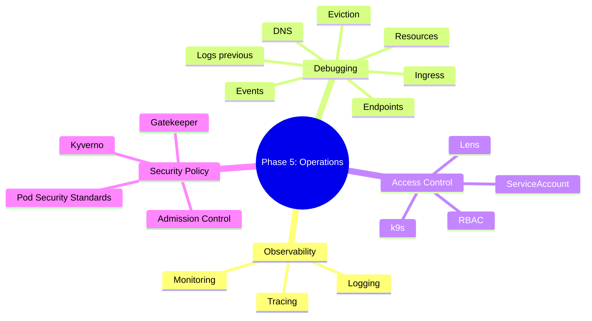

# Phase 5 Summary: Observability, Debugging, Security và Operations

## Key takeaways

Phase 5 nối các tín hiệu vận hành thành một năng lực hoàn chỉnh: quan sát, debug, giới hạn quyền và chặn workload không an toàn trước khi chạy.

Mental model tổng quát:

```text
Production incident
  |
  +-- observe
  |     +-- logs
  |     +-- metrics
  |     +-- traces
  |
  +-- debug
  |     +-- events
  |     +-- describe
  |     +-- endpoints/DNS/Ingress
  |     +-- resources/QoS/node pressure
  |
  +-- operate safely
        +-- RBAC
        +-- ServiceAccounts
        +-- Pod Security
        +-- admission policy
```

Nếu Phase 4 cho thấy stateful workloads khó vì dữ liệu, Phase 5 cho thấy production operations khó vì thiếu evidence, quyền quá rộng hoặc policy quá muộn.

## Mind map



## Core mental models

### Logs tell what happened inside the process

`kubectl logs` đủ cho debug nhanh, nhưng production cần log aggregation, metadata, retention và query path. Log không có `service`, `version`, `trace_id`, `namespace` và `pod` sẽ khó dùng khi incident đi qua nhiều microservices.

### Metrics tell how the system behaves over time

Metrics giúp thấy rate, latency, error, saturation, restart, resource pressure và trend. `up == 1` chỉ chứng minh scrape target sống, không chứng minh user request thành công.

### Traces connect service boundaries

Distributed tracing giúp nối request qua API Gateway, service nội bộ, database, cache và queue. Trace hữu ích nhất khi propagation chuẩn và được liên kết với logs/metrics.

### Debug Kubernetes by object graph

Không debug ngẫu nhiên. Đi theo graph:

```text
Ingress -> Service -> EndpointSlice -> Ready Pod -> container process
```

Với resource incident, đi theo graph:

```text
requests -> scheduler -> node allocatable -> kubelet -> cgroups -> container process
```

### RBAC controls who can act

RBAC là subject + verb + resource + scope. k9s, Lens và `kubectl` chỉ là client; quyền thật nằm ở kubeconfig/token đang dùng.

### Admission controls what can run

RBAC trả lời ai được tạo Pod. Admission trả lời Pod đó có được chấp nhận không. `Pod Security Admission`, Kyverno và Gatekeeper là lớp policy trước khi workload vào cluster state.

## Day-by-day recap

| Day | Topic | Main skill |
|---:|---|---|
| 29 | Logging | Thiết kế log pipeline, metadata, retention, debug `logs --previous` |
| 30 | Monitoring | Dùng Prometheus/Grafana mental model, RED/USE metrics, alert draft |
| 31 | Distributed tracing | Hiểu OpenTelemetry, trace propagation, Jaeger/Tempo caveats |
| 32 | Kubernetes debugging toolkit | Debug theo object graph: Pod, Service, DNS, Ingress, endpoints |
| 33 | Resource debugging | Debug `OOMKilled`, `Pending`, CPU throttling, eviction, QoS |
| 34 | RBAC + k9s + Lens | Thiết kế least privilege, debug `Forbidden`, dùng UI theo đúng quyền |
| 35 | Pod Security và admission control | Enforce `baseline`/`restricted`, hiểu admission webhook và policy engines |

## Production scenarios

### Scenario 1: API latency tăng nhưng Pod không restart

First checks:

```bash
kubectl top pod -n <namespace>
kubectl describe pod <pod> -n <namespace>
kubectl logs <pod> -n <namespace> --since=10m
```

Likely causes:

- CPU throttling do limit quá thấp.
- Downstream dependency chậm.
- Request burst vượt concurrency.
- GC/heap pressure nhưng chưa OOM.
- Network/service mesh policy hoặc retry storm.

Evidence cần:

- RED metrics: request rate, error ratio, p95/p99 latency.
- CPU throttling metrics nếu có Prometheus.
- Logs có trace/request ID.
- Trace span chậm ở service nào.

### Scenario 2: Rollout kẹt vì Pod Pending

First checks:

```bash
kubectl rollout status deploy/<name> -n <namespace>
kubectl get pod -n <namespace> -o wide
kubectl describe pod <pending-pod> -n <namespace>
kubectl get events -n <namespace> --sort-by=.lastTimestamp
```

Likely causes:

- `Insufficient cpu` hoặc `Insufficient memory`.
- Taint/toleration sai.
- Node selector/affinity không match.
- PVC/storage topology issue.
- Namespace quota hết.

Fix lab vs production:

- Lab: giảm request hoặc xóa Pod lỗi.
- Production: xem capacity plan, node pool, quota, priority và rollout strategy trước khi patch.

### Scenario 3: Engineer không đọc được logs production

First checks:

```bash
kubectl auth can-i get pods/log -n <namespace>
kubectl auth can-i get pods/log -n <namespace> --as=<subject>
kubectl get role,rolebinding -n <namespace>
```

Likely causes:

- Role chỉ có `pods`, thiếu `pods/log`.
- Binding sai subject.
- Binding sai namespace.
- User dùng context/kubeconfig khác.

Prevention:

- Có RBAC role chuẩn cho incident reader.
- Có runbook quyền cần cho logs/exec/debug.
- Không fix bằng cách cấp `cluster-admin`.

### Scenario 4: Pod bị reject khi apply

First checks:

```bash
kubectl apply -f <file>.yaml
kubectl get namespace <namespace> --show-labels
kubectl auth can-i create pods -n <namespace>
kubectl get validatingwebhookconfiguration
kubectl get mutatingwebhookconfiguration
```

Likely causes:

- Pod Security `enforce=baseline` chặn privileged Pod.
- `restricted` yêu cầu `runAsNonRoot`, seccomp, drop capabilities.
- Kyverno/Gatekeeper policy chặn label/image/security rule.
- Admission webhook lỗi hoặc timeout.

Prevention:

- Dùng `warn`/`audit` trước khi enforce.
- Đưa securityContext vào Helm chart/template chuẩn.
- Monitor policy webhook.

## Operations readiness checklist

- [ ] App logs có cấu trúc, metadata và correlation/trace ID.
- [ ] Có log aggregation với retention và quyền truy cập rõ.
- [ ] Có Prometheus/Grafana hoặc metrics stack tương đương.
- [ ] Có RED metrics cho service và USE metrics cho node.
- [ ] Có distributed tracing cho request quan trọng.
- [ ] Có runbook debug Pod, Service, DNS, Ingress và resource failures.
- [ ] Có alert cho `CrashLoopBackOff`, `OOMKilled`, Pod `Pending`, node pressure và high error rate.
- [ ] Có RBAC baseline theo role: readonly, deployer, incident responder, platform admin.
- [ ] k9s/Lens dùng kubeconfig least-privilege cho thao tác thường ngày.
- [ ] Namespace app có Pod Security labels.
- [ ] Workload mới hướng tới `restricted`.
- [ ] Policy engine nếu có được monitor và có owner rõ.

## Self-assessment quiz

1. Vì sao `kubectl logs` không đủ cho production logging?
2. `up == 1` trong Prometheus chứng minh điều gì và không chứng minh điều gì?
3. Trace propagation hỏng thì distributed tracing mất giá trị ở điểm nào?
4. Service có DNS resolve nhưng endpoints rỗng thì nghi lớp nào?
5. `CrashLoopBackOff` khác `OOMKilled` thế nào?
6. CPU limit thấp gây symptom gì dù Pod không restart?
7. Vì sao Pod `Pending` thường phải đọc scheduler events trước?
8. `pods/log` và `pods/exec` khác `pods` trong RBAC thế nào?
9. RoleBinding tới ClusterRole có cấp quyền toàn cluster không?
10. Lens/k9s có bypass RBAC được không?
11. `Pod Security Admission` khác Kyverno/Gatekeeper ở đâu?
12. Vì sao nên bật `warn`/`audit` trước khi `enforce=restricted`?
13. Webhook `failurePolicy=Fail` có rủi ro vận hành gì?
14. Một workload cần privileged mode nên được quản lý exception thế nào?
15. Incident note tốt cần những trường evidence nào?

## Next phase bridge

Phase 6 đi vào Helm, CRD/Operator, autoscaling, scheduling nâng cao, GitOps, backup/restore, managed Kubernetes và capstone. Những chủ đề đó đều phụ thuộc Phase 5:

- Helm chart phải encode resources, probes, securityContext và labels chuẩn.
- Operator/CRD cần RBAC và admission awareness.
- Autoscaling cần metrics đúng.
- GitOps cần policy để tránh drift và manual mutation.
- Managed Kubernetes vẫn cần observability, RBAC và Pod Security do team thiết kế.

Hoàn thành Phase 5 nghĩa là bạn không chỉ biết deploy workload, mà bắt đầu có năng lực vận hành workload đó một cách có kiểm soát.
