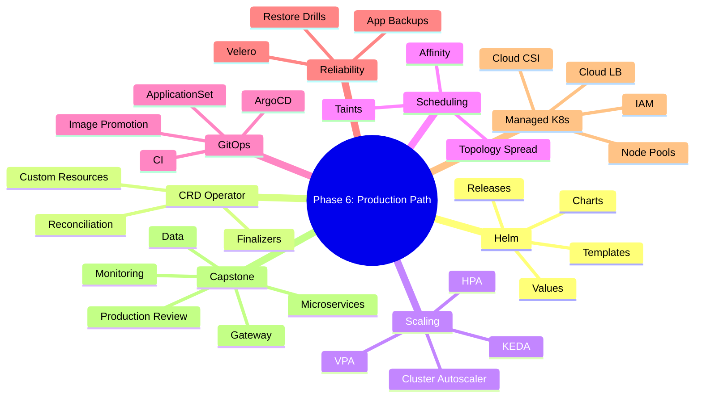

# Phase 6 Summary: Advanced, CI/CD, GitOps, Managed Kubernetes và Capstone

## Key takeaways

Phase 6 biến kiến thức Kubernetes rời rạc thành năng lực triển khai production-minded: package bằng Helm, hiểu CRD/operator, scale workload, điều khiển scheduling, release bằng GitOps, backup/restore, đánh giá managed Kubernetes và hoàn thành capstone.

Mental model tổng quát:

```text
Production Kubernetes platform
  |
  +-- package and extend
  |     +-- Helm
  |     +-- CRD / Operator
  |
  +-- scale and place
  |     +-- HPA / VPA / KEDA / Cluster Autoscaler
  |     +-- taints / affinity / topology spread
  |
  +-- release and recover
  |     +-- CI/CD
  |     +-- ArgoCD GitOps
  |     +-- backup / restore / DR
  |
  +-- production environment
        +-- EKS / GKE / AKS
        +-- node pools / IAM / cloud LB / cloud CSI
        +-- capstone readiness
```

## Mind map



## Day-by-day recap

| Day | Topic | Main skill |
|---:|---|---|
| 36 | Helm fundamentals | Đọc/viết chart, templates, values, release lifecycle |
| 37 | Helm chart cho microservices | Tạo chart reusable, environment values, tránh anti-pattern |
| 38 | CRD và Operator pattern | Hiểu reconciliation, finalizer, khi nào dùng operator |
| 39 | Autoscaling | Thiết kế HPA/VPA/KEDA/Cluster Autoscaler theo metrics đúng |
| 40 | Advanced scheduling | Đặt workload đúng node/topology, debug Pod Pending |
| 41 | CI/CD + GitOps với ArgoCD | Tách CI artifact và GitOps deployment, drift detection |
| 42 | Backup, restore và DR | Xác định RPO/RTO, Velero, etcd/app-level backup, restore drill |
| 43 | Managed Kubernetes và readiness | Phân chia trách nhiệm EKS/GKE/AKS, node pool, IAM, upgrade |
| 44 | Capstone Part 1 | Deploy gateway + stateless microservices + Ingress |
| 45 | Capstone Part 2 | Hoàn thiện data/monitoring/GitOps/backup/checklist |

## Production scenarios

### Scenario 1: Release lỗi sau khi ArgoCD sync

First checks:

```bash
argocd app get <app>
argocd app diff <app>
kubectl rollout status deploy/<name> -n <namespace>
kubectl get events -n <namespace> --sort-by=.lastTimestamp
kubectl logs deploy/<name> -n <namespace> --since=10m
```

Likely causes:

- Image tag/digest sai.
- Config/Secret thiếu.
- Probe fail.
- Admission policy reject.
- DB migration không tương thích.

Correct response:

- Rollback app/config bằng GitOps.
- Không tự ý sửa live object rồi quên backport Git.
- Kiểm tra migration có backward-compatible không trước khi rollback.

### Scenario 2: Cluster upgrade kẹt khi drain node

First checks:

```bash
kubectl get pdb -A
kubectl get pods -A -o wide
kubectl describe pod <pod> -n <namespace>
kubectl get events -A --sort-by=.lastTimestamp
```

Likely causes:

- PDB `minAvailable` quá chặt.
- Pod dùng local storage.
- StatefulSet không có replica/failover đủ.
- Affinity/topology constraints quá hẹp.
- Node pool thiếu capacity thay thế.

Correct response:

- Không xóa bừa PDB production.
- Tạm mở rộng capacity hoặc điều chỉnh rollout window.
- Review workload availability contract.

### Scenario 3: Mất namespace ứng dụng

Restore order:

```text
1. Tạo namespace hoặc để GitOps tạo.
2. Restore CRD/operator nếu cần.
3. Restore Secret/ConfigMap.
4. Restore PVC/database data.
5. Sync workloads bằng ArgoCD.
6. Chạy smoke test.
7. Mở traffic.
```

GitOps có thể restore manifests nhưng không tự phục hồi dữ liệu business nếu backup data không tồn tại.

## Final 45-day capability checklist

- [ ] Hiểu Kubernetes reconciliation loop và object graph.
- [ ] Cài và dùng K3s/k3d cho lab.
- [ ] Deploy/debug Pod, Deployment, StatefulSet, DaemonSet, Job/CronJob.
- [ ] Thiết kế Service, Ingress, DNS, NetworkPolicy và CNI trade-offs.
- [ ] Hiểu storage/PVC/CSI và caveats stateful workloads.
- [ ] Biết deploy lab PostgreSQL/Redis/Kafka và giải thích vì sao production khó hơn.
- [ ] Dùng logs/metrics/traces/events để debug incident.
- [ ] Thiết kế RBAC, Pod Security và admission baseline.
- [ ] Package app bằng Helm.
- [ ] Hiểu CRD/operator ở mức dùng an toàn.
- [ ] Thiết kế autoscaling và scheduling constraints.
- [ ] Thiết kế CI/CD + GitOps bằng ArgoCD.
- [ ] Có backup/restore/DR plan với RPO/RTO.
- [ ] Biết production readiness khác nhau giữa K3s, self-managed và EKS/GKE/AKS.
- [ ] Hoàn thành capstone có gateway, microservices, data dependencies, monitoring/GitOps/backup plan.

## Recommended next steps

- Ôn CKA/CKAD nếu muốn chuẩn hóa kiến thức và luyện thao tác CLI nhanh.
- Chạy capstone trên một managed Kubernetes nhỏ để trải nghiệm cloud LB, CSI và IAM thật.
- Thay image lab bằng microservices thật có metrics/traces.
- Thêm policy-as-code bằng Kyverno/Gatekeeper vào capstone.
- Thực hiện restore drill định kỳ và ghi lại thời gian RTO thực tế.
