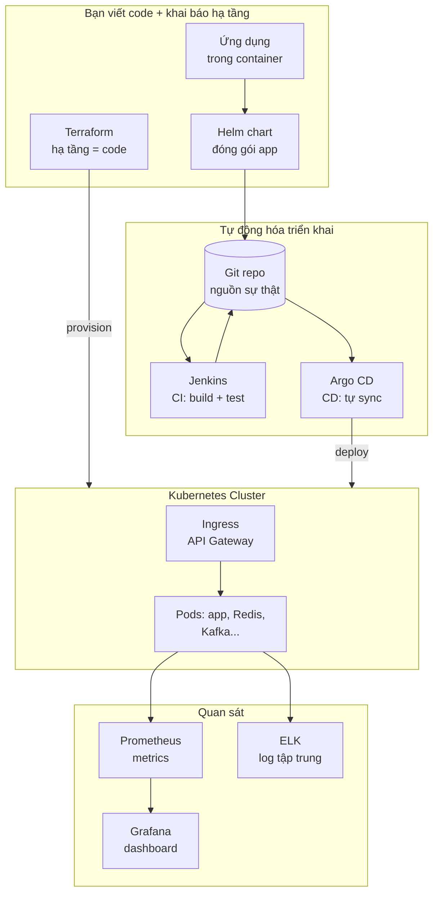
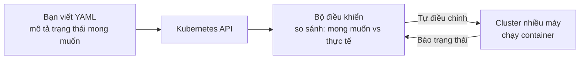
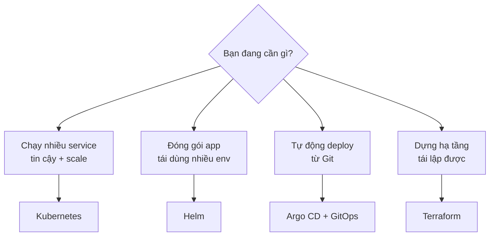

# Hệ sinh thái Kubernetes hướng Production — Giới thiệu & Roadmap 7 ngày

> Bộ học nhanh này giúp bạn đi từ "biết chạy container" đến "thiết kế và vận hành được một hệ thống production-grade trên Kubernetes" trong 7 ngày, rồi mới đào sâu những phần tạo khác biệt.
>
> **Giả định** (nếu bạn không nói rõ): bạn đã biết Docker/container cơ bản, có nền lập trình backend, học trên máy cá nhân (Linux/macOS/Windows) bằng **Minikube** cho cluster local và **Floci** để giả lập AWS. Phiên bản tham chiếu: **Kubernetes 1.36**, **Helm 3.x**, **Argo CD 2.x**, **Terraform 1.9+**.

---

## 1. Bức tranh tổng thể: bạn sẽ học gì và vì sao

Bạn không chỉ học Kubernetes. Bạn học **cả bộ công cụ vận hành một hệ thống thật**: cách đóng gói, triển khai tự động, provision hạ tầng bằng code, và quan sát hệ thống. Đây là bộ kỹ năng của một **DevOps/Platform Engineer** hoặc **backend engineer hướng production**.

**Đọc sơ đồ:** Bạn khai báo hạ tầng bằng **Terraform** và đóng gói app bằng **Helm** → đẩy lên **Git** → **Jenkins** build/test, **Argo CD** tự động deploy lên **Kubernetes** → **Ingress** đóng vai API Gateway điều hướng traffic → **Prometheus/Grafana/ELK** cho bạn nhìn thấy hệ thống đang chạy ra sao.

---

## 2. Kubernetes là gì (nền tảng của tất cả)

Kubernetes (viết tắt **K8s**) là hệ thống **điều phối container** (container orchestration): nó tự động **triển khai, mở rộng, tự phục hồi và quản lý** các ứng dụng chạy trong container trên một cụm nhiều máy.

Hãy hình dung: bạn có 20 container cần chạy trên 5 máy chủ. Ai quyết định container nào chạy máy nào? Nếu 1 máy chết thì sao? Nếu traffic tăng gấp 10 thì thêm container thế nào? Kubernetes là "bộ não" tự động lo tất cả.

Ý tưởng cốt lõi: bạn **khai báo** trạng thái mong muốn ("tôi muốn 3 bản chạy của app này"), Kubernetes liên tục **tự động ép** thực tế khớp với mong muốn đó. Đây là mô hình **declarative** (khai báo) — và cũng chính là triết lý mà **GitOps, Terraform, Helm** đều dùng chung. Nắm được tư duy này là chìa khóa của cả tuần học.

---

## 3. Nếu không có bộ kỹ năng này thì sao

| Tình huống thực tế | Làm thủ công (không có bộ công cụ này) | Hậu quả |
| --- | --- | --- |
| 1 container crash lúc 3h sáng | SSH vào máy, `docker run` lại bằng tay | Downtime, mất ngủ, mất khách |
| Traffic tăng gấp 5 | Tự bật máy, copy config, chỉnh load balancer | Chậm, dễ sai, không kịp |
| Deploy bản mới | Dừng app cũ, chạy app mới, lỗi thì rollback tay | Downtime, rủi ro cao |
| Dựng lại toàn bộ hạ tầng ở region mới | Click chuột hàng trăm bước trên console AWS | Vài ngày, không tái lập được, dễ sai |
| "Hôm qua chạy, hôm nay lỗi" | Mò trong đầu xem ai đổi gì | Không truy vết được, đổ lỗi lẫn nhau |
| Hệ thống chậm, không biết vì sao | Đoán mò, thêm log rải rác | Không đo được = không sửa được |

Không có bộ công cụ điều phối + tự động hóa + quan sát, sức người **không thể** theo kịp khi hệ thống lớn lên. Cả tuần học này biến những việc "cứu hỏa thủ công" thành **tự động và tái lập được**.

---

## 4. Các mảnh ghép và công nghệ tương tự

Mỗi công cụ trong roadmap đều có lựa chọn thay thế. Hiểu **khi nào chọn cái nào** quan trọng hơn học thuộc một công cụ.

| Vai trò | Công cụ trong roadmap | Lựa chọn thay thế | Khi nào chọn cái khác |
| --- | --- | --- | --- |
| Điều phối container | **Kubernetes** | Docker Compose, ECS, Nomad | App nhỏ 1 máy → Compose; đã all-in AWS → ECS |
| Cluster local để học | **Minikube** | kind, k3d, Docker Desktop | CI/CD nhanh, nhẹ → kind; nhiều cluster → k3d |
| Đóng gói app | **Helm** | Kustomize, raw YAML | Chỉ cần patch nhẹ theo env → Kustomize |
| Triển khai (CD) | **Argo CD** (GitOps) | Flux, Jenkins CD, Spinnaker | Thích CLI-first → Flux |
| Build/test (CI) | **Jenkins** | GitHub Actions, GitLab CI | Dự án nhỏ/trên cloud → GitHub Actions gọn hơn |
| Hạ tầng = code | **Terraform** | Pulumi, CloudFormation, Ansible | Thích code thật (TS/Python) → Pulumi; chỉ AWS → CloudFormation; cấu hình OS/VM → Ansible |
| Giả lập cloud local | **Floci** | LocalStack | Floci là bản thay thế nhanh của LocalStack (khởi động ~24ms) |
| Metrics + dashboard | **Prometheus + Grafana** | Datadog, New Relic | Muốn SaaS trọn gói, không tự vận hành → Datadog |
| Log tập trung | **ELK** (Elasticsearch/Logstash/Kibana) | Loki + Grafana, OpenSearch | Muốn nhẹ, hợp Grafana sẵn có → Loki |

**Nguyên tắc chọn:** Bắt đầu đơn giản nhất có thể. Chỉ thêm một công cụ khi độ phức tạp thật sự cần đến nó. Ở production, ưu tiên **managed Kubernetes** (GKE/EKS/AKS) để cloud lo phần khó nhất.

---

## 5. Ansible có cần không?

Bạn hỏi đúng: **Ansible chỉ cần nếu bạn tự quản lý VM/on-prem.** Roadmap này **không đưa Ansible vào 7 ngày chính** vì:

- Terraform lo **provision** hạ tầng (tạo VM, network, cluster).
- Kubernetes + Helm lo **cấu hình ứng dụng** bên trong cluster.
- Ansible lo **cấu hình hệ điều hành/VM** (cài package, chỉnh file hệ thống) — việc này bị Kubernetes thay thế phần lớn khi bạn đã dùng container.

➡️ Chỉ học Ansible sau này nếu bạn phải quản lý máy chủ vật lý/VM ngoài Kubernetes (on-prem, legacy). Xem phần "học sâu sau" trong `99-tong-hop.md`.

---

## 6. Bức tranh thực tế hiện nay

- **Kubernetes là chuẩn de-facto** cho điều phối container ở công ty quy mô vừa/lớn, thường qua bản managed (GKE/EKS/AKS).
- **GitOps (Argo CD/Flux) đang thắng thế** so với CI đẩy trực tiếp: Git là nguồn sự thật duy nhất, cluster tự kéo về. Đây là **mindset khác** với CI truyền thống — bạn học nó ở Ngày 4.
- **Terraform là chuẩn IaC** phổ biến nhất cho đa cloud.
- **Prometheus + Grafana là chuẩn observability** trong thế giới K8s; ELK/Loki cho log.

**Những điều người mới hay lo quá sớm (chưa cần vội):**
- Tự cài cluster production bằng tay (kubeadm, etcd HA) → hầu hết công ty dùng managed.
- Service mesh (Istio/Linkerd) → chỉ cần khi hệ thống rất lớn.
- Viết Operator/CRD phức tạp → chỉ khi có nhu cầu rất đặc thù.
- Tối ưu Kafka partition/Elasticsearch sharding sâu → học khi thật sự chạm giới hạn.

---

## 7. Mục tiêu học nhanh (3 cấp độ)

**Cấp độ 1 — Biết dùng cơ bản** (quan sát được):
- Dựng được cluster Minikube, deploy 1 app, `kubectl get pods` thấy Running.
- Hiểu Pod / Deployment / Service / Ingress / ConfigMap / Secret khác nhau ra sao.
- Đóng gói 1 app đơn giản bằng Helm chart.

**Cấp độ 2 — Làm được việc thực tế** (quan sát được):
- Deploy app + Redis, expose qua Ingress (API Gateway), cấu hình probes + resource limits + HPA.
- Dựng pipeline GitOps: đẩy Git → Argo CD tự deploy.
- Provision hạ tầng giả lập bằng Terraform + Floci.
- Xem được metrics trên Grafana và log trên Kibana.

**Cấp độ 3 — Đi sâu / chuyên nghiệp** (quan sát được):
- Thiết kế được một hệ thống production nhiều thành phần (API Gateway + Redis + Kafka + ELK) và giải thích trade-off.
- Xử lý sự cố: CrashLoopBackOff, OOMKilled, pod pending, drift trong GitOps.
- Đặt alert đúng, tinh chỉnh resource để tối ưu chi phí và độ tin cậy.

---

## 8. Roadmap 7 ngày

```mermaid
gantt
    title Lộ trình 7 ngày — từ K8s core đến production system design
    dateFormat X
    axisFormat Ngày %s
    section Nền tảng
    K8s core + Minikube        :d1, 0, 1
    Production-readiness + Redis :d2, 1, 1
    section Đóng gói & Triển khai
    Helm                        :d3, 2, 1
    GitOps + Argo CD + Jenkins  :d4, 3, 1
    section Hạ tầng & Quan sát
    Terraform + Floci           :d5, 4, 1
    Prometheus + Grafana + ELK  :d6, 5, 1
    section Tổng hợp
    Capstone: System Design     :d7, 6, 1
```

| Ngày | Trọng tâm | Deliverable cuối ngày |
| --- | --- | --- |
| **1** | K8s core: Pod, Deployment, Service, Ingress, ConfigMap, Secret + Minikube | Deploy app đầu tiên, truy cập được qua trình duyệt |
| **2** | Production-readiness: probes, resource limits, HPA, Ingress làm API Gateway, deploy Redis | App tự phục hồi, tự co giãn, có cache |
| **3** | Helm: chart, template, values, release | Đóng gói app + Redis thành 1 Helm chart cài lại được |
| **4** | GitOps + Argo CD (vai trò Jenkins CI) | Đẩy Git → Argo CD tự sync lên cluster |
| **5** | Terraform + Floci: hạ tầng = code, giả lập AWS/EKS | Provision hạ tầng bằng `terraform apply` |
| **6** | Observability: Prometheus + Grafana + ELK | Dashboard metrics + log tập trung xem được |
| **7** | Capstone: thiết kế hệ thống production (API Gateway + Redis + Kafka + ELK) | Sơ đồ kiến trúc + mini hệ thống chạy được |

**Thứ tự này có lý do:** phải hiểu K8s core (1) và làm app production-ready (2) trước khi đóng gói (3); có gói rồi mới tự động hóa triển khai (4); song song cần biết dựng hạ tầng (5); có hệ thống chạy rồi mới quan sát (6); cuối cùng ghép tất cả thành một thiết kế hoàn chỉnh (7).

➡️ Bắt đầu: mở [`ngay-01-k8s-core-minikube/bai-hoc.md`](ngay-01-k8s-core-minikube/bai-hoc.md).
