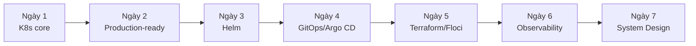

# Hệ sinh thái Kubernetes hướng Production — Tổng hợp 7 ngày

> File "nhớ lại" cho cả khóa. Đọc file này khi bạn muốn ôn nhanh, tránh các lỗi phổ biến, và biết học sâu gì tiếp theo.

---

## 1. Tóm tắt những gì đã học

| Ngày | Takeaway cốt lõi (nhớ 1 câu) |
| --- | --- |
| **1 — K8s core** | Bạn khai báo trạng thái mong muốn (YAML), K8s liên tục ép thực tế khớp mong muốn. Pod → Deployment → Service là bộ ba nền tảng. |
| **2 — Production-ready** | App "chạy được" khác "production-ready". Probes + resource limits + HPA là ranh giới. Ingress đóng vai API Gateway. |
| **3 — Helm** | 1 template + nhiều values → hết copy-paste YAML theo môi trường. Chart là đơn vị đóng gói tái dùng. |
| **4 — GitOps/Argo CD** | Git là nguồn sự thật duy nhất; cluster **tự kéo** về (pull), không phải CI **đẩy** vào (push). Rollback = git revert. |
| **5 — Terraform/Floci** | Hạ tầng = code, tái lập được. State là trái tim (và gót chân) của Terraform. Floci giả lập AWS local để `apply` an toàn. |
| **6 — Observability** | Không đo được thì không vận hành được. Metrics (Prometheus/Grafana) + Logs (ELK) + golden signals để đặt alert đúng. |
| **7 — System Design** | Ghép tất cả: gateway + microservice + Redis (cache) + Kafka (event bất đồng bộ) + observability, triển khai qua GitOps trên hạ tầng IaC. |

**Sợi chỉ đỏ xuyên suốt:** tư duy **declarative** (khai báo trạng thái mong muốn, để hệ thống tự hội tụ) lặp lại ở K8s, Helm, GitOps và Terraform. Nắm được nó là nắm được cả bộ công cụ.

---

## 2. Những điều hay nhầm lẫn cho người mới ⚠️

> Phần quan trọng. Mỗi dòng là một cái bẫy đã khiến nhiều người mất giờ debug hoặc dừng ở mức "biết dùng" mà không tạo được giá trị thật.

| Nhầm lẫn | Vì sao xảy ra | Hậu quả | Cách tránh / sửa |
| --- | --- | --- | --- |
| **Secret trong K8s là "được mã hóa an toàn"** | Thấy chữ "Secret" + base64 | Tưởng an toàn, commit Secret lên Git | base64 **không** phải mã hóa. Bật encryption-at-rest, dùng RBAC, hoặc external secret manager (Vault, SOPS) |
| **Không đặt readiness probe** | App "chạy" là thấy ổn | Deploy xong user gặp 502 vì traffic vào Pod chưa sẵn sàng | Luôn cấu hình readiness; phân biệt rõ với liveness |
| **Nhầm liveness với readiness** | Hai probe trông giống nhau | Đặt sai → Pod bị restart oan hoặc nhận traffic khi chưa sẵn sàng | Liveness = "còn sống không, nếu chết thì restart"; Readiness = "sẵn sàng nhận traffic chưa" |
| **Không đặt resource requests/limits** | Bỏ qua cho nhanh | 1 Pod ngốn hết RAM → node sập; hoặc bị OOMKilled bất ngờ | Luôn đặt requests/limits; hiểu CPU vượt limit = throttle, RAM vượt limit = OOMKilled |
| **Dùng image tag `latest`** | Tiện | "Hôm qua chạy hôm nay lỗi", không biết đang chạy bản nào | Pin phiên bản cụ thể (`app:1.4.2`) |
| **Sửa tay cluster khi đã dùng GitOps** | Quen `kubectl edit`/`scale` | Argo CD tự kéo về Git (self-heal) → thay đổi biến mất, tưởng bị "ma" | Mọi thay đổi qua Git. Sửa tay chỉ để debug tạm |
| **Commit `terraform.tfstate` lên Git** | Không hiểu vai trò state | Lộ secret trong state; xung đột state khi làm nhóm | Dùng remote state + locking (S3+DynamoDB), không commit tfstate |
| **Sửa tay resource trên cloud khi đã dùng Terraform** | Nhanh hơn viết code | Gây drift, lần `apply` sau ghi đè hoặc phá vỡ | Mọi thay đổi qua code; `terraform plan` để phát hiện drift |
| **Chạy DB/Redis quan trọng bằng Deployment thường** | Deployment quen tay | Mất dữ liệu khi Pod chuyển node | Stateful cần StatefulSet + PersistentVolume, hoặc dùng managed service |
| **Log không cấu trúc + cardinality metric quá cao** | Log `print` tự do, gắn label bừa | Kibana khó tìm; Prometheus phình bộ nhớ, chậm | Log JSON có cấu trúc; hạn chế label giá trị vô hạn (user_id...) |
| **Alert vào mọi thứ** | Sợ bỏ sót | Alert fatigue → bỏ qua cả alert thật | Alert theo golden signals (latency/traffic/errors/saturation), ít mà đúng |
| **Gọi mọi thứ bằng REST đồng bộ** | Đơn giản, quen thuộc | Service phụ thuộc chặt, 1 cái chậm kéo sập cả chuỗi | Dùng Kafka cho luồng bất đồng bộ, decoupling, buffering |

**Bẫy "dừng ở bề mặt" (quan trọng nhất):** Nhiều người học K8s chỉ tới mức `kubectl apply` chạy được Pod rồi dừng. Giá trị thật nằm ở tầng **vận hành**: đặt probe/limit đúng, đọc `describe` + events để chẩn đoán CrashLoopBackOff/OOMKilled/Pending, hiểu vì sao hệ thống chậm qua metrics. Đây là thứ phân biệt "người deploy được" với "người vận hành được production" — và là phần đáng đầu tư nhất sau khi qua 80/20.

---

## 3. Phần cần dành thời gian học sâu sau này

Học theo thứ tự này, và chỉ học khi gặp đúng "tín hiệu" thực tế:

| Thứ tự | Chủ đề học sâu | Học khi nào (tín hiệu kích hoạt) |
| --- | --- | --- |
| 1 | **Xử lý sự cố production** (CrashLoopBackOff, OOMKilled, Pending, drift) | Ngay khi bắt đầu trực/vận hành app thật |
| 2 | **Tinh chỉnh resource + HPA nâng cao** (custom metrics, right-sizing, cost) | Khi cluster đủ lớn, hóa đơn cloud đáng kể |
| 3 | **Networking + Security** (NetworkPolicy, RBAC tối thiểu, mTLS) | Khi cần cô lập, tuân thủ bảo mật |
| 4 | **Kafka chuyên sâu** (partition strategy, consumer lag, rebalancing, delivery semantics, schema) | Khi Kafka thành xương sống, chạm giới hạn throughput |
| 5 | **Elasticsearch/Prometheus vận hành** (sharding, retention, cardinality, HA) | Khi observability stack tốn tài nguyên / chậm |
| 6 | **Remote state + module hóa Terraform**, quản lý nhiều môi trường | Khi làm nhóm, nhiều env, nhiều region |
| 7 | **StatefulSet + storage** (PV/PVC, StorageClass, backup) | Khi phải chạy DB/stateful trên K8s |
| 8 | **Service mesh** (Istio/Linkerd), **Operator/CRD** | Chỉ khi hệ thống rất lớn / nhu cầu vận hành rất đặc thù |
| 9 | **Ansible** | Chỉ khi phải quản lý VM/OS/on-prem ngoài K8s |

**Nguyên tắc:** đừng học sâu trước khi gặp vấn đề thật. Kiến thức học lúc "chưa đau" quên rất nhanh; học lúc đang giải quyết sự cố thì nhớ lâu.

---

## 4. Kế hoạch học siêu ngắn (nếu không đủ 7 ngày)

**Bản 1 ngày (làm được việc tối thiểu):**
- Dựng Minikube, deploy 1 app bằng Deployment + Service, truy cập được.
- Deliverable: app chạy, `kubectl get pods` thấy Running, mở được trên trình duyệt.

**Bản 3 ngày (nền tảng vững):**
- Ngày 1: K8s core (Pod/Deployment/Service/ConfigMap/Secret) + Minikube.
- Ngày 2: probes + resource limits + Ingress + HPA + Redis.
- Ngày 3: Helm đóng gói app.
- Deliverable: app production-ready, đóng gói thành 1 Helm chart cài lại được.

**Bản 7 ngày (đầy đủ roadmap này):**
- Theo đúng 7 ngày ở trên.
- **Hoạt động "xem trước phần tạo khác biệt":** ở ngày 7, cố tình tắt Redis hoặc Kafka trong hệ thống capstone và quan sát điều gì xảy ra — đây là bài học đầu tiên về **failure mode**, thứ mà người vận hành senior luôn nghĩ tới.

---

## 5. Hành động tiếp theo

**Làm ngay bây giờ:**
- Bắt đầu từ [`ngay-01-k8s-core-minikube/thuc-hanh.md`](ngay-01-k8s-core-minikube/thuc-hanh.md) — dựng cluster và deploy app đầu tiên. Đừng chỉ đọc, hãy gõ tay.

**ĐỪNG học quá sớm (bẫy phổ biến):**
- Tự cài cluster bằng kubeadm/etcd HA → production dùng managed.
- Service mesh, Operator/CRD, multi-cluster → chưa cần khi mới học.
- Tuning Kafka partition / Elasticsearch sharding sâu → học khi chạm giới hạn thật.

**Chủ đề "tạo khác biệt" đầu tiên nên học sau khi qua 80/20:**
- **Health probes + resource limits cho đúng**, rồi tới **xử lý sự cố production** (đọc events, chẩn đoán CrashLoopBackOff/OOMKilled). Đây là kỹ năng biến bạn từ người "deploy được" thành người "vận hành được".

---

## 6. Tài liệu tham khảo tổng hợp

Chi tiết theo từng ngày nằm trong `tai-lieu.md` của mỗi thư mục ngày. Các nguồn gốc chính thức nên bookmark:

**Core 80/20:**
- kubernetes.io/docs — tài liệu chính thức K8s (Concepts, Tasks).
- minikube.sigs.k8s.io/docs — dựng cluster local.
- helm.sh/docs — Helm chart & templating.

**Triển khai & hạ tầng:**
- argo-cd.readthedocs.io — GitOps với Argo CD.
- opengitops.dev — nguyên tắc GitOps.
- developer.hashicorp.com/terraform — Terraform.
- floci.io — giả lập cloud local.

**Quan sát & thiết kế:**
- prometheus.io/docs, grafana.com/docs — metrics & dashboard.
- www.elastic.co/guide — ELK stack.
- kafka.apache.org/documentation, strimzi.io/docs — Kafka & Kafka trên K8s.
- 12factor.net, landscape.cncf.io — nguyên tắc app hiện đại & bản đồ hệ sinh thái cloud-native.

> Mọi link trên là domain chính thức. Một số đường dẫn con có thể đổi theo phiên bản — nếu gặp 404, vào trang gốc và tìm lại mục tương ứng.
