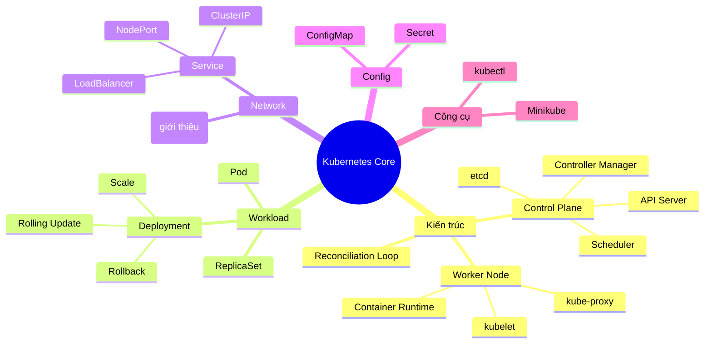
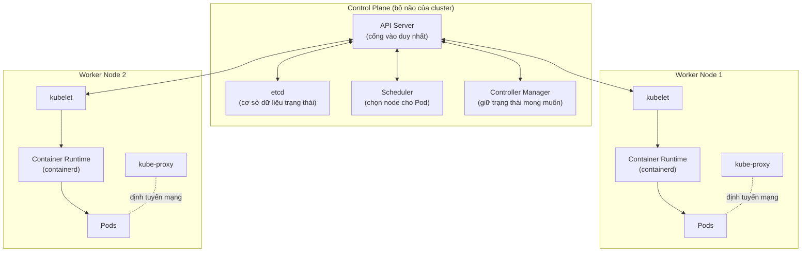
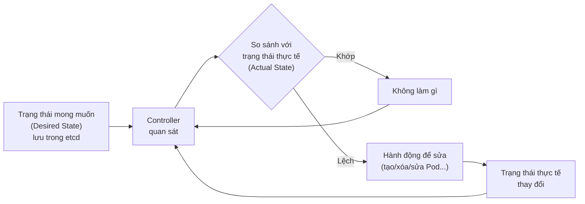
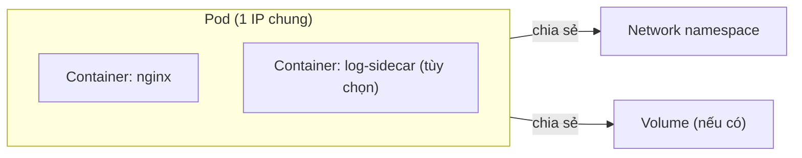
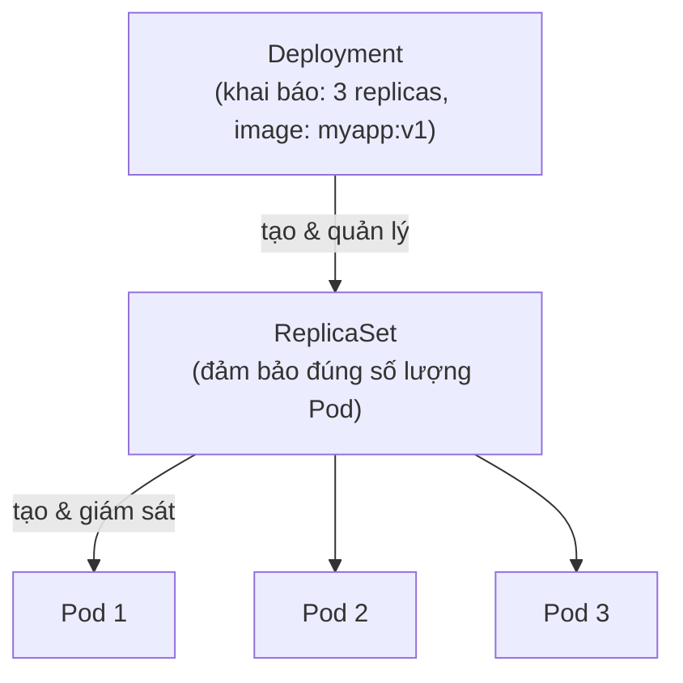
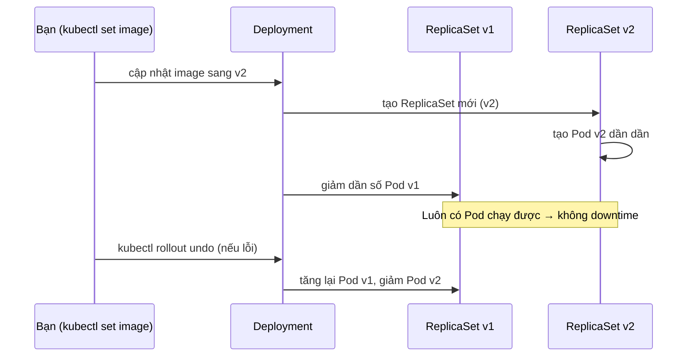
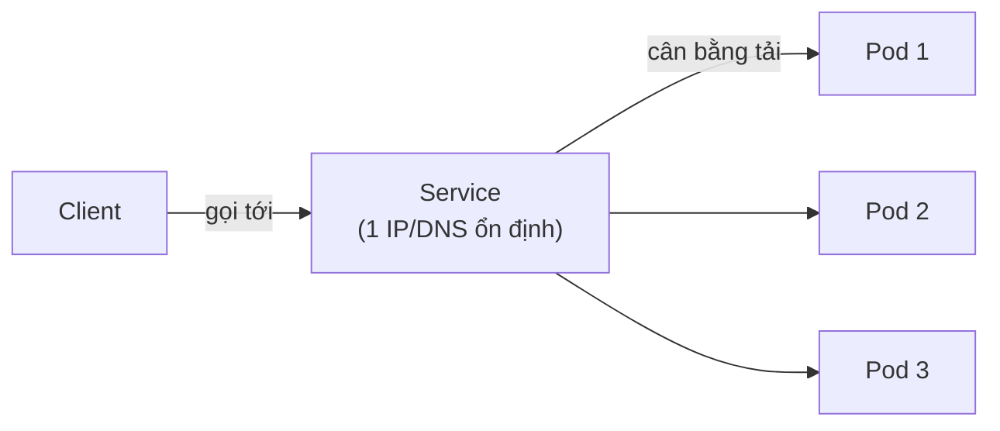
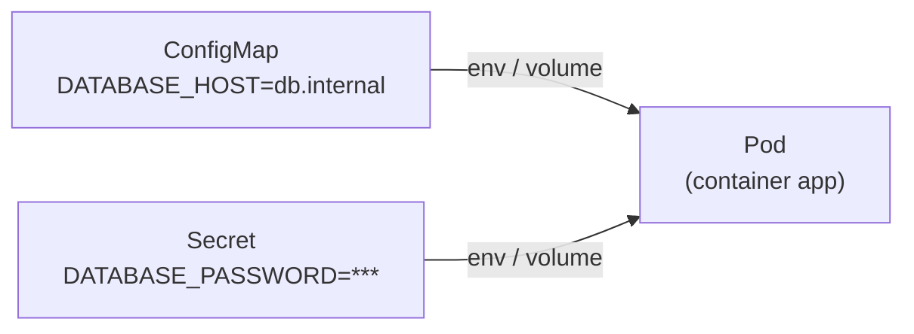
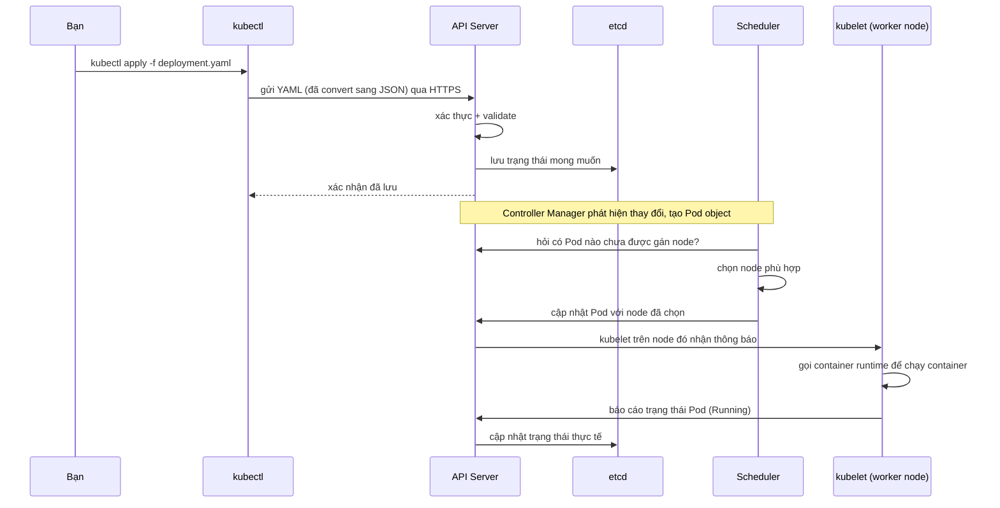

# Ngày 1 — Kubernetes Core & Minikube

> Mục tiêu ngày 1: hiểu kiến trúc K8s, làm chủ Pod/ReplicaSet/Deployment/Service, biết ConfigMap/Secret là gì, và chạy được mọi thứ trên Minikube.

---

## 1. Bản đồ kiến thức ngày 1

---

## 2. Kiến trúc cluster

### Bảng vai trò từng thành phần

| Thành phần | Nằm ở đâu | Vai trò | Nếu chết thì sao |
|---|---|---|---|
| API Server | Control Plane | Cổng vào duy nhất, mọi request (kubectl, controller, kubelet) đều đi qua đây | Cluster không nhận lệnh mới, nhưng Pod đang chạy vẫn sống |
| etcd | Control Plane | Cơ sở dữ liệu key-value lưu toàn bộ trạng thái cluster | Mất dữ liệu trạng thái, cluster coi như "mất trí nhớ" |
| Scheduler | Control Plane | Quyết định Pod mới chạy trên node nào (dựa CPU/RAM, taint, affinity...) | Pod mới tạo sẽ ở trạng thái `Pending` mãi |
| Controller Manager | Control Plane | Chạy các control loop (Deployment, ReplicaSet...) để giữ trạng thái thực tế khớp trạng thái mong muốn | Không ai tự sửa lỗi khi Pod chết, tự scale... |
| kubelet | Worker Node | Agent trên mỗi node, nói chuyện với API Server, ra lệnh cho runtime chạy/dừng container | Node đó bị đánh dấu `NotReady`, Pod bị điều chuyển đi node khác |
| kube-proxy | Worker Node | Thiết lập luật mạng (iptables/IPVS) để Service định tuyến traffic tới đúng Pod | Traffic không tới được Pod qua Service |
| Container Runtime | Worker Node | Thực thi container thật (containerd, CRI-O...) | Không container nào chạy được trên node đó |

---

## 3. Vòng lặp Reconciliation — "trái tim" của K8s

**Ý tưởng cốt lõi**: bạn không "ra lệnh" K8s làm gì từng bước, bạn chỉ khai báo *muốn có gì* (declarative). Mọi controller trong K8s liên tục lặp vòng này — đây là lý do K8s tự phục hồi khi Pod chết, node hỏng, hay bạn `kubectl scale`.

---

## 4. Bảng 80/20 — Ưu tiên học ngày 1

| Ưu tiên | Kiến thức cốt lõi | Vì sao quan trọng | Ứng dụng thực tế |
|---|---|---|---|
| Cao | Deployment (rolling update, rollback, scale) | 90% workload production dùng Deployment, không dùng Pod trần | Deploy app mới không downtime, rollback khi lỗi |
| Cao | Service (đặc biệt ClusterIP) | Pod là ephemeral (chết là mất IP), Service là địa chỉ ổn định để gọi vào | Backend gọi tới database Pod, frontend gọi tới backend Service |
| Cao | Reconciliation loop | Hiểu tại sao "sửa tay" trong Pod sẽ vô nghĩa, phải sửa qua manifest | Debug đúng chỗ khi thấy Pod tự "hồi sinh" sau khi bạn xóa |
| Trung bình | ConfigMap & Secret | Tách config khỏi image, đổi config không cần build lại image | Đổi biến môi trường (DB_HOST, API_KEY) không rebuild |
| Trung bình | kubectl cơ bản (get/describe/logs/exec) | Là công cụ debug hàng ngày, dùng liên tục mọi ngày còn lại | Tìm nguyên nhân Pod lỗi trong vài giây |
| Trung bình | NodePort / Ingress (khái niệm) | Cần biết cách traffic từ ngoài vào cluster, dù chi tiết để ngày 2 | Truy cập app từ máy cá nhân khi test trên Minikube |
| Thấp | LoadBalancer Service | Trên Minikube gần như không dùng thật (cần cloud provider hoặc `minikube tunnel`) | Chỉ cần biết khái niệm, ít thực hành ngày 1 |
| Thấp | Cấu trúc etcd chi tiết | Không cần biết vận hành etcd để làm dev/deploy app | Chỉ cần hiểu vai trò, chưa cần vận hành |

---

## 5. Pod — đơn vị nhỏ nhất

**Là gì?** Pod là nhóm 1 hoặc nhiều container luôn chạy cùng nhau trên 1 node, chia sẻ network (cùng IP) và storage.

**Vì sao cần?** Container đơn lẻ (`docker run`) không có ai theo dõi, tự khởi động lại khi cluster restart, hay tự dàn đều qua nhiều máy. Pod là đơn vị mà K8s lên lịch (schedule) và theo dõi.

**Khi nào dùng trực tiếp?** Hầu như KHÔNG BAO GIỜ tạo Pod trần trong production — luôn tạo qua Deployment. Pod trần chỉ dùng để test nhanh hoặc debug (`kubectl run`).

**Ví dụ thực tế**: một Pod chạy container `nginx` để phục vụ web tĩnh, có thể có thêm 1 container "sidecar" ghi log gửi ra ngoài.

> **Đặc điểm quan trọng cần nhớ**: Pod là **ephemeral** (tạm thời) — khi Pod chết, nó KHÔNG tự khởi động lại thành Pod cũ, mà bị controller tạo Pod **mới hoàn toàn** (IP mới, tên mới). Đây là lý do bạn không bao giờ nên "gắn cứng" IP Pod vào code.

---

## 6. Deployment — quản lý Pod đúng cách

**Là gì?** Deployment khai báo "tôi muốn N bản sao của app này luôn chạy", và tự động tạo ra ReplicaSet, ReplicaSet tạo ra Pod.

**Vì sao cần?** Deployment cho bạn: tự phục hồi khi Pod chết, scale lên/xuống bằng 1 lệnh, rolling update không downtime, rollback về version cũ khi lỗi.

**Khi nào dùng?** Mọi stateless workload (web server, API, worker...). Với stateful (database) sẽ dùng StatefulSet (học ngày sau).

**Ví dụ thực tế**: deploy 3 bản sao của API backend, khi 1 Pod chết, Deployment tự tạo Pod thay thế trong vài giây.

**Rolling update & rollback** — khi bạn đổi image từ `v1` sang `v2`:

---

## 7. Service — địa chỉ ổn định cho Pod

**Là gì?** Service là một địa chỉ IP/DNS cố định, đứng trước một nhóm Pod (chọn bằng label selector), tự động cân bằng traffic tới các Pod đang sống.

**Vì sao cần?** Vì Pod là ephemeral (IP thay đổi liên tục), app không thể gọi trực tiếp vào IP Pod. Service giải quyết vấn đề này bằng 1 địa chỉ không đổi.

**Khi nào dùng loại nào?**

| Loại Service | Phạm vi truy cập | Khi nào dùng | Ví dụ |
|---|---|---|---|
| ClusterIP (mặc định) | Chỉ trong cluster | Giao tiếp nội bộ giữa các service (backend gọi database) | Backend gọi tới Service của database Pod |
| NodePort | Ngoài cluster, qua `<NodeIP>:<port>` (30000-32767) | Test nhanh, dev local (Minikube), không có LoadBalancer thật | Truy cập app từ máy cá nhân khi dùng Minikube |
| LoadBalancer | Ngoài cluster, qua IP public do cloud provider cấp | Production trên cloud (AWS/GCP/Azure) có LB thật | Expose app ra internet trên EKS/GKE |

---

## 8. Ingress — giới thiệu nhanh (đào sâu ngày 2)

**Khái niệm**: Ingress là "bộ định tuyến HTTP" đứng trước nhiều Service, cho phép định tuyến theo domain/path (ví dụ `api.example.com` → Service A, `web.example.com` → Service B) chỉ với 1 điểm vào duy nhất.

> Chi tiết về Ingress Controller, TLS, API Gateway sẽ học kỹ ở **ngày 2**. Ngày 1 chỉ cần hiểu: Ingress giải quyết vấn đề "không muốn mỗi Service phải có 1 LoadBalancer riêng".

---

## 9. ConfigMap & Secret — tách config khỏi code

**Là gì?** ConfigMap lưu dữ liệu cấu hình dạng key-value (không nhạy cảm). Secret giống ConfigMap nhưng dành cho dữ liệu nhạy cảm (password, token, key) — dữ liệu được encode base64 (không phải mã hóa mạnh, chỉ là encode).

**Vì sao cần?** Để không hard-code config (URL, port, feature flag) hay bí mật (password DB) vào image. Đổi config = đổi ConfigMap, không cần build lại image.

**Khi nào dùng?**
- ConfigMap: biến môi trường, file config, feature flags.
- Secret: password, API key, TLS certificate.

**Ví dụ thực tế**: app cần `DATABASE_HOST` và `DATABASE_PASSWORD` — host để trong ConfigMap, password để trong Secret, cả hai được "bơm" vào Pod qua biến môi trường hoặc volume mount.

> Lưu ý quan trọng: Secret **không tự động mã hóa mạnh**, chỉ base64-encode. Bảo mật thật (mã hóa at-rest, quản lý key) là chủ đề nâng cao — **sẽ đào sâu ở ngày sau** (RBAC, Secret encryption).

---

## 10. Một lượt `kubectl apply` diễn ra thế nào

---

## 11. Yếu tố tạo khác biệt (ngày 1)

- **Hiểu Pod là ephemeral**: khi debug, đừng cố "vào sửa" trong Pod đang chạy rồi mong nó tồn tại — sửa manifest và apply lại. Việc quản lý state bền (volume, StatefulSet) sẽ học sâu ở **ngày sau**.
- **Đọc Events khi debug**: `kubectl describe pod <name>` có phần `Events` ở cuối, đây là nơi đầu tiên nên nhìn khi Pod lỗi (trước khi đọc logs). Việc phân tích sâu các loại lỗi (CrashLoopBackOff, ImagePullBackOff, OOMKilled...) sẽ thực hành ở phần thực hành ngày 1 và đào sâu thêm ở **ngày sau**.

---

## 12. Best Practices ngày 1

| Nên làm | Vì sao | Sai lầm thường gặp |
|---|---|---|
| Luôn dùng Deployment, không tạo Pod trần | Pod trần không tự phục hồi khi chết | Tạo Pod bằng `kubectl run` rồi quên, Pod chết không ai tạo lại |
| Luôn expose app qua Service, không gọi trực tiếp Pod IP | Pod IP thay đổi mỗi khi Pod restart | Hard-code IP Pod vào code/config, app lỗi ngẫu nhiên sau khi Pod restart |
| Đặt `labels` rõ ràng, nhất quán (app, env...) | Service/Deployment dựa vào label selector để tìm đúng Pod | Sửa label mà quên cập nhật selector, Service "mất" hết Pod |
| Dùng `kubectl describe` + xem `Events` trước khi đọc log | Events cho biết lỗi ở tầng scheduler/kubelet trước khi container chạy | Chỉ xem `kubectl logs`, bỏ lỡ lỗi kiểu `ImagePullBackOff` (log rỗng vì container chưa từng chạy) |
| Tách config nhạy cảm ra Secret, không nhạy cảm ra ConfigMap | Rõ ràng, dễ áp policy bảo mật riêng cho Secret | Nhồi cả password vào ConfigMap vì "cho tiện" |

---

➡️ Tiếp theo: [thuc-hanh.md](./thuc-hanh.md)
