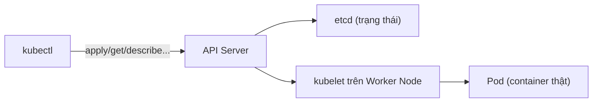

# Ngày 1 — Tài liệu & Cheatsheet

## 1. Sơ đồ tham chiếu nhanh



## 2. Bảng viết tắt tài nguyên (dùng trong lệnh kubectl)

| Viết tắt | Tên đầy đủ | Ý nghĩa |
|---|---|---|
| `po` | pods | Đơn vị nhỏ nhất, 1+ container chạy chung |
| `deploy` | deployments | Quản lý ReplicaSet + Pod, hỗ trợ rolling update/rollback |
| `rs` | replicasets | Đảm bảo đúng số lượng Pod (thường không tạo tay) |
| `svc` | services | Địa chỉ ổn định trước nhóm Pod |
| `cm` | configmaps | Cấu hình dạng key-value, không nhạy cảm |
| `ing` | ingress | Định tuyến HTTP vào nhiều Service |
| `ns` | namespaces | Không gian tên logic để chia nhỏ cluster |
| (không viết tắt) | secrets | Dữ liệu nhạy cảm (encode base64) |

## 3. Cheatsheet lệnh kubectl

```bash
# ---- Xem thông tin (get) ----
kubectl get nodes                        # Xem danh sách node và trạng thái (Ready/NotReady)
kubectl get pods                         # Xem Pod trong namespace hiện tại (mặc định: default)
kubectl get pods -o wide                 # Xem Pod kèm IP, node đang chạy
kubectl get deploy,svc,cm,secret         # Xem nhiều loại resource cùng lúc
kubectl get pods --watch                 # Theo dõi Pod thay đổi trạng thái theo thời gian thực

# ---- Xem chi tiết & debug (describe, logs) ----
kubectl describe pod <ten-pod>            # Xem chi tiết Pod, quan trọng nhất là mục "Events" ở cuối
kubectl describe deploy <ten-deploy>      # Xem chi tiết Deployment (điều kiện, sự kiện rollout)
kubectl logs <ten-pod>                    # Xem log container trong Pod (container đầu tiên nếu có nhiều)
kubectl logs <ten-pod> -c <ten-container> # Xem log của 1 container cụ thể trong Pod nhiều container
kubectl logs -f <ten-pod>                 # Theo dõi log liên tục (follow), giống tail -f

# ---- Áp dụng thay đổi (apply) ----
kubectl apply -f deployment.yaml          # Tạo hoặc cập nhật resource theo file YAML (declarative)
kubectl delete -f deployment.yaml         # Xóa resource được khai báo trong file

# ---- Vào trong container (exec) ----
kubectl exec -it <ten-pod> -- /bin/sh     # Mở shell tương tác vào container để kiểm tra trực tiếp
kubectl exec <ten-pod> -- env             # Chạy 1 lệnh trong container rồi thoát ra (xem biến môi trường)

# ---- Rollout: rolling update & rollback ----
kubectl set image deploy/<ten> <container>=<image>:<tag>   # Cập nhật image, tự động rolling update
kubectl rollout status deploy/<ten>       # Theo dõi tiến trình rolling update
kubectl rollout history deploy/<ten>      # Xem lịch sử các lần rollout
kubectl rollout undo deploy/<ten>         # Rollback về version ngay trước
kubectl rollout undo deploy/<ten> --to-revision=2  # Rollback về 1 revision cụ thể

# ---- Scale ----
kubectl scale deploy/<ten> --replicas=5   # Tăng/giảm số lượng Pod của Deployment

# ---- Minikube ----
minikube start                            # Khởi động cluster Minikube (1 node, dùng làm control plane + worker)
minikube status                           # Kiểm tra trạng thái cluster (Running/Stopped)
minikube stop                             # Dừng cluster (giữ lại dữ liệu)
minikube delete                           # Xóa hoàn toàn cluster Minikube
minikube service <ten-service>            # Mở URL truy cập Service NodePort trên máy local
minikube dashboard                        # Mở giao diện web quản lý cluster
minikube tunnel                           # Giả lập LoadBalancer thật trên máy local (chạy nền, cần quyền admin)
```

## 4. Tài liệu tham khảo

| Tài liệu | Nên đọc/xem trước | Dùng để làm gì |
|---|---|---|
| [Kubernetes Concepts](https://kubernetes.io/docs/concepts/) | Mục "Cluster Architecture" và "Workloads" | Hiểu tổng quan kiến trúc control plane/worker node, khái niệm nền tảng |
| [Kubernetes — Pods](https://kubernetes.io/docs/concepts/workloads/pods/) | Phần "Pod lifecycle" | Hiểu chi tiết vòng đời Pod, tại sao Pod ephemeral |
| [Kubernetes — Deployments](https://kubernetes.io/docs/concepts/workloads/controllers/deployment/) | Phần "Updating a Deployment" và "Rolling Back" | Tham khảo cú pháp rolling update, rollback, scale chuẩn |
| [Kubernetes — Services](https://kubernetes.io/docs/concepts/services-networking/service/) | Phần "Service types" | So sánh chi tiết ClusterIP/NodePort/LoadBalancer |
| [Kubernetes — Ingress](https://kubernetes.io/docs/concepts/services-networking/ingress/) | Phần "What is Ingress" (chỉ đọc lướt ngày 1) | Chuẩn bị nền cho bài học sâu Ingress/API Gateway ngày 2 |
| [Kubernetes — ConfigMaps](https://kubernetes.io/docs/concepts/configuration/configmap/) | Phần "ConfigMaps and Pods" | Tham khảo cách mount ConfigMap vào Pod (env vs volume) |
| [Kubernetes — Secrets](https://kubernetes.io/docs/concepts/configuration/secret/) | Phần "Types of Secret" | Tham khảo cách tạo và dùng Secret an toàn hơn |
| [Minikube — Get Started](https://minikube.sigs.k8s.io/docs/start/) | Toàn bộ trang (ngắn) | Hướng dẫn cài đặt Minikube theo từng hệ điều hành |
| [kubectl Cheat Sheet](https://kubernetes.io/docs/reference/kubectl/cheatsheet/) | Mục "Viewing, finding resources" | Tra cứu nhanh các lệnh kubectl khác ngoài phần đã liệt kê ở trên |

> Nếu đường link nào ở trên không còn hoạt động do tài liệu chính thức thay đổi cấu trúc, hãy tìm lại bằng công cụ tra cứu (Context7 hoặc search) trước khi coi đây là nguồn chính xác.

---

➡️ Quay lại: [bai-hoc.md](./bai-hoc.md) · Thực hành: [thuc-hanh.md](./thuc-hanh.md)
