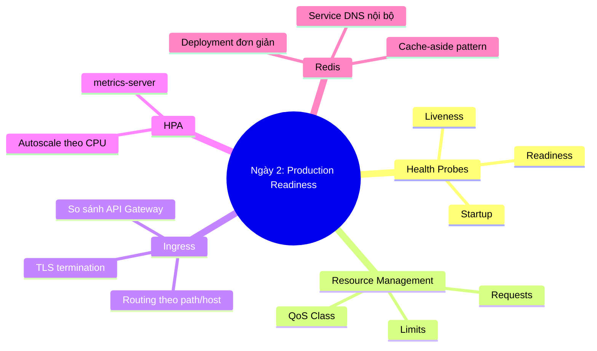
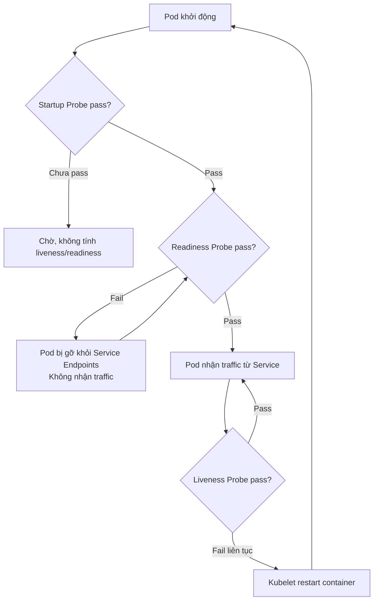
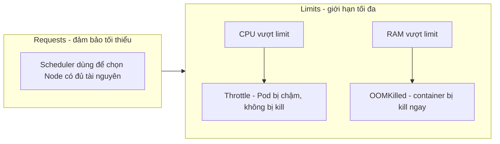
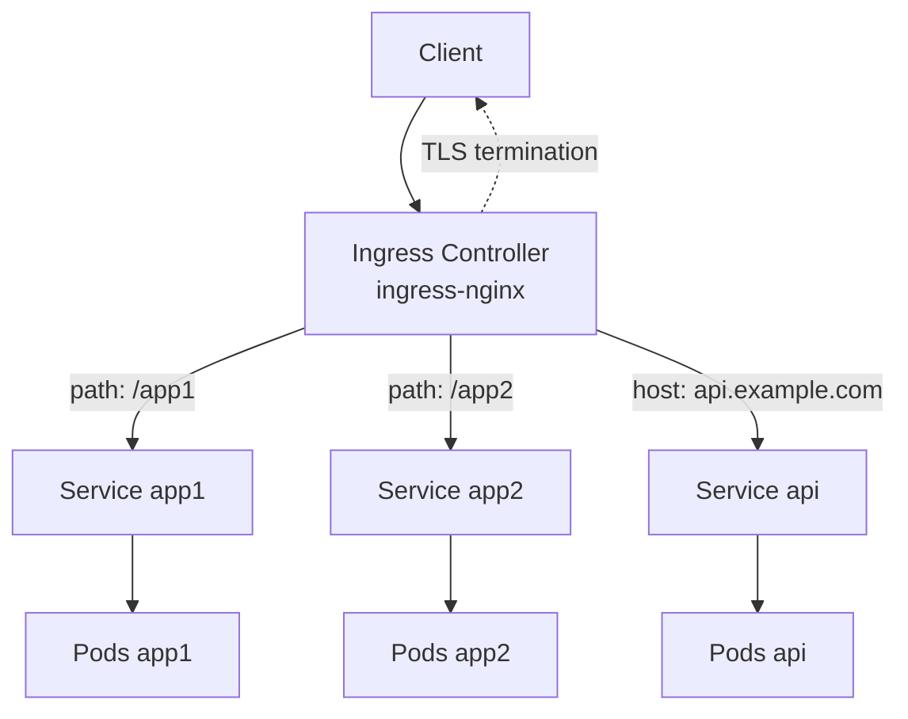
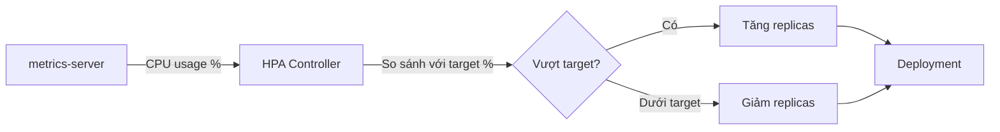
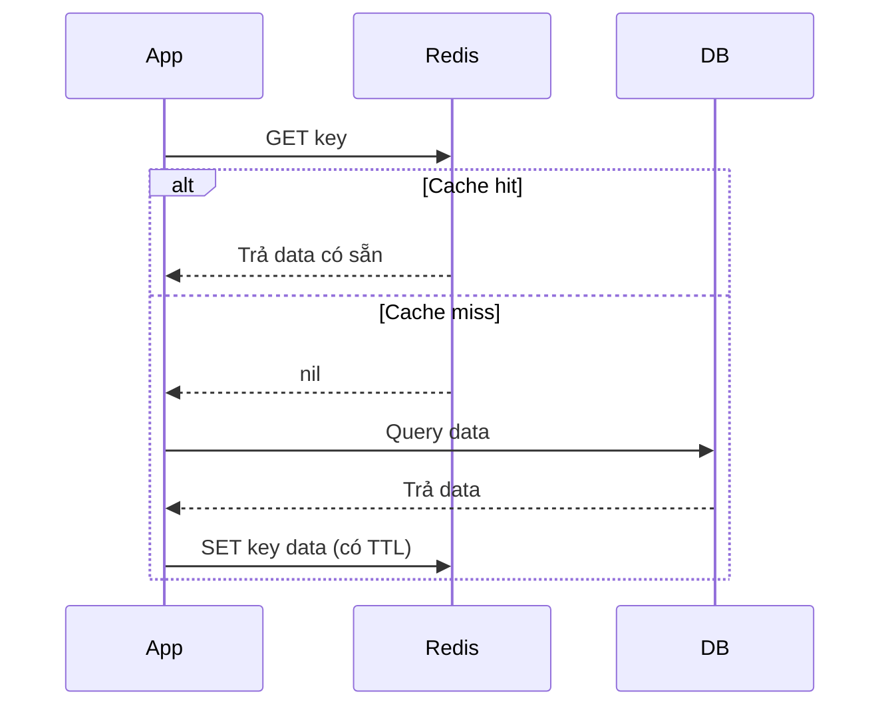

# Ngày 2: Production Readiness và Redis Cache

## Bản đồ kiến thức ngày 2

## 1. Health Probes: liveness vs readiness vs startup

Ba loại probe trả lời ba câu hỏi khác nhau. Nhầm lẫn giữa chúng là nguyên nhân phổ biến nhất khiến app "chạy được trên máy dev nhưng chết trên production".

**Bảng so sánh 3 probe:**

| Probe | Dùng để làm gì | Hậu quả khi thiếu | Hậu quả khi đặt sai |
|---|---|---|---|
| **Liveness** | Phát hiện container bị treo/deadlock, kích hoạt restart | Container treo mãi, không tự phục hồi, phải can thiệp thủ công | Threshold quá nhạy → restart loop liên tục dù app vẫn hoạt động (crash loop giả) |
| **Readiness** | Quyết định Pod có nên nhận traffic từ Service hay không | Traffic bị dồn vào Pod chưa sẵn sàng (vd chưa kết nối DB) → lỗi 5xx cho user | Threshold quá chặt → Pod healthy vẫn bị loại khỏi Service, giảm capacity không lý do |
| **Startup** | Cho ứng dụng khởi động chậm (JVM, load cache lớn) thời gian trước khi liveness/readiness tính | App khởi động chậm bị liveness kill giữa lúc đang boot → restart loop vô tận | initialDelay/failureThreshold quá ngắn → giống lỗi thiếu startup probe; quá dài → chậm phát hiện app treo thật |

## 2. Resource Requests & Limits

| Tài nguyên | Vượt Limit thì sao | Có bị kill không |
|---|---|---|
| CPU | Bị **throttle** (giảm tốc, CPU bị "bóp") | Không, chỉ chậm lại |
| Memory | Bị **OOMKilled** (Out Of Memory) | Có, container chết ngay, restart theo policy |

**QoS Class** (ngắn):

| Class | Điều kiện | Ưu tiên khi Node thiếu tài nguyên |
|---|---|---|
| Guaranteed | requests = limits cho cả CPU và RAM | Bị evict cuối cùng |
| Burstable | Có requests, nhưng requests ≠ limits (hoặc chỉ 1 trong 2) | Ưu tiên trung bình |
| BestEffort | Không đặt requests/limits | Bị evict đầu tiên |

## 3. Ingress như API Gateway

Ingress đóng vai trò "điểm vào duy nhất" (single entry point): định tuyến HTTP theo path/host, và có thể terminate TLS tại đây thay vì mỗi Service tự lo HTTPS.

| Ingress làm được | Ingress KHÔNG làm được (cần API Gateway chuyên dụng như Kong/APISIX) |
|---|---|
| Routing theo path/host | Rate limiting nâng cao, quota theo API key |
| TLS termination cơ bản | Transform request/response, plugin phong phú |
| Load balancing đơn giản tới Service | Authentication/OAuth phức tạp tích hợp sẵn |
| | API versioning, canary/traffic splitting nâng cao (cần thêm CRD như Gateway API) |

## 4. HPA (Horizontal Pod Autoscaler)

HPA cần **metrics-server** để lấy số liệu CPU/RAM thực tế của Pod, không có metrics-server thì HPA không hoạt động.

## 5. Redis làm cache (cache-aside pattern)

App kết nối Redis qua DNS nội bộ của Service, ví dụ `redis:6379` (Service tên `redis` trong cùng namespace).

**Vì sao Redis "stateful" cần cân nhắc:** Redis lưu dữ liệu trong memory, nếu Pod bị xóa/restart thì dữ liệu mất (trừ khi có persistence + volume). Dùng Deployment đơn giản chỉ phù hợp mục đích học/demo; production nên dùng **StatefulSet** (nếu tự quản lý, cần định danh ổn định + volume) hoặc **managed Redis** (ElastiCache, Redis Cloud...).

## Bảng 80/20 ngày 2

| Ưu tiên | Kiến thức | Vì sao | Ứng dụng |
|---|---|---|---|
| 1 | Readiness + Liveness probe | Ngăn traffic vào Pod chưa sẵn sàng, tự phục hồi Pod treo | Mọi Deployment production đều cần |
| 2 | Resource requests/limits | Tránh 1 Pod "ăn hết" tài nguyên Node, tránh OOMKilled bất ngờ | Bắt buộc trong mọi cluster nhiều team |
| 3 | Ingress routing | Một điểm vào cho nhiều service, đỡ tốn LoadBalancer | Khi có >1 service cần expose ra ngoài |
| 4 | HPA theo CPU | Tự động scale theo tải, tiết kiệm chi phí | Traffic biến động theo giờ/ngày |
| 5 | Redis cache | Giảm tải DB, tăng tốc response | App đọc nhiều, ghi ít |

## Tạo khác biệt

Người **deploy được** chỉ cần `kubectl apply` cho Pod chạy. Người **vận hành được** biết:
- Đặt probe sai → hoặc app không bao giờ nhận traffic (readiness quá chặt), hoặc restart loop vô tận (liveness quá nhạy hoặc thiếu startup probe cho app khởi động chậm).
- Không đặt resource limits → một Pod lỗi có thể làm sập cả Node, ảnh hưởng Pod khác (noisy neighbor).
- Đây chính là ranh giới giữa "chạy demo" và "chịu được production traffic".

## Best Practices

| Nên làm | Vì sao | Sai lầm thường gặp |
|---|---|---|
| Luôn có readiness probe cho app có dependency ngoài (DB, cache) | Tránh nhận traffic khi chưa kết nối được dependency | Không có readiness → 5xx ngay sau deploy |
| Dùng startup probe cho app khởi động > vài giây | Tránh liveness kill app đang boot | Dùng initialDelaySeconds lớn cho liveness thay vì startup probe riêng |
| Luôn đặt requests và limits cho mọi container | Scheduler đặt Pod đúng chỗ, tránh OOM ảnh hưởng lẫn nhau | Chỉ đặt limits mà không đặt requests, hoặc bỏ trống cả hai |
| Set target CPU HPA hợp lý (thường 60-80%) | Có buffer để scale trước khi quá tải | Set target quá cao (90%+) khiến scale trễ |
| Test OOMKilled trong dev trước khi lên production | Biết ngưỡng an toàn thực tế của app | Đặt limit theo cảm tính, không đo thử |

## Trade-offs

| So sánh | Ưu điểm A | Ưu điểm B | Khi nào chọn |
|---|---|---|---|
| Ingress vs LoadBalancer mỗi Service | Ingress: 1 IP/entry point, tiết kiệm chi phí cloud LB | LoadBalancer riêng: đơn giản, cách ly hoàn toàn giữa service | Nhiều service HTTP → Ingress; ít service, cần L4 riêng → LoadBalancer |
| Redis Deployment vs StatefulSet vs Managed | Deployment: đơn giản, nhanh để học | StatefulSet: định danh ổn định + volume, phù hợp self-host production | Managed (ElastiCache...): không cần tự vận hành, có SLA | Học/demo → Deployment; tự quản hạ tầng → StatefulSet; có budget → Managed |
| HPA theo CPU vs Custom Metrics | CPU: đơn giản, có sẵn với metrics-server | Custom metrics (queue length, request/s): chính xác hơn với tải thực tế | Tải liên quan CPU rõ ràng → CPU; tải theo hàng đợi/RPS → custom metrics (cần Prometheus Adapter) |

---

➡️ [thuc-hanh.md](./thuc-hanh.md)
