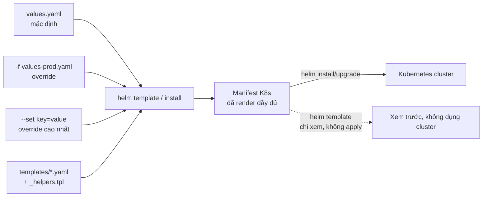
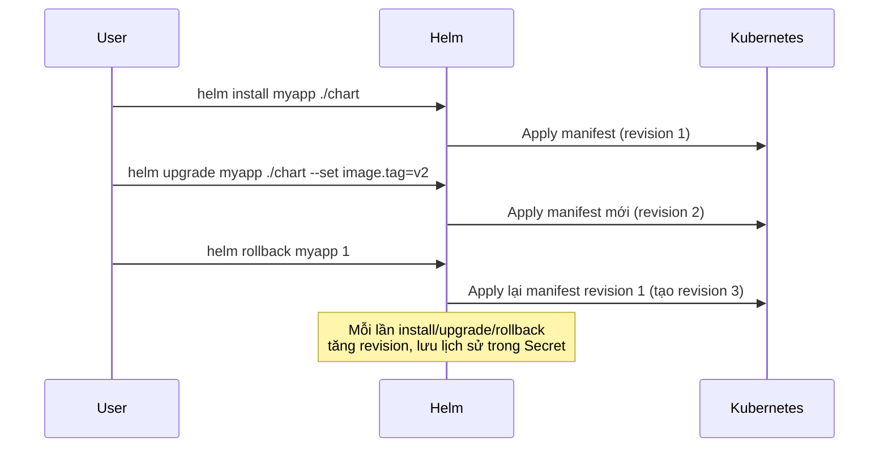

# Ngày 3: Helm - Đóng gói và quản lý ứng dụng Kubernetes

## Bản đồ kiến thức

```mermaid
mindmap
  root((Helm))
    Khái niệm cốt lõi
      Chart
      Release
      Repository
      Values
    Cấu trúc chart
      Chart.yaml
      values.yaml
      templates/
      _helpers.tpl
      charts/ (subchart)
    Template Go
      "{{ .Values.x }}"
      if/range/with
      pipeline (default, quote, nindent)
      include/define
    Lệnh vận hành
      create/install/upgrade
      rollback/uninstall
      template/lint
      repo add/update
      dependency update
    So sánh
      Helm
      Kustomize
      Raw YAML
```

## Vấn đề Helm giải quyết

**Trước Helm** - mỗi environment (dev/staging/prod) có một bộ file YAML riêng, copy-paste và sửa tay:

```
Trước Helm (raw YAML)                Sau Helm (template + values)
┌─────────────────────┐              ┌─────────────────────┐
│ dev/deployment.yaml  │              │ templates/           │
│ dev/service.yaml     │              │   deployment.yaml     │◄──┐
│ dev/ingress.yaml     │              │   service.yaml         │  │ 1 bộ
├─────────────────────┤   ──────►    │   ingress.yaml         │  │ template
│ staging/deployment.. │              │ values.yaml (default) │  │ dùng chung
│ staging/service.yaml │              └─────────────────────┘  │
│ staging/ingress.yaml │                          ▲             │
├─────────────────────┤                           │             │
│ prod/deployment.yaml │              ┌──────────┴──────────┐  │
│ prod/service.yaml    │              │ values-dev.yaml       │──┘
│ prod/ingress.yaml    │              │ values-staging.yaml    │──┘
└─────────────────────┘              │ values-prod.yaml       │──┘
  Trùng lặp ~90%, sửa 1 chỗ          └─────────────────────┘
  phải sửa N chỗ, dễ lệch cấu hình     Sửa logic 1 nơi, khác biệt
                                        chỉ nằm ở values
```

Vấn đề cụ thể:
- Copy-paste YAML giữa các môi trường → dễ quên đồng bộ, dễ sai sót.
- Không có versioning cho "bản deploy" (release) → khó rollback nguyên vẹn một bộ manifest.
- Không có cách chia sẻ/tái sử dụng chart giữa các team hoặc project (không có package + repository).

## Cấu trúc thư mục chart

```
myapp/
├── Chart.yaml            # Metadata: name, version, appVersion, dependencies
├── values.yaml           # Giá trị mặc định cho toàn bộ template
├── charts/                # Subchart (dependency) được vendor vào đây
│   └── redis/             # Ví dụ: Redis là dependency
├── templates/
│   ├── deployment.yaml    # Template render ra Deployment
│   ├── service.yaml       # Template render ra Service
│   ├── ingress.yaml       # Template render ra Ingress
│   ├── configmap.yaml     # Template render ra ConfigMap
│   ├── _helpers.tpl       # Định nghĩa helper (label chung, tên release...)
│   └── NOTES.txt          # Thông báo hiển thị sau khi install/upgrade
└── .helmignore            # File/thư mục bỏ qua khi package chart
```

| Thành phần | Vai trò |
|---|---|
| `Chart.yaml` | Metadata của chart: tên, version chart, appVersion, khai báo dependencies (subchart) |
| `values.yaml` | Giá trị mặc định, người dùng override bằng `-f` hoặc `--set` |
| `templates/` | Chứa các file template Go, render ra manifest K8s thật |
| `_helpers.tpl` | Định nghĩa các template con (`define`) để tái sử dụng, ví dụ label chuẩn |
| `charts/` | Chứa subchart - dependency được `helm dependency update` tải về |
| `.helmignore` | Loại trừ file không cần đóng gói (giống `.gitignore`) |

## Luồng render: từ template đến manifest



Thứ tự override giá trị (ưu tiên tăng dần): `values.yaml` mặc định trong chart → file truyền qua `-f` → `--set` trên command line (thắng cuối cùng).

## Vòng đời release



Mỗi `Release` là một instance chart đã được cài vào cluster với tên riêng (ví dụ `myapp`). Helm lưu lịch sử revision, nên `rollback` không phải "undo git" mà là apply lại manifest của revision cũ.

## Bảng 80/20

| Ưu tiên | Kiến thức | Vì sao | Ứng dụng |
|---|---|---|---|
| 1 | `helm create`, cấu trúc chart, `values.yaml` | Nền tảng để đọc/viết mọi chart | Đóng gói bất kỳ app nào thành chart chuẩn |
| 2 | Template Go cơ bản (`.Values`, if/range, pipeline) | 80% logic template chỉ dùng vài cú pháp này | Tham số hóa image, replicas, resources, env |
| 3 | `helm install/upgrade -i/rollback` | Vòng đời release là thao tác hàng ngày | Deploy, cập nhật, khôi phục nhanh khi lỗi |
| 4 | Values override (`-f`, `--set`) | Quản lý nhiều environment không copy code | 1 chart chạy cho dev/staging/prod |
| 5 | `_helpers.tpl` + `include` | Tránh lặp label/annotation ở nhiều file | Label chuẩn `app.kubernetes.io/*` dùng chung |
| 6 | `helm lint`, `helm template` | Bắt lỗi trước khi apply lên cluster | CI kiểm tra chart trước khi merge |
| 7 | Dependencies (subchart) | Tái sử dụng chart công khai (Redis, Postgres...) | Đóng gói app + Redis thành 1 chart install |

## Khái niệm cốt lõi

### Chart
Một package chứa template + metadata để mô tả một ứng dụng K8s. Giống "package" trong quản lý gói (npm, apt) nhưng cho K8s.

### Release
Một lần cài đặt chart vào cluster, có tên riêng và namespace riêng. Cùng một chart có thể tạo nhiều release khác nhau (ví dụ `myapp-dev`, `myapp-staging`).

### Repository
Nơi lưu trữ và phân phối chart đã đóng gói (`.tgz`), ví dụ Artifact Hub, Bitnami repo. Thêm bằng `helm repo add`.

### values.yaml và template
`values.yaml` là dữ liệu, `templates/*.yaml` là khuôn mẫu. Helm merge dữ liệu vào khuôn để ra manifest cuối.

Ví dụ snippet template ngắn:

```yaml
# templates/deployment.yaml
apiVersion: apps/v1
kind: Deployment
metadata:
  name: {{ .Release.Name }}-myapp
  labels:
    {{- include "myapp.labels" . | nindent 4 }}
spec:
  replicas: {{ .Values.replicaCount | default 1 }}
  template:
    spec:
      containers:
        - name: myapp
          image: "{{ .Values.image.repository }}:{{ .Values.image.tag | default .Chart.AppVersion }}"
          {{- if .Values.env }}
          env:
            {{- range $key, $value := .Values.env }}
            - name: {{ $key }}
              value: {{ $value | quote }}
            {{- end }}
          {{- end }}
```

```yaml
# templates/_helpers.tpl
{{- define "myapp.labels" -}}
app.kubernetes.io/name: {{ .Chart.Name }}
app.kubernetes.io/instance: {{ .Release.Name }}
{{- end -}}
```

## Tạo khác biệt

- **`_helpers.tpl` tái sử dụng**: định nghĩa label/annotation chuẩn một lần bằng `define`, gọi lại nhiều nơi bằng `include "ten.helper" .`. Giúp mọi resource trong chart có label nhất quán, dễ `kubectl get -l`.
- **Dependencies/subchart**: khai báo trong `Chart.yaml`:
  ```yaml
  dependencies:
    - name: redis
      version: "18.x.x"
      repository: "https://charts.bitnami.com/bitnami"
  ```
  Sau đó `helm dependency update` tải subchart vào `charts/`. Khi `helm install`, cả app và Redis được cài cùng lúc, cấu hình Redis override qua `values.yaml` với key `redis:`.
- **Quản lý nhiều environment**: 1 chart, nhiều file `values-<env>.yaml`, chỉ chứa phần khác biệt (image tag, replica, resource limit, domain ingress).
- **Khi nào Helm là quá mức**: app đơn giản, không cần versioning phức tạp, không cần chia sẻ chart, hoặc team chỉ cần "patch" một vài field trên manifest có sẵn (thêm label, đổi namespace) → Kustomize (overlay, không cần template engine) hoặc raw YAML + `kubectl apply -k` gọn hơn.

## Best Practices

| Nên làm | Vì sao | Sai lầm thường gặp |
|---|---|---|
| Luôn có giá trị mặc định hợp lý trong `values.yaml` | Chart dùng được ngay mà không cần override | Hardcode giá trị (image, domain) trực tiếp trong template |
| `helm lint` trước khi install/upgrade | Bắt lỗi cú pháp, thiếu field bắt buộc sớm | Install thẳng lên cluster rồi mới phát hiện lỗi |
| `helm template` để xem manifest trước khi apply | Biết chính xác điều gì sẽ được tạo | Tin tưởng mù quáng vào template phức tạp (nhiều if/range lồng nhau) |
| Dùng `include`/`define` cho phần lặp lại (label) | Nhất quán, sửa 1 nơi | Copy-paste block YAML giữa các template |
| Pin version trong `Chart.yaml` dependencies | Tránh subchart tự đổi version gây lỗi bất ngờ | Dùng version range quá lỏng (`*`, `^1`) |
| Dùng `--dry-run` hoặc `helm diff` (plugin) trước upgrade quan trọng | Thấy trước thay đổi trên production | `helm upgrade` trực tiếp trên prod không kiểm tra trước |

## Trade-offs: Helm vs Kustomize vs Raw YAML

| Cách tiếp cận | Ưu điểm | Nhược điểm | Khi nào dùng |
|---|---|---|---|
| **Helm** | Templating mạnh (logic, loop), quản lý release/version/rollback, đóng gói + chia sẻ (repository), hỗ trợ dependency/subchart | Cú pháp Go template khó đọc khi phức tạp, learning curve cao hơn | App phức tạp, nhiều environment, cần chia sẻ chart, cần rollback theo revision |
| **Kustomize** | Không cần template engine, patch trực tiếp trên YAML gốc, tích hợp sẵn trong `kubectl` | Không có logic điều kiện/loop mạnh như Helm, không có khái niệm release/rollback | Cần override nhỏ giữa các overlay (namespace, số replica, label) mà không muốn học template |
| **Raw YAML** | Đơn giản nhất, không cần công cụ thêm, dễ đọc | Copy-paste giữa environment, không versioning, dễ lệch cấu hình | Project nhỏ, 1 environment, học tập/demo |

➡️ [thuc-hanh.md](./thuc-hanh.md)
