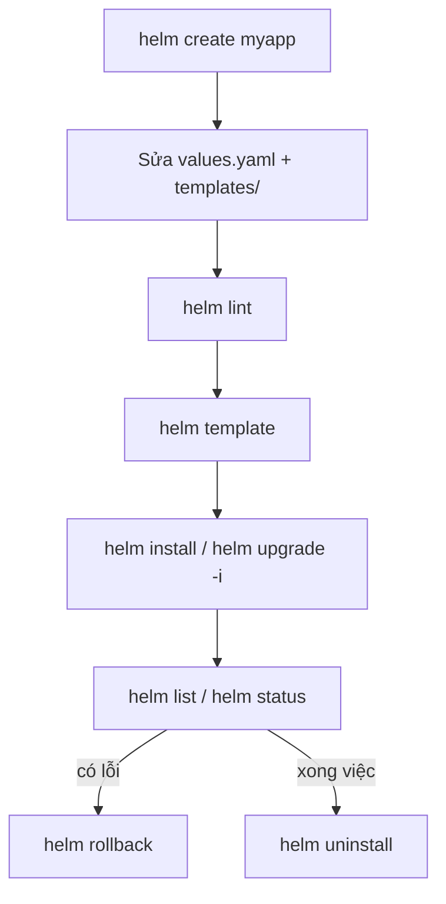

# Ngày 3: Tài liệu tham khảo Helm

## Sơ đồ tham chiếu nhanh



## Cheatsheet lệnh Helm

```bash
# ── Khởi tạo chart ──────────────────────────────────
helm create myapp                        # Tạo scaffold chart mẫu tại ./myapp
helm lint ./myapp                        # Kiểm tra lỗi cú pháp/cấu trúc chart

# ── Xem trước manifest (không apply) ────────────────
helm template myapp ./myapp              # Render manifest ra terminal
helm template myapp ./myapp -f values-prod.yaml   # Render với values override

# ── Cài đặt / cập nhật release ───────────────────────
helm install myapp ./myapp               # Cài release mới, tên "myapp"
helm install myapp ./myapp -f values-dev.yaml     # Cài với file values riêng
helm install myapp ./myapp --set replicaCount=3   # Override 1 giá trị nhanh
helm upgrade myapp ./myapp               # Cập nhật release đã tồn tại
helm upgrade -i myapp ./myapp            # -i = install nếu chưa có (idempotent)
helm upgrade myapp ./myapp --set image.tag=v2 -f values-prod.yaml

# ── Xem thông tin release ────────────────────────────
helm list                                # Danh sách release trong namespace hiện tại
helm list -A                             # Danh sách release ở tất cả namespace
helm status myapp                        # Trạng thái release
helm get values myapp                    # Xem values đang áp dụng cho release
helm history myapp                       # Lịch sử revision

# ── Rollback / gỡ bỏ ─────────────────────────────────
helm rollback myapp 1                    # Rollback về revision số 1
helm uninstall myapp                     # Gỡ release khỏi cluster

# ── Repository & dependency ──────────────────────────
helm repo add bitnami https://charts.bitnami.com/bitnami
helm repo update                         # Cập nhật danh sách chart từ repo
helm search repo redis                   # Tìm chart redis trong repo đã add
helm dependency update ./myapp           # Tải subchart khai báo trong Chart.yaml
helm dependency list ./myapp             # Xem danh sách dependency
```

## Cú pháp template Go thường dùng

```yaml
# Truy cập giá trị từ values.yaml
image: "{{ .Values.image.repository }}:{{ .Values.image.tag }}"

# Giá trị built-in: tên release, namespace, thông tin chart
name: {{ .Release.Name }}-myapp
namespace: {{ .Release.Namespace }}
version: {{ .Chart.AppVersion }}

# Điều kiện if / else
{{- if .Values.ingress.enabled }}
# ... khối YAML chỉ render khi ingress.enabled = true
{{- end }}

# Lặp với range (list)
{{- range .Values.env }}
- name: {{ .name }}
  value: {{ .value | quote }}
{{- end }}

# Lặp với range (map)
{{- range $key, $value := .Values.env }}
- name: {{ $key }}
  value: {{ $value | quote }}
{{- end }}

# with: đổi scope "." sang một object con
{{- with .Values.resources }}
resources:
  limits:
    cpu: {{ .limits.cpu }}
    memory: {{ .limits.memory }}
{{- end }}

# Pipeline: default, quote, nindent
replicas: {{ .Values.replicaCount | default 1 }}
label: {{ .Values.env | quote }}
labels:
  {{- include "myapp.labels" . | nindent 4 }}

# Định nghĩa và gọi lại helper (_helpers.tpl)
{{- define "myapp.labels" -}}
app.kubernetes.io/name: {{ .Chart.Name }}
app.kubernetes.io/instance: {{ .Release.Name }}
{{- end -}}
```

## Tài liệu tham khảo

| Link | Đọc gì trước | Dùng để làm gì |
|---|---|---|
| [helm.sh/docs/intro/quickstart](https://helm.sh/docs/intro/quickstart/) | Cài Helm, khái niệm chart/release cơ bản | Bắt đầu làm quen, chạy lệnh install đầu tiên |
| [helm.sh/docs/chart_template_guide](https://helm.sh/docs/chart_template_guide/getting_started/) | Cú pháp Go template, biến built-in (`.Values`, `.Release`, `.Chart`) | Viết/đọc template phức tạp hơn, dùng range/if/with |
| [helm.sh/docs/topics/charts](https://helm.sh/docs/topics/charts/) | Cấu trúc chart chi tiết, `Chart.yaml` các field | Hiểu đầy đủ metadata và quy tắc đóng gói chart |
| [helm.sh/docs/chart_best_practices](https://helm.sh/docs/chart_best_practices/) | Quy ước đặt tên, cấu trúc file khuyến nghị | Viết chart theo chuẩn cộng đồng, dễ maintain |
| [artifacthub.io](https://artifacthub.io/) | Cách tìm kiếm chart công khai | Tìm chart Redis/Postgres... để làm dependency subchart |

Ghi chú: các link trên đều thuộc domain chính thức helm.sh và artifacthub.io, không có link nào cần đánh dấu "(cần kiểm chứng)".
