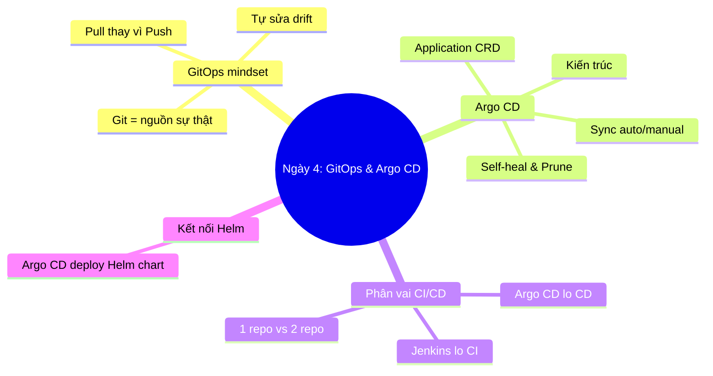
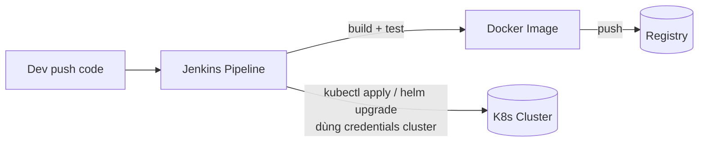
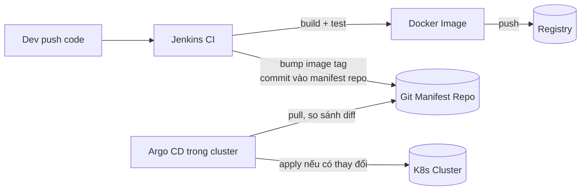
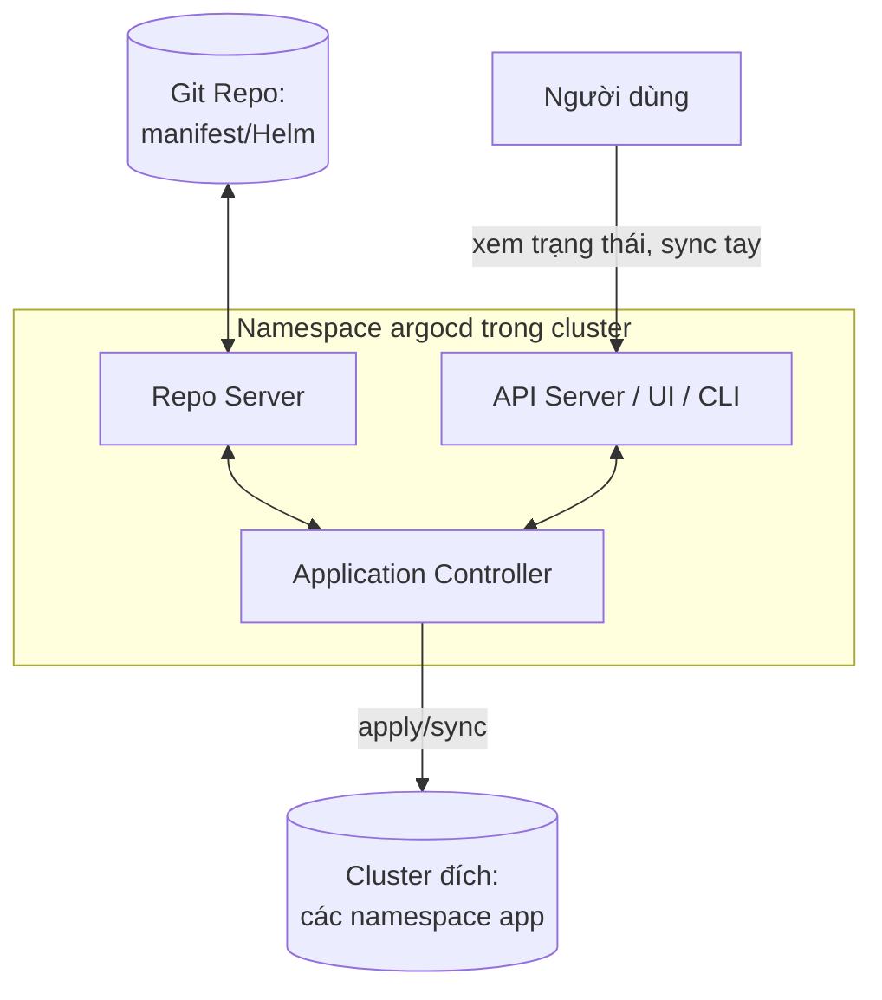
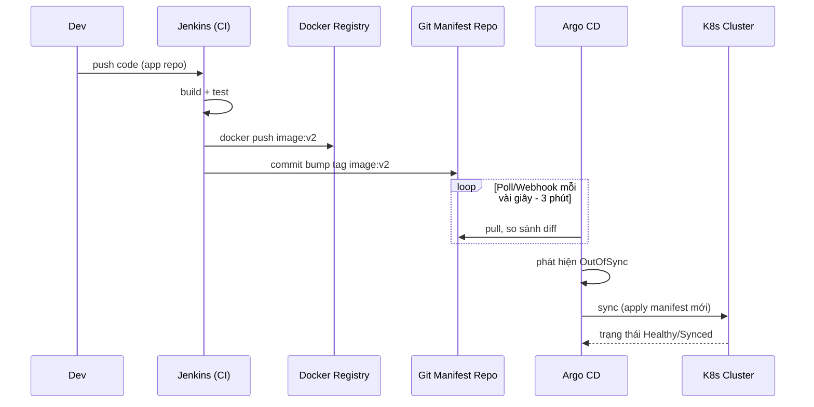
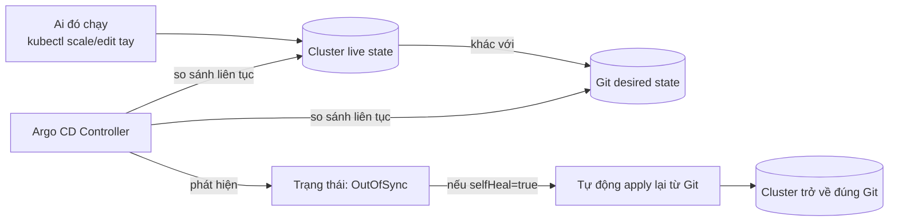

# Ngày 4: GitOps và Argo CD

## Bản đồ kiến thức ngày 4



## So sánh: CI push truyền thống vs GitOps pull

**Mô hình truyền thống (CI push)**



**Mô hình GitOps (pull)**



Điểm khác biệt cốt lõi: ở mô hình truyền thống, **Jenkins là người khởi xướng deploy** và cần credentials để ghi vào cluster (rủi ro bảo mật vì credentials nằm ngoài cluster). Ở GitOps, **Argo CD nằm trong cluster tự pull** từ Git, Jenkins không bao giờ chạm vào cluster — nó chỉ commit vào Git.

| Khía cạnh | CI push truyền thống | GitOps pull (Argo CD) |
|---|---|---|
| Nguồn sự thật | Pipeline script + trạng thái tạm trong CI | Git repo (manifest/Helm chart) |
| Chiều thao tác | Đẩy (push) từ ngoài vào cluster | Kéo (pull) từ trong cluster ra Git |
| Ai khởi xướng deploy | CI job (Jenkins) | Controller trong cluster (Argo CD) |
| Credentials cluster | Phải cấp cho CI (rủi ro rò rỉ) | Chỉ Argo CD trong cluster giữ, CI không cần |
| Xử lý drift (sửa tay) | Không phát hiện, không tự sửa | Phát hiện OutOfSync, tự self-heal về Git |
| Rollback | Chạy lại pipeline cũ hoặc apply tay | `git revert` rồi Argo CD tự sync |
| Audit | Rải rác trong log CI | Toàn bộ lịch sử nằm trong Git log |

## Kiến trúc Argo CD



- **API Server / UI**: giao diện web, CLI, RBAC, nơi user xem trạng thái và trigger sync thủ công.
- **Repo Server**: clone Git repo, render manifest (plain YAML, Helm, Kustomize) thành YAML thuần.
- **Application Controller**: vòng lặp liên tục so sánh trạng thái Git (desired) với trạng thái cluster (live), tính diff, và apply khi cần.

## Luồng end-to-end



## Reconciliation và drift



Đây chính là **self-heal**: nếu ai đó `kubectl scale deploy --replicas=5` trong khi Git khai báo `replicas: 2`, Argo CD phát hiện drift và tự động apply lại từ Git, đưa cluster về đúng trạng thái khai báo — không cần con người can thiệp.

## Bảng 80/20

| Ưu tiên | Kiến thức | Vì sao | Ứng dụng |
|---|---|---|---|
| 1 | GitOps pull vs CI push | Đây là mindset gốc của toàn ngày học | Thiết kế pipeline không cấp credentials cluster cho CI |
| 2 | Application CRD (source/destination/syncPolicy) | Là đơn vị cấu hình trung tâm của Argo CD | Khai báo app trỏ tới repo + path + cluster đích |
| 3 | Self-heal + drift detection | Lợi ích lớn nhất của GitOps so với CI truyền thống | Ngăn "config drift" do sửa tay, tăng độ tin cậy |
| 4 | Sync auto/manual, prune | Kiểm soát khi nào và cách nào apply thay đổi | Chọn auto cho non-prod, manual cho prod nhạy cảm |
| 5 | Rollback = git revert | Rollback trở nên đơn giản và có audit trail | Không cần script rollback riêng, dùng lại git history |
| 6 | Phân vai CI (Jenkins) vs CD (Argo CD) | Tránh nhầm lẫn trách nhiệm giữa 2 công cụ | Thiết kế Jenkinsfile chỉ build/test/push + bump tag |
| 7 | 1 repo vs 2 repo (app code vs manifest) | Ảnh hưởng cách tổ chức pipeline và quyền truy cập | Chọn mô hình phù hợp quy mô team |
| 8 | Argo CD dùng Helm chart | Kết nối trực tiếp với kiến thức Ngày 3 | Application trỏ tới Helm chart thay vì plain YAML |

## Application CRD — các field chính

```yaml
apiVersion: argoproj.io/v1alpha1
kind: Application
metadata:
  name: demo-app
  namespace: argocd
spec:
  project: default
  source:
    repoURL: https://github.com/<user>/<manifest-repo>.git
    targetRevision: main        # branch, tag, hoặc commit SHA
    path: apps/demo             # đường dẫn chứa manifest/Helm chart trong repo
    # Nếu dùng Helm chart:
    # helm:
    #   valueFiles:
    #     - values.yaml
  destination:
    server: https://kubernetes.default.svc   # cluster đích (in-cluster)
    namespace: demo
  syncPolicy:
    automated:
      prune: true       # xóa resource không còn khai báo trong Git
      selfHeal: true     # tự sửa khi cluster bị sửa tay (drift)
    syncOptions:
      - CreateNamespace=true
```

- `source.repoURL/path/targetRevision`: Argo CD lấy manifest ở đâu, nhánh/tag nào.
- `destination.server/namespace`: cluster và namespace áp dụng.
- `syncPolicy.automated`: nếu bỏ trống, phải sync tay qua UI/CLI; nếu khai báo, Argo CD tự động sync khi phát hiện thay đổi trong Git.
- `prune`: xóa resource đã bị gỡ khỏi Git (tránh rác tồn đọng).
- `selfHeal`: tự sửa drift khi cluster bị chỉnh tay khác với Git.

## Điều tạo nên khác biệt của GitOps

- **Self-heal**: tự động đưa cluster về đúng trạng thái Git khi có drift, không cần cron job hay con người canh chừng.
- **Prune**: tự xóa resource không còn được khai báo, tránh rò rỉ tài nguyên "orphan".
- **App-of-apps**: một Application "cha" quản lý nhiều Application "con", giúp quản lý nhiều microservice/nhiều môi trường bằng một cấu trúc phân cấp trong Git.
- **Sync waves**: gắn annotation để kiểm soát thứ tự apply resource (ví dụ deploy Namespace/Secret trước, Deployment sau) khi có phụ thuộc thứ tự.
- **Vì sao mạnh về audit/rollback/security**: mọi thay đổi đều là một commit Git có tác giả, thời gian, message — audit trail có sẵn miễn phí; rollback chỉ là revert commit; và vì CI không cần credentials cluster, bề mặt tấn công (attack surface) giảm đáng kể.

## Best practices

| Nên làm | Vì sao | Sai lầm thường gặp |
|---|---|---|
| Để Argo CD giữ credentials cluster, không cấp cho CI | Giảm bề mặt tấn công, CI compromise không đồng nghĩa cluster compromise | Nhúng kubeconfig hoặc service account token vào Jenkins để chạy `kubectl apply` |
| Mọi thay đổi đi qua Git, không sửa tay cluster | Giữ Git là nguồn sự thật duy nhất, tránh drift âm thầm | Chạy `kubectl edit`/`kubectl scale` trực tiếp lên production |
| Dùng tag image cụ thể (SHA hoặc semver) | Đảm bảo Argo CD phát hiện được thay đổi và deploy đúng bản | Dùng tag `latest`, Argo CD không biết image đã đổi |
| Tách repo config khỏi repo app code (khi team lớn) | Phân quyền rõ, CI chỉ cần quyền viết vào manifest repo | Trộn lẫn code và manifest khiến khó kiểm soát quyền |
| Bật `selfHeal` cho môi trường quan trọng | Tự động sửa drift, giảm rủi ro "config rot" | Chỉ sync tay, quên sync khi có thay đổi khẩn cấp |
| Review kỹ trước khi bật `automated` cho production | Tránh deploy tự động ngoài ý muốn khi commit sai | Bật auto-sync mà không có pipeline kiểm tra/test trước |

## Trade-offs

- **GitOps pull vs CI push**: pull an toàn hơn (không cấp quyền cluster cho CI) nhưng có độ trễ (polling interval, mặc định ~3 phút, hoặc cần webhook để nhanh hơn); push nhanh gần như tức thì nhưng rủi ro bảo mật cao hơn.
- **1 repo vs 2 repo**: 1 repo đơn giản, phù hợp team nhỏ/dự án nhỏ; 2 repo (app code + manifest) tách biệt vòng đời CI/CD, phân quyền rõ ràng hơn nhưng thêm phức tạp vận hành (đồng bộ giữa 2 repo).
- **Argo CD vs Flux**: cả hai đều là GitOps controller theo mô hình pull. Argo CD có UI trực quan, Application CRD tường minh, phổ biến trong doanh nghiệp; Flux thiên về CLI/GitOps toolkit, tích hợp sâu với Kustomize, thường nhẹ hơn khi chạy nhiều cluster. Lựa chọn phụ thuộc vào việc team cần UI trực quan (Argo CD) hay cấu trúc toolkit linh hoạt hơn (Flux).

## Vai trò Jenkins (CI)

Jenkins đảm nhiệm phần **CI**, không đụng vào cluster:

1. **Build**: compile code, build Docker image.
2. **Test**: chạy unit test/integration test.
3. **Push image**: đẩy image lên registry với tag cụ thể (ví dụ commit SHA).
4. **Update manifest**: commit thay đổi tag image vào manifest repo (repo mà Argo CD theo dõi).

Jenkins dùng **Jenkinsfile** (pipeline as code) để khai báo các stage này. Ngày 4 không đi sâu cài đặt Jenkins — trọng tâm là hiểu Jenkins dừng lại ở bước "commit vào Git", còn việc deploy thực tế là việc của Argo CD.

---

➡️ [thuc-hanh.md](./thuc-hanh.md)
