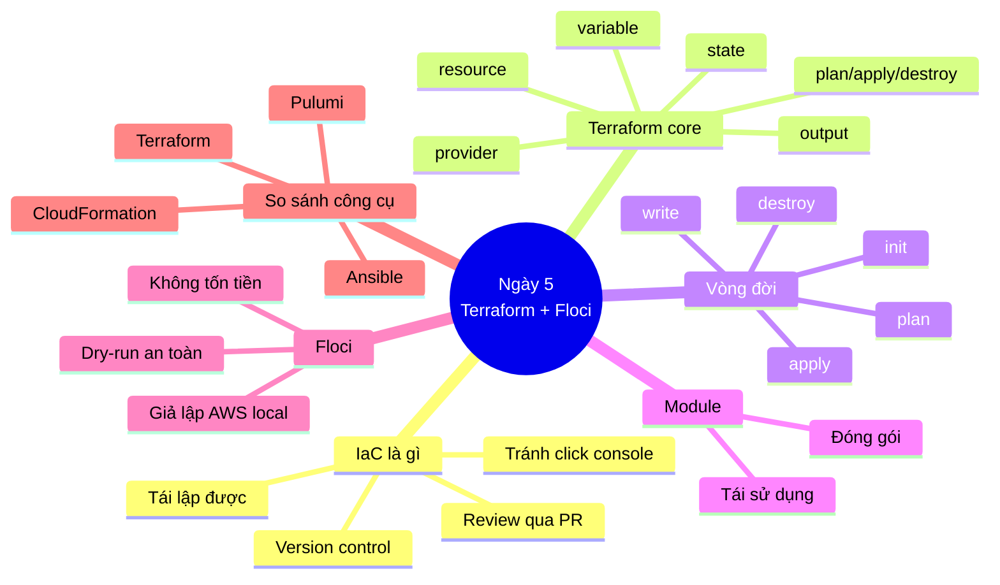
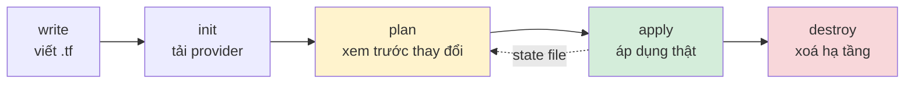
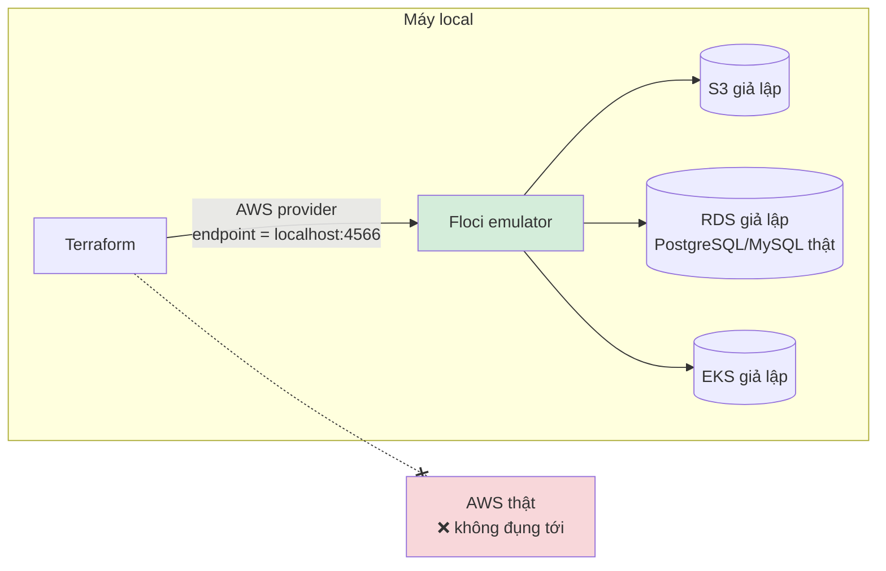

# Ngày 5: Terraform và Floci — Infrastructure as Code

## Bản đồ kiến thức ngày 5



## Vì sao cần IaC (Infrastructure as Code)?

Trước IaC, hạ tầng được tạo bằng cách click chuột trên AWS Console. Cách này có vấn đề:

- Không tái lập được (không ai biết chính xác đã click gì).
- Không version control, không review được thay đổi.
- Không biết ai đã sửa gì, khi nào.

IaC giải quyết bằng cách mô tả hạ tầng dưới dạng code, giống hệt tư duy Kubernetes manifest: bạn khai báo **desired state** (trạng thái mong muốn), công cụ tự lo phần còn lại. Terraform dùng ngôn ngữ khai báo (declarative) — bạn nói "tôi muốn có 1 S3 bucket tên X", không cần viết các bước "tạo request API nào, theo thứ tự gì".

## Vòng đời Terraform



- **write**: viết file `.tf` bằng HCL (HashiCorp Configuration Language).
- **init**: `terraform init` tải provider (vd AWS provider) và module cần dùng, khởi tạo thư mục `.terraform/`.
- **plan**: `terraform plan` so sánh desired state (code) với state hiện tại, in ra bản diff — **không** thay đổi gì thật.
- **apply**: `terraform apply` thực thi bản diff đó, gọi API thật (hoặc API giả lập của Floci) để tạo/sửa/xoá resource.
- **destroy**: `terraform destroy` xoá toàn bộ resource đang được Terraform quản lý.

State file được cập nhật sau mỗi `apply`/`destroy`, và được dùng lại ở lần `plan` kế tiếp — đó là lý do có mũi tên chấm chấm quay lại.

## State: trái tim (và cũng là gót chân) của Terraform

Terraform không tự "hỏi" cloud provider "hạ tầng hiện tại của tôi trông như thế nào". Nó dựa vào **state file** (`terraform.tfstate`) — một file JSON ghi lại resource nào đang được quản lý và cấu hình cuối cùng của chúng.

Terraform luôn so sánh 3 thứ:

```
┌─────────────────┐      ┌──────────────────┐      ┌─────────────────┐
│  Desired state   │      │   State file      │      │   Real state      │
│  (file .tf, HCL) │ <──> │ (terraform.tfstate)│ <──> │  (cloud thật)     │
└─────────────────┘      └──────────────────┘      └─────────────────┘
        ▲                                                    ▲
        └──────────────── terraform plan so sánh ────────────┘
```

- **Desired state**: những gì bạn viết trong file `.tf` — ý định của bạn.
- **State file**: bản ghi Terraform tự lưu, coi là "sự thật" về những gì nó đã tạo.
- **Real state**: hạ tầng thực tế đang chạy trên cloud (hoặc trên Floci).

`terraform plan` so sánh desired state với state file để tính ra diff cần áp dụng. Nếu ai đó sửa tay resource trên console (real state thay đổi mà state file không biết), Terraform sẽ phát hiện **drift** — sự lệch giữa state file và thực tế — ở lần `plan` tiếp theo.

Đây chính là tư duy **reconciliation loop** giống Kubernetes: K8s controller liên tục so sánh spec (desired) với status (actual) và điều chỉnh. Terraform làm y hệt, chỉ khác là nó chạy theo lệnh (on-demand) thay vì liên tục (continuous). Vì vậy state file quan trọng đến mức: mất state file, mất luôn "bộ nhớ" của Terraform về hạ tầng đã tạo — dù hạ tầng vẫn còn đó, Terraform coi như chưa từng biết nó.

## Floci: giả lập AWS để thực hành an toàn



Floci (floci.io) là bộ giả lập cloud chạy local, drop-in replacement cho LocalStack:

- Chạy trên port **4566**, khởi động ~24ms, không cần AWS credentials thật.
- Giả lập ~68 dịch vụ AWS (S3, SQS, Lambda, DynamoDB, RDS, EKS...), dùng engine thật bên dưới (Docker container thật cho Lambda, PostgreSQL/MySQL thật cho RDS).
- Cài: `curl -fsSL https://floci.io/install.sh | sh` rồi `floci start && eval $(floci env)`. `floci env` export biến môi trường để AWS CLI/Terraform tự trỏ về endpoint local.
- MIT license.

Lợi ích khi học/thực hành: `terraform apply` thoải mái mà không tốn tiền, không cần tài khoản AWS, và **không có rủi ro đụng vào production** — rất phù hợp để tập vòng đời init/plan/apply/destroy trước khi làm việc với hạ tầng thật.

## Bảng 80/20 kiến thức ngày 5

| Ưu tiên | Kiến thức | Vì sao | Ứng dụng |
|---|---|---|---|
| Cao | Vòng đời init → plan → apply → destroy | Là quy trình dùng hàng ngày | Mọi thay đổi hạ tầng đều đi qua 4 bước này |
| Cao | State file là gì, vì sao quan trọng | Mất state = mất "trí nhớ" của Terraform | Tránh sửa tay resource, tránh mất file state |
| Cao | `terraform plan` là công cụ review | Xem trước hậu quả trước khi apply | Bắt lỗi/tránh xoá nhầm resource trước khi quá muộn |
| Trung bình | provider/resource/variable/output | Cấu trúc cơ bản của mọi file .tf | Viết được file HCL đọc hiểu được |
| Trung bình | Floci để dry-run local | Học/test không tốn tiền, không rủi ro | Thực hành thoải mái, CI/CD ephemeral |
| Thấp (biết là được) | Module, workspace, remote state | Cần khi làm nhóm/dự án lớn | Tái sử dụng code, tránh xung đột state |

## Các khối cơ bản trong HCL

### Provider

Khai báo "nói chuyện với ai" (AWS, Azure, GCP...).

```txt
provider "aws" {
  region = "us-east-1"
}
```

### Resource

Khai báo một thành phần hạ tầng cụ thể muốn tạo.

```txt
resource "aws_s3_bucket" "demo" {
  bucket = "my-demo-bucket"
}
```

### Variable

Tham số hoá cấu hình, tránh hard-code.

```txt
variable "bucket_name" {
  type    = string
  default = "my-demo-bucket"
}
```

### Output

Xuất giá trị ra sau khi apply (vd endpoint, ARN) để dùng ở nơi khác.

```txt
output "bucket_arn" {
  value = aws_s3_bucket.demo.arn
}
```

### State

Không khai báo trực tiếp trong HCL — Terraform tự sinh và cập nhật file `terraform.tfstate` sau mỗi lần apply. Khi làm nhóm, state nên lưu ở **remote backend** (S3 + DynamoDB lock, Terraform Cloud...) để nhiều người cùng làm việc mà không đè state của nhau — phần này chỉ cần biết khái niệm ở mức nhập môn.

## Điều tạo nên khác biệt (khi làm việc thật)

- **Remote state + locking**: khi làm nhóm, state phải lưu ở nơi chung (vd S3 bucket) kèm cơ chế lock (vd DynamoDB) để 2 người không apply cùng lúc gây hỏng state.
- **Module**: đóng gói một nhóm resource hay dùng lại (vd "VPC chuẩn của công ty") thành module, gọi lại nhiều lần với tham số khác nhau — giống hàm trong lập trình.
- **Workspace**: dùng 1 bộ code Terraform để quản lý nhiều môi trường (dev/staging/prod) mà không phải copy file.
- **Drift**: khi thực tế (real state) lệch khỏi state file (vd ai đó sửa tay trên console), `terraform plan` sẽ phát hiện và đề xuất đưa về đúng desired state.
- **`terraform plan` như review tool**: nên chạy plan và đọc kỹ output trong code review (PR), giống review code — đây là lợi ích lớn nhất của IaC so với click console.

## Best practices

| Nên làm | Vì sao | Sai lầm thường gặp |
|---|---|---|
| Không commit `terraform.tfstate` vào git | State có thể chứa secret (password, key) ở dạng plaintext | Commit tfstate lên repo public, lộ secret |
| Dùng remote state khi làm nhóm | Tránh 2 người ghi đè state của nhau | Mỗi người giữ state local riêng, dễ conflict |
| Luôn `terraform plan` trước khi apply | Phát hiện thay đổi ngoài ý muốn (vd xoá nhầm resource) | Apply thẳng không xem plan, gây outage |
| Không sửa tay resource trên console | Gây drift, Terraform không biết về thay đổi đó | Sửa tay "cho nhanh" rồi quên mất, lần sau apply đè lại |
| Dùng `.gitignore` cho `.terraform/`, `*.tfstate*` | Đây là file sinh ra, không phải source of truth | Commit cả thư mục `.terraform/` nặng và không cần thiết |
| Đặt tên resource/variable rõ nghĩa | Dễ đọc, dễ review | Đặt tên như `resource "aws_s3_bucket" "a"` |

## Trade-offs: Terraform vs Pulumi vs CloudFormation vs Ansible

| Công cụ | Ưu điểm | Nhược điểm | Khi nào dùng |
|---|---|---|---|
| **Terraform** | Đa cloud, HCL dễ đọc, ecosystem provider rất lớn, cộng đồng lớn | Không phải ngôn ngữ lập trình thật (hạn chế logic phức tạp) | Mặc định tốt cho hầu hết bài toán IaC đa cloud |
| **Pulumi** | Dùng ngôn ngữ lập trình thật (TypeScript, Python, Go...), logic linh hoạt | Ecosystem nhỏ hơn Terraform, learning curve nếu chưa quen | Team đã mạnh về 1 ngôn ngữ, cần logic phức tạp trong hạ tầng |
| **CloudFormation** | Native AWS, không cần cài thêm gì, tích hợp sâu dịch vụ AWS mới nhất | Chỉ dùng cho AWS, cú pháp YAML/JSON dài dòng | Tổ chức chỉ dùng AWS, muốn native support |
| **Ansible** | Rất mạnh về cấu hình VM/OS (cài package, config file, restart service) | Không phải công cụ quản lý state hạ tầng cloud tốt như Terraform | Bổ trợ Terraform: dùng Terraform tạo VM, dùng Ansible cấu hình bên trong VM đó — **không thay thế Terraform** |

## Bước tiếp theo

➡️ [thuc-hanh.md](./thuc-hanh.md)
