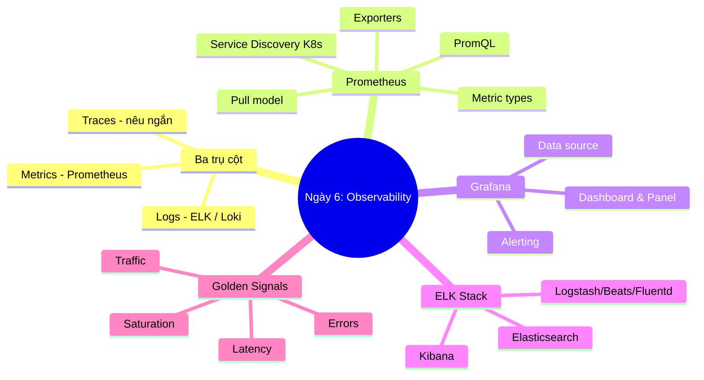
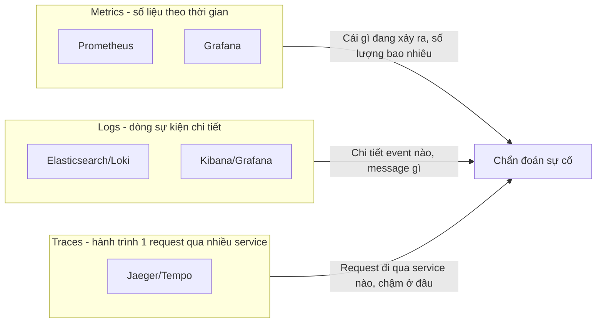
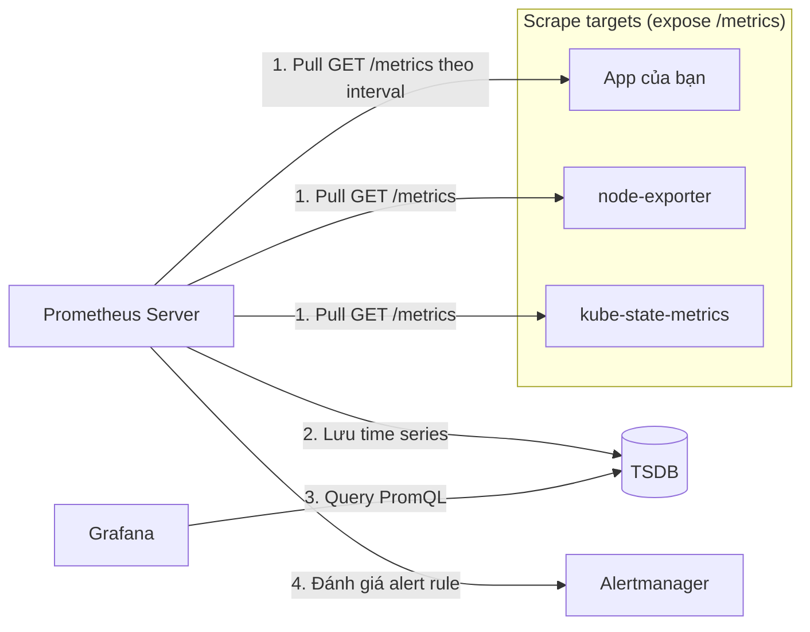
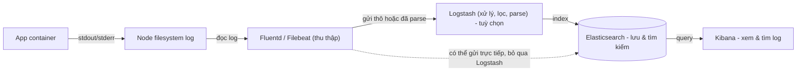
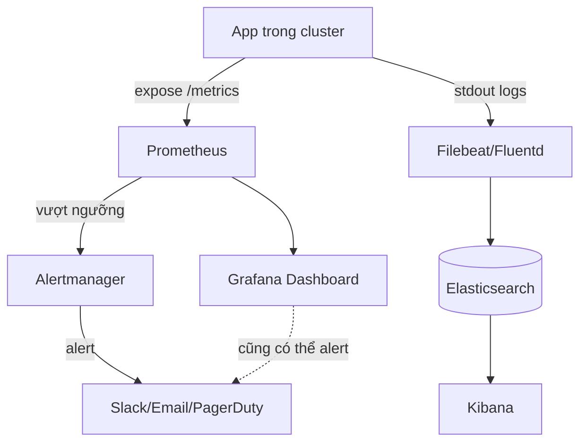

# Ngày 6: Observability với Prometheus, Grafana và ELK

## Bản đồ kiến thức ngày 6



## Monitoring vs Observability

Monitoring là việc theo dõi các chỉ số đã biết trước (dashboard, alert cho các trường hợp bạn đã dự đoán). Observability rộng hơn: khả năng trả lời các câu hỏi bạn *chưa* dự đoán trước về hệ thống, bằng cách khai thác dữ liệu thô (metrics, logs, traces). Nói cách khác, monitoring cho biết "có gì sai không", observability giúp trả lời "tại sao nó sai".

## Sơ đồ 3 trụ cột observability



## Prometheus pull model

Điểm khác biệt quan trọng nhất: Prometheus **chủ động kéo (pull)** dữ liệu từ target, không phải target đẩy (push) dữ liệu vào Prometheus như nhiều hệ thống khác (ví dụ StatsD, CloudWatch push).



**Vì sao pull quan trọng trong K8s:** Prometheus dùng service discovery để tự tìm Pod/Service có annotation phù hợp và tự động scrape, không cần từng app tự cấu hình nơi gửi dữ liệu tới. Điều này đơn giản hoá vận hành khi Pod tạo/xoá liên tục.

## 4 loại metric type

| Loại | Là gì | Ví dụ |
|---|---|---|
| Counter | Giá trị chỉ tăng, reset về 0 khi restart. Dùng với `rate()` để tính tốc độ | `http_requests_total`, `container_cpu_usage_seconds_total` |
| Gauge | Giá trị có thể tăng/giảm, đại diện trạng thái hiện tại | `node_memory_MemAvailable_bytes`, `kube_pod_status_ready` |
| Histogram | Phân bố giá trị vào các bucket, tính được quantile phía server qua `histogram_quantile()` | `http_request_duration_seconds_bucket` |
| Summary | Tương tự histogram nhưng tính quantile phía client, không gộp (aggregate) được giữa nhiều instance | `rpc_duration_seconds` |

## Vì sao K8s cần log tập trung (centralized logging)

Pod trong Kubernetes là **ephemeral**: khi Pod bị xoá, restart, hoặc bị evict, toàn bộ log lưu trên filesystem của container cũng biến mất theo. Nếu không thu thập log ra một nơi lưu trữ độc lập, bạn sẽ mất log ngay khi cần điều tra sự cố nhất (lúc Pod crash).

## Sơ đồ luồng log ELK



Vai trò từng thành phần:
- **Filebeat/Fluentd**: agent chạy trên mỗi Node (thường DaemonSet), đọc log file, gắn thêm metadata (Pod, namespace) rồi gửi đi.
- **Logstash**: xử lý/biến đổi log phức tạp (parse, enrich, filter) trước khi lưu — có thể bỏ qua nếu Beats/Fluentd đã đủ.
- **Elasticsearch**: lưu trữ log dạng document, index để tìm kiếm nhanh.
- **Kibana**: giao diện web để tìm kiếm, lọc, visualize log từ Elasticsearch.

## Sơ đồ end-to-end quan sát hệ thống



## Bảng 80/20

| Ưu tiên | Kiến thức | Vì sao | Ứng dụng |
|---|---|---|---|
| 1 | Pull model + `/metrics` endpoint | Là cách Prometheus vận hành, hiểu sai sẽ hiểu sai toàn bộ hệ thống | Biết vì sao cần ServiceMonitor, vì sao app phải tự expose metrics |
| 2 | PromQL cơ bản (`rate`, `sum by`, `histogram_quantile`) | 80% việc điều tra sự cố dùng vài hàm này | Viết query cho dashboard và alert |
| 3 | 4 loại metric type | Chọn sai loại metric dẫn tới query sai hoặc vô nghĩa | Đọc/viết instrumentation code đúng |
| 4 | Log tập trung + Pod ephemeral | Lý do tồn tại của ELK/Loki trong K8s | Không mất log khi Pod chết, điều tra lỗi sau sự cố |
| 5 | Golden signals (latency, traffic, errors, saturation) | Khung chuẩn để biết nên đo gì, alert gì | Thiết kế dashboard/alert có ý nghĩa, tránh đo lung tung |
| 6 | Cardinality explosion | Sai lầm phổ biến nhất khiến Prometheus sập hoặc chậm | Tránh gắn label có giá trị không giới hạn (user_id, request_id) |

## PromQL cơ bản

```txt
# rate: tốc độ tăng của counter trong 5 phút gần nhất (đơn vị: mỗi giây)
rate(http_requests_total[5m])

# sum by: tổng tốc độ request, nhóm theo mã status code
sum by (status_code) (rate(http_requests_total[5m]))

# histogram_quantile: tính p95 latency từ histogram bucket
histogram_quantile(0.95, sum by (le) (rate(http_request_duration_seconds_bucket[5m])))

# up: kiểm tra target có đang được scrape thành công không (1 = up, 0 = down)
up
```

## Golden Signals và RED/USE

| Tín hiệu | Ý nghĩa | Ví dụ metric |
|---|---|---|
| Latency | Thời gian xử lý 1 request | `histogram_quantile(0.95, http_request_duration_seconds_bucket)` |
| Traffic | Số lượng request/giây hệ thống đang nhận | `rate(http_requests_total[5m])` |
| Errors | Tỉ lệ request lỗi | `rate(http_requests_total{status_code=~"5.."}[5m])` |
| Saturation | Mức độ "đầy" của tài nguyên (CPU, memory, queue) | `container_cpu_usage_seconds_total`, `node_memory_MemAvailable_bytes` |

- **RED** (Rate, Errors, Duration): dùng cho service hướng request (API, web service) — tương ứng Traffic, Errors, Latency ở trên.
- **USE** (Utilization, Saturation, Errors): dùng cho tài nguyên (CPU, disk, network) — phù hợp giám sát Node/hạ tầng.

## Tạo khác biệt

- **Đặt alert đúng, tránh alert fatigue**: chỉ alert vào symptom ảnh hưởng người dùng (ví dụ error rate cao, latency cao), không alert vào mọi cause có thể (CPU cao chưa chắc gây vấn đề thật). Alert quá nhiều khiến team bỏ qua alert thật.
- **Chọn metric quan trọng**: ưu tiên golden signals trước, không cố đo mọi thứ có thể đo.
- **Cardinality explosion**: mỗi combination label tạo ra 1 time series riêng. Gắn label như `user_id`, `request_id`, `email` vào metric có thể tạo ra hàng triệu time series, làm Prometheus hết RAM hoặc chậm nghiêm trọng. Chỉ dùng label có số giá trị hữu hạn và nhỏ (status_code, method, namespace).
- **Loki vs ELK trade-off**: Loki index metadata (label) thay vì full-text nội dung log, nên nhẹ hơn, rẻ hơn, tích hợp sẵn với Grafana; nhưng tìm kiếm full-text phức tạp kém linh hoạt hơn Elasticsearch. ELK mạnh về tìm kiếm/phân tích log phức tạp nhưng tốn tài nguyên vận hành hơn nhiều.
- **Đọc dashboard để chẩn đoán sự cố**: quy trình thường gặp — nhìn error rate tăng (Grafana) → xem latency có tăng theo không → xuống log (Kibana) lọc theo khoảng thời gian đó và tìm request lỗi cụ thể.

## Best practices

| Nên làm | Vì sao | Sai lầm thường gặp |
|---|---|---|
| Log dạng structured (JSON) | Dễ parse, dễ query trong Kibana/Loki | Log dạng text tự do, không thể filter theo field |
| Giới hạn số label và giá trị của mỗi label | Tránh cardinality explosion làm sập Prometheus | Gắn `user_id`/`request_id` làm label metric |
| Alert theo golden signals, có ngưỡng rõ ràng | Alert có ý nghĩa hành động được | Alert vào mọi metric, gây alert fatigue |
| Đặt retention/TSDB size phù hợp tài nguyên | Prometheus lưu local, dễ hết disk nếu không giới hạn | Không giới hạn retention, disk đầy làm Prometheus down |
| Dùng label chuẩn K8s (namespace, pod, container) | Nhất quán, dễ query chung giữa metrics và logs | Mỗi app tự đặt tên label khác nhau |

## Trade-offs

- **Prometheus tự vận hành vs SaaS (Datadog, New Relic)**: Prometheus miễn phí, mã nguồn mở, kiểm soát toàn bộ dữ liệu, nhưng bạn phải tự vận hành (scale, backup, retention, HA). SaaS tốn phí theo host/metric nhưng giảm gánh nặng vận hành và có nhiều tính năng tích hợp sẵn.
- **ELK vs Loki**: ELK linh hoạt, mạnh về full-text search và phân tích log phức tạp, nhưng nặng tài nguyên (Elasticsearch cần nhiều RAM/CPU). Loki nhẹ hơn, tích hợp tốt với Prometheus/Grafana, chi phí thấp hơn, nhưng khả năng tìm kiếm log kém linh hoạt hơn.
- **Pull vs push metrics**: Pull (Prometheus) đơn giản hoá việc quản lý phía client (app chỉ cần expose endpoint, không cần biết địa chỉ server giám sát), phù hợp môi trường động như K8s. Push (StatsH, CloudWatch) phù hợp hơn cho job ngắn hạn (batch job, cron) không tồn tại đủ lâu để bị scrape.

---

➡️ [thuc-hanh.md](./thuc-hanh.md)
