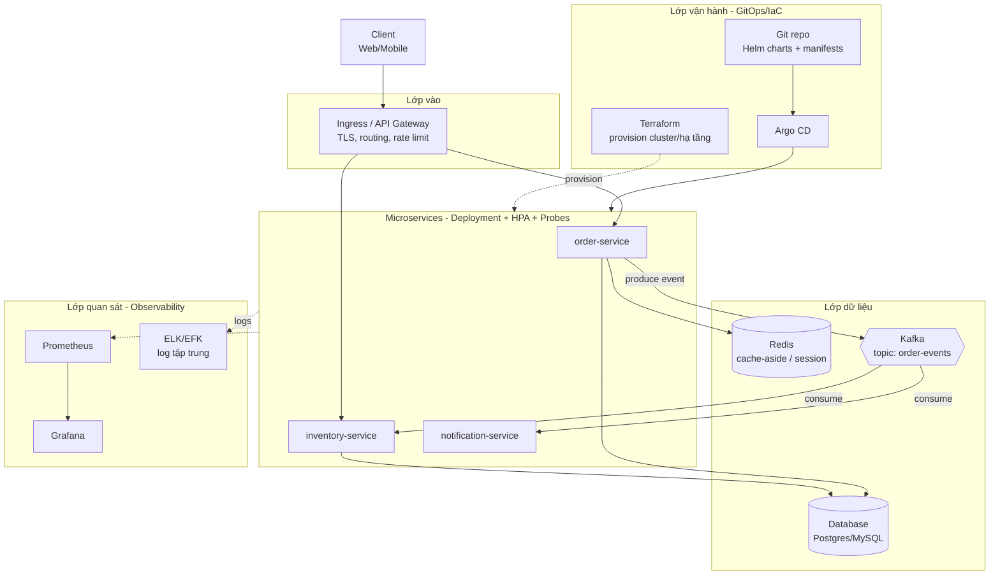
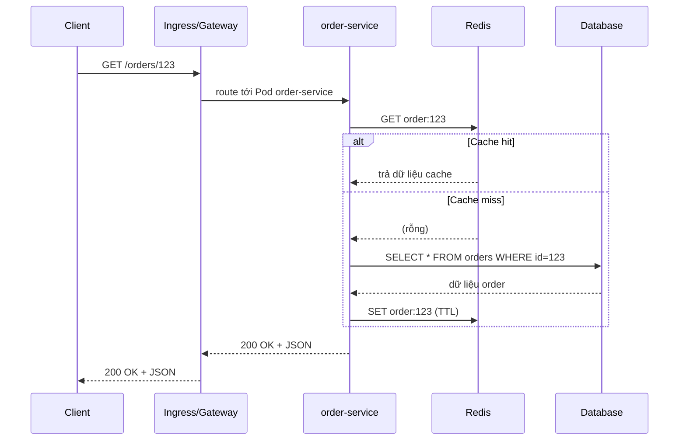
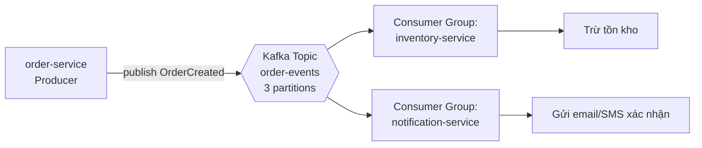
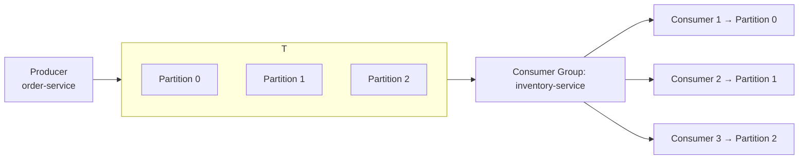
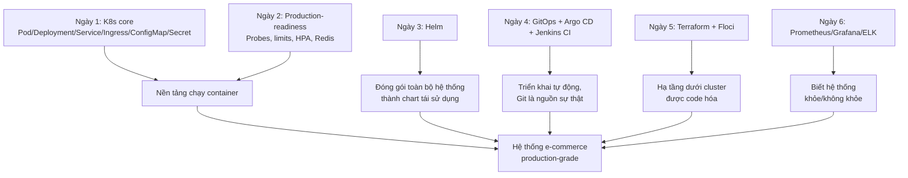

# Ngày 7 (Capstone) — Thiết kế hệ thống production trên Kubernetes

> File này ưu tiên **hình ảnh trước, chữ sau**. Đây là ngày ghép toàn bộ 6 ngày trước thành một thiết kế hệ thống hoàn chỉnh. Ví dụ xuyên suốt: nền tảng **e-commerce** với `order-service`, `inventory-service`, `notification-service`.

---

## 1. Sơ đồ kiến trúc tổng thể

**Đọc sơ đồ:** Client chỉ biết một điểm vào duy nhất (Gateway). Các service giao tiếp đồng bộ qua REST (khi cần trả lời ngay) và bất đồng bộ qua Kafka (khi không cần chờ). Redis giảm tải DB. Toàn bộ được quan sát bởi Prometheus/Grafana (metrics) và ELK (log), và được triển khai/quản lý hạ tầng bằng GitOps + IaC — không ai `kubectl apply` tay vào production.

---

## 2. Luồng request đồng bộ (REST + cache-aside)

Đây chính là pattern **cache-aside** đã học ở Ngày 2, giờ đặt vào đúng vị trí trong luồng request thật.

---

## 3. Luồng event bất đồng bộ qua Kafka

### Khi nào dùng đồng bộ (REST) vs bất đồng bộ (Kafka)

| Tiêu chí | Đồng bộ (REST) | Bất đồng bộ (Kafka) |
| --- | --- | --- |
| Cần kết quả ngay để trả cho client | ✅ Có | ❌ Không |
| Service gọi và service nhận cần tách rời (decoupling) | ❌ Không, gọi trực tiếp | ✅ Có, qua topic |
| 1 event cần nhiều service xử lý độc lập | ❌ Phải gọi từng service | ✅ Nhiều consumer group cùng đọc 1 topic |
| Cần buffer khi consumer chậm/down tạm thời | ❌ Request thất bại ngay | ✅ Message ở lại topic, xử lý khi consumer sống lại |
| Độ trễ yêu cầu rất thấp, tương tác 2 chiều ngay | ✅ Phù hợp | ❌ Không phù hợp |
| Ví dụ | Client tra cứu đơn hàng, thanh toán ngay | Sau khi tạo đơn: trừ kho, gửi thông báo, ghi log phân tích |

---

## 4. Kafka ở mức kiến trúc

| Khái niệm | Giải thích ngắn |
| --- | --- |
| **Topic** | "Kênh" đặt tên để phân loại message, ví dụ `order-events` |
| **Partition** | Topic chia nhỏ thành nhiều partition để xử lý song song, đảm bảo thứ tự trong từng partition |
| **Offset** | Vị trí đọc của consumer trong 1 partition, dùng để biết đã đọc tới đâu |
| **Consumer group** | Nhóm consumer cùng chia nhau đọc các partition của 1 topic; mỗi message trong group chỉ được 1 consumer xử lý |
| **Replication** | Mỗi partition được sao lưu trên nhiều broker để chịu lỗi khi 1 broker chết |

**Vì sao dùng Kafka:** decoupling (order-service không cần biết inventory-service hay notification-service là ai), buffering (nếu consumer chết tạm thời, message vẫn nằm trong topic chờ), event streaming (nhiều consumer khác nhau có thể cùng đọc 1 event để làm việc khác nhau, không cần producer biết trước).

> ⚠️ Phần **tuning sâu** — chọn partition strategy, rebalancing, delivery semantics (at-least-once/exactly-once) — **không thuộc phạm vi bài này**. Đây là chủ đề học sau khi đã vận hành Kafka thật trong production.

---

## 5. Ghép 6 ngày lại thành 1 hệ thống

| Thành phần | Công nghệ | K8s resource dùng | Vì sao chọn | Ngày đã học |
| --- | --- | --- | --- | --- |
| Điểm vào | Ingress | `Ingress` + `IngressClass` | Đủ cho routing HTTP/HTTPS, sẵn có trong K8s | Ngày 1, 2 |
| Microservice | order/inventory/notification-service | `Deployment`, `Service`, `HPA` | Stateless, cần scale ngang theo tải | Ngày 1, 2 |
| Cấu hình | env riêng theo service | `ConfigMap`, `Secret` | Tách config/bí mật khỏi image | Ngày 1 |
| Cache | Redis | `Deployment`/`StatefulSet` + `Service` | Giảm tải DB, tăng tốc đọc | Ngày 2 |
| Message broker | Kafka | `StatefulSet` (qua Helm/Strimzi) | Decoupling, buffering giữa service | Ngày 7 (mới) |
| Đóng gói | Helm chart | `Chart.yaml`, `values.yaml` | Tái sử dụng, quản nhiều env (dev/staging/prod) | Ngày 3 |
| Triển khai | Argo CD | `Application` CRD | GitOps: Git là nguồn sự thật, tự đồng bộ | Ngày 4 |
| CI | Jenkins | (ngoài cluster hoặc `Deployment`) | Build/test/push image trước khi Argo CD deploy | Ngày 4 |
| Hạ tầng | Terraform | (ngoài K8s, provision cluster/network) | IaC, tái lập hạ tầng, review qua PR | Ngày 5 |
| Metrics | Prometheus + Grafana | `ServiceMonitor`/scrape config | Biết CPU/RAM/latency/error rate theo thời gian thực | Ngày 6 |
| Log | ELK/EFK | `DaemonSet` (Filebeat/Fluentd) | Tìm log tập trung khi debug sự cố nhiều Pod | Ngày 6 |

---

## 6. Checklist "production-grade"

| Hạng mục | Đạt chưa? |
| --- | --- |
| Mỗi service có readiness + liveness probe | ☐ |
| Mỗi service có resource requests/limits | ☐ |
| Mỗi service có HPA (scale theo CPU/traffic) | ☐ |
| Gateway/Ingress có TLS | ☐ |
| Có metrics (Prometheus scrape được) | ☐ |
| Có dashboard cảnh báo cơ bản (Grafana) | ☐ |
| Có log tập trung (không phải `kubectl logs` tay từng Pod) | ☐ |
| Deploy qua GitOps (Argo CD), không `kubectl apply` tay vào prod | ☐ |
| Hạ tầng được code hóa (Terraform), có review qua PR | ☐ |
| Secret không nằm trần trong Git (dùng Sealed Secrets/External Secrets — biết là cần, chưa bắt buộc làm ở bài này) | ☐ |

---

## 7. Trade-off hệ thống

| Lựa chọn | Ưu điểm | Nhược điểm | Khi nào chọn |
| --- | --- | --- | --- |
| **Ingress** vs **API Gateway chuyên dụng** (Kong/APISIX) | Ingress: đơn giản, sẵn trong K8s, đủ cho routing cơ bản | Ingress: thiếu rate limiting/auth/plugin nâng cao mà Gateway chuyên dụng có sẵn | Ít service, ít yêu cầu chính sách phức tạp → Ingress. Cần rate limit/API key/plugin phong phú → Gateway chuyên dụng |
| **Redis tự host (Deployment)** vs **managed** (ElastiCache/Cloud Memorystore) | Tự host: kiểm soát toàn quyền, không phụ thuộc vendor | Tự host: tự lo backup, failover, patch bảo mật | Team nhỏ, ưu tiên vận hành đơn giản → managed. Cần kiểm soát tuyệt đối/tránh chi phí managed → tự host |
| **Kafka tự host** vs **managed** (MSK/Confluent Cloud) | Tự host: không phí license/managed, tùy biến sâu | Tự host: vận hành Kafka rất phức tạp (ZooKeeper/KRaft, rebalancing, storage) | Team chưa có kinh nghiệm vận hành Kafka → managed gần như luôn đáng tiền hơn |
| **Đồng bộ (REST)** vs **Bất đồng bộ (Kafka)** | Đồng bộ: đơn giản, dễ debug, phản hồi ngay | Đồng bộ: service phụ thuộc chặt (nếu B chết, A cũng lỗi theo) | Cần phản hồi ngay → đồng bộ. Có thể xử lý sau, cần tách rời → bất đồng bộ |
| **Microservices** vs **Monolith** | Microservices: scale độc lập từng phần, team độc lập | Microservices: độ phức tạp vận hành tăng vượt trội (network, observability, debug distributed) | **Đừng tách microservices khi:** team nhỏ (<5-6 người), domain chưa rõ ranh giới, chưa có nhu cầu scale khác nhau giữa các phần — monolith module hóa tốt vẫn thắng ở giai đoạn này |

---

## 8. Phần tạo khác biệt cấp senior

**Resilience:**
- **Retry:** service gọi REST tới service khác nên có retry có giới hạn (kèm backoff), tránh retry vô hạn gây bão request.
- **Circuit breaker:** khi 1 service downstream lỗi liên tục, ngắt tạm thời để không làm nghẽn cả hệ thống, thử lại sau.
- **Graceful degradation:** nếu Redis chết, order-service vẫn phải chạy được (chậm hơn, đọc thẳng DB) thay vì crash toàn bộ.

**Capacity planning:** ước lượng traffic đỉnh (ví dụ số order/giây giờ sale), từ đó tính số replica tối thiểu, ngưỡng HPA, số partition Kafka đủ để không nghẽn.

**Failure mode — điều gì xảy ra khi:**

| Thành phần chết | Ảnh hưởng | Cách giảm thiểu |
| --- | --- | --- |
| **Redis chết** | Mọi request đọc thẳng DB → chậm, DB có thể quá tải | Có timeout ngắn khi gọi Redis, fallback đọc DB, không để Redis là single point of failure bắt buộc |
| **Kafka chết** | order-service không publish được event → inventory/notification không nhận việc mới | Producer nên buffer tạm hoặc báo lỗi rõ ràng (không nên chặn luôn việc tạo order nếu event là "best effort"); Kafka nên chạy multi-broker có replication |
| **1 service (Pod) chết** | Nếu chỉ 1 Pod trong nhiều replica: Service tự route sang Pod khác, gần như không ảnh hưởng | Đây là lý do luôn chạy ≥2 replica cho service quan trọng, không chạy 1 Pod duy nhất |

**Security:** Secret quản qua K8s `Secret` (tối thiểu) hoặc External Secrets/Sealed Secrets (tốt hơn, không nằm trần trong Git); NetworkPolicy hạn chế service nào được gọi service nào; RBAC hạn chế ai/CI nào được apply gì vào namespace nào.

**Cost:** mỗi Deployment thêm là thêm resource requests cố định dù ít traffic; managed Redis/Kafka có phí theo giờ; cần cân bằng giữa "tách nhỏ để scale độc lập" và "chi phí vận hành/tài nguyên tăng theo số service".

---

➡️ Tiếp theo: [thuc-hanh.md](./thuc-hanh.md)
➡️ Tổng hợp toàn khóa: [../99-tong-hop.md](../99-tong-hop.md)
