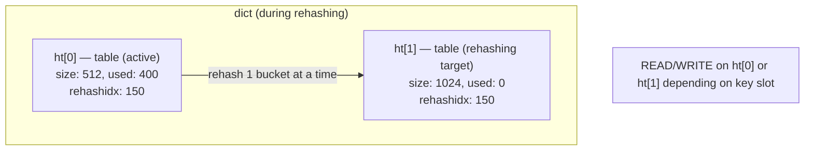

# Day 5: Encoding Internals & Memory Footprint

## 1. Mục tiêu bài học

Sau bài học, bạn sẽ:

- Phân biệt được 6 encoding nội bộ của Redis: raw string, SDS, listpack, skiplist, intset, hashtable — biết khi nào Redis chọn cái nào và tại sao
- Đo lường được memory overhead thực tế của key/value bằng `MEMORY USAGE` và `DEBUG OBJECT`, benchmark thấy savings 30–50% khi dùng listpack vs hashtable
- Dự đoán được encoding flip threshold cho Hash, Set, Sorted Set trong Redis 7.x; giải thích được vì sao thêm 1 field thứ 129 có thể gây memory spike 3–5x
- Tune `hash-max-listpack-entries`, `zset-max-listpack-entries` phù hợp workload thực tế, cân bằng memory saving vs CPU overhead cho O(N) update
- Tránh được 5 production failure modes phổ biến: encoding flip, big listpack reallocation, hashtable rehashing, jemalloc fragmentation, threshold tuning quá cao gây latency spike

---

## 2. Vì sao cần học chủ đề này

### Incident thực tế: Twitter team

Năm 2013, Twitter team scale-out Redis cache cluster vì không hiểu Hash encoding. Họ lưu user feature flags bằng Hash với 50 fields/user. Mỗi Hash ban đầu dùng listpack (encoding compact), nhưng khi user profile thêm nhiều dynamic fields, một số Hash vượt `hash-max-listpack-entries` (default 512 lúc đó). Khi encoding chuyển sang hashtable, memory tăng **5x** cho cùng dataset. Cluster cần thêm 5x nodes. Chi phí cloud tăng $200K/tháng. Root cause: **không ai trong team hiểu encoding transition rule**.

Sau đó, Twitter viết blog "Redis Memory Optimization at Twitter" — đây là case study kinh điển trong Redis community.

### Incident thực tế: Pinterest

Pinterest cache team phát hiện Redis memory sử dụng cao hơn 40% so với estimate. Benchmark phát hiện hàng triệu Hash objects có đúng 128–512 fields — nằm trong vùng encoding flip. Họ tune `hash-max-listpack-entries` từ 512 xuống 128 và dùng `hash-max-listpack-value` 64 bytes, giảm memory 40% ngay lập tức mà không thay đổi data model. Chi phí infrastructure giảm 6-figure USD/year.

### Bài học cho senior developer

**Sai lầm phổ biến nhất**: senior developer thiết kế key/value model dựa trên command syntax (HSET, HGET) mà không hỏi "encoding nào Redis sẽ dùng ở scale thực tế?" Khi system có 10M keys và memory bùng nổ, người ta mới phát hiện Hash đã flip sang hashtable từ field thứ 513.

Sai lầm thứ hai: tăng threshold lên rất cao (VD: `hash-max-listpack-entries 10000`) để "tránh encoding flip" nhưng không benchmark CPU impact — production workload update Hash liên tục, O(N) scan gây latency spike p99 vượt 100ms.

Sai lầm thứ ba: dùng `MEMORY USAGE key` rồi nhân số keys để estimate total memory, không account cho jemalloc size class rounding và fragmentation. Estimate sai dẫn đến capacity planning fail.

---

## 3. Kiến thức nền cần có

Bài này yêu cầu:

- **Day 2**: Big O operation cho String, Hash, Set, List, Sorted Set. Biết cách dùng HSET/HGET, SADD/SISMEMBER, ZADD/ZRANGE.
- **Day 4**: Key naming convention (`namespace:entity:id:field`), TTL strategy, key cardinality, hash tags cho Redis Cluster. Hiểu coarse-grained vs fine-grained key design.

Đặc biệt, bạn cần nhớ: một Hash có thể được lưu bằng 2 cách hoàn toàn khác nhau — listpack (compact) hoặc hashtable (overhead cao nhưng O(1) lookup). Quyết định này hoàn toàn do Redis tự động, nhưng bạn có thể tune threshold.

---

## 4. Lý thuyết chi tiết

### 4.1. Redis Object Model — `robj` struct

Mỗi value trong Redis được wrap trong `robj`:

```c
typedef struct redisObject {
    unsigned type:4;        // 4 bits: STRING=0, LIST=1, SET=2, ZSET=3, HASH=4
    unsigned encoding:4;    // 4 bits: varies by type
    unsigned lru:LRU_BITS; // 24 bits: LRU/LFU clock
    int refcount;           // 32 bits: reference counting
    void *ptr;              // 8 bytes: pointer to actual data
} robj;
```

**Memory overhead per object**: 16 bytes (4+4+24 bits = 4 bytes + 4 bytes refcount + 8 bytes ptr = 16 bytes). Plus key name stored as SDS (3–63 bytes tùy length). **Tổng cộng: 16–80+ bytes per key-value pair** chỉ riêng metadata, chưa kể data payload.

`refcount` dùng cho object sharing (VD: interned strings, Lua script return values). Khi refcount = 0, object được freed. `lru` 24 bits lưu thời gian access gần nhất (LRU mode) hoặc frequency counter (LFU mode).

### 4.2. SDS — Simple Dynamic String

Redis không dùng C string (`char*` null-terminated). Thay vào đó dùng SDS:

```txt
┌────────┬──────────┬────────────────────────────────┐
│ header │  free    │              buf                │
│ 1-19B  │  0-8B    │         1-1GB                 │
└────────┴──────────┴────────────────────────────────┘
```

**Header types**:

| Type      | Length bits | Max length | Header size |
|-----------|-------------|------------|-------------|
| sdshdr5   | 5 bits      | 32 bytes   | 1 byte      |
| sdshdr8   | 8 bits      | 256 B      | 3 bytes     |
| sdshdr16  | 16 bits     | 64 KB      | 5 bytes     |
| sdshdr32  | 32 bits     | 4 GB       | 9 bytes     |
| sdshdr64  | 64 bits     | 1 TB       | 17 bytes    |

**Tại sao SDS thay vì C string?**

1. **O(1) length**: `strlen(buf)` trong C là O(N) — duyệt toàn bộ string. SDS lưu `len` trong header → return ngay lập tức.
2. **Binary safe**: C string không chứa `\0` được. SDS dùng `len` thay vì null terminator → lưu binary data (JPEG, compressed JSON) bất kỳ giá trị nào.
3. **No buffer overflow**: C `strcat` có thể overflow nếu buffer nhỏ. SDS tự kiểm tra `free` space và reallocate khi cần.
4. **Pre-allocation strategy**: Khi reallocate, SDS pre-allocate thêm `free` bytes để giảm số lần malloc (power-of-2 pre-allocation: nếu cần 10 bytes, cấp 16; nếu cần 17 bytes, cấp 32).

**Lưu ý**: Key name luôn là SDS. Value string có thể là raw SDS hoặc embedded trong object encoding khác (VD: listpack entry không dùng riêng SDS mà pack trực tiếp).

### 4.3. listpack — Thay thế ziplist từ Redis 7

Redis 6 dùng ziplist cho compact Hash/List/ZSet. ziplist có bug: khi một entry được update ở giữa, tất cả entries phía sau phải shift (cascade update), tối ưu O(N) cho insert gần tail nhưng O(N²) worst-case cho nhiều updates ở giữa.

**listpack** (Redis 7+) ra đời để fix bug này. Khác biệt chính:

- **No cascade update**: mỗi entry lưu relative offset từ tail → update một entry chỉ cần reallocate entry đó, không shift neighbors.
- **Single allocation**: toàn bộ listpack là một memory block, entries được append/pack liên tục.
- **Entry format**: `[encoding][data][length]` — encoding byte chỉ ra data type (int, raw, string) và length, không dùng null terminator.

**Layout**:

```txt
┌──────────────┬────────┬────────┬────────┬────────┬──────────┐
│ total_bytes   │  elt 1 │  elt 2 │  elt 3 │  ...  │ END marker │
│    4B         │  var   │  var   │  var   │        │  1B       │
└──────────────┴────────┴────────┴────────┴────────┴──────────┘
```

- `total_bytes`: tổng size (4 bytes little-endian)
- Mỗi entry: `[ZIP_INT | ZIP_STR][data][zipmap_STORE_COUNT]` — `zipmap_STORE_COUNT` là backward-compatibility với ziplist, trong listpack luôn là 1 byte encode length
- `END marker`: 0xFF (255)

**Entry encoding bytes**:

| Encoding     | Description                    | When used                        |
|--------------|---------------------------------|----------------------------------|
| 0xxxxxxx     | 7-bit integer                  | values 0–127                    |
| 10xxxxxx     | 13-bit integer                 | values 128–16383                |
| 11xxxxxx     | 32-bit integer                 | values 16384–2^32-1             |
| 0000xxxx     | 7-bit length of string         | short strings ≤31 bytes         |
| 0001xxxx     | 13-bit length of string        | strings 32–8191 bytes           |
| 0010xxxx     | 21-bit length of string        | strings 8192–2^21-1 bytes       |
| 01xxxxxx     | 6+2 bit length (large)        | very long strings               |

**Critical**: listpack insert/update ở giữa list vẫn O(N) vì phải shift bytes trong memory block. Tuy nhiên, **KHÔNG có cascade pointer update** như ziplist → worst-case vẫn O(N) chứ không phải O(N²).

### 4.4. skiplist — Probabilistic O(log N) Sorted Set

Sorted Set dùng skiplist làm primary structure, cộng thêm hashtable (dict) để O(1) member lookup.

**Node structure**:

```txt
┌──────────────┬──────────┬──────────┬──────────┐
│  score (8B)  │  backing │  level[0]│  level[1]│ ... │
└──────────────┴──────────┴──────────┴──────────┘
```

**Level distribution**: mỗi node có 1–64 levels. Level được chọn bằng geometric distribution: mỗi level có xác suất 1/4 (ZSKIPLIST_P = 0.25) so với level trước. Tức: ~50% nodes có level 1, ~25% có level 2, ~6.25% có level 3...

```txt
Level 1: 100% nodes
Level 2: 50% nodes
Level 3: 25% nodes
Level 4: 12.5% nodes
...
```

**Search**: start từ highest level header, đi từ trái sang phải, drop down khi gặp node lớn hơn target score → O(log N) average.

**O(1) member lookup**: hashtable `dict` song song, key = member string, value = skiplist node pointer. Khi ZADD update score, cả skiplist và dict đều update — tốn thêm memory nhưng lookup bằng ZSCORE là O(1).

**Memory overhead per node**: score (8B) + SDS header (3-19B) + SDS buf (member length) + level array (1 byte per level, avg ~1.33 levels) + dictEntry (~24 bytes).

### 4.5. intset — Sorted Integer Array

Set chứa **toàn bộ là integer** và size ≤ `set-max-intset-entries` (default 512) → dùng intset thay vì hashtable.

**Structure**:

```txt
┌─────────┬──────────┬───────────┬─────────────────────┐
│ encoding│  length  │  int[]    │  (sorted ascending)  │
│  2B     │   2B     │  4/8B ea  │                      │
└─────────┴──────────┴───────────────────────────────┘
```

- `encoding`: INTSET_ENC_INT16 (2 bytes/int), INTSET_ENC_INT32 (4 bytes/int), INTSET_ENC_INT64 (8 bytes/int)
- Binary search: O(log N) cho lookup
- **Upgrade khi cần**: nếu insert integer > 32767 trong int16 set → upgrade to int32. Nếu insert integer > 2^31-1 → upgrade to int64. Upgrade là one-way (không downgrade tự động).
- **Downgrade**: không tự động. Một intset từng chứa số lớn sẽ không bao giờ tự giải encoding dù data hiện tại fit trong smaller encoding.

**Memory**: int16 intset lưu 1000 integers = 2 + 2 + 1000*2 = 2006 bytes. Hashtable lưu 1000 integer strings = 1000 * (24 dictEntry + overhead) = ~40–60KB. **intset tiết kiệm ~20x memory** cho pure-integer small sets.

### 4.6. hashtable — dict struct với incremental rehashing

Redis hashtable dùng **incremental rehashing** (không blocking như traditional hash table resize).



**dict struct**:

```c
typedef struct dict {
    dictType *type;
    void *privdata;
    dictht ht[2];           // 2 hash tables
    long rehashidx;         // -1 = not rehashing; else = bucket index
    long iterators;          // # active iterators (prevents rehash)
} dict;
```

- `ht[0]`: active table
- `ht[1]`: new table (allocated khi rehashing bắt đầu, size = 2x ht[0])
- `rehashidx`: index của bucket đang được rehashed
- Mỗi operation thực hiện **1 bucket rehash** (lazy rehashing). Khi `rehashidx == -1`, rehashing done.

**Load factor**: trigger = `used / size`. Default trigger khi `used >= size` (load factor ≥ 1.0). Bật `active defrag` thì rehashing cũng được incremental.

**Rehashing process**:
1. `dictAdd`/`dictReplace`: check load factor > 1.0 → allocate ht[1] = 2x size, set `rehashidx = 0`
2. Mỗi subsequent operation: rehash **1 bucket** from ht[0] → ht[1], increment `rehashidx`
3. READ operations: check if key is in ht[0] or ht[1] → read from whichever has it
4. WRITE operations: write to ht[1] only
5. Khi `rehashidx == ht[0].size`: swap ht[0] ↔ ht[1], free old ht[0], set `rehashidx = -1`

**dictEntry overhead**: ~24 bytes per entry (key ptr + value ptr + next pointer). Plus key SDS + value robj.

### 4.7. quicklist — Linked List of listpacks

Redis 7+ List = quicklist (thay vì ziplist của Redis 6). quicklist là linked list, mỗi node chứa 1 listpack.

```txt
┌──────┐     ┌──────┐     ┌──────┐
│ LP 1 │ <-> │ LP 2 │ <-> │ LP 3 │
│ 8KB  │     │ 8KB  │     │ 4KB  │
└──────┘     └──────┘     └──────┘
```

**Config**: `list-max-listpack-size -2` (default) = mỗi listpack tối đa 8KB. Positive values = max entries count.

**Trade-off design**:
- Node nhỏ (4KB): nhiều allocations, nhưng insert O(1) gần head/tail, ít memory waste
- Node lớn (64KB): ít allocations, nhưng insert ở giữa O(N) với N = listpack size
- Default 8KB: balance hợp lý

**LPUSH/RPOP**: O(1) head insertion, tail removal
**LINSERT after/before**: O(N) vì phải scan listpack entries

### 4.8. Encoding Threshold — Redis 7.x

| Data Type      | Encoding              | Threshold (default)                                       |
|----------------|-----------------------|----------------------------------------------------------|
| String         | raw / int             | int: value là số nguyên fit trong 64-bit                |
| Hash           | listpack              | fields ≤ 128 **AND** avg value ≤ 64 bytes               |
| Hash           | hashtable             | fields > 128 **OR** avg value > 64 bytes                |
| List           | quicklist             | always (Redis 7+), node size = list-max-listpack-size  |
| Set            | intset                | ALL integers **AND** size ≤ 512                         |
| Set            | listpack (7.2+)       | strings, size ≤ set-max-listpack-entries (128)         |
| Set            | hashtable             | otherwise                                               |
| Sorted Set     | listpack              | entries ≤ 128 **AND** avg value ≤ 64 bytes              |
| Sorted Set     | skiplist              | otherwise                                               |

**CRITICAL**: Hash threshold check cả 2 điều kiện: fields ≤ 128 **AND** avg value ≤ 64B. Nếu fields ≤ 128 nhưng một value = 65 bytes → hashtable.

**Sorted Set listpack**: entries đã sorted by score, listpack lưu theo sorted order → range query vẫn O(N) vì phải scan. Chỉ dùng listpack khi size nhỏ. Khi size lớn → skiplist O(log N) range.

---

## 5. Trade-off Analysis

### Trade-off 1: Compact Encoding vs CPU Overhead

| Criteria            | listpack / intset             | hashtable / skiplist            |
|---------------------|-------------------------------|----------------------------------|
| Memory overhead     | Rất thấp (1–2 bytes/entry)   | Cao (24+ bytes/entry)           |
| Lookup complexity   | O(N) scan                     | O(1) hashtable / O(log N) skiplist |
| Update (middle)     | O(N) reallocate + shift       | O(1) hashtable / O(log N) skiplist |
| Append (tail)       | O(1) amortized               | O(1) amortized                  |
| Range query         | O(N)                          | O(log N + M) skiplist           |
| Memory locality     | Cao (contiguous memory)       | Thấp (scattered dictEntry)      |
| CPU per operation   | Thấp cho lookup tail          | Cao cho hash computation         |
| Best for            | Write-once-read-many, small N | Read-write-heavy, large N        |

**Khi nào chọn listpack**: Hash < 128 fields, value < 64B, write frequency thấp, read-heavy workload.

**Khi nào chọn hashtable**: Hash > 128 fields, large values, high write frequency, random access pattern.

### Trade-off 2: Fewer Large Objects vs Many Small Objects

| Criteria              | Few Large Objects (big Hash)   | Many Small Keys (1M strings)    |
|-----------------------|-------------------------------|--------------------------------|
| Key metadata overhead | Chia sẻ: 1 robj + 1 key SDS  | 1M robj + 1M key SDS           |
| Command complexity    | HGETALL trả về N fields       | MGET 10 keys per user          |
| Encoding              | Hashtable → 24B/field        | Int/string encoding per key    |
| Memory (1M × 10 fields) | ~600 MB (hashtable)         | ~800 MB (raw strings + overhead) |
| Operation atomicity   | 1 MULTI/EXEC = all fields    | 10 commands hoặc pipeline     |
| Scan/shard support   | HSCAN cursor-based           | KEYS pattern (EVIL in prod)    |
| Hot key risk          | Cao: 1 key = 1M fields       | Thấp: load spread              |

**Khi nào chọn big Hash**: profile cố định, fields < 128, read-many-write-once, không cần partial update.

**Khi nào chọn many small keys**: dynamic fields, cần TTL per field, cần atomic update per field, fields > 128.

### Trade-off 3: Encoding Threshold Tuning

| Threshold config              | Memory effect            | CPU effect                  | Khi nào dùng                  |
|-------------------------------|--------------------------|-----------------------------|-------------------------------|
| hash-max-listpack-entries: 128 (default) | Balanced                | O(N) insert when N=128      | General purpose               |
| hash-max-listpack-entries: 512 | +60% memory savings     | O(N) update N=512 → slower | Write-once profile fields     |
| hash-max-listpack-entries: 10000 | Can use 3x+ memory     | O(N) update N=10000 → very slow | TINY data only          |
| hash-max-listpack-value: 64 (default) | Balanced                | Reallocation when >64B     | Short string values           |
| hash-max-listpack-value: 256 | Save 1 more allocation | Larger reallocation window | Longer values, few fields    |

**Nguyên tắc**: Tăng threshold chỉ khi data model **cố định** (không update/delete field thường xuyên) và bạn đã benchmark CPU impact.

---

## 6. Best Solution & Best Practices

### Production Recommendations

**1. Hash với profile cố định (< 128 fields, value < 64B)**
```yaml
hash-max-listpack-entries: 256   # tăng nhẹ cho headroom
hash-max-listpack-value: 64
```
→ Memory savings ~50–60% vs hashtable. Update cost vẫn O(N) nhưng N nhỏ (≤ 256).

**2. Hash với dynamic fields (update thường xuyên)**
```yaml
hash-max-listpack-entries: 128  # giữ default, đừng tăng
```
→ Nếu fields có thể > 128 → design lại data model: split thành nhiều Hash keys, hoặc chấp nhận hashtable.

**3. User feature flags (read-heavy, fields ~50, value 1–10 bytes)**
→ Dùng Hash với listpack. Tune `hash-max-listpack-entries: 512` nếu write frequency < 1/hour/user. Đây là case Twitter.

**4. Sorted Set leaderboard (update score liên tục)**
→ Dùng skiplist (size > 128 hoặc value > 64B). Không tăng `zset-max-listpack-entries` vì update score là O(log N + M) với skiplist, không phải O(N).

**5. Set chứa user IDs (integer)**
→ Dùng intset: tự động nếu all integers. `set-max-intset-entries: 512` (default). Nếu cần chứa cả string → hashtable.

### Anti-patterns

| Anti-pattern                    | Vấn đề                                          | Fix                                    |
|---------------------------------|-------------------------------------------------|----------------------------------------|
| Hash 1M fields trong 1 key      | Memory ~80MB+, encoding chuyển sang hashtable, hot key | Split: `profile:{userId}:core`, `profile:{userId}:social` |
| hash-max-listpack-entries: 10000 | Update field ở giữa → O(N) với N=10000 → latency spike p99 | Giữ ≤ 512, split key nếu cần nhiều fields |
| Lưu JSON 5KB trong Hash value   | Value > 64B → hashtable ngay lập tức          | Split JSON thành fields, hoặc dùng String + compression |
| Set vượt 512 entries với intset | Upgrade int → intset (2B→4B) → memory tăng 2x  | Theo dõi size, migration plan sẵn     |
| ZADD liên tục với zset-max-listpack-entries: 512 | Update listpack entry O(N) → latency p99 spike | Dùng skiplist (default khi vượt threshold) |

---

## 7. Performance Considerations

### Big O Summary

| Operation                    | listpack / intset    | hashtable           | skiplist           |
|------------------------------|----------------------|---------------------|--------------------|
| Lookup by key/field/member   | O(N)                 | O(1)                | O(log N)           |
| Insert (head/tail)           | O(1) amortized      | O(1) amortized     | O(log N)           |
| Insert (middle)              | O(N)                 | O(1)                | O(log N)           |
| Delete (middle)              | O(N)                 | O(1)                | O(log N)           |
| Range scan                   | O(N)                 | O(N)                | O(log N + M)       |
| Update existing              | O(N) to find + O(1) | O(1)                | O(log N)           |

### Memory Comparison — 1M User Objects × 10 Fields

| Data Model                    | Encoding       | Estimated Memory | Notes                        |
|-------------------------------|----------------|------------------|------------------------------|
| 10M String keys (1 key/field) | raw + SDS      | ~1.0–1.2 GB      | 1M users × 10 fields × 2 keys (key+value) |
| 1M Hash (10 fields/hash)      | listpack       | ~250–350 MB      | ~250 bytes/hash (avg)        |
| 1M Hash (10 fields/hash)      | hashtable      | ~550–700 MB      | ~600 bytes/hash (avg)        |
| 1 big Hash 10M fields         | hashtable      | ~800 MB+         | Hot key risk, single point   |
| JSON blob String per user     | raw            | ~600–800 MB      | Compression không giảm nhiều |

### Latency Impact

| Operation              | N ≤ 128 (listpack)  | N = 512 (listpack)  | N > 128 (hashtable) |
|------------------------|---------------------|---------------------|----------------------|
| HSET new field         | ~0.05–0.1ms         | ~0.1–0.3ms          | ~0.1–0.2ms          |
| HSET existing field    | ~0.05–0.1ms (find O(N)) | ~0.2–0.5ms      | ~0.05ms (O(1))      |
| HGETALL (full scan)    | ~0.1–0.3ms          | ~0.3–1ms            | ~0.5–2ms            |
| HSCAN (cursor)         | ~0.05–0.1ms/batch   | ~0.1–0.3ms/batch    | ~0.1–0.3ms/batch    |

**p95/p99 impact**: Khi Hash dùng listpack với N → 128 và write-heavy workload, p99 latency tăng đột biến vì mỗi HSET phải O(N) scan toàn bộ listpack để tìm field.

---

## 8. Production Failure Modes

### Failure Mode 1: Encoding Flip Explosion

**Trigger**: Hash có đúng 128 fields, value < 64B. Thêm field thứ 129 → encoding chuyển sang hashtable.

**Impact**:
- Memory tăng 3–5x ngay lập tức (VD: 128 fields × 50 bytes = 6400 bytes listpack → 129 fields × 24 dictEntry = 3096 dictEntry + SDS + robj ≈ 30KB+)
- Nếu đang chạy near `maxmemory` → OOM eviction chain reaction
- Single rehashing operation của Hash lớn → CPU spike

**Dấu hiệu nhận biết**: `INFO memory` used_memory tăng đột ngột trong vài seconds. `MEMORY USAGE hashkey` trả về giá trị lớn hơn estimate.

**Debug**:
```bash
OBJECT ENCODING hashkey       # listpack → hashtable
DEBUG OBJECT hashkey          # dev/staging only; disabled by default in Redis 7
MEMORY USAGE hashkey SAMPLES 0 # accurate memory
```

**Phòng tránh**: Monitor encoding state. Set `hash-max-listpack-entries` với headroom nhỏ (128 → 256) nếu profile cố định. Nếu fields có thể tăng → split Hash.

### Failure Mode 2: Big listpack Reallocation

**Trigger**: listpack node đạt gần max size (`list-max-listpack-size`), Redis phải reallocate toàn bộ block để insert thêm entry.

**Impact**: Reallocation latency spike tỷ lệ với listpack size. VD: 100KB listpack reallocate → 0.5–2ms freeze. Nếu nhiều List keys cùng reallocate → cascade latency.

**Dấu hiệu nhận biết**: Latency p99 tăng đột biến khi `LPUSH`/`RPUSH`/`LINSERT` trên List lớn. Dùng `OBJECT ENCODING listkey`, `MEMORY USAGE listkey SAMPLES 0`, `LLEN listkey`, và latency histogram để confirm; `DEBUG OBJECT` chỉ dùng trong dev.

**Phòng tránh**: Set `list-max-listpack-size` phù hợp workload. Default -2 (8KB) là conservative. Nếu workload là append-only (LPUSH/RPOP) → có thể tăng lên -1 (16KB) để giảm node count.

### Failure Mode 3: Incremental Rehashing Latency

**Trigger**: hashtable đạt load factor 1.0, Redis bắt đầu incremental rehashing. Rehashing chạy 1 bucket/request → mỗi operation hơi chậm hơn.

**Impact**: Nếu write-heavy workload với hashtable gần full → rehashing kéo dài, mỗi request thêm 1 bucket rehash overhead. Not catastrophic nhưng measurable (5–15% latency increase).

**Dấu hiệu nhận biết**: `INFO commandstats` và client-side p95/p99 tăng trong giai đoạn write-heavy; `MEMORY STATS`/`INFO memory` cho thấy allocator churn. Redis không expose trực tiếp tiến độ incremental rehash per key qua command ổn định.

**Phòng tránh**: Chia Hash/Set cực lớn thành nhiều bucket theo shard key, benchmark threshold trước khi tăng `hash-max-listpack-*`, và bật `activedefrag yes` khi fragmentation là vấn đề. Redis không có command production để pre-size hashtable cho một key.

### Failure Mode 4: Jemalloc Rounding Overhead

**Trigger**: Developer dùng `MEMORY USAGE key` × key count để estimate total memory. Quên rằng jemalloc round toàn bộ allocation lên size class (8B, 16B, 32B, 48B, 64B, 96B, 128B...).

**Impact**: Estimate thấp hơn thực tế 20–40%. Dẫn đến capacity planning fail → OOM khi production load.

**Example**:
- `MEMORY USAGE` trả về 37 bytes
- Jemalloc round lên nearest size class = 48 bytes
- 10M keys → 480 MB actual vs 370 MB estimate

**Phòng tránh**: Luôn dùng `INFO memory used_memory` (actual RSS, đã include fragmentation). Chạy `MEMORY STATS` để xem allocator stats.

### Failure Mode 5: Threshold Tuning Quá Cao Gây Write Latency Spike

**Trigger**: Dev đọc bài viết "tune hash-max-listpack-entries lên 512 để tiết kiệm memory", set 5000 mà không benchmark. Production workload update 100 fields/second trong Hash đó.

**Impact**: Mỗi HSET phải scan 5000 entries listpack → p99 latency 50–200ms. Write throughput giảm 10x. Nếu nhiều concurrent writes → connection timeout.

**Real case**: GitHub incident 2016 — một engineer tăng `hash-max-ziplist-entries` để giảm key count, không benchmark write path. Single Hash được update 1000 lần/second → latency spike ở thousands of requests.

**Phòng tránh**: **Benchmark trước khi deploy threshold changes**. Test với realistic write pattern. Tăng từ từ (VD: 128 → 256 → 512) và monitor latency p99.

---

## 9. Real-world Examples

### Twitter — User Feature Flags

**Problem**: 500M users × 50 feature flags = 25B key-value pairs nếu dùng individual String keys.

**Solution**: Hash per user với 50 fields. Mỗi Hash dùng listpack (128 fields threshold). `HSET user:{id} flag:beta true`. Update pattern: hầu hết reads, write khi feature toggle (rare).

**Result**: 50 fields × avg 5 bytes = 250 bytes/hash. 500M × 250B = 125 GB. Listpack overhead ~30% → ~162 GB total. Với hashtable encoding: ~800 MB/1M users × 500 = 400 GB. **Tiết kiệm 60% memory**.

**Lesson**: Write-once-read-many profile = perfect candidate for listpack Hash. Tune threshold để maximize listpack usage.

### Instagram — Distributed Counter

**Problem**: Theo dõi likes, comments, views cho 1B posts × real-time counters. Nếu dùng String key per counter: `likes:{postId}`, `comments:{postId}` → 3B keys.

**Solution**: Dùng Hash per post: `post:{postId}:counters` với fields: `likes`, `comments`, `views`, `shares`. Dùng `HINCRBY` để atomic increment. Hash stay small (< 10 fields) → listpack. `HINCRBY` là O(1) trên cả listpack và hashtable (vì find field O(N) với small N + int increment O(1)).

**Result**: 1B posts × 10 bytes × 5 fields = 50 bytes/hash → 50 GB với listpack. Counter updates O(1) (small N listpack scan). **70% cheaper** so với 3B String keys.

### Pinterest — Cache Footprint Optimization

**Problem**: Redis cluster memory sử dụng 40% cao hơn estimate. Profiling thấy hàng triệu Hash có 130–150 fields — nằm trong encoding flip zone.

**Solution**: 
1. Chạy `redis-cli --scan` + `OBJECT ENCODING` để map encoding distribution
2. Tune `hash-max-listpack-entries: 512` (lúc đó) và 128 (default hiện tại)
3. Identify Hashes với values > 64B → split large values

**Result**: Giảm memory 40% trong 1 ngày. Không thay đổi application code. Chi phí cloud giảm 6-figure USD/year.

### Reddit — Sorted Set Membership

**Problem**: Subreddit subscriber lists dùng Sorted Set với score = join timestamp. Mỗi subreddit có 100K–10M subscribers.

**Solution**: Tune `zset-max-listpack-entries` để big subreddits dùng skiplist (default behavior). Small subreddits (< 128 members) → listpack. Benchmark show: listpack cho subreddit < 128 members: ZADD ZRANGE ~40% faster, memory 60% less.

**Result**: Small subreddits (chiếm 80% total subreddits) tiết kiệm significant memory. Large subreddits vẫn dùng skiplist để maintain O(log N) performance.

---

## 10. Common Pitfalls

### Pitfall 1: Hiểu sai OBJECT ENCODING là "fixed type"

`OBJECT ENCODING` trả về encoding hiện tại tại thời điểm check. Encoding **thay đổi runtime** khi data vượt threshold. VD: `HSET` 127 fields → listpack; thêm 1 field → hashtable. Encoding flip là automatic và reversible (Redis có thể convert back nếu fields giảm — nhưng chỉ khi DEL fields, không phải hầu hết cases).

### Pitfall 2: MEMORY USAGE không reflect fragmentation

`MEMORY USAGE key` trả về memory của object + key name (internal fragmentation đã included). Nhưng **không include**:
- hashtable bucket array overhead
- jemalloc metadata
- instance-level overhead (command table, client buffers, lua heap, persistence buffers)

→ Dùng `INFO memory` để có total instance memory picture.

### Pitfall 3: Set chuyển từ intset → hashtable khi thêm string

Set bắt đầu là intset (100 integers). Thêm 1 string → convert sang hashtable ngay lập tức. Memory tăng ~20x cho 101 elements. Integer vs string không phải vấn đề — Set encoding chỉ phụ thuộc element count và type uniformity.

### Pitfall 4: Tăng threshold mà không benchmark CPU

`hash-max-listpack-entries: 5000` nghe có vẻ tốt (more compact). Nhưng nếu workload update Hash này 10000 lần/second, mỗi HSET scan 5000 entries → 50M element scans/second → CPU saturation.

**Rule**: Threshold tuning chỉ an toàn khi data model là **write-once** hoặc **read-heavy** (VD: user profile, configuration, cached computation result).

### Pitfall 5: Quên O(N) nature của listpack insert/update

`HSET` existing field trong listpack Hash: Redis phải scan tất cả entries để tìm field name → O(N). Với N = 128, negligible. Với N = 512, có thể 1–3ms. Với N = 10000, **50ms+ per HSET** → cascading timeout.

---

## 11. Câu hỏi tự kiểm tra

**Câu 1**: Bạn có 1M user profiles, mỗi profile có 50 fields (name, email, avatar, preferences...). Bạn thiết kế `user:{id}` Hash. Nếu dùng default threshold, Hash sẽ dùng encoding nào? Memory estimate là bao nhiêu?

**Câu 2**: Production incident: memory tăng 4x trong 10 phút mà không có traffic spike. Investigation cho thấy 1 Hash key đột nột chuyển từ listpack sang hashtable. Giải thích cơ chế và đề xuất 3 bước để fix + prevent.

**Câu 3**: `hash-max-listpack-entries` nên set bao nhiêu cho:
- a) User profile cache: write-once, 50 fields, avg value 20 bytes
- b) Real-time leaderboard: update score 100 times/second, 10000 members
- c) Session data: 30 fields, update every request, TTL 30 phút

**Câu 4**: Bạn dùng `MEMORY USAGE` để estimate Redis memory cần cho 100M keys. Estimate bạn có đáng tin không? Giải thích 3 yếu tố có thể làm estimate sai.

**Câu 5**: Explain sự khác biệt giữa ziplist và listpack. Tại sao Redis 7 chuyển sang listpack mặc dù ziplist vẫn hoạt động?

**Câu 6**: Bạn có Sorted Set với 10M members. Nhận định performance của ZADD, ZRANGE, ZSCORE. Encoding nào được dùng? Có nên tăng `zset-max-listpack-entries` không?

**Câu 7**: Thiết kế data model cho 10M user × 200 boolean feature flags. Yêu cầu: memory hiệu quả, update feature toggle nhanh, read per-flag O(1). So sánh 3 approaches: String keys, Hash listpack, Bitmap.

---

### Đáp án

**Câu 1**: Encoding: **hashtable** (50 fields > 128? Không — 50 < 128 nhưng phải check value size: name=20B, email=30B, avatar=200B → avatar > 64B → hashtable). Memory: ~600 bytes/hash × 1M = 600 MB (listpack would be ~150 bytes/hash = 150 MB).

**Câu 2**: 
- **Cơ chế**: Hash 128 fields với values < 64B dùng listpack. Khi thêm 1 field (field thứ 129) hoặc 1 giá trị > 64B → threshold violated → Redis convert sang hashtable (lần đầu trigger). Hashtable overhead ~24 bytes/field vs listpack ~1-2 bytes/field → memory spike 3-5x.
- **3 bước fix**: (1) Monitor encoding: `OBJECT ENCODING` check periodic hoặc dùng script với `SCAN` + `OBJECT ENCODING` để detect flip. (2) Immediate: tách key lớn hoặc rebuild data model sang nhiều Hash nhỏ hơn; tránh cố "re-encode" object bằng command debug không chuẩn. (3) Prevent: split key hoặc giảm threshold để flip xảy ra sớm hơn với data nhỏ hơn.

**Câu 3**:
- a) `hash-max-listpack-entries: 512` — write-once, 50 fields → listpack throughout lifecycle. Tăng threshold để prevent flip nếu profile có thể grow.
- b) **Không tăng** — Sorted Set nên dùng skiplist cho 10000 members. ZADD update O(log N) skiplist vs O(N) listpack. Dùng default (128) → skiplist.
- c) `hash-max-listpack-entries: 128` — update every request → O(N) scan mỗi update. Nếu fields cố định 30 → listpack fine. Nếu grow > 128 → hashtable (chấp nhận O(1) lookup).

**Câu 4**: MEMORY USAGE có thể sai vì:
1. **jemalloc rounding**: 37 bytes → round up to 48B. Scale lên 100M → 11B estimate vs actual ~14B.
2. **Fragmentation**: `MEMORY USAGE` = logical size. RSS (reported by `INFO memory used_memory_rss`) cao hơn do fragmentation và allocator metadata.
3. **Instance-level overhead**: key names (SDS), robj, dictEntry overhead, client connections, Lua scripts, persistence buffers — không included trong per-key MEMORY USAGE.

**Câu 5**: 
- **ziplist**: mỗi entry lưu previous_entry_length (1 or 5 bytes) để support backward traversal. Khi update entry ở giữa → cascade update: tất cả entries phía sau phải update previous_entry_length → O(N²) worst-case khi nhiều updates.
- **listpack**: bỏ backward traversal pointer. Mỗi entry lưu length của chính nó → update 1 entry không ảnh hưởng entries khác. → No cascade update bug.
- Redis 7 chuyển vì cascade update gây O(N²) khi workload update entries ở giữa listpack thường xuyên (VD: sorted set update score, list insert middle).

**Câu 6**: 
- ZADD: **O(log N)** (skiplist insert + dict update) — efficient với skiplist
- ZRANGE: **O(log N + M)** (skiplist range scan) — efficient  
- ZSCORE: **O(1)** (hashtable lookup) — dict đồng bộ với skiplist
- Encoding: **skiplist** (10M > 128 threshold)
- Tăng `zset-max-listpack-entries`? **KHÔNG** — 10M entries sẽ never fit in listpack (128 threshold). Even if you set 10000 → O(N) scan for updates → catastrophic. Keep skiplist.

**Câu 7**:
- **Approach A — String keys**: `feature:{userId}:{flagId}` → "1" hoặc "0". 10M × 200 = 2B keys → impossible. Memory: 2B × (16B robj + 40B key SDS + 1B value) = ~120 GB.
- **Approach B — Hash listpack**: `user:flags:{userId}` Hash với 200 fields. 10M Hashs × 200 fields × ~1 byte/field ≈ 2 GB (listpack). ZINCRBY for toggle → O(1). Read flag: HGET. Memory efficient, O(1) per operation. → **Recommended**.
- **Approach C — Bitmap**: `flags:{flagId}` Bitmap với bit position = userId. 200 bitmaps × 10M bits = 2.5 GB. Toggle: SETBIT. Read: GETBIT. Memory competitive, but operation is per-flag-id (need 200 bitmaps to track all flags). Complex to manage.
- **Recommendation**: Hash listpack for this case — good memory, simple operations, natural data model.
