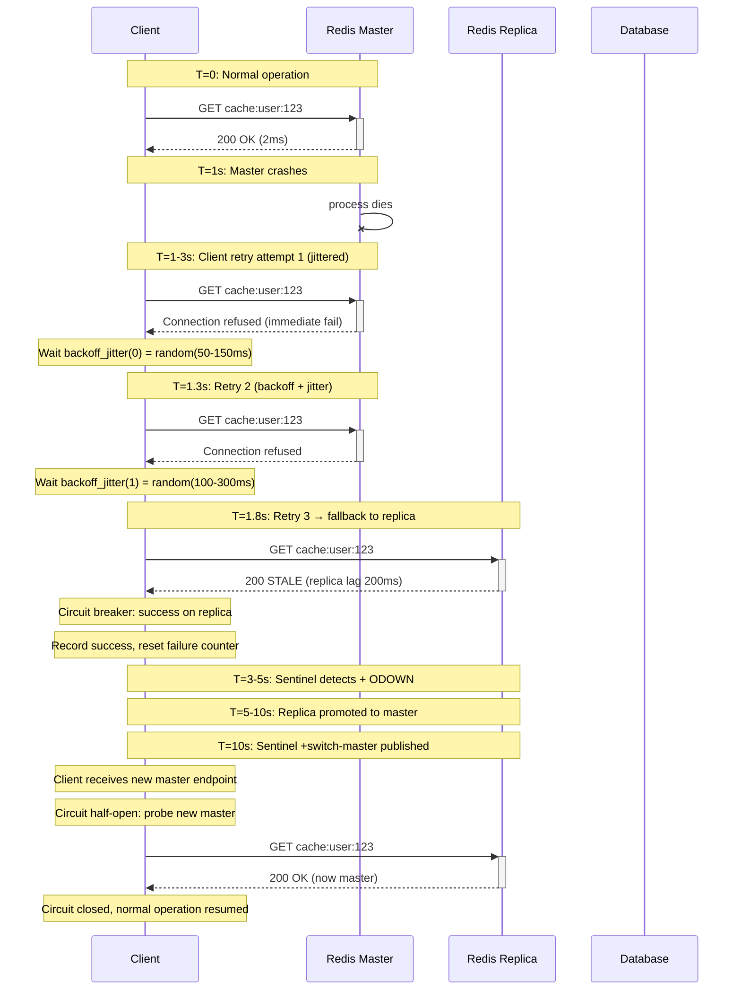

# Day 21: Failover, Client Retry & Chaos Lab

---

## 1. Mục tiêu bài học

Sau bài học, bạn sẽ:

- Phân biệt được 5+ failure modes của Redis HA (master crash, replica lag, network partition, DNS issue, slow disk) và chỉ ra nguyên nhân gốc, dấu hiệu nhận biết, và cách phòng tránh cho từng mode.
- Implement được client retry với exponential backoff + jitter đúng cách (không thundering herd), hiểu sự khác nhau giữa retry fail-safe vs retry idempotent, và biết khi nào chọn fail-fast thay vì retry.
- Tune được timeout: connect timeout, read timeout, write timeout — với giá trị cụ thể phù hợp cho từng use case (cache vs session vs payment idempotency), tránh mass false failure do timeout < failover time.
- Thiết kế được degraded mode strategy: read from replica khi master down, fallback to database, return cached/default value — với trade-off rõ ràng về data consistency.
- Chạy được chaos testing cho Redis bằng Pumba, `tc netem`, Toxiproxy: kill master trong lúc load test, simulate network partition, đo error rate, p99 latency, và recovery time.
- Viết được postmortem sau incident giả lập theo template 5 Whys.

---

## 2. Vì sao cần học chủ đề này

### Incident 1: AWS ElastiCache Failover — Mass Timeout Kills 40% Requests

Một service e-commerce chạy trên AWS ElastiCache Redis (Sentinel-backed). Khi master node bị hardware failure, ElastiCache failover mất **28 giây** (thực tế: 15-45s tùy replica lag). Client có:

```typescript
// Bad config — timeout quá ngắn
const client = new Redis({
  host: 'cache.myapp.amazonaws.com',
  connectTimeout: 3000,  // ← 3s, ngắn hơn failover time
  maxRetriesPerRequest: 3,
});
```

Khi master down, **tất cả 3 retry × 3s = mass timeout xảy ra đồng thời trên 500+ pods** → 40% requests failed trong 9 giây. Retry không jitter: 500 pods retry cùng lúc ở giây 3, 6, 9 → **retry storm** đẩy tải vào database.

Sau failover, master mới lên, nhưng **DNS TTL = 3600s** (1 giờ). 200 pods vẫn connect vào master CŨ (đã shutdown). 300 pods connect vào master MỚI. → **split-brain**: 1/3 requests write vào master mới, 2/3 requests timeout liên tục → data inconsistency.

**Root cause**: Timeout < failover time + không jitter + DNS TTL quá cao + không subscribe Sentinel events.

### Incident 2: Twitter Cache Stampede Sau Failover

Sau Redis master failover, cache bị flushed (hoặc replication lag + lượng lớn requests thất thoát). Hàng triệu requests đồng thời detect cache miss → tất cả hit database cùng lúc → database overload → cascading failure.

```
Timeline:
T=0:     Master failover starts
T=1-28s: Replica promoted, but cache cold
T=29s:   1M requests hit cold cache simultaneously
T=30s:   Database CPU 100%, latency > 10s
T=31s:   Database timeout → cascading failures across services
```

**Bottom line**: Failover không chỉ là "Sentinel đổi master". Client phải xử lý retry đúng cách, timeout đúng cách, fallback đúng cách, và phải test toàn bộ chain trước khi production. Không có chaos test = incident guaranteed.

---

## 3. Kiến thức nền cần có

- **Day 19 Replication Internals**: async replication, PSYNC, replica lag, read from replica — hiểu replica lag là nguyên nhân phổ biến của data loss khi promoted.
- **Day 20 Sentinel & High Availability**: Sentinel quorum, leader election, automatic failover, client discovery qua Sentinel — hiểu failover flow từ phía Sentinel và cách client nhận biết master mới.
- **Day 12 Connection Pooling & Client Behavior**: connection storm, backpressure, circuit breaker pattern — hiểu tại sao reconnect đồng thời từ nhiều clients gây overload.

---

## 4. Lý thuyết chi tiết

### 4.1. Failure Modes của Redis HA

#### Mode 1: Master Crash (Hard Failure)

```
┌─────────────────────────────────────────────────────────────┐
│  Master Crash Timeline                                      │
│                                                             │
│  T=0:      Master process dies (OOM, segfault, kill -9)    │
│  T=0-50ms: Sentinel detects via +sdown (subjective down)   │
│  T=50-500ms: Sentinel reaches quorum → +odown (objective)  │
│  T=500-1000ms: Sentinel leader election                     │
│  T=1000ms:   Leader promotes best replica                  │
│  T=1500ms:   Replica receives REPLICAOF NO ONE             │
│  T=1500-2500ms:Replica loads RDB/AOF, becomes master       │
│  T=2500ms:   Sentinel publishes +switch-master             │
│  T=2500-3000ms:Clients receive new IP via Sentinel         │
│  T=3000ms:   System recovers (best case)                  │
│                                                             │
│  Total: 3-5 seconds (best case)                            │
│  With replica lag: 15-45 seconds                          │
│  With network partition: 60+ seconds (quorum loss)        │
└─────────────────────────────────────────────────────────────┘
```

**Thực tế production**:
- ElastiCache managed: 15-45s failover
- Self-hosted Sentinel: 3-15s (quicksilver: 1-3s với `--down-after-milliseconds 500`)
- Redis Cluster failover: 10-30s (vg: slot ownership transfer)
- Brain-split: không có failover cho đến khi partition heal

#### Mode 2: Replica Lag

```
Master: ─────────────────────────────────────────
         writes: w1 w2 w3 w4 w5 w6 w7 w8 w9 w10

Replica (lagging): ────────────────────
         repl:  w1 w2 w3 w4     ← lag 6 commands
         (disk I/O slow, network congestion)

Problem: If replica promoted at this moment:
  → w5, w6, w7, w8, w9, w10 LOST
  → 6 acknowledged writes lost
```

**Nguyên nhân phổ biến**:
- Replica đặt trên instance type nhỏ hơn master (disk I/O bottleneck)
- `appendfsync always` trên replica: fsync latency spike
- Network throttling trên replica (shared VPC, bandwidth cap)
- Replica đang `BGSAVE` (RDB snapshot) đồng thời với heavy writes
- Slow command trên replica (KEYS *, SCAN, LARGE HGETALL)

**Detection**:
```bash
# Real-time replica lag
redis-cli -h <replica-ip> INFO replication
# role:slave
# master_link_status: up
# slave_repl_offset: 123456
# master_repl_offset: 123600
# Difference = lag in bytes

# Alert threshold
redis-cli INFO replication | grep "slave_repl_offset"
# Alert if lag > 10MB sustained > 30s
```

#### Mode 3: Network Partition

```
Network Partition Diagram:

  [Sentinel 1] [Sentinel 2] [Sentinel 3]
        │            │            │
   ─────┴────────────┴────────────┴───── [Network Partition]
        │            │            │
    [Master A]  [Replica B]  [Replica C]

  Partition Side A (majority if 2/3 Sentinel + master):
    - Sentinel 1, 2 + Master A
    - Quorum = 2 (satisfied)
    - Master A continues accepting writes

  Partition Side B (minority):
    - Sentinel 3 + Replica B + Replica C
    - Quorum = 2 (NOT satisfied)
    - NO failover, Replica B stays replica
    - Client writes to Master A (reachable) → OK
    - Client writes to Side B → TIMEOUT

Brain-split scenario:
  - If partition splits 2/2 (2 Sentinel each side):
  - Neither side has quorum
  - NO automatic failover
  - Manual intervention required
  - "Sentinel is deadlocked"
```

#### Mode 4: DNS / Service Discovery Issue

```
Client connects to: redis-master.prod.internal (DNS A record)
DNS TTL = 3600s (1 hour)

At T=0: DNS resolves to 10.0.1.100 (master)
At T=0-3600s: Master at 10.0.1.100 fails, replica promoted at 10.0.1.101
At T=0-3600s: Clients still connecting to 10.0.1.100 (old master)
At T=3600s: DNS TTL expires, clients refresh to 10.0.1.101
At T=0-3600s: 1 hour of TOTAL FAILURE for write clients

Problem: Service discovery via hardcoded DNS = unacceptable for HA
Solution: Subscribe to +switch-master events via Pub/Sub
```

#### Mode 5: Slow Disk (Persistence Bottleneck)

```
Master config:
  appendonly yes
  appendfsync always     ← writes block on every command

Master under 100K writes/sec:
  - Every write: call write() → fsync() → return
  - fsync on ext4: 10-100ms (depends on disk)
  - 100K writes/sec × 50ms avg = 5000 seconds queue
  → Master unresponsive
  → Replica PSYNC fails
  → Replica lag → eventually full sync → more disk load

Same fsync delay on replica during failover promotion:
  - Replica promoted to master
  - AOF replay takes minutes
  - Writes blocked → clients timeout
```

---

### 4.2. Client Retry Storm và Thundering Herd

#### Retry Storm Scenario

```
1000 clients, each with maxRetries = 3, retryDelay = 100ms

T=0: Master fails
T=3s: All 1000 clients' first retry fires simultaneously
T=6s: All 1000 clients' second retry fires simultaneously
T=9s: All 1000 clients' third retry fires simultaneously
T=12s: All 1000 clients give up → circuit opens

Total: 3000 requests hitting failed master in 9 seconds
= 333 req/sec storm on dead node
= 333 req/sec × 3s timeout = 1000 connection attempts queued
= Connection pool exhaustion on load balancer

Meanwhile, DB receives:
  T=3-12s: All 1000 clients fallback to DB simultaneously
  T=12s+: DB CPU 100% → cascading failure
```

#### The Fix: Jittered Exponential Backoff

```go
// Jitter formula: base * 2^attempt * random(0.5, 1.5)
func backoffWithJitter(attempt int) time.Duration {
    base := 100 * time.Millisecond
    maxDelay := 30 * time.Second

    // Exponential: 100ms, 200ms, 400ms, 800ms...
    exp := base * time.Duration(1<<attempt) // 2^attempt

    // Full jitter: random trong khoảng [0, exp]
    jitter := time.Duration(rand.Int63n(int64(exp)))

    // Cap at maxDelay
    if jitter > maxDelay {
        jitter = maxDelay
    }

    return jitter
}

// Retry loop with jitter
func doWithRetry(ctx context.Context, op func() error) error {
    var lastErr error
    for attempt := 0; attempt < maxRetries; attempt++ {
        if err := ctx.Err(); err != nil {
            return err // Context cancelled
        }

        lastErr = op()
        if lastErr == nil {
            return nil
        }

        if isRetryable(lastErr) {
            delay := backoffWithJitter(attempt)
            select {
            case <-time.After(delay):
                // Continue to next retry
            case <-ctx.Done():
                return ctx.Err()
            }
        } else {
            return lastErr // Non-retryable error
        }
    }
    return fmt.Errorf("max retries exceeded: %w", lastErr)
}
```

**Jitter types**:

| Type | Formula | Effect | Best for |
|---|---|---|---|
| **Full jitter** | `random(0, base * 2^n)` | Spread max | High-concurrency clients |
| **Equal jitter** | `base * 2^n / 2 + random(0, base * 2^n / 2)` | Middle ground | General purpose |
| **Decorrelated** | `random(base, prev * 3)` | Adaptive spread | Variable load |

---

### 4.3. Timeout Tuning

```
Timeout Hierarchy:

connectTimeout:  Thời gian chờ TCP handshake
  ├── Kernel: SYN → SYN-ACK → ACK (1 RTT)
  ├── OS: connection queue
  └── Recommended: 2-5s (network RTT + DNS + queue)

readTimeout:  Thời gian chờ response sau khi request gửi
  ├── Redis processing time
  ├── Network RTT (local: <1ms, cross-region: 50-200ms)
  └── Recommended: 2-5s (cache), 5-10s (session), 10-30s (batch)

writeTimeout:  Thời gian chờ write acknowledgment
  ├── Typically same as readTimeout
  └── Recommended: same as readTimeout

totalCommandTimeout:  connectTimeout + readTimeout
  └── Some clients combine these
```

**Timeout vs Failover Time**:

```
| Scenario                    | Failover Time | Min Timeout  |
|-----------------------------|---------------|--------------|
| Local Sentinel (good config)| 1-3s          | > 5s        |
| ElastiCache managed         | 15-45s        | > 60s       |
| Self-hosted Sentinel        | 3-15s         | > 20s       |
| Redis Cluster failover      | 10-30s        | > 40s       |
| Network partition           | 30-60s+       | > 90s       |

Anti-pattern: timeout = 1s trên ElastiCache
  → Every failover = mass timeout
  → Every recovery = retry storm
  → Guaranteed incident

Recommended: timeout = 3 × expected failover time
```

---

### 4.4. Degraded Mode và Graceful Fallback

```
┌─────────────────────────────────────────────────────────────────┐
│               Graceful Degradation Decision Tree                  │
│                                                                  │
│  Request arrives                                                 │
│       │                                                          │
│       ▼                                                          │
│  Try Redis (master)                                              │
│       │                                                          │
│    ┌──┴──┐                                                      │
│    │ OK  │ ──▶ Return result                                    │
│    └──┬──┘                                                      │
│  timeout │ error                                                 │
│       │                                                          │
│       ▼                                                          │
│  Try Redis (replica, stale-ok)                                   │
│       │                                                          │
│    ┌──┴──┐                                                      │
│    │ OK  │ ──▶ Return result + flag "stale"                     │
│    └──┬──┘                                                      │
│  timeout │ error                                                 │
│       │                                                          │
│       ▼                                                          │
│  Fallback to Database                                           │
│       │                                                          │
│    ┌──┴──┐                                                      │
│    │ OK  │ ──▶ Return result + populate cache                   │
│    └──┬──┘                                                      │
│  timeout │ error                                                 │
│       │                                                          │
│       ▼                                                          │
│  Return cached/default value                                   │
│  + Log error + emit metric                                      │
│  + Increment circuit breaker failure counter                   │
└─────────────────────────────────────────────────────────────────┘
```

**Fallback strategies by use case**:

| Use Case | Degraded Mode | Stale Acceptable | Fallback |
|---|---|---|---|
| **API cache** | Read from replica | Yes (TTL-aware) | Return stale + serve anyway |
| **Session store** | Read from replica | No (freshness critical) | Reject write, read from DB |
| **Rate limiting** | Allow burst (no Redis) | No | Fail-open (allow) vs fail-closed (deny) |
| **Payment idempotency** | Reject request | No | Never fallback — must be consistent |
| **Leaderboard** | Return cached snapshot | Yes | Return empty or last known |
| **Distributed lock** | Lock acquisition fails | N/A | Fail-fast, caller handles |

---

### 4.5. Chaos Testing Redis

#### Tool Comparison

| Tool | Mechanism | Network | Latency | Packet Loss | Use Case |
|---|---|---|---|---|---|
| **Pumba** | Docker pause/kill/signal | ✓ | ✗ | ✗ | Container failure |
| **tc netem** | Linux kernel qdisc | ✓ | ✓ | ✓ | Network impairment |
| **iptables DROP** | Kernel firewall | ✓ | ✗ | ✓ (0% or 100%) | Hard partition |
| **Toxiproxy** | TCP proxy with rules | ✓ | ✓ | ✓ (configurable) | Programmatic, CI/CD |
| **Chaos Mesh** | Kubernetes CRD | ✓ | ✓ | ✓ | K8s environment |

#### Pumba Commands

```bash
# Kill Redis container (simulate master crash)
docker kill redis-master

# Pause Redis container (simulate unresponsive)
docker pause redis-master

# Network partition using Pumba netem
pumba netem --duration 60s --tc-image gaiadocker/iproute2 redis-master \
  delay --time 500 --jitter 100

# Packet loss 10%
pumba netem --duration 30s --tc-image gaiadocker/iproute2 redis-master \
  loss --percent 10

# Corrupt packets 5%
pumba netem --duration 30s --tc-image gaiadocker/iproute2 redis-master \
  corrupt --percent 5
```

#### tc netem (Manual)

```bash
# Add network delay 500ms to redis-master container
docker exec redis-master tc qdisc add dev eth0 root netem delay 500ms 50ms

# Add 10% packet loss
docker exec redis-master tc qdisc change dev eth0 root netem loss 10%

# Remove rules
docker exec redis-master tc qdisc del dev eth0 root netem

# Check current rules
docker exec redis-master tc qdisc show dev eth0
```

#### Toxiproxy (Recommended for Programmatic)

```go
// toxiproxy.go — Go client for Toxiproxy
package main

import (
    "context"
    "fmt"
    "time"

    "github.com/Shopify/toxiproxy/v2/toxiproxy"
)

func main() {
    client := toxiproxy.NewClient("localhost:8474")

    // Create proxy for Redis
    proxy, err := client.CreateProxy("redis", "localhost:16379", "localhost:6379")
    if err != nil {
        panic(err)
    }

    ctx := context.Background()

    // --- Scenario 1: Network latency 500ms ---
    fmt.Println("=== Scenario 1: 500ms latency ===")
    proxy.AddToxic("latency", "latency", "downstream",
        500, // 500ms latency
        map[string]interface{}{"jitter": 50})
    time.Sleep(5 * time.Second)
    proxy.RemoveToxic("latency")

    // --- Scenario 2: Packet loss 20% ---
    fmt.Println("=== Scenario 2: 20% packet loss ===")
    proxy.AddToxic("loss", "loss", "downstream",
        20, // 20% loss
        nil)
    time.Sleep(5 * time.Second)
    proxy.RemoveToxic("loss")

    // --- Scenario 3: Connection timeout (bandwidth 1KB/s) ---
    fmt.Println("=== Scenario 3: Slow connection ===")
    proxy.AddToxic("bandwidth", "bandwidth", "downstream",
        1024, // 1KB/s
        nil)
    time.Sleep(5 * time.Second)
    proxy.RemoveToxic("bandwidth")

    // --- Scenario 4: Full partition (100% loss) ---
    fmt.Println("=== Scenario 4: Full partition ===")
    proxy.AddToxic("partition", "timeout", "downstream", 0, nil)
    time.Sleep(10 * time.Second)
    proxy.RemoveToxic("partition")

    fmt.Println("=== Chaos scenarios completed ===")
}
```

#### Mermaid: Client Retry Timeline



#### ASCII: Failover Phases

```
Phase 1: Detection (T+0 to T+0.5s)
═══════════════════════════════════════════════════════
  Sentinel-1  ──PING──▶  Master  (no reply)
  Sentinel-1  ──+sdown──▶  (subjective down)
  Sentinel-2,3 ──SENTINEL is-master-down-by-addr──▶  (reach quorum)
  Sentinel-1,2,3 ──+odown──▶  (objective down, quorum=2)

Phase 2: Election (T+0.5s to T+1.5s)
═══════════════════════════════════════════════════════
  Sentinel-1  ──SENTINEL failover-elected──▶  (leader elected)
  Leader evaluates replicas:
    Replica-1: priority=100, lag=0ms   ✓ BEST
    Replica-2: priority=100, lag=500ms  (lagging)
  Leader chooses Replica-1

Phase 3: Promotion (T+1.5s to T+3s)
═══════════════════════════════════════════════════════
  Leader ──REPLICAOF NO ONE──▶  Replica-1
  Replica-1 loads AOF/RDB (disk I/O)
  Replica-1 ──+promoted──▶  (now master)
  Leader ──SENTINEL set──▶  (reconfigure replica-1 as master)
  Leader ──SENTINEL set──▶  (reconfigure replica-2 to new master)

Phase 4: Reconfiguration (T+3s to T+5s)
═══════════════════════════════════════════════════════
  Sentinel ──+switch-master──▶  Pub/Sub channel
  All Sentinels update internal state
  Sentinel ──sentinel:publish──▶  (clients subscribed)

Phase 5: Client Reconnect (T+5s to T+30s)
═══════════════════════════════════════════════════════
  Client-1 receives +switch-master → reconnect to new master ✓
  Client-2 (hardcoded IP, no sub) → still connecting to old master ✗
  Client-3 DNS TTL expired → reconnect ✓
  Client-4 retry storm to old master → timeout ✗

Recovery complete: T+5s to T+3600s (depending on client implementation)
```

---

### 4.6. Brain-Split Scenarios

```
Brain-split: Network partition khiến 2 sides đều nghĩ mình là master

Setup: 3 Sentinel + 1 Master + 2 Replica
Partition: Split 2-2 (Sentinel-1+Master on side A, Sentinel-2+Replica-1 on side B)

Side A (majority):
  - Sentinel-1, Sentinel-2 + Master-A = quorum 2 ✓
  - Master-A continues writing
  - Clients on side A → writes succeed

Side B (minority, but has replica):
  - Sentinel-3, Replica-1 = quorum 1 ✗ (not enough)
  - NO automatic failover (quorum not reached)
  - BUT: manual `SENTINEL failover <master-name>` can force it
  - Risk: if Sentinel-1 down AND Sentinel-2 on side A can't reach majority
  - → Both sides frozen (no writes)

The 5-Node Split (Worst Case):
  5 Sentinel, partition 2 vs 3
  - Side with 3: quorum ✓, continues as master
  - Side with 2: NO quorum, no failover
  - Both sides have data divergence

Solution: odd number of Sentinels (3, 5, 7)
  → Always a clear majority side
  → Never a 2-way split with equal votes
```

---

## 5. Trade-off Analysis

### Retry vs Fail Fast

| Dimension | Retry with Backoff | Fail Fast |
|---|---|---|
| **Availability** | Higher (recovers automatically) | Lower (fails immediately) |
| **Latency** | Higher (waits for retry) | Lower (immediate response) |
| **Load on Redis** | Spikes during recovery | Spikes on initial failure only |
| **Data consistency** | Risk of stale read after retry | Consistent (immediate failure) |
| **Idempotency required** | Yes (can retry same operation) | No (same request tried once) |
| **Best for** | Transient failures, network blips | Non-idempotent writes, hard failures |
| **Risk if wrong choice** | Retry non-idempotent → double charge | Miss recoverable requests |

### Fallback to DB vs Reject Request

| Dimension | Fallback to DB | Reject Request |
|---|---|---|
| **Availability** | Highest (always have answer) | Lower (Redis+DB both fail = fail) |
| **Latency** | Higher (DB usually slower) | Lower (immediate fail) |
| **Data consistency** | May serve stale data | Always fresh (or fail) |
| **DB load** | Increases during Redis failure | No extra DB load |
| **Best for** | Read-heavy, stale-ok (cache) | Write-critical, consistency-critical |
| **Risk** | DB overload during failover | Customer-facing errors |

### Stale Cache vs Unavailable Cache

| Dimension | Serve Stale | Return Unavailable |
|---|---|---|
| **User experience** | Seamless (get data) | Degraded (error/empty) |
| **Consistency** | Stale (may show old data) | No data (not stale) |
| **Availability** | Higher | Lower |
| **Best for** | Public content, product catalog | User-specific data, cart, payments |
| **TTL awareness** | Check staleness vs maxStale | N/A |
| **SLA concern** | May violate freshness SLA | May violate availability SLA |

### Automatic Recovery vs Manual Intervention

| Dimension | Automatic Recovery | Manual Intervention |
|---|---|---|
| **MTTR (Mean Time To Recover)** | Faster (seconds) | Slower (minutes to hours) |
| **Human cost** | Lower | Higher |
| **Risk of wrong action** | Low (automated, tested) | High (human error under pressure) |
| **Consistency guarantee** | Depends on config | Better for complex scenarios |
| **Best for** | Common failures (node crash) | Complex failures (data corruption) |
| **Audit trail** | Limited | Full (human decisions logged) |

### Aggressive Timeout vs Conservative Timeout

| Dimension | Aggressive (short) | Conservative (long) |
|---|---|---|
| **False failure rate** | Higher (timeout < real processing time) | Lower |
| **Recovery speed** | Faster (fail fast → retry) | Slower (wait longer) |
| **User-perceived latency** | Lower (quick error) | Higher (slow error) |
| **Best for** | Non-critical, idempotent reads | Critical, non-idempotent writes |
| **Failover time** | Timeout must exceed failover time | Same |
| **Risk** | Mass timeout if Redis slower than expected | Hangs if Redis completely unresponsive |

---

## 6. Best Solution & Best Practices

### Recommendation by Use Case

#### API Response Cache

```
Goal: Cache API responses, maximize hit rate, tolerate staleness
Timeout: connect=2s, read=3s, write=3s
Retry: 2 attempts, jittered backoff (full jitter)
Fallback: Serve stale (Cache-Control: max-stale=300) + async refresh
Circuit breaker: Trip after 50% errors in 10s, half-open after 30s

Config (ioredis):
  connectTimeout: 2000,
  maxRetriesPerRequest: 2,
  retryStrategy: (times) => Math.min(times * 200, 2000),
  enableOfflineQueue: false, // Don't queue writes when disconnected
  enableReadyCheck: true,
```

#### Session Store

```
Goal: Store user sessions, freshness critical
Timeout: connect=5s, read=5s, write=5s
Retry: 1 attempt only (non-idempotent session update)
Fallback: Read from database, but WRITE must go to Redis (no DB fallback for writes)
Circuit breaker: Trip after 30% errors in 10s

Anti-pattern: NEVER fallback writes to DB for sessions
  → Session data in DB ≠ Redis session → inconsistent auth
  → User logged in on app but not on service using Redis
```

#### Payment Idempotency Key

```
Goal: Ensure payment deduplication, zero tolerance for duplicates
Timeout: connect=10s, read=10s, write=10s
Retry: NEVER retry automatically (payment submission)
Fallback: Return error to client, client decides retry
Circuit breaker: Trip aggressively (10% errors in 5s)

Critical: Payment idempotency keys MUST be checked BEFORE sending to payment provider
  1. Check SETNX idempotency:<key> (Redis)
  2. If key exists → return cached response
  3. If not → proceed to payment provider
  4. Store result in Redis with TTL 24h
```

### Best Practices Checklist

- [ ] **Timeout > 3× expected failover time** (ElastiCache: 60s+, self-hosted: 15s+)
- [ ] **Retry with jitter** (full jitter hoặc equal jitter — never fixed delay)
- [ ] **Retry only idempotent operations** (GET, INCR, SET NX — NOT INCR twice)
- [ ] **Subscribe to Sentinel Pub/Sub** (`+switch-master`, `+sdown`, `+reboot`) — never poll
- [ ] **DNS TTL ≤ 15s** for Redis endpoints — avoid hardcoded IPs with high TTL
- [ ] **Circuit breaker** with appropriate thresholds per use case
- [ ] **Degraded mode** strategy documented and tested for every service
- [ ] **Never retry non-idempotent writes** without idempotency key in application layer
- [ ] **Monitor during failover**: error rate, p99 latency, retry count, circuit breaker state
- [ ] **Test failover in staging** with real chaos (kill master, network partition, slow link)
- [ ] **Write postmortem template** filled after every incident (including lab incidents)

---

## 7. Performance Considerations

### Error Budget

```
Error budget = 1 - SLO (e.g., 99.9% = 0.1% allowed errors)

For 100K requests/minute:
  - Allowed errors: 100/minute
  - During failover (30s): 50K requests hit degraded path
  - Expected error rate during failover: 20-40% (without proper retry)
  - Error budget burned in 1 failover: 50K × 30% = 15K errors
  → 15K / 100K/min budget = 15 minutes of budget burned in ONE failover

With proper retry (3 retries, 2s backoff, jitter):
  - Effective error rate: 0.5-2% during failover
  - 50K × 1% = 500 errors
  - 500 / 100K budget = 0.5 minutes burned
  → 30× improvement
```

### Retry Storm Impact on Database

```
Scenario: 1000 pods, each hitting DB during Redis failover

Without jitter:
  T=0:    Redis fails
  T=0-5s: All 1000 pods exhaust retries (3 × 1s)
  T=5s:   All 1000 pods fallback to DB simultaneously
  DB load: 1000 × 50ms avg = 50,000ms DB processing time in 1 batch
  DB CPU:  100% → DB latency spike → cascading failures

With jitter (full jitter):
  T=0:    Redis fails
  T=0-8s: Backoff spread over 8 seconds (jitter = random(0, 200ms*2^n))
  T=0-8s: DB load spread over 8 seconds
  DB load: 1000 pods × 50ms / 8s = 6,250ms/s = manageable
  DB CPU:  62% → acceptable, no cascading failure

Rule: Jitter reduces DB load spike by factor of N (number of clients)
```

### p99 Latency During Failover

```
Normal operation:
  p50: 2ms, p95: 8ms, p99: 15ms

During failover (30s):
  Attempt 1 (master): timeout 3s → p99 = 3s for failing requests
  Attempt 2 (master after backoff): timeout 3s → additional 0.2s wait
  Attempt 3 (replica fallback): p95 = 20ms (replica)
  Recovery: p99 = 15ms (back to normal)

Total observed latency distribution during failover:
  60% of requests: p99 = 15ms (replica fallback, fast)
  30% of requests: p99 = 3,200ms (2 retries + backoff)
  10% of requests: p99 = 6,200ms (3 retries + backoff)

User impact: 40% of users experience 3-6 second delay
  → Acceptable for cache, NOT acceptable for session
```

---

## 8. Production Failure Modes

### 8.1. Retry Storm Sập Database

```
Symptom: Database CPU 100%, latency > 5s, cascading failures across services
Cause: Redis failover → all clients fallback to DB simultaneously
Trigger: No jitter + aggressive retry + no circuit breaker

Detection:
  - DB CPU > 90% during Redis incident
  - Redis error rate spike correlates with DB latency spike
  - Pattern: DB overload always follows Redis failure by ~3-10 seconds

Fix:
  - Immediate: Enable circuit breaker to block fallback requests
  - Scale DB temporarily (vertical scale or read replica)
  - Throttle fallback requests using token bucket

Prevention:
  - Jittered backoff (mandatory)
  - Circuit breaker with DB fallback throttling
  - Pre-warm cache on failover recovery
  - DB has its own circuit breaker
```

### 8.2. DNS TTL Cao Gây Client Kẹt vào Master Cũ

```
Symptom: Some clients work, some clients fail, for 1 hour after failover
Cause: DNS A record TTL = 3600s (1 hour)
        Clients cached old IP (master cũ, đã shutdown)
        Master mới có IP khác

Timeline:
  T=0:   Master-1 fails, Replica promoted to Master-2 (10.0.1.102)
  T=0:   DNS updated to 10.0.1.102
  T=0-3600s: 30% clients still using 10.0.1.101 (old master)
  T=0-3600s: 30% clients timeout on every request
  T=3600s: DNS TTL expires, all clients recover

Impact: 30% of traffic fails for up to 1 hour

Fix:
  - Reduce DNS TTL to 15s (before incident)
  - Use service discovery (Consul, etcd) with push notifications
  - Subscribe to Sentinel +switch-master events (recommended)

Prevention:
  - Always use short DNS TTL for Redis endpoints (≤15s)
  - Never hardcode IP addresses
  - Use service discovery for all dynamic endpoints
```

### 8.3. Replica Lag → Promoted Với Data Loss

```
Symptom: After failover, some acknowledged writes are missing
Root cause: Replica lag > failover trigger threshold
           Replica promoted before receiving latest writes

Example:
  Master acknowledged 1000 writes
  Replica only received 990 writes (10 writes in replication backlog)
  Failover triggers (master unreachable)
  Replica promoted → 10 writes LOST

Specific scenario:
  Master: appendfsync always + slow disk
  Replica lag: 500ms consistently
  Sentinel down-after = 5000ms
  Failover at T=5s: replica 500ms behind → 10 writes LOST

Fix:
  - Increase min-replica-max-lag (e.g., 10s for critical data)
  - Set appendfsync noeverysec or everysec (not always)
  - Monitor replica lag and alert before promotion

Prevention:
  - `CONFIG SET min-replica-max-lag 10` (Sentinel uses this)
  - Alert when replica lag > 5s (before failover threshold)
  - Never use `appendfsync always` in production with replicas
```

### 8.4. Circuit Breaker Không Trip → Cascading Failure

```
Symptom: Service A calls Service B, Service B calls Redis
         Redis slow → Service B slows → Service A slows → cascading failure
Cause: Circuit breaker threshold too high (50% errors in 30s)
       Circuit never opens → Service B absorbs all latency → thread pool exhaustion

Example:
  Redis p99 = 5s (normally 15ms)
  Circuit breaker: trip after 50% errors in 30s
  Over 30s: 1000 requests, 950 timeout at 5s, 50 succeed at 15ms
  Error rate: 95% → circuit opens ✓ (this case is OK)

Counter-example:
  Redis p99 = 500ms (normally 15ms, degraded but not dead)
  Circuit breaker: trip after 50% errors in 30s
  Over 30s: 1000 requests, 600 timeout at 500ms, 400 succeed at 100ms
  Error rate: 60% → circuit opens ✓ (also OK)

Worst case:
  Circuit breaker: trip after 99% errors in 10s
  Redis is slow (p99=800ms) but not completely down
  Error rate: 30% (timeouts at 500ms vs limit) → circuit never opens
  Service B: 1000 threads × 500ms = 500 thread-seconds wasted
  Thread pool exhausted → Service B down → cascading

Fix: Tune circuit breaker to trip BEFORE thread pool exhaustion
     latency threshold + error rate threshold = OR condition
```

### 8.5. Timeout < Failover Time → Mass Error

```
Symptom: Every failover = 100% request failures for N seconds
Cause: Client timeout configured shorter than actual failover time

Real example (ElastiCache):
  Failover time: 15-45 seconds
  Client timeout: 3 seconds
  Result: Every write fails for entire failover duration

Analysis:
  Failover duration: 30s avg
  Timeout: 3s
  Retries: 3
  All 3 retries fail within first 9 seconds
  Remaining 21 seconds: all requests fail with timeout

Fix:
  ElastiCache + ioredis/go-redis:
    connectTimeout: 6000 (6s)
    readTimeout: 6000 (6s)
    maxRetriesPerRequest: 1  // Only 1 retry to avoid double timeout

  Self-hosted Sentinel (fast failover):
    connectTimeout: 5000 (5s)
    readTimeout: 5000 (5s)
    maxRetriesPerRequest: 2
```

### 8.6. Sentinel Client Cache Stale Endpoint

```
Symptom: Client uses wrong endpoint for minutes after failover
Cause: Sentinel client caches resolved IP (connection pool)
       Does not receive +switch-master event (Pub/Sub not subscribed)

Redis client behavior:
  Client connects to: Sentinel → gets master IP → caches IP in pool
  On master change: Sentinel publishes +switch-master
  If client not subscribed: pool still connects to old IP
  Old IP = dead master = connection refused

Scenario:
  Client: ioredis with sentinel
  Subscribe channel: +switch-master
  On +switch-master: reconnect()
  BUT: if reconnect() called while pool is loading → race condition
  Result: some connections go to old master, some to new master

Fix:
  - Always subscribe to +switch-master, +sdown, +reboot
  - Use `autoDiscoverMasterAddrByName` (ioredis)
  - Force full reconnect on +switch-master (not lazy reconnect)
  - Connection pool must be fully drained and rebuilt on master change
```

---

## 9. Real-world Examples

### GitLab Redis Incident 2017 (Data Loss)

GitLab production database (not Redis, but same pattern): 2017, a late-night maintenance window, a senior engineer ran `rm -rf` on the wrong database server. The result: 6 hours of data loss for ~5000 projects.

**Lesson for Redis HA**: GitLab's postmortem identified: no failover for the primary DB, no monitoring, no backup verification. For Redis: Sentinel is the "backup" for master failure. Without Sentinel + tested failover, Redis master failure = data loss + service outage.

GitLab's Redis setup at the time: single Redis instance (no replication). The lesson: **replication without Sentinel = false sense of security**.

### AWS ElastiCache Failover Stories

Multiple AWS customers have reported ElastiCache failover taking **15-45 seconds** (vs AWS documentation says "typically under 6 seconds"). Root causes documented:
- Replica lag > threshold before failover
- Multi-AZ failover requires replica in different AZ (same AZ = same hardware failure)
- Customer timeout = 1-3s (below actual failover time)

**Pattern**: Clients with `connectTimeout: 3000` and `maxRetries: 3` experience complete failure during every failover. Clients with `connectTimeout: 10000` + jitter experience graceful degradation.

**Recommendation from AWS re:Post**: Set `timeout` ≥ 15s for ElastiCache with replicas.

### Stack Exchange "It's Always DNS"

Stack Exchange (Stack Overflow infrastructure) documented a Redis DNS incident: Redis master IP changed (after failover), DNS TTL was 1 hour, 50% of web servers continued connecting to old IP for 1 hour after failover.

Impact: **~50% of write traffic failed for 1 hour**. Postmortem action: reduced DNS TTL to 15s for all Redis endpoints, implemented Sentinel Pub/Sub client reconnect.

**Key quote**: "We thought DNS caching was handled by our application. It wasn't."

### Twitter Post-Failover Cache Miss Storm

Twitter engineering documented a pattern: after Redis master failover, cache hit rate dropped from 95% to 0% for ~30 seconds. Root cause: replica promoted but cold (empty or far behind), all requests hitting cold cache simultaneously (thundering herd).

Mitigation Twitter implemented:
1. **Cache warming**: On failover complete, proactively populate cache from DB
2. **Request coalescing**: Only 1 request goes to DB per cache key, others wait
3. **Probabilistic early expiration**: TTL with jitter to prevent synchronized expiration
4. **Circuit breaker**: If error rate > 30%, serve stale instead of hitting DB

---

## 10. Common Pitfalls

| Pitfall | Symptom | Fix |
|---|---|---|
| Retry without jitter | 1000 clients retry simultaneously → retry storm | Add full jitter: `random(0, base * 2^n)` |
| Timeout = 1s trên managed Redis | Mass timeout every failover | Set timeout ≥ 3× expected failover time |
| Fallback to DB không rate limit | DB overload → cascading failure | Throttle fallback: max 100 req/s to DB |
| Không subscribe Sentinel events | Clients use stale master IP | Subscribe to +switch-master Pub/Sub |
| Hardcoded Redis IP hoặc DNS TTL cao | Clients stuck on dead master for 1h | Short DNS TTL + service discovery |
| Retry non-idempotent operation | Double charge, duplicate data | Only retry idempotent ops; use idempotency key |
| Circuit breaker threshold quá cao | Circuit never opens → cascading failure | Tune: trip before thread pool exhaustion |
| Replica promoted với lag > threshold | Data loss (acknowledged writes missing) | Set `min-replica-max-lag` + alert on lag |
| Không test failover | Incident khi failover xảy ra lần đầu | Chaos test trong staging trước khi production |
| Degraded mode serving stale data quá lâu | SLA violation (data too old) | TTL-aware stale serving + force refresh |

---

## 11. Câu hỏi tự kiểm tra

### Câu 1: Timeout vs Failover Time

Bạn dùng AWS ElastiCache Redis với 1 replica. AWS tài liệu nói failover "typically under 6 seconds", nhưng thực tế bạn đo được **28 giây** trong 3 lần failover gần đây. Client hiện tại:

```typescript
const client = new Redis({
  host: 'elasticache.myapp.amazonaws.com',
  connectTimeout: 3000,
  readTimeout: 3000,
  maxRetriesPerRequest: 3,
});
```

Mỗi failover: bao nhiêu requests thất bại? Bao nhiêu retries xảy ra? Đề xuất config mới.

> **Đáp án**:
> - Failover time: 28s
> - Timeout: 3s
> - Retry 1: 3s → fail → retry 2 at 6s → fail → retry 3 at 9s → fail → give up at 12s
> - Result: 100% requests fail for entire 28s failover duration
> - Retries: 3 × N requests = mass load on dead node
>
> Config mới:
> ```typescript
> const client = new Redis({
>   host: 'elasticache.myapp.amazonaws.com',
>   connectTimeout: 10000,
>   readTimeout: 10000,
>   maxRetriesPerRequest: 1,  // Only 1 retry to avoid doubling wait time
>   retryStrategy: (times) => {
>     if (times > 1) return null; // No more retries
>     // Full jitter: random(0, 1000ms)
>     return Math.floor(Math.random() * 1000);
>   },
> });
> ```
> Kết quả: request vẫn có thể fail trong failover 28s, nhưng fail có bounded latency (~20-21s worst case) và không tạo retry storm. Muốn user-facing request không fail, cần degraded mode/fallback hoặc timeout budget > measured p99 failover (ví dụ 35s), nhưng điều đó đẩy p99 latency lên rất cao.

### Câu 2: Retry Storm

1000 clients, mỗi client retry 3 lần với fixed delay 100ms (không jitter). Master down. Mô tả retry storm xảy ra: bao nhiêu requests hit dead node tại mỗi thời điểm? Nếu có jitter (full jitter), con số này thay đổi thế nào?

> **Đáp án**:
> - Without jitter:
>   - T=3s: 1000 retry-1 → 1000 requests to dead node
>   - T=3.1s: all 1000 clients wait 100ms
>   - T=3.2s: 1000 retry-2 → 1000 more requests
>   - T=3.3s: 1000 retry-3 → 1000 more requests
>   - Total: 3000 requests to dead node in 0.2 seconds
>
> - With full jitter (`random(0, 100ms * 2^n)`):
>   - Retry-1: spread over 0-100ms → 1000 / 100ms = 10K req/s
>   - Retry-2: spread over 0-200ms → 1000 / 200ms = 5K req/s
>   - Retry-3: spread over 0-400ms → 1000 / 400ms = 2.5K req/s
>   - Peak load reduced by 60-80%
>   - DB fallback also spread → DB manageable

### Câu 3: Circuit Breaker + Degraded Mode

Service đọc product catalog từ Redis. Yêu cầu:
- Normal: Redis cache hit → < 5ms response
- Degraded: Redis miss → read from DB → < 100ms response
- Circuit breaker: khi nào nên trip? threshold bao nhiêu?

Đề xuất circuit breaker config.

> **Đáp án**:
> - Redis cache hit: < 5ms (p99)
> - Redis miss + DB fallback: < 100ms (p99)
> - Error (Redis down, DB down): > 10s (timeout)
>
> Circuit breaker thresholds:
> ```
> Failure rate: > 50% in 10 seconds → OPEN
> Latency: > 100ms p95 in 10 seconds → OPEN (degraded too slow)
> Success recovery: > 80% in 30 seconds → HALF-OPEN
> Timeout to wait in OPEN: 30 seconds
> ```
>
> In OPEN state: serve stale cache (return cached product data, may be 5 min old)
> In HALF-OPEN: allow 10 probe requests, if > 80% succeed → CLOSED
> Trade-off: serving stale (5 min old) vs serving error
> → For product catalog: serve stale always (better UX than error)

### Câu 4: Brain-Split Scenario

Bạn có 3 Sentinel + 1 Master + 2 Replica. Network partition chia đôi:
- Side A: Sentinel-1, Sentinel-2, Master, Replica-1
- Side B: Sentinel-3, Replica-2

Điều gì xảy ra trên mỗi side? Có failover tự động không? Điều gì xảy ra khi partition heal?

> **Đáp án**:
> - Side A: Sentinel-1,2 + Master = quorum 2 ✓ → master continues, no failover
> - Side B: Sentinel-3 + Replica-2 = quorum 1 ✗ → NO automatic failover
> - Both sides: writes to Side A succeed, writes to Side B timeout
> - Clients on Side B: all requests fail (no failover, master unreachable)
>
> After partition heals:
> - Sentinel-3 discovers new master (Side A's master)
> - Sentinel-3 updates its view
> - Replica-2 resyncs from new master (may need full sync if lag large)
> - Client on Side B reconnects to master
> - Data: writes accepted on Side A during partition are safe
> - Risk: if Side B had a promoted master during partition → split-brain → manual merge needed

### Câu 5: DNS TTL Causing Prolonged Outage

Redis master IP thay đổi sau failover. DNS TTL hiện tại = 3600s. Không có Sentinel Pub/Sub. Bao lâu sau failover, client mới bắt đầu hồi phục? Tại sao?

> **Đáp án**:
> - Without Sentinel Pub/Sub: clients only know about new master via DNS refresh
> - DNS TTL = 3600s (1 hour)
> - Clients using old IP (dead master): 100% failure for 1 hour
> - After DNS TTL expiry (T+3600s): clients resolve new IP → recovery
>
> If Sentinel Pub/Sub subscribed:
> - Client receives +switch-master event within seconds of failover
> - Client immediately reconnects to new master
> - Recovery time: ~5-10 seconds (failover + reconnect)
> - Improvement: 3600s → 10s = **360× faster recovery**

### Câu 6: Idempotency Key Retry

API endpoint `POST /payments` dùng Redis để lưu idempotency key. Request flow:
1. `SETNX idempotency:<key> <request-data>` — prevents duplicate
2. Process payment (external API call)
3. `SET idempotency:<key> <response> EX 86400` — store response

Payment fails ở bước 2 (timeout từ payment provider). Client retry. Điều gì xảy ra nếu không có idempotency check? Nếu có idempotency check?

> **Đáp án**:
> - Without idempotency check:
>   - Retry → new request to payment provider → double charge → **financial loss**
>
> - With idempotency check:
>   - `SETNX` at step 1: if key exists → return cached response
>   - But: key exists only AFTER step 1 completes
>   - If crash between step 1 and step 2: key exists but no response stored
>   - Client retries → `SETNX` fails (key exists) → but no cached response
>   → **Idempotency check alone is NOT enough**
>
> Safe pattern:
> ```go
> // Step 1: SETNX with token (atomic)
> ok := SETNX("idem:token:<key>", <client-token>, "PROCESSING")
> if !ok {
>     // Another request processing or completed
>     return getCachedResponse(key)
> }
>
> // Step 2: Process payment
> result := paymentProvider.Call()
>
> // Step 3: Store result with same token
> SET("idem:result:<key>", <result>, "EX", 86400)
> DEL("idem:token:<key>")
> return result
> ```
> Retry safety: token stored atomically → crash = token left in PROCESSING state → detect and return "in progress" (not "already done")

### Câu 7: Chaos Testing Design

Thiết kế chaos test cho Redis failover trong CI/CD pipeline. Cần test:
1. Master crash (kill -9 simulation)
2. Network partition (500ms latency)
3. Full partition (100% packet loss, 10s)
4. Slow disk (fsync delay)

Với mỗi scenario, đề xuất: tool, duration, assertion (what to check), pass/fail criteria.

> **Đáp án**:
>
> | Scenario | Tool | Duration | Assertion | Pass Criteria |
> |---|---|---|---|---|
> | Master crash | `docker kill` hoặc Pumba `kill` | 30s | Error rate < 5%, recovers within 60s | Requests succeed after recovery |
> | Network latency | tc netem hoặc Toxiproxy | 30s | Latency spike observed, no error | Fallback to replica works |
> | Full partition | iptables DROP hoặc Pumba `pause` | 10s | Writes fail, reads from replica | Circuit breaker opens |
> | Slow disk | `tc qdisc` bandwidth limit | 30s | Read timeout, fallback triggered | DB not overloaded |
>
> CI/CD integration:
> ```bash
> # In CI pipeline (after load test starts)
> toxiproxy-cli create redis 127.0.0.1:16379 127.0.0.1:6379
> toxiproxy-cli toxic add redis latency -a latency=500
> sleep 30
> toxiproxy-cli toxic remove redis latency
> # Assert: error rate < 5%, p99 < 2s during chaos
> ```
>
> Metrics to collect:
> - Error rate (before/during/after chaos)
> - p99 latency (before/during/after)
> - Circuit breaker state transitions
> - Recovery time (chaos end → all requests succeeding)
