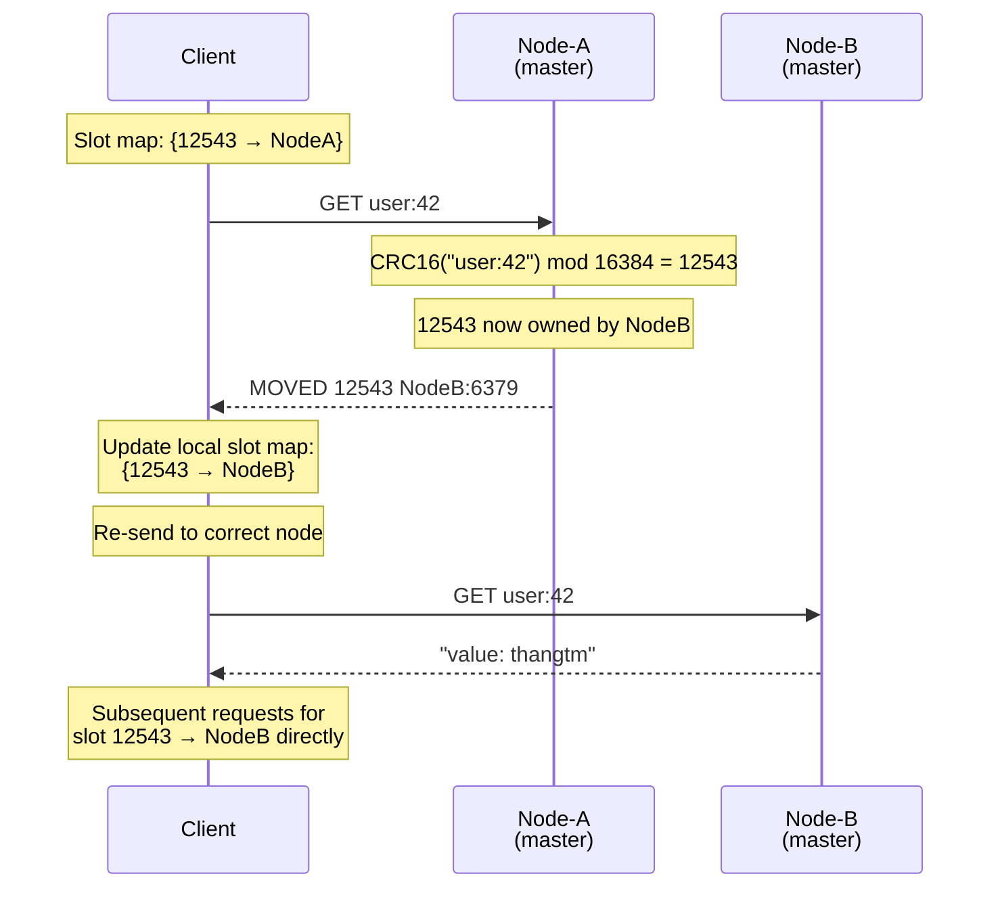

# Day 22: Redis Cluster & Hash Slots

---

## 1. Mục tiêu bài học

Sau bài học, bạn sẽ:

- Giải thích được Redis Cluster architecture: tại sao dùng 16384 hash slots thay vì số khác, cách `CRC16(key) mod 16384` hoạt động, và trade-off khi chọn bit array size.
- Phân tích được gossip protocol: cluster bus port, PING/PONG heartbeat, failure detection (PFAIL → FAIL), slot map propagation — hiểu cách cluster tự động phát hiện node down mà không cần centralized coordinator.
- Implement được multi-key operation với hash tag `{tag}`: biết khi nào dùng, khi nào tránh, và tại sao hash tag tạo hot slot là anti-pattern.
- Xử lý được MOVED redirection (slot chuyển hẳn) và ASK redirection (đang migrating) trong cluster-aware client: hiểu p99 latency impact khi client không cluster-aware.
- Đưa ra quyết định kiến trúc: Cluster vs Sentinel vs client-side sharding cho 3 scenario cụ thể (cache 1TB, session multi-region, leaderboard), có trade-off rõ ràng.

---

## 2. Vì sao cần học chủ đề này

### Incident 1: Sentinel Không Giải Quyết Được Sharding

Một startup có Redis master 50GB, throughput 80K ops/sec. Đã dùng Sentinel (3 node) cho HA, failover tự động. Mọi thứ ổn.

6 tháng sau: data tăng lên 200GB, throughput 200K ops/sec. Redis bắt đầu OOM. Team nhận ra vấn đề:

- **Sentinel chỉ quản lý replication và failover**: 1 master duy nhất, không chia data ra nhiều node
- **Muốn scale**: phải sharding thủ công — chia keyspace ra nhiều Redis instance, mỗi instance có Sentinel riêng
- **Client-side sharding tự viết**: hash key → node. Khi cần add/remove node → resharding = downtime hoặc phải tự implement migration logic
- **Code sharding tự viết bug**: có 2 endpoint đọc sai node → data inconsistent, âm thầm trong 2 tuần

**Redis Cluster giải quyết**: auto-sharding 16384 slots, tự động migrate slots khi add/remove node, cluster-aware client tự redirect.

### Incident 2: Cross-Slot MGET Làm API Latency Tăng 10×

Team muốn dùng Redis Cluster làm distributed cache. Code:
```typescript
// Lấy 100 product details — 100 keys
const keys = products.map(p => `product:${p.id}`);
const results = await redis.mget(keys); // MGET cross-slot → ERROR
```

Error: `CROSSSLOT Keys in request don't hash to the same slot`.

Team không hiểu hash slot constraint. Fix bằng cách:
1. Thêm hash tag: `product:{category}:{id}` → tất cả cùng slot? Không đúng.
2. Thực tế: mỗi product khác nhau → phải pipeline riêng từng slot.

Sai lầm phổ biến: nghĩ Cluster giống single-node Redis, không biết multi-key constraint.

### Incident 3: Hash Tag Tạo Hot Slot — API Down 2 Giờ

Một SaaS multi-tenant dùng hash tag cho session: `session:{tenant_id}:{user_id}`. Một tenant có 80% traffic. Tất cả session của tenant lớn đó rơi vào **cùng 1 slot**. Slot đó trở thành hot slot.

- CPU trên node chứa slot đó: 95%, tất cả request đến slot đó timeout
- Các node khác: idle 5%
- **Cluster không tự cân bằng hash tag key**: không có cách tự động chia đều
- Fix: phải rename key pattern, migrate data, hoặc thêm prefix random

**Bottom line**: Cluster là giải pháp scale horizontally tốt nhất cho Redis, nhưng đi kèm constraints (hash slot, cross-slot limitation, operational complexity) mà nếu không hiểu sẽ tạo incident mới nghiêm trọng hơn single-node.

---

## 3. Kiến thức nền cần có

- **Day 19 Replication Internals**: async replication, PSYNC, replica lag, read from replica — Cluster dùng replication bên trong mỗi shard
- **Day 20 Sentinel & High Availability**: quorum, failover, split-brain prevention — Cluster có failure detection tương tự nhưng distributed, không dùng Sentinel
- **Day 4 Key Design**: namespace convention, TTL strategy, key cardinality — hash tag là phần mở rộng của key design cho cluster
- **Day 11 Pipelining**: pipelining để giảm RTT — cluster-aware pipelining cần group command theo slot
- **Day 12 Connection Pooling**: cluster client cần connection pool per node

---

## 4. Lý thuyết chi tiết

### 4.1. Redis Cluster Architecture — Tổng quan

Redis Cluster là **distributed Redis deployment** cho phép sharding data qua nhiều node và tự động failover.

```
┌─────────────────────────────────────────────────────────────────────────┐
│                     Redis Cluster Architecture (6 nodes)                 │
│                                                                          │
│   Shard 1                    Shard 2                    Shard 3         │
│  ┌─────────┐                ┌─────────┐                ┌─────────┐     │
│  │ Master1 │───────────────▶│ Master2 │───────────────▶│ Master3 │     │
│  │Slots:   │                │Slots:   │                │Slots:   │     │
│  │ 0-5460 │                │5461-10922│               │10923-   │     │
│  │         │                │         │                │16383    │     │
│  └────┬────┘                └────┬────┘                └────┬────┘     │
│       │ replicate                 │ replicate                 │ replicate│
│       ▼                           ▼                           ▼         │
│  ┌─────────┐                ┌─────────┐                ┌─────────┐     │
│  │Replica1 │                │Replica2 │                │Replica3 │     │
│  │(backup) │                │(backup) │                │(backup) │     │
│  └─────────┘                └─────────┘                └─────────┘     │
│                                                                          │
│  Gossip Protocol (P2P, port 16379 = 6379 + 10000)                       │
│  ┌─────────────────────────────────────────────────────────────────┐   │
│  │ Every node connects to ALL other nodes via cluster bus          │   │
│  │ PING/PONG heartbeat: every node-timeout/2                       │   │
│  │ Each PING carries: slot map, node state, epoch                   │   │
│  └─────────────────────────────────────────────────────────────────┘   │
│                                                                          │
│  Client (cluster-aware):                                                │
│  - Caches slot map locally                                              │
│  - Routes command directly to correct node                              │
│  - Handles MOVED/ASK redirect                                           │
│  - Pipelining per slot                                                  │
└─────────────────────────────────────────────────────────────────────────┘
```

**Định nghĩa quan trọng**:

- **Shard**: 1 master + N replica (thường 1 replica). Mỗi shard chịu trách nhiệm 1 tập hash slots.
- **Slot**: Đơn vị sharding, 16384 slots trong toàn cluster. Mỗi slot thuộc đúng 1 master.
- **Node**: 1 Redis process. Có thể là master hoặc replica trong cluster.
- **Cluster-enabled mode**: Redis chạy với `--cluster-enabled yes`, không chạy standalone commands.

### 4.2. 16384 Hash Slots — Tại sao 16384?

Slot assignment dùng công thức:

```
slot = CRC16(hash_key) mod 16384
```

**CRC16**: polynomial checksum, 16-bit (0–65535). Redis lấy 14 bit thấp nhất bằng `CRC16(hash_key) & 16383`, kết quả 0–16383. `hash_key` là toàn bộ key nếu không có hash tag, hoặc phần nằm trong cặp `{}` hợp lệ đầu tiên nếu có hash tag.

#### Tại sao không phải 65536 (full 16-bit range)?

```
CRC16 output: 0-65535 (65536 values)
16384 slots:  = 65536 / 4 (chia 4)

Why 16384 specifically:
1. Slot map size per node:
   - 16384 bits = 2048 bytes = 2 KB per node
   - 65536 bits = 8192 bytes = 8 KB per node
   - Sent in EVERY PING message (gossip protocol)
   - Every node sends PING every node-timeout/2 ≈ 7.5s default
   - Bandwidth per cluster per second:
     * 2KB × (1 PING/7.5s) × N nodes ≈ 10-50 KB/s (manageable)
     * 8KB × ... = 40-200 KB/s (too high for large cluster)

2. Gossip message size constraint:
   - Cluster bus packet: slot map + node state + epoch + other metadata
   - Target: < 16 KB per gossip message
   - With 16384 slots: slot map = 2KB → plenty of room for other fields
   - With 65536 slots: slot map = 8KB → gossip packet close to limit

3. Historical context (antirez blog):
   - 16384 was chosen as a balance: enough slots for distribution
     (avg ~3000-5000 keys/slot at scale) while keeping gossip light
   - 65536 would double gossip bandwidth, no real benefit
   - 256 slots: too coarse, would create uneven distribution
   - 16384 ≈ 2^14: fits perfectly in bit array (power of 2)
```

#### Slot Distribution trên 6-node Cluster (3 master + 3 replica):

```
Node             Role    Slots owned
─────────────────────────────────────────────────────────────
redis-node-1     Master  0, 1, 2, ... 5460      (5461 slots)
redis-node-2     Master  5461, 5462, ... 10922  (5462 slots)
redis-node-3     Master  10923, 10924, ... 16383 (5461 slots)
redis-node-4     Replica replica of node-1      (no slots)
redis-node-5     Replica replica of node-2      (no slots)
redis-node-6     Replica replica of node-3      (no slots)

Note: Redis tự động chia slots đều khi dùng redis-cli --cluster create
      Mỗi master nhận ~5461 slots (16384 / 3 ≈ 5461.33)
```

### 4.3. Gossip Protocol — Failure Detection Không Cần Coordinator

Cluster không có master node quản lý. Tất cả node giao tiếp P2P qua **gossip protocol**.

#### Cluster Bus Port

```
Redis client port:     6379
Cluster bus port:      16379  (= 6379 + 10000)
                        ─────────────────────────
                        offset cố định, không configurable
```

Mỗi node mở 2 TCP port:
- `6379`: client command port
- `16379`: cluster bus (node-to-node communication)

#### Gossip Message Flow

```
Node A                                    Node B
  │                                          │
  │──────── PING {                           │
  │   type: PING,                            │
  │   node_id: A,                            │
  │   currentEpoch: 5,                        │
  │   slotMap: {                             │
  │     node-1: [0-5460],                    │
  │     node-2: [5461-10922],                │
  │     node-3: [10923-16383]                │
  │   },                                     │
  │   state: handshake/connected/fail/...     │
  │ } ──────────────────────────────────────▶│
  │                                          │
  │◀─────── PONG {                           │
  │   type: PONG,                            │
  │   node_id: B,                            │
  │   currentEpoch: 5,                       │
  │   } ──────────────────────────────────────│
  │                                          │
  Every node does this with EVERY other node │
  (full mesh, N*(N-1)/2 connections at most)│
```

**PING frequency**: Mỗi node gửi PING đến random 5 nodes khác mỗi `node-timeout / 2` (default: 7.5 giây).

#### Failure Detection: PFAIL → FAIL

```
Timeline (node-1 goes down):

T=0:        Node-1 không respond (hardware/network issue)
T=0-7.5s:   Các node khác vẫn chưa confirm node-1 fail
T=7.5s:     Node-2 gửi PING đến node-1 → no response
            Node-2: mark node-1 as PFAIL (possibly failed)
            Node-2 broadcasts PFAIL to all via gossip
T=15s:      >quorum nodes (quorum = N/2+1, tùy config) mark node-1 as PFAIL
            → PFAIL escalates to FAIL
            Node-1's replica (node-4) promoted to master
T=15-30s:   Cluster converges: all nodes update slot map
            Client redirected via MOVED

Key: FAIL requires majority agreement, prevents split-brain
      But: if majority of masters are lost → cluster down
```

**Configuration epoch**: Mỗi node có `configEpoch` — số tăng đơn điệu khi node được promote. Dùng để resolve conflict khi 2 node cùng claim 1 slot (split-brain).

### 4.4. MOVED vs ASK Redirection

Client gửi command đến sai node → node reply redirect.

#### MOVED Redirection (Slot đã chuyển hẳn)

```
Client → Node-B:  GET user:42
Node-B → Client:  MOVED 12543 node-1:6379
                 ───────────────────────────
                 Slot 12543 now owned by node-1

Client behavior:
1. Update local slot map (cache)
2. Re-send GET user:42 to node-1:6379
3. Continue normally

Cluster-aware client: automatic MOVED handling
Cluster-unaware client: throws error / returns MOVED string
```

```typescript
// Cluster-aware (ioredis): MOVED handled automatically
const redis = new Redis.Cluster([{ host: 'node-1', port: 6379 }]);
const result = await redis.get('user:42');
// ioredis: detects MOVED, updates slot map, retries → works transparently

// Cluster-unaware (basic ioredis without cluster mode): throws
// ClusterUnavailable: All CLUSTER SLOTS should be known
```

#### ASK Redirection (Slot đang migrating)

```
Scenario: Resharding đang chạy
- Slot 12543: source=Node-A, target=Node-B (in progress)
- Some keys already migrated, some not

Client → Node-A:  GET user:42  (slot 12543)
Node-A → Client:  ASK 12543 node-b:6379
                 ───────────────────────────
                 Slot 12543 is MIGRATING to node-b
                 This key specifically is on node-b

Client behavior (ASK is different from MOVED):
1. Send ASKING to node-b:6379 (prepares node-b to accept command)
2. Send GET user:42 to node-b:6379
3. Continue

Why ASKING vs MOVED?
- MOVED: "slot permanently moved, update your map"
- ASK:   "slot in transit, ask target node but don't update map yet"
- If client sends MGET [key1, key2] where key1 migrated and key2 not:
  - Node-A returns: key1→ASK, key2→value (mixed response)
  - Client must handle partially-filled response
```

**Mermaid: Client MOVED Redirection Flow**



### 4.5. Hash Tags — Force Keys Vào Cùng Slot

**Hash tag** là phần trong key được extract để tính slot thay vì full key:

```
Pattern: {tag}
Key:     user:{tenant-id}:{user-id}
         ───────────────
         {tenant-id} = hash tag

CRC16("tenant-id") mod 16384
→ chỉ sử dụng phần bên trong `{tenant-id}` cho CRC16 calculation
→ tất cả keys có cùng tenant-id → cùng slot
```

#### Hash Tag Examples

```
Key pattern                 | Hash tag  | Slot calculation uses
────────────────────────────┼───────────┼────────────────────────────────
user:123:profile            | (none)    | CRC16("user:123:profile")
user:{tenant-a}:profile     | tenant-a  | CRC16("tenant-a")
session:{tenant-42}:abc     | tenant-42 | CRC16("tenant-42")
order:{tenant-99}:items     | tenant-99 | CRC16("tenant-99")
product:{cat}:{id}          | cat       | CRC16("cat")
cache::{data}               | (empty)   | CRC16("cache::{data}")
file:{path/to/file}         | path/to/file | CRC16("path/to/file")
```

#### Hash Tag Rules

```
1. First {} pair in key is used as hash tag
2. Empty {} → entire key used (no hash tag)
3. {} inside string (not as tag) → still parsed as tag
   "cache:{user:123}" → tag = "user:123"
4. Multiple {} pairs → first pair only
   "a{x}b{y}c" → tag = "x"
```

### 4.6. Multi-Key Operations — Cluster Limitation

```
RULE: Multi-key command chỉ chạy được khi TẤT CẢ keys thuộc cùng slot.

Allowed:
  MGET key1 key2  (same slot → same node)
  MSET key1 val1 key2 val2  (same slot)
  SUNION set1 set2  (same slot)

NOT allowed (CROSSSLOT error):
  MGET key1 key2  (different slots → different nodes)
  SORT mylist GET #{pattern}  (pattern may span slots)
  BITOP AND result key1 key2  (key1, key2 different slots)

Allowed even if different nodes (automatic scatter-gather):
  MGET key1 key2  (ioredis: split by slot, pipeline to each node, merge)

Special cases (ALLOWED regardless of slot):
  KEYS pattern        → scans all nodes (expensive!)
  SCAN cursor         → scans all nodes (cursor is per-node)
  PUBLISH channel     → broadcasts to all nodes (Pub/Sub is not clustered)
  MULTI/EXEC within same slot
```

### 4.7. Cluster-Aware Client — Phải có

Single-node Redis client không hiểu cluster commands. Cluster client cần:

```
1. Slot map cache:   Lưu {slot → node} mapping
2. MOVED handling:    Tự động reconnect + retry khi MOVED
3. ASK handling:      Gửi ASKING + retry command
4. Pipelining per slot: Group commands by slot before sending
5. Per-node connection pool: Pool riêng cho mỗi node
6. Periodic refresh:  Refetch slot map từ cluster (vd: mỗi 60s)
```

**Scatter-Gather (cross-slot reads ở application layer)**:

```
Client has keys: k1(slot0), k2(slot5461), k3(slot10923)

Client/helper behavior:
1. Split by slot: {slot0: [k1], slot5461: [k2], slot10923: [k3]}
2. Open pipelines to node-1, node-2, node-3 in parallel
3. Send GET k1 to node-1, GET k2 to node-2, GET k3 to node-3
4. Merge results → return array [val1, val2, val3]

Performance:
  - RTT: 1 RTT to slowest node (parallel)
  - NOT 3 RTTs sequentially
  - But: Redis server vẫn không execute MGET cross-slot; split/merge nằm ở client/proxy/application
  - Latency = max(latencies) + ~0.5ms overhead
```

---

## 5. Trade-off Analysis

### Cluster vs Sentinel

| Dimension | Redis Sentinel | Redis Cluster |
|---|---|---|
| **Data distribution** | Single master, no sharding | Sharded across N masters |
| **Max data per deployment** | ~50-100 GB (single master RAM) | ~N × 50-100 GB (N shards) |
| **Max throughput** | ~150K ops/sec (single node) | N × 150K ops/sec (horizontal scale) |
| **Sharding** | ✗ Không có | ✓ Tự động (16384 slots) |
| **Automatic failover** | ✓ Sentinel quorum | ✓ Internal (PFAIL→FAIL, replica promote) |
| **Client complexity** | Low (1 address) | Higher (slot map, MOVED handling) |
| **Cross-key operations** | ✓ Full (single node) | ✗ Limited to same slot |
| **Operational complexity** | Medium (3+ Sentinel nodes) | Higher (6+ nodes, slot migration) |
| **Minimum nodes** | 1 master + 1 replica + 3 Sentinel = 5 | 3 masters + 3 replicas = 6 |
| **Setup complexity** | Medium | High |
| **Use when** | < 50 GB, < 150K ops/sec, simple HA | > 50 GB, > 150K ops/sec, horizontal scale needed |
| **Not use when** | Multi-region (Sentinel không hỗ trợ tốt) | Data < 10 GB (overkill) |

### Cluster vs Client-Side Sharding

| Dimension | Redis Cluster | Client-Side Sharding |
|---|---|---|
| **Sharding logic** | Server-managed (slot map) | Client-managed (hash → node) |
| **Slot migration** | Automatic (ASK redirect) | Manual / complex |
| **Add/remove node** | `redis-cli --cluster add-node` | Rebuild routing table, restart clients |
| **Cross-key within same shard** | ✓ (same slot) | ✓ (client knows which keys share node) |
| **Cross-key different nodes** | ✗ (must use hash tag or scatter-gather) | ✗ (same limitation) |
| **Client library requirement** | Cluster-aware library bắt buộc | Any Redis library |
| **Operations team knowledge** | Redis Cluster specifics | Standard Redis |
| **HOT slot risk** | ✓ Via hash tag | ✓ Via hash distribution |
| **Flexibility** | Fixed 16384 slots | Arbitrary node count, custom logic |
| **Use when** | Standard sharding, managed by Redis | Non-standard sharding (geo, tenant), custom routing |
| **Not use when** | Need geo-distributed nodes | Simple consistent hash sufficient |

### Cluster vs Proxy-Based Sharding (Twemproxy / Codis)

| Dimension | Redis Cluster | Proxy-Based Sharding |
|---|---|---|
| **Proxy layer** | Không cần | Cần (Twemproxy, Codis, Redis-Proxy) |
| **Latency** | Low (direct client → node) | +1 hop (client → proxy → node) |
| **Proxy as SPOF** | N/A | Yes (need multiple proxy instances) |
| **MOVED/ASK handling** | Client-side | Proxy handles, client is simple |
| **Multi-key support** | Same as Cluster | Depends on proxy implementation |
| **Hot key handling** | Via local hot key solutions | Can route around hot key at proxy |
| **Operational complexity** | High (cluster internals) | Medium (proxy + Redis) |
| **Use when** | Performance-critical, low latency | Simpler clients, centralized routing |

### Hash Tag Convenience vs Hot Slot Risk

| Dimension | With Hash Tag | Without Hash Tag |
|---|---|---|
| **Multi-key operation** | ✓ Same-slot (MGET, etc.) | ✗ Cross-slot error (or scatter-gather) |
| **Data locality** | ✓ Related keys on same node | ✗ Distributed randomly |
| **Hot slot risk** | HIGH (all traffic → 1 slot) | LOW (random distribution, ~16384 slots) |
| **Use when** | Small N keys, critical locality (session, cart) | High cardinality keys, no multi-key needed |
| **Anti-pattern** | `session:{tenant-id}:*` — all tenant traffic → 1 slot | Using hash tag unnecessarily |
| **Mitigation** | Subdivide hash tag: `session:{tenant}:{shard-id}:{user}` | Accept scatter-gather overhead |

---

## 6. Best Solution & Best Practices

### Scenario 1: Cache 1TB với 200K ops/sec

**Recommendation: Redis Cluster với 10 shard, mỗi shard 100GB**

```
Architecture:
  - 10 master nodes × 100GB = 1TB total
  - 10 replica nodes (1 replica per master)
  - Total: 20 nodes
  - Hash tag strategy: KHÔNG dùng hash tag (random key distribution)
  - Key pattern: `cache:{entity}:{id}:{field}`

Key design:
  cache:product:{id}:data     ← no hash tag → slots distributed evenly
  cache:user:{id}:profile     ← random distribution

Why not hash tag:
  - 1TB cache với high cardinality (hàng triệu keys)
  - Hash tag = hot slot risk → destroy distribution
  - Multi-key operation not needed (get/set per key)

Persistence:
  - AOF everysec on all nodes (durability vs latency tradeoff)
  - RDB weekly snapshots for disaster recovery

Eviction:
  - allkeys-lru (cache use case)
  - maxmemory 90GB per node (leave headroom for fragmentation)
```

### Scenario 2: Session Store Multi-Region (APAC + US)

**Recommendation: 2 separate Redis Clusters + Redis Cluster không hỗ trợ multi-region tốt**

```
Problem: Redis Cluster gossip protocol không thiết kế cho cross-region
         Latency US→APAC ~200ms → gossip thất bại → false FAIL

Solution: Per-region cluster

APAC Cluster (Singapore):
  - 3 masters + 3 replicas (Singapore AZ)
  - 20GB session data, ~50K ops/sec
  - Primary cluster for APAC users

US Cluster (Virginia):
  - 3 masters + 3 replicas (US East AZ)
  - 20GB session data, ~50K ops/sec
  - Primary cluster for US users

Application layer:
  - Route user → correct cluster by user_id prefix or region tag
  - session:{region}:{user_id}  (region = apac | us)
  - Hash tag: session:{region}:{user_id} → all user session in same slot/region

NOT recommended:
  - Single cluster spanning regions (gossip will fail)
  - Redis Sentinel cross-region (same issue)
```

### Scenario 3: Leaderboard cho Game (Real-time Ranking)

**Recommendation: Redis Cluster với sorted set per shard + hash tag**

```
Architecture:
  - 3 shards (3 masters + 3 replicas) = 6 nodes
  - Each sorted set leaderboard on 1 shard
  - Key: `leaderboard:{game_id}` → no hash tag (each game = separate key)
  - Total games: 10,000 → distributed across 3 shards

Why not hash tag for leaderboard:
  - Each leaderboard = 1 sorted set key (ZADD, ZRANK, ZREVRANGE)
  - Single-key sorted set operation always same slot
  - No multi-key operation needed

If leaderboard needs cross-game aggregation:
  - Use ZUNIONSTORE to merge (but requires same slot → use hash tag)
  - Or: application-level aggregation (read from 3 shards, merge in app)

P95/P99 for ZADD, ZREVRANGE on sorted set:
  - O(log N) per operation
  - N = 1M players: ~20 steps → sub-millisecond
  - P99 latency: < 2ms per shard
```

### Anti-patterns Cần Tránh

```
1. Dùng hash tag mà không đo hot slot:
   session:{tenant-id}:* → 80% traffic → 1 slot overloaded
   Fix: session:{tenant-id}:{shard}:* với shard = hash(tenant) % N_shards

2. Cluster-unaware client dùng MGET cross-slot:
   MGET product:1 product:2 product:3 → CROSSSLOT error
   Fix: group by slot/node và pipeline song song; chỉ dùng MGET khi keys cùng slot

3. Bật cluster mà không bật replica:
   1 master per shard, master dies → shard down → cluster may halt
   Fix: luôn có replica, dùng cluster-require-full-coverage no

4. Dùng KEYS trong production cluster:
   KEYS pattern → scans ALL nodes → blocks cluster bus → incident
   Fix: SCAN với cursor, chạy off-peak, không dùng production

5. Dùng single script với KEYS trong cluster mode:
   EVAL "return redis.call('KEYS', KEYS[1])" 1 "pattern"
   → KEYS scans wrong node or all nodes → unpredictable
   Fix: all keys in script must be in same slot, use tag

6. Không set cluster-node-timeout phù hợp:
   Too short: false FAIL on slow network
   Too long: slow failover detection
   Recommendation: 15000ms (15s) for most environments
```

### Best Practices Checklist

```
Cluster Design:
  [ ] Minimum 3 masters (quorum requirement)
  [ ] 1 replica per master (minimum for HA)
  [ ] Nên có 2 replicas per master cho mission-critical
  [ ] Odd master count để quorum clean (3, 5, 7...)
  [ ] Spread masters across availability zones

Key Design:
  [ ] No hash tag unless multi-key locality is critical
  [ ] If hash tag: mitigate hot slot (subdivide)
  [ ] Key cardinality high → distribution even
  [ ] Monitor slot distribution: CLUSTER SLOTS, CLUSTER KEYSLOT

Client:
  [ ] Dùng cluster-aware client library (ioredis ClusterClient, go-redis ClusterClient)
  [ ] Configure slot map refresh interval (vd: 60s)
  [ ] Implement retry on MOVED (ioredis: automatic)
  [ ] Connection pool per node, not per cluster
  [ ] Set timeouts: connectTimeout, commandTimeout

Operations:
  [ ] Monitor: cluster_node_count, cluster_slots_assigned, cluster_known_nodes
  [ ] Backup: RDB/AOF per node, test restore
  [ ] cluster-require-full-coverage no (để operate khi 1 shard down)
  [ ] Đặt alert: node_down, slot_migration_in_progress, cluster_fail
```

---

## 7. Performance Considerations

### Cross-Slot Operation Cost

```
Case: MGET với 100 keys, keys spread across 3 slots (3 nodes)

Cluster-unaware MGET:
  Error: CROSSSLOT Keys in request don't hash to the same slot
  → Must change application logic

Application-level scatter-gather:
  Step 1: Split 100 keys by slot: {node1: [35 keys], node2: [33 keys], node3: [32 keys]}
  Step 2: Parallel pipeline GET hoặc MGET per same-slot group to each node
  Step 3: Collect responses
  Step 4: Merge and return array

  Latency = max(RTT_node1, RTT_node2, RTT_node3) + ~0.5ms overhead

Important: Redis Cluster server không execute một command MGET cross-slot. Một số client/proxy có helper tách request, nhưng production code không nên giả định `mget(...keys)` cross-slot luôn work. Cách portable là tự group by slot/node rồi pipeline.

  If all keys on same node (with hash tag):
  Latency = RTT_single_node

  Difference:
  - 3 nodes parallel: ~2ms (assuming 1ms RTT per node)
  - 1 node: ~1ms
  → 2× overhead for scatter-gather vs single-node

Recommendation:
  - Cross-slot scatter-gather acceptable for reads (latency +1ms)
  - Cross-slot writes: avoid, latency doubles, complexity increases
  - Use pipeline per slot, not global pipeline
```

### MOVED Redirect Overhead

```
Scenario: Cluster刚开始, slot map chưa cached

First request to key X:
  1. Client sends GET to random node (no slot map)
  2. Node returns MOVED → client fetches full slot map (CLUSTER SLOTS)
  3. Client re-sends to correct node
  Latency: +1 RTT + slot map fetch (~10-50KB)

After slot map cached:
  1. Client routes directly to correct node
  2. MOVED only on resharding (rare)

Impact on P95/P99:
  - Normal: ~0.5ms (single RTT)
  - On MOVED: +1 RTT → ~1ms (still low)
  - After resharding (many MOVED): ~1.5-2ms spike → P99 increases

ioredis: MOVED handling adds ~0.1ms overhead per MOVED redirect
        At 1% MOVED rate: negligible
        At 100% MOVED rate (cluster-unaware client): disaster
```

### Gossip Bandwidth

```
Cluster size: 6 nodes (3 master + 3 replica)
node-timeout: 15000ms
PING interval: node-timeout / 2 = 7500ms
Random nodes per PING: 3 (configurable)

Per-node PING size:
  - Header: ~100 bytes (node_id, epoch, flags)
  - Slot map: 2048 bytes (16384 bits)
  - Total: ~2.2 KB per PING

Bandwidth calculation:
  Per-node: 2.2 KB × (1 PING / 7.5s) × 3 targets = 0.88 KB/s
  Total cluster: 0.88 KB/s × 6 = ~5.3 KB/s
  With ACK overhead: ~10-15 KB/s per cluster

This is negligible for any production network.

Impact of large cluster:
  - 100 nodes: ~200 KB/s total gossip bandwidth
  - Still very manageable (< 1 Mbps)
  - Redis Cluster recommended max: 1000 nodes (theoretical)
  - Practical: 20-50 nodes per cluster for operational simplicity
```

### Cluster Bus Latency và P99 Impact

```
Gossip PING interval: 7.5s (default)
Failure detection time:
  - Best case: 7.5s (one node fails to respond)
  - Typical: 10-15s (requires multiple PING cycles)
  - Worst case: node-timeout (15s) if all PINGs happen to miss

P99 latency impact of cluster operations:
  - Normal client request: < 1ms
  - During failover (15s window):
    * MOVED redirect: +1 RTT for affected slots
    * ~5% requests affected during failover
    * P99 during failover: ~3-5ms (vs 1ms normal)
  - Slot migration: ASK redirects → +0.5ms per redirected request

Recommendation:
  - Set cluster-node-timeout = 15000ms (balance between
    false positive and detection speed)
  - Monitor cluster_known_nodes: sudden drop → node failure
  - Alert on cluster_state: fail (cluster cannot elect new masters)
```

---

## 8. Production Failure Modes

### 8.1. Hash Tag Tạo Hot Slot — Traffic Unevenly Distributed

```
Symptom:
  - CPU trên 1 node ~90-100%, các node khác idle 10-20%
  - Latency spike: requests đến hot slot node timeout
  - Metrics: slot hotness distribution không đều

Cause:
  - Hash tag {tenant-id} gom tất cả requests của 1 tenant vào 1 slot
  - Một tenant có traffic cao hơn bình thường

Detection:
  redis-cli CLUSTER KEYSLOT <key> → kiểm tra slot distribution
  redis-cli CLUSTER SLOTS → xem slot 12543 thuộc range nào và node nào serve range đó
  Monitor: ops per slot (need cluster-aware monitoring)

Fix:
  - Short-term: scale up hot node (bigger instance) — temporary
  - Medium-term: rename keys với sub-sharding:
    Before: session:{tenant}:{user}      → slot = hash({tenant})
    After:  session:{tenant}:{shard}:{user} → shard = CRC16(user) % 4
    → Mỗi tenant có 4 slots, traffic chia đều
  - Long-term: redesign key pattern, migrate data

Prevention:
  - Test hot spot BEFORE production: generate N keys với
    hash tag, check slot distribution
  - Set alert on slot imbalance (max_slot_ops / min_slot_ops > 10)
```

### 8.2. Cluster-Unaware Client — MOVED Flooding

```
Symptom:
  - 100% requests return MOVED error
  - Application logs full of "CROSSSLOT" hoặc "MOVED"
  - All requests fail → service unavailable

Cause:
  - Dùng single-node Redis client trong cluster mode
  - Hoặc cluster client không enable MOVED handling

Detection:
  - Application errors: "Redis Cluster is not configured with a slot map"
  - redis-cli CLUSTER INFO → cluster_state = fail

Fix:
  - Replace client: ioredis.new Redis.Cluster([nodes])
  - go-redis: use NewCluster() instead of NewClient()
  - Verify: test MOVED handling in staging

Prevention:
  - Mandatory cluster-aware client in cluster environment
  - Add cluster mode to code review checklist
```

### 8.3. Epoch Mismatch Sau Split-Brain

```
Symptom:
  - 2 phần của cluster không converge được
  - CLUSTER INFO: cluster_state = fail
  - Replica không sync được với master mới

Cause:
  - Network partition chia cluster làm 2 phần
  - Phần có majority (>50% masters) survive và elect new masters
  - Phần minority mất sync, có stale configEpoch
  - Khi partition heal: nodes từ minority phải re-join với configEpoch thấp hơn

Detection:
  CLUSTER NODES → kiểm tra configEpoch của mỗi node
  Nodes với configEpoch cao hơn: primary
  Nodes với configEpoch thấp hơn: phải accept new config

Fix:
  - Thường tự động: node có configEpoch thấp hơn bị cluster yêu cầu forget
  - Manual: CLUSTER FORGET <node-id> trên nodes cần remove
  - Nếu không: restart node bị stuck

Prevention:
  - Đảm bảo majority partition: odd master count (3, 5, 7...)
  - Spread masters across AZs
  - Monitor cluster_state metric
```

### 8.4. Majority Master Loss → Cluster Down

```
Symptom:
  - CLUSTER INFO: cluster_state = fail
  - "Cluster can only contain 0 unreachable masters"
  - Writes rejected: "CLUSTERDOWN The cluster is degraded"

Cause:
  - Quorum không đạt được (vd: 3 masters, 2 down)
  - Cluster không thể elect new master cho slot bị affected

Detection:
  CLUSTER INFO → cluster_state = fail
  CLUSTER NODES → unreachables masters > 0

Fix:
  - Restore failed masters ASAP (restart, networking fix)
  - Hoặc: set cluster-allow-reads-when-down yes
    (cho phép đọc từ minority partition, nhưng không write)
  - Hoặc: manual failover replicas:
    CLUSTER FAILOVER FORCE trên replicas (bỏ qua master coordination)

Prevention:
  - Always have replicas for every master
  - Spread across AZs: 1 master per AZ, 1 replica per AZ
  - Set cluster-require-full-coverage no nếu partial availability acceptable
  - Alert on any master unreachable > 5 minutes
```

### 8.5. Cluster-Enabled Mode + MULTI/EXEC Script Với KEYS

```
Symptom:
  - EVAL/EVALSHA script fail: "Lua script contains keys not in same slot"
  - Cluster không thể execute script vì KEYS spread across nodes

Cause:
  - Script dùng KEYS pattern để find keys, nhưng cluster không
    cho phép script access multiple slots trong 1 transaction
  - Dùng KEYS command trong script → scan tất cả nodes → unpredictable

Detection:
  - Script error: "Lua script keys must all be in the same slot"
  - redis-cli CLUSTER KEYSLOT <key1> vs <key2> → khác nhau

Fix:
  - Thêm hash tag vào tất cả keys trong script scope:
    Before: product:123:info, product:456:info
    After:  product:{cat-a}:123:info, product:{cat-a}:456:info
  - Hoặc: gọi script riêng cho từng slot (script must pass slot id)
  - Hoặc: dùng SCAN + pipeline riêng cho từng slot

Prevention:
  - Review script trước khi deploy lên cluster
  - Use CLUSTER KEYSLOT để verify keys cùng slot trong staging
  - Document hash tag requirements cho mỗi key pattern
```

---

## 9. Real-world Examples

### Twitter/X: Tweet ID Sharding

Twitter (legacy architecture, pre-X) dùng Redis Cluster để cache timeline. Mỗi tweet có unique ID = snowflake (timestamp + machine ID + sequence). Để cache timeline entries, Twitter dùng hash tag:

```
Timeline key pattern:
  timeline:user:{user_id}:{bucket}
  Ví dụ:  timeline:user:123456:2024-01

Hash tag: {user_id} → tất cả bucket của cùng user cùng slot
→ ZADD timeline:user:{user_id}:{bucket} timestamp tweet_id
→ ZRANGE timeline:user:{user_id}:{bucket} 0 49

Reason: Timeline reads = multi-key sorted set operations
        (ZRANGE on multiple buckets cùng user)
        → phải cùng slot để đảm bảo consistency
```

**Challenge Twitter gặp**: 1 celebrity (1M followers) → tất cả timeline entries rơi vào 1 slot → hot slot. Fix bằng cách:
- Bucket size nhỏ (100 tweets/bucket)
- Dùng fan-out on write (push timeline vào Redis)
- Hot user timeline cached separately (bypass cluster, local cache)

### Shopify: Cart Cluster (Multi-Tenant)

Shopify dùng Redis Cluster để store shopping cart — data per merchant (tenant). Key pattern:

```
Cart key: cart:{merchant_id}:{cart_id}
Hash tag: {merchant_id}

Impact:
  - Large merchants (100K+ orders/day) → hot slot
  - 80% traffic đến từ 20% merchants
  → slot imbalance nghiêm trọng

Shopify's solution:
  - Shard sub-pattern: cart:{merchant_id}:{shard}:{cart_id}
    shard = merchant_id % N (N = 16)
  - 16 slots per merchant, traffic distributed
  - Latency: consistent P99 < 5ms across all merchant sizes

Published insight: Shopify Redis at scale blog series
```

### AWS ElastiCache Redis Cluster

AWS ElastiCache cung cấp managed Redis Cluster:

```
Architecture:
  - 1-15 shard(s)
  - Mỗi shard: 1-5 replica
  - Total: up to 15 shards × 5 replicas = 75 nodes

Configuration:
  - cluster-enabled = yes (always)
  - Automatic failover: tự động
  - Slot allocation: AWS tự động chia đều

Cost model:
  - Per-node-hour pricing
  - 3 shards × (1 master + 2 replica) = 9 nodes
  - vs 6 nodes (3+3) self-managed → similar cost, less ops

Limitation:
  - Không tự do resize shards online (trước Redis 7.x)
  - Redis 7.x: online resharding with Data-tiering

Recommendation for AWS:
  - ElastiCache Cluster Mode enabled = production standard
  - Multi-AZ = bắt buộc
  - Parameter group: cluster-enabled specific settings
```

### Redis Labs (Redis Inc) Enterprise: Multi-Tenant SaaS

Redis Labs cung cấp Redis Enterprise Cloud (now Redis Cloud) — multi-tenant Redis as a service. Dùng Redis Cluster bên dưới nhưng abstract away:

```
Architecture (per customer):
  - Dedicated database (logical)
  - Shared physical cluster (many customers)
  - Hash tag isolation: customer được gán vào specific slots

Key insight:
  - Redis Cluster cung cấp sharding infrastructure
  - Redis Cloud thêm: isolation, SLA, backup, monitoring
  - Customer không thấy cluster complexity

Benchmark published by Redis Inc:
  - 6-node cluster (3+3): ~500K ops/sec
  - 10-node cluster (5+5): ~900K ops/sec
  - Linear scaling up to ~20 nodes
  - Gossip bandwidth: < 50 KB/s per cluster
```

---

## 10. Common Pitfalls

| Pitfall | Symptom | Fix |
|---|---|---|
| Hardcoded slot count (16384) | Magic number scattered in code | Always use `CLUSTER KEYSLOT` to compute, never hardcode |
| MGET cross-slot dùng nhầm | CROSSSLOT error | Group keys by slot/node rồi pipeline; chỉ dùng MGET khi keys cùng slot |
| Hash tag tạo hot slot | 1 node CPU 95%, others idle | Subdivide: `{tenant}:{shard-id}`, shard-id = hash(user) % N |
| Lambda/function không có deterministic key | Every call → different slot | Capture key in closure, hash tag if needed |
| KEYS trong cluster mode | Scans all nodes, blocks event loop | Dùng SCAN với COUNT, never KEYS in production |
| EVAL script với KEYS không cùng slot | "keys must be in same slot" | All keys in script must share hash tag |
| Không set `cluster-require-full-coverage no` | Cluster down khi 1 shard fail | Set = no, cho phép read/write khi partial cluster |
| Dùng Sentinel config trong Cluster | Node không join được cluster | Cluster dùng `cluster-config-file`, không phải `sentinel.conf` |
| Bật cluster-mode trên existing single-node Redis | Cluster state = fail | Cần `redis-cli --cluster create` để initialize slots |
| Quên replicas khi tính capacity | Master die → shard down | Luôn có replicas, đặt alert on replica lag |
| Spread replicas cùng AZ với master | AZ failure → master + replicas cùng die | Spread replicas across AZs |
| Dùng MOVED redirect cho writes | Moved slot → write fail | Cluster-aware client: auto retry on MOVED (reads), fail on writes to wrong node |

---

## 11. Câu hỏi tự kiểm tra

### Câu 1: Hash Slot Computation

Cho key `product:{category}:{id}` với category = "electronics", id = "P-001". Tính slot number bằng tay? (Không cần tính đúng exact, cần giải thích cách tính.)

> **Đáp án**: Hash tag hợp lệ là `electronics`, tức phần bên trong cặp `{}` đầu tiên. Redis tính `CRC16("electronics") mod 16384`, không tính trên toàn bộ chuỗi `product:{electronics}:P-001`. Trong thực tế, dùng `redis-cli CLUSTER KEYSLOT "product:{electronics}:P-001"` để xem exact slot.

### Câu 2: MOVED vs ASK

Khi nào client nhận `MOVED` và khi nào nhận `ASK`? Client xử lý 2 redirect này khác nhau thế nào?

> **Đáp án**:
> - `MOVED`: Slot đã chuyển **vĩnh viễn** sang node khác (resharding complete). Client phải update slot map và retry command đến node mới. Từ nay trở đi, gửi thẳng đến node mới.
> - `ASK`: Slot đang **trong quá trình migrate** từ source → target. Key cụ thể đang ở target node, nhưng slot map chưa update. Client phải gửi `ASKING` đến target node trước, rồi gửi lệnh gốc. Client **không update** slot map sau ASK.
> - Khác biệt: MOVED → retry thẳng; ASK → gửi ASKING trước + retry. MOVED là hint rằng slot map cần update; ASK là transient state trong resharding.

### Câu 3: Quorum Calculation

Bạn có 3 master + 3 replica (6 nodes). Một master chết. Cluster có hoạt động không? Quorum là bao nhiêu?

> **Đáp án**: Còn 2 master + 3 replica = 5/6 nodes alive. Quorum = `ceil(masters / 2)` = ceil(3/2) = 2 (hoặc có thể config). Đa số masters (2/2 alive) → quorum đạt → cluster vẫn hoạt động. Nếu 2 master chết → chỉ 1 master + 3 replica → quorum = ceil(3/2) = 2 → không đạt → **cluster down** (không thể write).
> Lesson: Luôn spread masters across AZs. Với 3 masters, tốt nhất mỗi AZ 1 master. Nếu 1 AZ die → 1 master die, 2 còn lại → quorum đạt.

### Câu 4: Hot Slot Investigation

Bạn phát hiện slot 12543 có throughput 80K ops/sec trong khi trung bình slot khác 5K ops/sec. Tất cả request đến slot này bị timeout. Làm sao debug và fix?

> **Đáp án**:
> - Bước 1: `redis-cli CLUSTER SLOTS` → biết slot 12543 thuộc range nào và node nào serve range đó
> - Bước 2: `redis-cli CLUSTER KEYSLOT <sample-key>` → tìm pattern key gây hot slot
> - Bước 3: Scan keys in that slot: `SCAN 0 MATCH "pattern:*" COUNT 1000` → phân tích pattern
> - Root cause: Hash tag với cardinality thấp (vd: `{category}` với chỉ vài categories)
> - Fix:
>   1. Short-term: scale up hot node (bigger instance) — temporary mitigation
>   2. Medium-term: thêm sub-sharding: `{category}:{shard}` với shard = CRC16(entity_id) % N
>   3. Long-term: redesign key pattern, migrate data
> - Prevention: monitor slot distribution, alert when max/min ratio > 5×

### Câu 5: Cluster vs Sentinel Decision

Hệ thống e-commerce: 50K ops/sec, 80GB data, primary region Vietnam, DR region Singapore. Bạn chọn Sentinel hay Cluster? Giải thích với số liệu.

> **Đáp án**:
> - **50K ops/sec**: Single Redis ~150K ops/sec → Sentinel OK về throughput, nhưng Sentinel = 1 master → single-node bottleneck (nhưng 50K < 150K → OK)
> - **80GB data**: Single Redis node ~100GB RAM → Sentinel OK, 1 master đủ
> - **Cross-region (Vietnam ↔ Singapore)**: Redis Cluster gossip không hoạt động tốt cross-region (latency ~200ms → gossip fail → false FAIL). Redis Sentinel cũng không cross-region tốt.
> - **Recommendation**:
>   - **Option A**: Sentinel trong mỗi region riêng. Vietnam cluster (1 master + 2 replica), Singapore cluster (1 master + 2 replica). Application layer điều hướng user → correct region.
>   - **Option B**: Nếu cần cross-region replication: dùng Redis Enterprise hoặc custom async replication (application-level).
>   - **Không dùng single cluster spanning regions**.
> - **Bottom line**: 80GB + 50K ops/sec → Sentinel OK trong 1 region. Cross-region requirement → per-region clusters + application routing.

### Câu 6: Gossip Bandwidth Calculation

Bạn có 50-node cluster, node-timeout = 15000ms. Tính gossip bandwidth per cluster?

> **Đáp án**:
> - Slot map: 16384 bits = 2048 bytes = 2 KB per PING
> - PING frequency: `node-timeout / 2 = 7500ms` = 7.5s interval
> - Random nodes per PING: 3 (default)
> - Per node: 2 KB × (1/7.5s) × 3 = 0.8 KB/s
> - Total cluster: 0.8 KB/s × 50 = **40 KB/s**
> - With PONG + overhead: ~60-80 KB/s
> - So sánh: 1 Gbps network → 125 MB/s available → 80 KB/s = **0.06% bandwidth**
> - **Conclusion**: Gossip bandwidth hoàn toàn negligible cho cluster size đến 100+ nodes.

### Câu 7: Script KEYS Trong Cluster

Bạn có script Lua:

```lua
local keys = redis.call('KEYS', 'user:*:profile')
for i, v in ipairs(keys) do
  redis.call('DEL', v)
end
return #keys
```

Script này chạy trong Redis Cluster có vấn đề gì?

> **Đáp án**:
> - **Problem 1**: `KEYS` trong script → scan trên node hiện tại → không scan toàn cluster. Một số keys có thể ở node khác → miss.
> - **Problem 2**: Ngay cả nếu KEYS trả về đúng, `DEL` gọi trên key ở node khác → error "keys must be in same slot"
> - **Fix**: Rewrite logic:
>   - Option A: Dùng hash tag, tất cả keys cùng slot → `DEL` an toàn
>   - Option B: Scan từ application layer, gọi DEL riêng cho từng node
>   - Option C: Dùng pipeline per slot: scan + DEL batched per node
> - **Best practice**: Không bao giờ dùng KEYS trong cluster mode. Dùng SCAN với `COUNT` + per-node pipeline.
