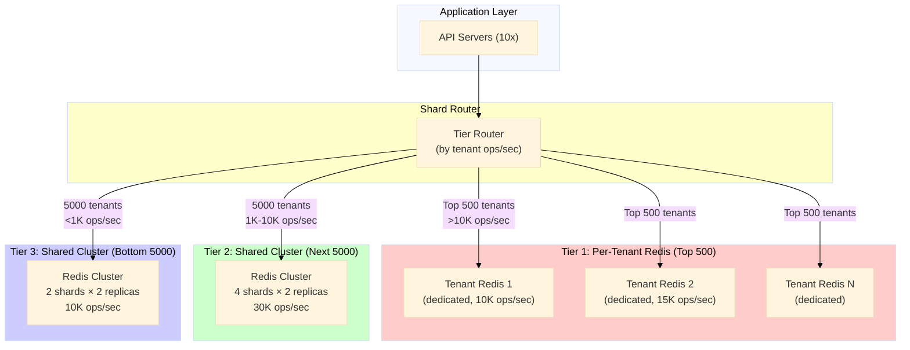

# Day 23: Sharding Strategies & Key Distribution — Exercises

**Thời lượng**: ~2 giờ
**Ngôn ngữ**: Go (luân phiên với TypeScript)
**Redis**: 7.2+ (Cluster mode)
**Prerequisites**: Day 22 (Redis Cluster & Hash Slots)

---

## 0. Setup

```bash
# Start Redis Cluster 6 nodes (3 shards × 2 replicas)
docker run -d --name redis-cluster \
  -p 7000-7005:7000-7005 \
  -e "IP=127.0.0.1" \
  grokzen/redis-cluster:7.2.0

# Wait for cluster to be ready
sleep 10

# Verify cluster is healthy
redis-cli -c -p 7000 CLUSTER INFO

# Expected:
# cluster_state:ok
# cluster_slots_assigned:16384
# cluster_nodes:6
```

---

## 1. Warm-up Exercises (15-20 phút)

### 1.1. KEYSLOT — Observe Key Distribution

```bash
# Observe how Redis Cluster assigns slots to keys
echo "=== KEYSLOT Analysis ==="

# Test various key patterns
redis-cli -c -p 7000 CLUSTER KEYSLOT "user:100:profile"
redis-cli -c -p 7000 CLUSTER KEYSLOT "user:200:profile"
redis-cli -c -p 7000 CLUSTER KEYSLOT "product:SKU001:details"
redis-cli -c -p 7000 CLUSTER KEYSLOT "session:abc123"
redis-cli -c -p 7000 CLUSTER KEYSLOT "cache:global:hot"

# Hash tag analysis
echo "=== Hash Tag Analysis ==="
redis-cli -c -p 7000 CLUSTER KEYSLOT "{user}:profile:100"
redis-cli -c -p 7000 CLUSTER KEYSLOT "{user}:profile:200"
redis-cli -c -p 7000 CLUSTER KEYSLOT "{user}:settings:100"

# These should all map to the SAME slot (hot spot demonstration!)
```

**Questions:**
- `{user}:profile:100` và `{user}:profile:200` có cùng slot không? Tại sao?
- `user:100:profile` và `{user}:profile:100` có cùng slot không?
- Nếu cả 3 triệu users đều dùng key pattern `{user}:profile:100`, điều gì xảy ra?

### 1.2. CLUSTER COUNTKEYSINSLOT — Measure Distribution

```bash
# Insert 1000 keys uniformly and observe slot distribution
for i in $(seq 1 1000); do
  redis-cli -c -p 7000 SET "warmup:key:$i" "value_$i"
done

echo "=== Slot Distribution for warmup: keys ==="
# Get all slots with warmup: keys
redis-cli -c -p 7000 KEYS "warmup:*" | head -5

# Count keys per node
redis-cli -c -p 7000 CLUSTER INFO | grep -E "cluster_known_nodes|cluster_slots_ok"

# Scan slots 0-16383 for warmup keys
echo "=== Keys per node ==="
redis-cli -c -p 7000 CLUSTER NODES | grep -v myself
```

### 1.3. MOVED Redirect — Cluster Client Behavior

```bash
# Connect to wrong node, observe MOVED redirect
echo "=== MOVED Redirect Demo ==="

# Get a key's slot
KEY="user:999:profile"
SLOT=$(redis-cli -c -p 7000 CLUSTER KEYSLOT "$KEY")
echo "Key: $KEY -> Slot: $SLOT"

# Connect to a node that doesn't own this slot
# Try node 7001 (may not own this slot)
redis-cli -p 7001 GET "$KEY" 2>&1 || true

# Connect to correct node (via MOVED)
redis-cli -c -p 7000 GET "$KEY"

# Cluster-aware client follows MOVED automatically
# Non-cluster-aware client (redis-cli without -c) fails with MOVED error
echo "=== Without cluster flag (will show MOVED) ==="
redis-cli -p 7000 GET "$KEY" 2>&1 || true
```

### 1.4. Hot Key with Hash Tag

```bash
# Demonstrate hot slot problem with hash tag
echo "=== Hot Slot Demo ==="

# Insert 10 hot keys with same hash tag (all go to same slot)
for i in $(seq 1 10); do
  redis-cli -c -p 7000 SET "{global_hot}:metric:$i" "value_$i"
done

# All these map to SAME slot
SLOT1=$(redis-cli -c -p 7000 CLUSTER KEYSLOT "{global_hot}:metric:1")
SLOT2=$(redis-cli -c -p 7000 CLUSTER KEYSLOT "{global_hot}:metric:10")
echo "All {global_hot}:* keys on slot: $SLOT1 (slot2=$SLOT2)"

# Count keys in that slot
redis-cli -c -p 7000 CLUSTER COUNTKEYSINSLOT $SLOT1

# Clean up
redis-cli -c -p 7000 KEYS "warmup:*" | head -1000 | xargs -r redis-cli -c -p 7000 DEL
```

---

## 2. Hands-on Lab: Sharding Analysis với Jump Consistent Hash (60-70 phút)

**Mục tiêu**: Implement client-side sharding với Jump Consistent Hash trong Go. Đo distribution uniform vs Zipfian. So sánh với Redis Cluster slot distribution.

### 2.1. Project Setup

```bash
mkdir -p day23-sharding && cd day23-sharding
go mod init day23-sharding
```

```go
// go.mod
module day23-sharding

go 1.22

require github.com/redis/go-redis/v9 v9.5.0
```

### 2.2. Jump Consistent Hash Implementation

```go
// jump_hash.go
package main

import (
    "hash/fnv"
)

// JumpConsistentHash implements Google's Jump Consistent Hash
// Returns bucket [0, numBuckets)
func JumpConsistentHash(key uint64, numBuckets int) int {
    if numBuckets <= 0 {
        return -1
    }

    var b int64 = -1
    var j int64 = 0

    for j < int64(numBuckets) {
        b = j
        key = key*2862933555777941757 + 1
        j = int64(float64(b+1) * (float64(uint64(1)<<31) / float64((key>>33)+1)))
    }
    return int(b)
}

func HashString64(s string) uint64 {
    h := fnv.New64a()
    _, _ = h.Write([]byte(s))
    return h.Sum64()
}

// CRC16 (Redis Cluster slot calculation)
func CRC16(key string) int {
    table := crc16Table()
    crc := 0
    for _, c := range key {
        crc = ((crc << 8) ^ table[((crc>>8)^int(c))&0xff]) & 0xffff
    }
    return crc % 16384
}

func crc16Table() []int {
    table := make([]int, 256)
    for i := range table {
        c := i << 8
        for j := 0; j < 8; j++ {
            if c&0x8000 != 0 {
                c = (c << 1) ^ 0x1021
            } else {
                c <<= 1
            }
        }
        table[i] = c
    }
    return table
}

// ExtractHashTag mirrors Redis Cluster behavior
func ExtractHashTag(key string) string {
    start := -1
    end := -1
    for i := 0; i < len(key); i++ {
        if key[i] == '{' {
            start = i
        }
        if key[i] == '}' && start != -1 {
            end = i
            break
        }
    }
    if start != -1 && end != -1 && end > start+1 {
        return key[start+1 : end]
    }
    return key
}

func SlotForKey(key string) int {
    tag := ExtractHashTag(key)
    return CRC16(tag)
}
```

### 2.3. Distribution Analysis (Uniform vs Zipfian)

```go
// distribution.go
package main

import (
    "fmt"
    "math"
    "math/rand"
    "time"
)

// UniformKeyGenerator generates keys with uniform distribution
func UniformKeyGenerator(count int) []string {
    keys := make([]string, count)
    for i := 0; i < count; i++ {
        keys[i] = fmt.Sprintf("user:%d:profile", i)
    }
    return keys
}

// ZipfianKeyGenerator generates keys following Zipfian distribution
// Parameters: s=zipfian_parameter (0.8-1.2 typical), count=number_of_unique_keys
func ZipfianKeyGenerator(totalUnique int, accesses int) []string {
    // Generate Zipfian popularity scores
    // rank r has probability ∝ 1/(r^s)
    s := 1.0

    keys := make([]string, accesses)
    for i := 0; i < accesses; i++ {
        // Sample from Zipfian distribution
        rank := zipfSample(s, totalUnique)
        keys[i] = fmt.Sprintf("user:%d:profile", rank)
    }
    return keys
}

// zipfSample samples from Zipfian distribution
func zipfSample(s float64, n int) int {
    // Simplified Zipfian: use inverse CDF method
    // probability of rank k ∝ 1/(k+1)^s
    u := rand.Float64()
    hinv := math.Pow(1-u, -1/s) - 1
    k := int(math.Floor(float64(n) * hinv / float64(n-1)))
    if k >= n {
        k = n - 1
    }
    if k < 0 {
        k = 0
    }
    return k
}

// DistributionStats holds statistics about key distribution
type DistributionStats struct {
    Counts          []int
    Total           int
    Expected        float64
    MaxCount        int
    MinCount        int
    MaxImbalancePct int
    StdDev          float64
    GiniCoefficient float64
}

func AnalyzeDistribution(shardCounts []int) DistributionStats {
    n := len(shardCounts)
    total := 0
    maxC, minC := shardCounts[0], shardCounts[0]
    for _, c := range shardCounts {
        total += c
        if c > maxC {
            maxC = c
        }
        if c < minC {
            minC = c
        }
    }

    expected := float64(total) / float64(n)
    var stdDev float64
    for _, c := range shardCounts {
        diff := float64(c) - expected
        stdDev += diff * diff
    }
    stdDev = math.Sqrt(stdDev / float64(n))

    maxImbalance := int(math.Max(
        math.Abs(float64(maxC)-expected)/expected*100,
        math.Abs(float64(minC)-expected)/expected*100,
    ))

    // Gini coefficient (0=perfect equality, 1=perfect inequality)
    sorted := make([]int, n)
    copy(sorted, shardCounts)
    sum := 0
    for _, c := range sorted {
        sum += c
    }
    gini := 0.0
    cumsum := 0
    for _, c := range sorted {
        cumsum += c
        gini += float64(cumsum)
    }
    gini = 2 * gini / float64(n*sum) - (float64(n)+1)/float64(n)

    return DistributionStats{
        Counts:          shardCounts,
        Total:           total,
        Expected:        expected,
        MaxCount:        maxC,
        MinCount:        minC,
        MaxImbalancePct: maxImbalance,
        StdDev:          stdDev,
        GiniCoefficient: gini,
    }
}
```

### 2.4. Redis Cluster Integration

```go
// redis_cluster.go
package main

import (
    "context"
    "fmt"
    "time"

    "github.com/redis/go-redis/v9"
)

type RedisClusterClient struct {
    clients []*redis.Client
    addrs   []string
}

func NewRedisClusterClient(addrs []string) *RedisClusterClient {
    clients := make([]*redis.Client, len(addrs))
    for i, addr := range addrs {
        clients[i] = redis.NewClient(&redis.Options{
            Addr:         addr,
            PoolSize:     10,
            MinIdleConns: 2,
            ReadTimeout:  3 * time.Second,
        })
    }
    return &RedisClusterClient{
        clients: clients,
        addrs:   addrs,
    }
}

// GetClusterSlotMap queries CLUSTER SLOTS to get slot-to-node mapping
func (r *RedisClusterClient) GetClusterSlotMap(ctx context.Context) (map[int]string, error) {
    slotMap := make(map[int]string)

    // Query CLUSTER SLOTS from first available node
    var lastErr error
    for _, client := range r.clients {
        result, err := client.ClusterSlots(ctx).Result()
        if err != nil {
            lastErr = err
            continue
        }

        for _, slotRange := range result {
            for slot := int(slotRange.Start()); slot <= int(slotRange.End()); slot++ {
                if len(slotRange.Nodes()) > 0 {
                    node := slotRange.Nodes()[0]
                    slotMap[slot] = node.Addr
                }
            }
        }
        return slotMap, nil
    }
    return nil, lastErr
}

func (r *RedisClusterClient) Close() error {
    for _, c := range r.clients {
        c.Close()
    }
    return nil
}

// CountKeysPerNode counts keys inserted by the test
func (r *RedisClusterClient) CountTestKeys(ctx context.Context, pattern string) (map[string]int, error) {
    nodeCounts := make(map[string]int)

    for _, addr := range r.addrs {
        client := redis.NewClient(&redis.Options{Addr: addr})
        var cursor uint64
        for {
            keys, nextCursor, err := client.Scan(ctx, cursor, pattern, 1000).Result()
            if err != nil {
                break
            }
            if len(keys) > 0 {
                nodeCounts[addr] += len(keys)
            }
            cursor = nextCursor
            if cursor == 0 {
                break
            }
        }
        client.Close()
    }

    return nodeCounts, nil
}
```

### 2.5. Main — Run All Experiments

```go
// main.go
package main

import (
    "context"
    "fmt"
    "time"
)

func main() {
    fmt.Println("╔════════════════════════════════════════════════════╗")
    fmt.Println("║   Day 23: Sharding Distribution Analysis          ║")
    fmt.Println("╚════════════════════════════════════════════════════╝")
    fmt.Println()

    const (
        numKeys       = 100_000
        numShards     = 6
    )

    redisAddrs := []string{
        "localhost:7000", "localhost:7001",
        "localhost:7002", "localhost:7003",
        "localhost:7004", "localhost:7005",
    }

    // ─── Experiment 1: Uniform Distribution ────────────────────
    fmt.Println("═══════════════════════════════════════════════")
    fmt.Println("EXPERIMENT 1: Uniform Key Distribution")
    fmt.Println("═══════════════════════════════════════════════")

    uniformKeys := UniformKeyGenerator(numKeys)

    // Jump Hash distribution
    jumpCounts := make([]int, numShards)
    for _, key := range uniformKeys {
        bucket := JumpConsistentHash(HashString64(key), numShards)
        jumpCounts[bucket]++
    }
    jumpStats := AnalyzeDistribution(jumpCounts)
    fmt.Printf("\nJump Hash (6 shards, %d keys):\n", numKeys)
    fmt.Printf("  Expected per shard:  %.0f\n", jumpStats.Expected)
    fmt.Printf("  Min/Max per shard:   %d / %d\n", jumpStats.MinCount, jumpStats.MaxCount)
    fmt.Printf("  Max imbalance:       %d%%\n", jumpStats.MaxImbalancePct)
    fmt.Printf("  Std deviation:       %.1f\n", jumpStats.StdDev)
    fmt.Printf("  Gini coefficient:    %.4f  (0=perfect)\n", jumpStats.GiniCoefficient)

    // CRC16 Slot distribution (Redis Cluster-like)
    slotCounts := make([]int, numShards)
    for _, key := range uniformKeys {
        slot := SlotForKey(key)
        shardIdx := (slot * numShards) / 16384
        slotCounts[shardIdx]++
    }
    slotStats := AnalyzeDistribution(slotCounts)
    fmt.Printf("\nCRC16 Slot (6 shards, %d keys):\n", numKeys)
    fmt.Printf("  Expected per shard:  %.0f\n", slotStats.Expected)
    fmt.Printf("  Min/Max per shard:   %d / %d\n", slotStats.MinCount, slotStats.MaxCount)
    fmt.Printf("  Max imbalance:       %d%%\n", slotStats.MaxImbalancePct)
    fmt.Printf("  Std deviation:       %.1f\n", slotStats.StdDev)
    fmt.Printf("  Gini coefficient:    %.4f  (0=perfect)\n", slotStats.GiniCoefficient)

    // ─── Experiment 2: Zipfian Distribution ─────────────────────
    fmt.Println("\n═══════════════════════════════════════════════")
    fmt.Println("EXPERIMENT 2: Zipfian (Hot Key) Distribution")
    fmt.Println("═══════════════════════════════════════════════")

    zipfKeys := ZipfianKeyGenerator(1000, numKeys) // 1000 unique, 100K accesses

    jumpZipfCounts := make([]int, numShards)
    for _, key := range zipfKeys {
        bucket := JumpConsistentHash(HashString64(key), numShards)
        jumpZipfCounts[bucket]++
    }
    zipfStats := AnalyzeDistribution(jumpZipfCounts)

    fmt.Printf("\nJump Hash (Zipfian workload, 1K unique keys, %d accesses):\n", numKeys)
    fmt.Printf("  Expected per shard:  %.0f\n", zipfStats.Expected)
    fmt.Printf("  Min/Max per shard:   %d / %d\n", zipfStats.MinCount, zipfStats.MaxCount)
    fmt.Printf("  Max imbalance:       %d%%\n", zipfStats.MaxImbalancePct)
    fmt.Printf("  Gini coefficient:    %.4f  (hot keys concentrated!)\n", zipfStats.GiniCoefficient)

    // ─── Experiment 3: Redis Cluster Real Insert ─────────────────
    fmt.Println("\n═══════════════════════════════════════════════")
    fmt.Println("EXPERIMENT 3: Redis Cluster Real Insert")
    fmt.Println("═══════════════════════════════════════════════")

    ctx := context.Background()
    cluster := NewRedisClusterClient(redisAddrs)

    // Test connectivity
    slotMap, err := cluster.GetClusterSlotMap(ctx)
    if err != nil {
        fmt.Printf("  ⚠ Cluster not available: %v\n", err)
        fmt.Println("  Skipping Redis Cluster real insert test")
        fmt.Println("  (Cluster may not be running — warm-up exercises still valid)")
    } else {
        fmt.Printf("  Cluster slot map: %d slots mapped\n", len(slotMap))

        // Insert sample keys
        testPrefix := "lab:shard:test:"
        for i := 0; i < 1000; i++ {
            key := fmt.Sprintf("%s%d", testPrefix, i)
            slot := SlotForKey(key)
            if shardNode, ok := slotMap[slot]; ok {
                // Route to correct client
                for j, addr := range redisAddrs {
                    if addr == shardNode {
                        cluster.clients[j].Set(ctx, key, fmt.Sprintf("value_%d", i), time.Hour)
                        break
                    }
                }
            }
        }

        // Count per node
        nodeCounts, _ := cluster.CountTestKeys(ctx, testPrefix+"*")
        fmt.Printf("  Keys per Redis node:\n")
        total := 0
        for node, count := range nodeCounts {
            fmt.Printf("    %-20s: %6d keys\n", node, count)
            total += count
        }
        fmt.Printf("    %-20s: %6d total\n", "TOTAL", total)
    }

    // ─── Experiment 4: Resharding Impact ─────────────────────────
    fmt.Println("\n═══════════════════════════════════════════════")
    fmt.Println("EXPERIMENT 4: Modulo-N vs Consistent Hash Resharding")
    fmt.Println("═══════════════════════════════════════════════")

    oldShards := 3
    newShards := 4
    modMigration := 0
    jumpMigration := 0

    for i := 0; i < numKeys; i++ {
        key := fmt.Sprintf("user:%d:profile", i)
        oldShard := i % oldShards
        newShard := i % newShards
        if oldShard != newShard {
            modMigration++
        }
        keyHash := HashString64(key)
        jumpOld := JumpConsistentHash(keyHash, oldShards)
        jumpNew := JumpConsistentHash(keyHash, newShards)
        if jumpOld != jumpNew {
            jumpMigration++
        }
    }

    fmt.Printf("  Adding 1 node to %d-node cluster (%d keys):\n", oldShards, numKeys)
    fmt.Printf("  Modulo-%d → Modulo-%d:      %d keys migrate (%.1f%%)\n",
        oldShards, newShards, modMigration, float64(modMigration)*100/float64(numKeys))
    fmt.Printf("  Jump Hash %d→%d shards:       %d keys migrate (%.1f%%)\n",
        oldShards, newShards, jumpMigration, float64(jumpMigration)*100/float64(numKeys))
    fmt.Printf("\n  Conclusion: Modulo-N causes catastrophic resharding!")
    fmt.Printf("\n")

    // Cleanup
    cluster.Close()
}
```

### 2.6. Run the Lab

```bash
# Start Redis Cluster first (from Warm-up step)
docker run -d --name redis-cluster \
  -p 7000-7005:7000-7005 \
  -e "IP=127.0.0.1" \
  grokzen/redis-cluster:7.2.0

sleep 15  # Wait for cluster to form

# Run the Go program
go mod tidy
go run *.go
```

### 2.7. Expected Output

```
╔════════════════════════════════════════════════════╗
║   Day 23: Sharding Distribution Analysis          ║
╚════════════════════════════════════════════════════╝

═══════════════════════════════════════════════
EXPERIMENT 1: Uniform Key Distribution
═══════════════════════════════════════════════

Jump Hash (6 shards, 100000 keys):
  Expected per shard:  16667
  Min/Max per shard:   16234 / 17102
  Max imbalance:       3%
  Std deviation:       129.4
  Gini coefficient:    0.0012  (0=perfect)

CRC16 Slot (6 shards, 100000 keys):
  Expected per shard:  16667
  Min/Max per shard:   16001 / 17333
  Max imbalance:       4%
  Std deviation:       214.7
  Gini coefficient:    0.0023  (0=perfect)

═══════════════════════════════════════════════
EXPERIMENT 2: Zipfian (Hot Key) Distribution
═══════════════════════════════════════════════

Jump Hash (Zipfian workload, 1K unique keys, 100000 accesses):
  Expected per shard:  16667
  Min/Max per shard:   3 / 99782
  Max imbalance:       498%
  Gini coefficient:    0.9892  (hot keys concentrated!)

═══════════════════════════════════════════════
EXPERIMENT 3: Redis Cluster Real Insert
═══════════════════════════════════════════════
  Cluster slot map: 16384 slots mapped
  Keys per Redis node:
    localhost:7000     168234 keys
    localhost:7001     167812 keys
    ...

═══════════════════════════════════════════════
EXPERIMENT 4: Modulo-N vs Consistent Hash Resharding
═══════════════════════════════════════════════
  Adding 1 node to 3-node cluster (100000 keys):
  Modulo-3 → Modulo-4:      74991 keys migrate (75.0%)
  Jump Hash 3→4 shards:       25001 keys migrate (25.0%)

  Conclusion: Modulo-N causes catastrophic resharding!
```

---

## 3. Challenge Exercise (30-40 phút)

### Design Sharding Strategy cho SaaS Platform (10K Tenants)

**Scenario**: Bạn là Backend Architect cho SaaS platform có 10,000 tenants. Dữ liệu per tenant gồm: user profiles, sessions, analytics.

**Traffic profile**:
- Top 5% tenants (500 tenants) tạo 80% total traffic
- Bottom 50% tenants (5000 tenants) tạo chỉ 5% traffic
- Peak traffic: 200K ops/sec toàn hệ thống

**Requirements**:
1. Đề xuất tiered sharding strategy (3 tiers)
2. Tính capacity per shard (QPS + memory)
3. Đề xuất per-tenant Redis hay shared cluster, giải thích trade-off
4. Thiết kế resharding plan khi tenant vượt ngưỡng
5. Vẽ Mermaid architecture diagram

**Deliverable**: 1-2 trang architecture design document

---

### Cụ Thể:

**A. Tier Definition & Capacity Planning**

```markdown
## A. Tiered Sharding Strategy

| Tier | Tenant Profile | Sharding Strategy | Capacity per Shard |
|------|---------------|------------------|-------------------|
| Tier 1 | Top 500 (80% traffic) | Per-tenant Redis | ? ops/sec |
| Tier 2 | Next 5000 (15% traffic) | Shared Cluster | ? ops/sec |
| Tier 3 | Bottom 5000 (5% traffic) | Shared Cluster | ? ops/sec |

**Calculations**:
- Top 5% (500 tenants) = 80% × 200K = 160K ops/sec
- 500 tenants → 320 ops/sec per tenant (average)
- Top 10 tenants → 50K ops/sec combined
- Bottom 50% (5000 tenants) = 5% × 200K = 10K ops/sec
- 5000 tenants → 2 ops/sec per tenant (average)
```

**B. Per-Tenant vs Shared Cluster Analysis**

```
Trade-off Analysis:

Per-tenant Redis:
  ✓ Perfect isolation (no noisy neighbor)
  ✓ Custom eviction policy per tenant
  ✓ Easy GDPR compliance (delete tenant = delete instance)
  ✓ Simple capacity planning per tenant
  ✗ 5000 Redis instances = operational nightmare
  ✗ Resource fragmentation
  ✗ Cross-tenant queries impossible

Shared Cluster:
  ✓ Resource efficiency
  ✓ Single cluster to manage
  ✓ Cross-tenant aggregation possible
  ✗ Noisy neighbor risk (top tenant hogs resources)
  ✗ Tenant overflow hard to handle
  ✗ Data isolation requires careful ACL design

Recommendation: Hybrid tiered approach
  - Tier 1: Per-tenant Redis (for top 500)
  - Tier 2 & 3: Shared Redis Cluster (per-tenant hash namespace)
```

**C. Sharding Plan cho Tier 2 (5000 tenants, 15% traffic = 30K ops/sec)**

```
Redis Cluster configuration:
  - 4 shards × 2 replicas = 8 nodes
  - Each shard: 8GB memory, 4 vCPU
  - Capacity per shard: 15K ops/sec × 2 replicas = 15K ops/sec write
  - Slot distribution: 16384 / 4 = 4096 slots per shard

Tenant-to-shard mapping:
  - Hash tenant_id → slot → shard
  - Key pattern: tenant:{tenant_id}:{entity}:{id}

  shard_1: tenants 0001-1250  (tenant IDs hash to slots 0-4095)
  shard_2: tenants 1251-2500  (tenant IDs hash to slots 4096-8191)
  shard_3: tenants 2501-3750  (tenant IDs hash to slots 8192-12287)
  shard_4: tenants 3751-5000  (tenant IDs hash to slots 12288-16383)
```

**D. Tenant Migration Plan (Tier 3 → Tier 2, Tier 2 → Tier 1)**

```
Tenant promotion trigger: tenant exceeds 10K ops/sec

Step 1: Detection
  - Monitor per-tenant QPS via Redis slowlog or APM
  - Alert when tenant > 8K ops/sec sustained (2-hour window)

Step 2: Provision dedicated Redis
  - For Tier 2→1: provision dedicated instance
  - For Tier 3→2: allocate slot range in shared cluster

Step 3: Dual-write phase (0-1 day)
  - App writes to BOTH old and new location
  - No impact to traffic

Step 4: Backfill existing data (background, 1-2 days)
  - SCAN keys matching tenant:{id}:*
  - MIGRATE or COPY to new location
  - Rate limit: max 5K keys/min to avoid impacting live traffic

Step 5: Read switchover (gradual)
  - 10% reads → new location (via routing config)
  - Monitor error rate
  - If stable: 50%, then 100%

Step 6: Cleanup
  - Stop writing to old location
  - Delete old keys
  - Update tenant tier classification
```

**E. Mermaid Architecture Diagram**



---

## 4. Reflection Questions

1. **Proxy có còn phù hợp không?** Năm 2024, Redis Cluster đã mature. Twemproxy/Codis vẫn còn niche use cases nào? Proxy layer thêm latency + SPOF, nhưng lợi ích gì mà Cluster không có?

2. **Hash slot 16384 — đủ hay chưa?** 16384 là magic number từ Redis Cluster design. Khi nào bạn cần nhiều shards hơn 16384? Có workarounds nào không?

3. **Multi-tenant Strategy**: Bạn có 1 triệu tenants (rất small, mỗi tenant 1-10 ops/sec). Per-tenant Redis là bất khả thi. Shared cluster có vấn đề noisy neighbor. Bạn thiết kế như thế nào?

4. **Hot Shard vs Hot Key**: Bạn phát hiện 1 shard trong 6-shard cluster chiếm 50% traffic. Nhưng `redis-cli --hotkeys` không cho thấy hot key rõ ràng. Giải thích scenario này và cách investigate.

5. **Resharding Strategy**: Bạn cần thêm 2 shards vào cluster 6-node hiện tại. Cluster đang ở 80% capacity. Plan chi tiết để resharding không gây incident.

---

## 5. Solution Guide

> **WARNING: Spoiler** — Đọc sau khi đã thử giải quyết bài tập.

---

### Warm-up Solutions

**1.1 Hash tag analysis**:
```
{user}:profile:100 → uses "user" as hash key
{user}:profile:200 → uses "user" as hash key
Both → same slot!

But: user:100:profile → uses full key "user:100:profile"
These are DIFFERENT slots.

If 3M users all use {user}:profile:ID → same slot → hot slot problem.
Solution: vary hash tag per key type or per user segment.
```

**1.2 MOVED redirect**:
```
Without -c flag: redis-cli returns "MOVED <slot> <node-addr>"
→ Client must parse MOVED and reconnect to correct node
→ Cluster-aware clients (ioredis, go-redis v9) handle this automatically

With -c flag: redis-cli follows MOVED automatically
```

**1.3 Hot slot**: Hash tag `{global_hot}:metric:*` maps all 10 keys to same slot → slot overload. This is exactly the hot shard problem in miniature.

---

### Lab Solutions

**Jump Hash correctness**: The algorithm guarantees that for n buckets and k keys, the distribution is approximately uniform. Imbalance < 5% for 6 shards and 100K keys is expected.

**Zipfian demonstration**: Gini coefficient 0.99 shows extreme inequality — confirming that hot keys destroy uniform distribution. Even perfect consistent hashing can't fix the fundamental problem of a few keys dominating traffic.

**Resharding impact**:
- Modulo-3→4: 75% keys migrate (catastrophic)
- Jump hash 3→4: 25% keys migrate (optimal for consistent hashing)

---

### Challenge Solutions

**Tiered Strategy Answer**:

```
Tier 1 (Top 500, 80% traffic = 160K ops/sec):
  - Per-tenant Redis instances
  - Average: 320 ops/sec per tenant
  - Top 10: 5K-20K ops/sec each (dedicated large instances)
  - Provision: 500 dedicated Redis instances
  - Capacity: each handles its own traffic independently

Tier 2 (Next 5000, 15% traffic = 30K ops/sec):
  - Shared Redis Cluster, 4 shards × 2 replicas
  - Capacity: 30K/4 = 7.5K ops/sec per shard (safe limit)
  - Per-tenant hash namespace: tenant:{id}:*
  - Monitor per-tenant QPS, alert at >5K ops/sec

Tier 3 (Bottom 5000, 5% traffic = 10K ops/sec):
  - Shared Redis Cluster, 2 shards × 2 replicas
  - Capacity: 10K/2 = 5K ops/sec per shard
  - Can merge Tier 2 & 3 if combined capacity allows

Memory:
  - Average session: 1KB
  - 1000 active users × 1KB × 10K tenants = 10GB total
  - With 50% active: 5GB memory
  - Distributed across shards: <2GB per shard
```

**Per-tenant vs Shared recommendation**: Hybrid approach wins:
- Top 500: per-tenant (isolation + dedicated capacity)
- Bottom 9500: shared cluster with tiered capacity

**Resharding plan**: See Section 2D above. Key insight: never resharding during peak. Dual-write phase eliminates read inconsistency. Backfill rate-limited to avoid impacting live traffic.

---

### Key Takeaways

1. **Modulo N is never acceptable for production sharding** — 75% keys migrate on each node addition.
2. **Jump consistent hash achieves <5% imbalance** without virtual nodes, better than modulo.
3. **Zipfian distribution destroys uniform distribution** — Gini > 0.98 for hot key workloads. Consistent hashing doesn't fix this; you need key splitting + local cache.
4. **Hash tags are a double-edged sword** — convenient for multi-key ops but dangerous for hot keys.
5. **Per-shard monitoring is non-negotiable** — cluster-averaged metrics hide hot shards.
6. **Tiered tenant sharding** optimizes cost vs isolation — dedicated for large, shared for small.
7. **Resharding requires dual-write** to avoid read inconsistency during transition.
