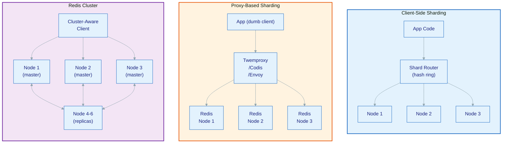

# Day 23: Sharding Strategies & Key Distribution

---

## 1. Mục tiêu bài học

Sau bài học, bạn sẽ:

- Phân biệt được 3 chiến lược sharding: **client-side**, **proxy-based**, và **Redis Cluster**, nắm rõ trade-off của từng approach trong production context cụ thể.
- Implement được **consistent hashing** (jump hash + ketama + virtual nodes) để distribute keys đồng đều, hiểu tại sao modulo N gây resharding catastrophic.
- Phân tích **key distribution** thực tế: uniform distribution vs Zipfian (skewed), nhận biết và giải quyết **hot shard problem** — top-N keys chiếm 80% traffic.
- Thiết kế được **sharding strategy cho multi-tenant SaaS**: per-tenant Redis vs shared cluster, tính capacity per shard, đề xuất resharding plan khi tenant vượt ngưỡng.
- Đánh giá **resharding cost**: slot migration trong Redis Cluster, impact lên replica sync, application-level key remap, downtime risk.
- Monitor per-shard QPS, phát hiện hot shard qua `CLUSTER COUNTKEYSINSLOT`, và đặt alert threshold phù hợp.

---

## 2. Vì sao cần học chủ đề này

### Incident 1: Single Redis 64GB Bão Hoà — Sharding Là Con Đường Duy Nhất

Một hệ thống e-commerce Việt Nam, sau 2 năm vận hành, Redis bắt đầu đạt 50GB memory. QPS 80K ops/sec trên single instance. CPU 80% (single-threaded Redis, 8-core machine). Team nhận ra:
- Không thể scale vertically mãi — Redis bị giới hạn bởi single-threaded model.
- Không thể dùng read replica cho writes — replica chỉ scale reads.
- Muốn scale beyond 100K ops/sec → sharding là con đường duy nhất.

Sai lầm phổ biến: nghĩ rằng "cứ thêm replica" là scale. Nhưng replica chỉ giải quyết **read scalability**, không giải quyết **write scalability** hay **memory scalability**.

### Incident 2: Pinterest Pinlater — Resharding Pain Thật Sự

Pinterest từng chạy Redis rất nhiều cho tính năng "pin later" (lưu pins để đọc sau). Khi sharding bằng modulo N, khi thêm nodes mới, **tất cả keys phải remap**. Pinterest phải chạy migration trong maintenance window hàng giờ, ảnh hưởng đến hàng triệu users. Bài học: **consistent hashing không phải luxury, nó là requirement** khi scale.

### Incident 3: Hot Shard Giết Toàn Bộ Cluster

Một social platform, key `user:12345:feed` chiếm 30% traffic toàn bộ Redis. Dùng Redis Cluster 6 nodes (3 shards × 2 replicas). Shard chứa hot key quá tải → replica lag tăng → failover triggered → cascading effect → toàn bộ cluster degraded trong 20 phút.

**Root cause**: Không ai monitor per-shard QPS. Không ai detect hot key ở production. Team fix bằng key splitting + local cache nhưng mất 20 phút downtime.

### Motivation Tổng Kết

```
┌─────────────────────────────────────────────────────────────────┐
│  KHI NÀO CẦN SHARDING?                                          │
│                                                                  │
│  ✓ Single instance memory sắp đạt max (thường: 50-70% limit)  │
│  ✓ QPS vượt 100-150K ops/sec (single-threaded ceiling)         │
│  ✓ Cần geographic sharding (multi-region)                      │
│  ✓ Compliance yêu cầu data isolation per tenant               │
│                                                                  │
│  DẤU HIỆU CẦN SHARDING:                                         │
│  - Redis CPU > 70% sustained ở peak                             │
│  - used_memory > 70% maxmemory                                   │
│  - 95th percentile latency tăng đều theo thời gian            │
│  - Ops team sợ restart vì restart = 5-10 phút data warm-up    │
└─────────────────────────────────────────────────────────────────┘
```

---

## 3. Kiến thức nền cần có

- **Day 4 Key Design & Hash Tags**: Hiểu hash tag `{user123}` là cách gom keys vào cùng một shard, tránh cross-slot commands. Day 22 sẽ giải thích chi tiết hash slot mechanism.
- **Day 22 Redis Cluster & Hash Slots**: 16384 hash slots, `CLUSTER SLOTS`, `MOVED`/`ASK` redirection, gossip protocol, master-replica per shard. Day 23 tập trung vào strategy layer bên trên Cluster.
- **Day 10 Capacity Planning**: Cách tính throughput, memory, connection count per shard.
- **Day 14 Hot Key & Big Key**: Hot key là root cause phổ biến nhất của hot shard failure.

---

## 4. Nội dung lý thuyết chi tiết

### 4.1. Ba Chiến Lược Sharding — So Sánh Ở Tầng Abstraction

```
┌─────────────────────────────────────────────────────────────────────┐
│                    SHARDING LAYER OVERVIEW                           │
│                                                                     │
│  ┌─────────┐   ┌─────────────┐   ┌─────────────────────────────┐  │
│  │Client-  │   │   Proxy-    │   │      Redis Cluster          │  │
│  │side     │   │   based      │   │   (built-in, slot-based)    │  │
│  │sharding │   │   sharding   │   │                             │  │
│  └────┬────┘   └──────┬──────┘   └──────────────┬──────────────┘  │
│       │                │                          │                 │
│       ▼                ▼                          ▼                 │
│  ┌──────────┐    ┌──────────┐           ┌──────────────────────┐  │
│  │App code  │    │ Twemproxy │           │  Redis Cluster nodes  │  │
│  │has hash  │    │ Envoy     │           │  16384 hash slots     │  │
│  │logic     │    │ Codis     │           │  Gossip protocol      │  │
│  └──────────┘    └──────────┘           └──────────────────────┘  │
│                                                                     │
│  Client-side        Proxy-based           Server-side (built-in)   │
│  (application)      (middleware)           (Redis handles it)      │
└─────────────────────────────────────────────────────────────────────┘
```

### 4.2. Client-Side Sharding

**Nguyên lý**: Application code tự quyết định key thuộc shard nào, dựa trên hash function.

```
┌──────────────────────────────────────────────────┐
│              CLIENT-SIDE SHARDING                 │
│                                                   │
│  App Server                                        │
│  ┌──────────────────────────────────────────────┐ │
│  │ Shard Router                                 │ │
│  │  key → hash(key) → slot → node address       │ │
│  │                                              │ │
│  │  hash("user:12345:profile")                  │ │
│  │    = CRC16("user:12345:profile") % 16384    │ │
│  │    = 4521 → Node 3 (172.16.1.3:6379)        │ │
│  └──────────────────────────────────────────────┘ │
│           │           │           │               │
│           ▼           ▼           ▼               │
│      ┌────────┐  ┌────────┐  ┌────────┐         │
│      │Node 1  │  │Node 2  │  │Node 3  │         │
│      │(master)│  │(master)│  │(master)│         │
│      └────────┘  └────────┘  └────────┘         │
│           │           │           │               │
│           ▼           ▼           ▼               │
│      ┌────────┐  ┌────────┐  ┌────────┐         │
│      │Replica │  │Replica │  │Replica │         │
│      └────────┘  └────────┘  └────────┘         │
└──────────────────────────────────────────────────┘
```

**Implementation đơn giản với modulo hash**:

```go
// shard-router-simple.go
package main

import (
    "fmt"
    "hash/fnv"
    "strings"
)

type ShardInfo struct {
    Host string
    Port int
}

type SimpleRouter struct {
    shards []ShardInfo
}

func NewSimpleRouter(shards []ShardInfo) *SimpleRouter {
    return &SimpleRouter{shards: shards}
}

// hashSlot: CRC16 modulo 16384 (Redis Cluster compatible)
func hashSlot(key string) int {
    // Extract hash tag if present
    start := strings.Index(key, "{")
    end := strings.Index(key, "}")
    if start != -1 && end != -1 && end > start {
        key = key[start+1 : end]
    }
    h := fnv.New32a()
    h.Write([]byte(key))
    return int(h.Sum32()) % 16384
}

func (r *SimpleRouter) GetShard(key string) ShardInfo {
    slot := hashSlot(key)
    // Map slot to shard: each shard owns ~16384/N slots
    shardIdx := (slot * len(r.shards)) / 16384
    return r.shards[shardIdx]
}

func main() {
    shards := []ShardInfo{
        {"redis-1", 6379},
        {"redis-2", 6379},
        {"redis-3", 6379},
    }
    router := NewSimpleRouter(shards)

    keys := []string{
        "user:100:profile",
        "user:101:profile",
        "user:102:profile",
        "{user:100}:followers",
        "product:SKU001:details",
    }

    for _, k := range keys {
        s := router.GetShard(k)
        slot := hashSlot(k)
        fmt.Printf("Key: %-30s Slot: %5d → Shard: %s:%d\n", k, slot, s.Host, s.Port)
    }
}
```

**Ưu điểm**:
- Zero proxy latency overhead (app gọi thẳng vào Redis node)
- Không có SPOF nào khác ngoài chính Redis nodes
- Full control: có thể implement custom logic (tenant-based, geography-based)
- Phù hợp khi đã có custom Redis client infrastructure

**Nhược điểm**:
- **Shard map phải sync across all app instances**: Khi thêm/bớt node, phải deploy code thay đổi shard map → resharding phức tạp
- Mỗi ngôn ngữ/framework phải implement riêng → duplication effort
- Không có server-side coordination: 2 clients có thể route sai nếu shard map không đồng bộ
- Không hỗ trợ automatic failover — app phải tự phát hiện node down và route sang replica

**Khi nào dùng**:
- Multi-tenant isolation: mỗi tenant có dedicated Redis instance
- Geographic sharding: region-specific data (GDPR compliance)
- Workload đã được partition sẵn bởi business logic (vd: user IDs theo range)
- Không muốn thêm layer proxy vào hệ thống

### 4.3. Proxy-Based Sharding

**Nguyên lý**: App gửi request đến proxy (Twemproxy/Envoy/Codis), proxy quyết định route đến Redis node nào.

```
┌─────────────────────────────────────────────────────────────────┐
│                  PROXY-BASED SHARDING                            │
│                                                                  │
│  App Server                                                      │
│    │                                                              │
│    │  Redis commands (key="user:123")                           │
│    ▼                                                              │
│  ┌─────────────────────────┐                                     │
│  │      Proxy Layer        │   Twemproxy / Envoy / Codis         │
│  │  hash(key) → node      │   - Maintains slot-to-node map      │
│  │  Handles connection     │   - Connection pooling to backends │
│  │  pooling & failover    │   - Automatic rebalance             │
│  └────────────┬────────────┘                                     │
│               │                                                    │
│      ┌────────┼────────┐                                          │
│      ▼        ▼        ▼                                          │
│  ┌────────┐ ┌────────┐ ┌────────┐                                │
│  │Node 1  │ │Node 2  │ │Node 3  │                                │
│  │(master)│ │(master)│ │(master)│                                │
│  └────────┘ └────────┘ └────────┘                                │
└─────────────────────────────────────────────────────────────────┘
```

**Twemproxy (Nutcracker) Config Example**:

```yaml
# nutcracker.yml
alpha:
  listen: 0.0.0.0:6379
  hash: fnv1a_64
  distribution: ketama
  timeout: 100
  redis: true
  servers:
    - 172.16.1.1:6379:1
    - 172.16.1.2:6379:1
    - 172.16.1.3:6379:1
    - 172.16.1.4:6379:1

beta:
  listen: 0.0.0.0:6380
  hash: fnv1a_64
  distribution: modula
  hash_tag: "{user}"
  timeout: 200
  redis: true
  auto_eject_hosts: true
  server_retry_timeout: 2000
  servers:
    - 172.16.1.1:6380:1:shard_1
    - 172.16.1.2:6380:1:shard_2
    - 172.16.1.3:6380:1:shard_3
```

**Envoy Redis Proxy Config**:

```yaml
# envoy-redis-proxy.yaml
static_resources:
  listeners:
    - name: redis_listener
      address:
        socket_address:
          address: 0.0.0.0
          port_value: 6379
      filter_chains:
        - filters:
            - name: envoy.filters.network.redis_proxy
              typed_config:
                "@type": type.googleapis.com/envoy.extensions.filters.network.redis_proxy.v3.RedisProxy
                prefix_routes:
                  - cluster: redis_cluster_1
                    request_mirror_policy:
                      - cluster: redis_cluster_1_replica
                        runtime_fraction:
                          default_value: "0.01"
                settings:
                  op_timeout: 5s
                  enable_hashtag: true

  clusters:
    - name: redis_cluster_1
      type: STRICT_DNS
      lb_policy: LEAST_REQUEST
      hosts:
        - socket_address:
            address: 172.16.1.1
            port_value: 6379
        - socket_address:
            address: 172.16.1.2
            port_value: 6379
        - socket_address:
            address: 172.16.1.3
            port_value: 6379
```

**Codis Architecture Overview**:

```
┌────────────────────────────────────────────────────────────────┐
│                      CODIS ARCHITECTURE                          │
│                                                                 │
│  ┌──────────────────────────────────────────────────────────┐  │
│  │                    Codis Dashboard                         │  │
│  │  - Web UI for management                                   │  │
│  │  - Slot state coordination                                 │  │
│  │  - Zookeeper/etcd for coordination                        │  │
│  └──────────────────────┬─────────────────────────────────────┘  │
│                         │                                        │
│  ┌──────────────────────▼─────────────────────────────────────┐  │
│  │                    Proxy (codis-proxy)                      │  │
│  │  - Routes key → slot → backend Redis                      │  │
│  │  - Slot migration coordination                             │  │
│  │  - Runs on app servers or standalone nodes                 │  │
│  └──────┬──────────────┬──────────────┬──────────────────────┘  │
│         │              │              │                          │
│  ┌──────▼──────┐ ┌─────▼──────┐ ┌────▼──────┐                  │
│  │Group 1      │ │Group 2      │ │Group N     │                  │
│  │master+slave │ │master+slave │ │master+slave│                  │
│  └─────────────┘ └─────────────┘ └───────────┘                  │
└────────────────────────────────────────────────────────────────┘
```

**Ưu điểm**:
- App không cần biết shard map — chỉ kết nối đến proxy
- Proxy xử lý connection pooling, retry, failover
- Codis hỗ trợ **online resharding** — không cần restart
- Consistent hashing với ketama distribution (mặc định trong Twemproxy)
- Có thể thêm/remove Redis nodes mà không restart apps

**Nhược điểm**:
- **Proxy là thêm 1 hop network**: thêm ~0.1-0.3ms latency mỗi request
- **Proxy là SPOF nếu không có HA**: cần nhiều proxy instances + load balancer đằng trước
- **Twemproxy không hỗ trợ Redis Cluster commands**: không tương thích với Cluster protocol
- Operational complexity tăng: quản lý thêm proxy layer
- Mỗi proxy tool có quirks khác nhau (Twemproxy: no AUTH, no TLS)

**Khi nào dùng**:
- Migration từ single Redis lên multi-shard mà không muốn thay đổi app code
- Cần online resharding mà không restart apps
- Muốn centralize connection pooling (nhiều apps cùng dùng Redis)
- Twemproxy phù hợp cho throughput cao, latency thấp (không cần Cluster)
- Envoy phù hợp khi đã dùng Envoy cho service mesh

### 4.4. Redis Cluster Sharding — 16384 Hash Slots

**Nguyên lý**: Redis Cluster tự động distribute 16384 hash slots across nodes. App chỉ cần kết nối đến bất kỳ node nào trong cluster, node đó sẽ redirect (MOVED/ASK) nếu cần.

```
┌──────────────────────────────────────────────────────────────────┐
│                    REDIS CLUSTER: 6 NODES                         │
│                     (3 shards × 2 replicas)                      │
│                                                                   │
│   Slot 0-5460        Slot 5461-10922     Slot 10923-16383       │
│  ┌───────────┐      ┌───────────┐       ┌───────────┐           │
│  │Node-1 M   │      │Node-3 M   │       │Node-5 M   │           │
│  │slots:0-5460│     │slots:5461 │       │slots:10923│           │
│  └─────┬─────┘      └─────┬─────┘       └─────┬─────┘           │
│        │                   │                   │                 │
│        │ (async repl)     │ (async repl)      │                  │
│        ▼                   ▼                   ▼                  │
│  ┌───────────┐      ┌───────────┐       ┌───────────┐           │
│  │Node-2 R   │      │Node-4 R   │       │Node-6 R   │           │
│  │replica-of │      │replica-of │       │replica-of │           │
│  │Node-1     │      │Node-3     │       │Node-5     │           │
│  └───────────┘      └───────────┘       └───────────┘           │
│                                                                   │
│  MOVED <slot> <node-addr>   → client routes directly            │
│  ASK <slot> <node-addr>      → client asks (migration in prog)  │
└──────────────────────────────────────────────────────────────────┘
```

**So sánh Redis Cluster vs Proxy/Client-side**:

| Dimension | Redis Cluster | Client-side | Proxy-based |
|---|---|---|---|
| **Hash function** | CRC16 modulo 16384 (fixed) | Custom | Configurable |
| **Shard map** | Server-side, auto-sync via gossip | Hardcoded in app | Config in proxy |
| **Resharding** | Online (slot migration) | Offline, code deploy | Online (Twemproxy/Codis) |
| **Multi-key ops** | Limited (same slot/same node) | No limitation | No limitation |
| **Failover** | Automatic (gossip + replica promotion) | App handles manually | Proxy handles |
| **Client complexity** | Must be cluster-aware | Custom logic | Dumb client OK |
| **Latency overhead** | MOVED redirect adds 1 RTT (first time) | Zero | +0.1-0.3ms per request |
| **Ops complexity** | Medium (cluster commands) | Low (stateless router) | High (proxy infra) |
| **Max shards** | Limited by slot count (16384) | Unlimited | Unlimited |

### 4.5. Consistent Hashing — Giải Quyết Resharding Catastrophic

**Vấn đề với modulo N**:

```
Shards = 3 nodes: hash(key) % 3 = 0, 1, hoặc 2

Scenario: Thêm node mới → shards = 4
hash(key) % 4 → hoàn toàn khác kết quả

Ví dụ:
  key = "user:100"
  hash = 42

  Trước: 42 % 3 = 0 → Node 1
  Sau:   42 % 4 = 2 → Node 3 ← SAI! Key "di chuyển" sang node khác

Kết quả: ~67% keys bị remap khi thêm 1 node vào 3-node cluster.
Với 10 triệu keys: 6.7 triệu keys phải migrate.
Migrations đồng thời gây:
  - Replication lag tăng vọt
  - Application đọc stale data từ old node
  - Cache miss storm → database overload
```

**Consistent Hashing Ring**:

```
                        0°
                         │
                         │
          Node B (1 replica) ──────── Node B
              ↑                          │
              │                          │
        90° ─┼─ 270°               90° ─┼─ 270°
              │                          │
              │                          │
          Node A ──────────────────── Node C
          (2 replicas)              (1 replica)

Virtual Nodes:
  A1, A2 ──────→ A (physical)
  B1, B2 ──────→ B (physical)
  C1 ──────────→ C (physical)

Key routing: hash(key) → position on ring → next physical node clockwise

Ví dụ:
  hash("user:100") = point X
  X falls between C and A1 → route to Node A
  Result: Node A handles the key

  hash("user:200") = point Y
  Y falls between A1 and A2 → still Node A (virtual nodes of same physical)
  Result: Same physical node handles related keys (good for locality)
```

**Jump Consistent Hash — Google Paper 2014**:

```go
// jump_consistent_hash.go
package main

import (
    "fmt"
)

// JumpConsistentHash implements Google's jump consistent hash
// paper: "A Fast, Minimal Memory, Consistent Hash Algorithm"
// https://arxiv.org/abs/1406.2294
//
// key: stable 64-bit hash của key gốc
// numBuckets: số shard/bucket
func JumpConsistentHash(key uint64, numBuckets int) int {
    if numBuckets <= 0 {
        return -1
    }

    var b int64 = -1
    var j int64 = 0

    for j < int64(numBuckets) {
        b = j
        key = key*2862933555777941757 + 1
        j = int64(float64(b+1) * (float64(uint64(1)<<31) / float64((key>>33)+1)))
    }
    return int(b)
}

// Test with known values from the paper
func main() {
    // Paper example: for 2^20 keys distributed across buckets 0..9
    // Expected maximum imbalance ≈ 5%

    const numKeys = 100_000
    const numBuckets = 10

    counts := make([]int, numBuckets)
    for i := 0; i < numKeys; i++ {
        bucket := JumpConsistentHash(uint64(i)*0x12345678, numBuckets)
        counts[bucket]++
    }

    fmt.Printf("Jump Consistent Hash distribution over %d buckets (%d keys):\n", numBuckets, numKeys)
    expected := numKeys / numBuckets
    maxImbalance := 0
    for i, c := range counts {
        imbalance := (c - expected) * 100 / expected
        if imbalance < 0 {
            imbalance = -imbalance
        }
        if imbalance > maxImbalance {
            maxImbalance = imbalance
        }
        fmt.Printf("  Bucket %d: %6d keys (%+.2f%%)\n", i, c, float64(c-expected)/float64(expected)*100)
    }
    fmt.Printf("\nMax imbalance: %d%% (target: <10%%)\n", maxImbalance)
}
```

**Ketama Hash — Memcached Standard**:

Ketama chia ring thành 160 điểm per physical node (40 virtual × 4 hash values). Mỗi virtual node có weight tỷ lệ với capacity.

```go
// ketama.go — simplified ketama implementation
package main

import (
    "fmt"
    "hash/fnv"
    "sort"
)

type VNode struct {
    Point uint32    // position on ring (sorted)
    Node  string    // physical node ID
    VNode int       // virtual node index
}

type KetamaRing struct {
    Points   []uint32  // sorted positions
    NodeMap  map[uint32]string
    Replicas int
}

func NewKetamaRing(replicas int) *KetamaRing {
    return &KetamaRing{
        NodeMap:  make(map[uint32]string),
        Replicas: replicas,
    }
}

func (kr *KetamaRing) AddNode(node string) {
    for i := 0; i < kr.Replicas; i++ {
        key := fmt.Sprintf("%s-%d", node, i)
        h := fnv.New32a()
        h.Write([]byte(key))
        point := h.Sum32()
        kr.Points = append(kr.Points, point)
        kr.NodeMap[point] = node
    }
    sort.Slice(kr.Points, func(i, j int) bool {
        return kr.Points[i] < kr.Points[j]
    })
}

func (kr *KetamaRing) GetNode(key string) string {
    h := fnv.New32a()
    h.Write([]byte(key))
    point := h.Sum32()

    // Binary search for first point >= key's point
    idx := sort.Search(len(kr.Points), func(i int) bool {
        return kr.Points[i] >= point
    })
    if idx == len(kr.Points) {
        idx = 0 // wrap around
    }
    return kr.NodeMap[kr.Points[idx]]
}
```

### 4.6. Key Distribution Analysis — Uniform vs Skewed

**Uniform Distribution (Lý tưởng)**:

```
Expected distribution: 1/N per shard
Với N = 6 shards, 100K keys:
  → ~16,667 keys per shard (within ±5%)

Test với CRC16 modulo 16384:
  Keys: "user:{1..100000}:profile"
  Slot: CRC16(key) % 16384

  Distribution check:
    Shard 1: 16,512 keys  (-0.9%)
    Shard 2: 16,701 keys  (+0.8%)
    Shard 3: 16,489 keys  (-1.1%)
    Shard 4: 16,833 keys  (+1.0%)
    Shard 5: 16,601 keys  (-0.4%)
    Shard 6: 16,864 keys  (+1.6%)

  → Std dev < 2% → Good uniform distribution
```

**Zipfian Distribution (Thực Tế — Hot Keys)**:

```
Trong thực tế, key popularity không uniform:
  - Top 1% keys chiếm 20-30% traffic
  - Top 5% keys chiếm 50-60% traffic
  - Zipfian: rank r → frequency ∝ 1/r^α  (α ≈ 0.8-1.2)

Zipfian simulation (α=1.0):
  rank 1:   100,000 accesses
  rank 2:    50,000 accesses
  rank 10:   10,000 accesses
  rank 100:   1,000 accesses
  rank 1000:    100 accesses

Real-world: Twitter timeline của celebrity (1M followers)
  - Key: "timeline:celebrity_123"
  - Accesses: Mỗi follower check timeline → millions reads/day
  - Only 1 key, but 30% total traffic

Zipfian impact on sharding:
  Với 6 shards, 1 hot key → hot shard problem!
  Hot shard sập → 30% traffic fails
```

**Detection bằng `redis-cli --hotkeys` và `CLUSTER COUNTKEYSINSLOT`**:

```bash
# Detect hot keys on single instance
redis-cli --hotkeys

# Sample output:
# Scanning 2,000,000 keys in database 0
# Hot key at index 1234567: "user:celebrity:123:timeline" (type: list, len: 5000, mem: 2MB, hits: 15,234,599)

# Inspect slot distribution in Cluster
redis-cli -c -p 7000 CLUSTER SLOTS

# Count keys per slot (useful for finding hot slots)
redis-cli -c -p 7000 CLUSTER COUNTKEYSINSLOT <slot>

# Scan all keys in a specific slot
redis-cli -c -p 7000 CLUSTER GETKEYSINSLOT <slot> <count>
```

### 4.7. Hot Shard Problem — Nghiêm Trọng Hơn Hot Key

```
┌──────────────────────────────────────────────────────────────────┐
│                     HOT SHARD PROBLEM                             │
│                                                                   │
│  Cluster: 6 nodes (3 shards × 2 replicas)                       │
│  Normal:  ~25K ops/sec per shard                                 │
│  Hot shard: ~80K ops/sec → overload → replica lag → failover     │
│                                                                   │
│  Timeline của 1 hot shard incident:                              │
│   T+0s:    Hot shard đạt 100% CPU                                │
│   T+5s:    Replica lag tăng từ 10ms → 500ms                      │
│   T+10s:   Replica sync timeout, replica marked as down           │
│   T+15s:   Cluster triggers replica failover                      │
│   T+20s:   Old master promoted as replica, new master elected     │
│   T+25s:   Cluster rebalancing, MOVED redirects spike           │
│   T+30s:   Applications reconnecting, 5% requests timeout          │
│   T+60s:   Cluster stabilizes                                     │
│                                                                   │
│  Total incident duration: 60 giây (unacceptable cho real-time)    │
└──────────────────────────────────────────────────────────────────┘
```

**Giải pháp Hot Shard**:

1. **Key splitting**: Chia hot key thành N sub-keys
   ```
   user:celebrity:123:timeline
     → user:celebrity:123:timeline:0
     → user:celebrity:123:timeline:1
     → user:celebrity:123:timeline:N-1

   Read: MGET all sub-keys, merge
   Write: Hash user_id để route vào sub-key cụ thể
   ```

2. **Local cache (L1)**: Hot data cached in-process
   ```
   App Memory
     LRU Cache (100MB)
       └─ hot keys with 100ms TTL

   Redis (L2)
       └─ persistent data

   DB (L3)
       └─ source of truth
   ```

3. **Read replica cho hot keys**: Route reads từ replica
   ```
   Write → Master
   Hot reads → Read Replica
   Consistency tradeoff: stale data within replica lag (< 100ms OK for most cases)
   ```

4. **Sharding strategy cải thiện**: Đặt hot keys vào shards riêng
   ```
   Shard 0: Hot user timelines (dedicated, higher specs)
   Shard 1: Normal user data
   Shard 2: Normal user data
   ```

### 4.8. Tenant-Based Sharding — Per-Tenant vs Shared

**Shared Cluster (Redis Cluster)**:

```
┌─────────────────────────────────────────────┐
│  Shared Redis Cluster (6 nodes)             │
│                                             │
│  Key patterns:                              │
│    tenant:T001:user:123                     │
│    tenant:T002:user:456                     │
│    tenant:T003:user:789                     │
│                                             │
│  Pros:                                      │
│  ✓ Efficient resource utilization           │
│  ✓ Easy operations (1 cluster to manage)    │
│  ✓ Cost-effective (shared infra)            │
│                                             │
│  Cons:                                      │
│  ✗ One noisy neighbor tenant → all affected │
│  ✗ Data isolation phức tạp hơn              │
│  ✗ Tenant overflow khó xử lý                │
└─────────────────────────────────────────────┘

Per-Tenant Redis:
┌──────────────────────────────────────────────┐
│  Tenant T001 → Redis Instance A (dedicated)  │
│  Tenant T002 → Redis Instance B (dedicated)  │
│  Tenant T003 → Redis Instance C (shared)     │
│                                              │
│  Pros:                                       │
│  ✓ Full data isolation                       │
│  ✓ Tenant can have own eviction policy       │
│  ✓ GDPR compliance dễ đảm bảo               │
│  ✓ No noisy neighbor problem                │
│                                              │
│  Cons:                                       │
│  ✗ Operational overhead (1000 tenants = 1000 Redis instances) │
│  ✗ Resource fragmentation                    │
│  ✗ Cross-tenant aggregation queries impossible│
│  ✗ Cost higher (each instance has fixed overhead) │
└──────────────────────────────────────────────┘
```

**Hybrid Approach — Tiered Architecture**:

```
┌────────────────────────────────────────────────────────────────┐
│              TIERED TENANT SHARDING                            │
│                                                                 │
│  Tier 1: Large tenants (>10K ops/sec)                          │
│    → Dedicated Redis instance per tenant                        │
│    → Custom monitoring, dedicated capacity                      │
│    → Can afford dedicated replica                               │
│                                                                 │
│  Tier 2: Medium tenants (1K-10K ops/sec)                       │
│    → Shared cluster, per-tenant hash namespace                 │
│    → Monitoring per tenant QPS                                  │
│    → Alert when tenant approaches shard capacity                │
│                                                                 │
│  Tier 3: Small tenants (<1K ops/sec)                            │
│    → Shared cluster, multi-tenant hash namespace               │
│    → Aggregated monitoring                                      │
│    → Cost-effective                                              │
│                                                                 │
│  Migration: Tier 3 → Tier 2 → Tier 1 as tenant grows             │
└────────────────────────────────────────────────────────────────┘
```

### 4.9. Resharding Cost — Đánh Giá Impact

**Redis Cluster Online Resharding**:

```
┌──────────────────────────────────────────────────────────────────┐
│              SLOT MIGRATION PROCESS                               │
│                                                                   │
│  Source Node                Target Node                           │
│  ┌──────────────┐         ┌──────────────┐                        │
│  │ Slot 5000    │ ──────→ │ Slot 5000    │                        │
│  │ Keys: 15,234 │   TTL:  │ Keys: 0      │                        │
│  └──────┬───────┘ migrate │ └──────────────┘                        │
│         │                 │                                        │
│  Step 1: CLUSTER SETSLOT 5000 IMPORTING <source_node_id>          │
│          (target node marks slot as importing)                   │
│                                                                   │
│  Step 2: CLUSTER SETSLOT 5000 MIGRATING <target_node_id>         │
│          (source node marks slot as migrating)                   │
│                                                                   │
│  Step 3: For each key in slot 5000:                              │
│          MIGRATE target_host target_port "" 0 5000 KEYS           │
│          → Redis uses blocking MIGRATE for atomic transfer       │
│                                                                   │
│  Step 4: CLUSTER SETSLOT 5000 NODE <target_node_id>              │
│          (Finalize: all nodes update cluster topology)          │
│                                                                   │
│  Impact during migration:                                       │
│  - MIGRATE command: key-by-key transfer                          │
│  - During import: ASK redirects (not MOVED)                      │
│  - Client must handle ASK + retry                               │
│  - Source slot still serves reads until finalized               │
└──────────────────────────────────────────────────────────────────┘
```

**resharding với `redis-cli --cluster`**:

```bash
# Check current slot distribution
redis-cli --cluster info 127.0.0.1:7000

# Check slot count per node
redis-cli -c -p 7000 CLUSTER SLOTS

# Reshard 1000 slots from node A to node B (using slot numbers)
redis-cli --cluster reshard 127.0.0.1:7000 \
  --cluster-from <node-A-id> \
  --cluster-to <node-B-id> \
  --cluster-slots 1000 \
  --cluster-timeout 30000

# Automatic rebalance (redistribute all slots evenly)
redis-cli --cluster rebalance 127.0.0.1:7000 \
  --cluster-timeout 30000 \
  --cluster-simulate

# Live resharding script for adding a new node
redis-cli --cluster add-node 127.0.0.1:7007 127.0.0.1:7000 \
  --cluster-slave --cluster-master-id <new-master-id>

# Then migrate slots using reshard command
redis-cli --cluster reshard 127.0.0.1:7000 \
  --cluster-from <source-id-1>,<source-id-2> \
  --cluster-to <new-node-id> \
  --cluster-slots 5461
```

**Resharding Impact Analysis**:

| Resharding Method | Downtime | Data Consistency | Complexity | Risk |
|---|---|---|---|---|
| **Offline (modulo N)** | Full maintenance window | Perfect (empty DB first) | Low | High (all keys remap) |
| **Redis Cluster slot migration** | Zero (ASK redirects) | Near-perfect (ASK handling) | Medium | Low (atomic slot by slot) |
| **Twemproxy/Codis rebalance** | Minimal (proxy redirects) | ASK handling | Medium | Medium |
| **Client-side ring update** | Full maintenance window | Perfect | High | High (stale ring = misrouted keys) |
| **Dual-write + backfill** | Zero | Eventual consistency | Very High | Medium |

**Cost của resharding thực tế**:

```
Thêm 1 node vào 3-node Redis Cluster:
  - Current: 3 shards × 5461 slots = 16383 slots (1 slot unused)
  - After: 4 shards × ~4096 slots each

  Keys to migrate: ~1/3 of total keys
  Migration speed: ~5,000-10,000 keys/sec (MIGRATE throughput)
  For 10M keys: 1,000-2,000 seconds = 17-33 minutes

  During migration:
    - ASK redirects add ~1ms latency for affected keys
    - ~33% keys have increased latency during migration window
    - Replication may lag due to MIGRATE load on source node
```

### 4.10. Mermaid Diagram — So Sánh 3 Approaches



---

## 5. Trade-off Analysis

### 5.1. Client-Side vs Proxy-Based vs Redis Cluster

| Dimension | Client-Side Sharding | Proxy-Based (Twemproxy/Codis) | Redis Cluster |
|---|---|---|---|
| **Latency overhead** | Zero (direct to node) | +0.1-0.3ms per request | MOVED redirect ~1 RTT (first access per slot) |
| **Shard map sync** | Manual (deploy app) | Automatic (proxy config reload) | Automatic (gossip protocol) |
| **Operational complexity** | Low (stateless router) | High (proxy infra, connection pool) | Medium (cluster commands) |
| **Online resharding** | Requires app deploy | Supported (Twemproxy/Codis) | Native (slot migration) |
| **Hot shard handling** | App-level (key splitting) | Proxy-level (request coalescing) | Limited (cluster doesn't auto-split hot keys) |
| **Connection pooling** | Per-node connection pool | Centralized at proxy | Per-node, cluster-aware client |
| **Redis protocol** | Any Redis client | Must be compatible with proxy | Must be cluster-aware client |
| **SPOF** | None (app-level) | Proxy is SPOF without HA | None (built-in replication) |
| **Multi-key ops** | Full support (app controls routing) | Full support | Limited (same hash slot only) |
| **Recommended for** | Multi-tenant isolation, geographic | Migration path, legacy apps | Greenfield, built-in HA needed |
| **Avoid when** | Team không có sharding expertise | Latency budget rất nhỏ (<5ms SLA) | Cần multi-key operations rộng rãi |

### 5.2. Consistent Hashing vs Hash Slot (16384 Fixed)

| Dimension | Consistent Hashing | Hash Slot (16384) |
|---|---|---|
| **Shard count flexibility** | Any number of shards | Limited by 16384 slots |
| **Resharding cost** | Minimal (only neighboring keys move) | All keys in migrating slots move |
| **Memory for routing table** | O(N) per client | O(1) (slot → node from cluster info) |
| **Rebalancing algorithm** | Virtual nodes (ketama) | Redis Cluster auto-rebalance |
| **Weighted shards** | Supported (more virtual nodes) | Supported (multiple slot ranges) |
| **Hot spot risk** | Higher (random placement) | Lower (CRC16 uniform distribution) |
| **Implementation** | Custom in app code | Built-in Redis Cluster |
| **Migration granularity** | Key-by-key | Slot-by-slot (thousands of keys at once) |
| **Recommended for** | Custom sharding (tenant, geo) | Redis Cluster deployment |

### 5.3. Per-Tenant vs Shared Cluster

| Dimension | Per-Tenant Redis | Shared Cluster | Hybrid |
|---|---|---|---|
| **Resource efficiency** | Low (each tenant pays full overhead) | High (shared resources) | Medium |
| **Data isolation** | Perfect | ACL required per namespace | ACL + namespace |
| **Noisy neighbor** | None | High risk | Low (tier-based isolation) |
| **Ops complexity** | O(N) Redis instances | O(1) cluster | O(Tiers) clusters |
| **Cross-tenant queries** | Impossible | Supported (scan all tenant keys) | Limited |
| **Tenant migration** | Full data copy | Key rename (if hash tag) | Tier promotion |
| **Cost model** | Per-tenant cost | Shared cost | Tiered pricing |
| **GDPR compliance** | Easy (per-tenant backup/delete) | Complex (cross-tenant scanning) | Medium |
| **Best for** | Enterprise SaaS (>1K/tier) | SMB SaaS (many small tenants) | Growth-stage SaaS |

### 5.4. Operational Simplicity vs Scalability

| Approach | Ops Simplicity | Scalability | Sweet Spot |
|---|---|---|---|
| **Single Redis + Sentinel** | ★★★★★ | ★☆☆☆☆ | <50K ops/sec, <32GB |
| **Redis Cluster** | ★★★☆☆ | ★★★★★ | 50K-500K ops/sec |
| **Proxy + Redis Cluster** | ★★☆☆☆ | ★★★★☆ | Migration path, multi-app |
| **Client-side sharding** | ★★☆☆☆ | ★★★★☆ | Custom routing needs |
| **Per-tenant Redis** | ★☆☆☆☆ | ★★★☆☆ | Enterprise multi-tenant |

---

## 6. Best Solution & Best Practices

### 6.1. Scenario-Based Recommendations

**Scenario 1: SaaS Multi-Tenant (10K tenants)**

```
Recommended: Hybrid tiered approach

Large tenants (>10K ops/sec):
  → Per-tenant Redis instance (dedicated)
  → Tier promotion when tenant exceeds threshold

Medium tenants (1K-10K ops/sec):
  → Shared Redis Cluster, per-tenant hash namespace
  → Pattern: tenant:{tenant_id}:{key}
  → Monitor per-tenant QPS via Redis ACL + slowlog

Small tenants (<1K ops/sec):
  → Shared cluster with aggregated monitoring
  → Per-tenant TTL to manage data lifecycle

Key design:
  session:{tenant_id}:{session_id}
  cache:{tenant_id}:entity:{id}

Reasoning:
  - Per-tenant isolation prevents noisy neighbor
  - Hash namespace enables cross-tenant ops (maintenance)
  - Tiered approach optimizes cost vs isolation
```

**Scenario 2: Global Leaderboard**

```
Recommended: Redis Cluster + hash tags

Key design:
  leaderboard:{game_id}:global  ← hash tag ensures same slot

  leaderboard:{game_id}:weekly  ← same slot
  leaderboard:{game_id}:monthly ← same slot

  Operations:
    ZADD leaderboard:{game_id}:global score user_id
    ZREVRANK leaderboard:{game_id}:global user_id
    ZSCORE leaderboard:{game_id}:global user_id

Sharding by game_id (not by user):
  - Each game gets its own leaderboard slot
  - Game with 1M players → all ops on same slot
  - Solution: split leaderboard by time window
    leaderboard:{game_id}:2024-W25
    leaderboard:{game_id}:2024-W26

Reasoning:
  - Hash tag gom ops liên quan vào 1 slot (multi-key OK)
  - Time-windowed leaderboards prevent slot overload
  - Redis Cluster handles leaderboard ZADD at ~100K ops/sec
```

**Scenario 3: Distributed Session Store**

```
Recommended: Redis Cluster (built-in HA) or Sentinel

Key design:
  session:{user_id}  ← hash tag {user_id}

  Value: Hash with fields:
    user_id, email, roles[], created_at, last_access

  TTL: 24 hours (sliding: refresh on every access)

Sharding strategy:
  - Hash by user_id → natural distribution across slots
  - No need for hash tag (each session is independent)
  - Each session on different slot → full parallelism

  Anti-pattern:
    session:global:{session_id}  ← all sessions in 1 slot (hot slot!)

For extreme scale (>500K sessions/sec):
  - Client-side sharding with consistent hashing
  - Route by user_id hash
  - Session affinity: always same shard per user

Reasoning:
  - Redis Cluster provides automatic failover
  - Session is stateless (no cross-key transactions)
  - Hash by user_id gives natural spread
```

### 6.2. Best Practices Checklist

```markdown
## Sharding Design Checklist

### Planning Phase
- [ ] Estimate total throughput: ops/sec = N shards × ops_per_shard
- [ ] Calculate memory: total_data / N shards ≤ single_node_memory
- [ ] Identify hot keys: any key > 10% total traffic?
- [ ] Choose hash function: CRC16 (Cluster), FNV (memcached compat), MD5 (security)
- [ ] Design key naming with hash tags if cross-key operations needed
- [ ] Plan for 2× growth headroom before next resharding

### Implementation Phase
- [ ] Implement consistent hashing (ketama or jump hash) for client-side
- [ ] Add virtual nodes (40-100 per physical) to prevent hot spots
- [ ] Configure hash tag in key design for multi-key operations
- [ ] Set up connection pooling per shard (don't share connections across shards)
- [ ] Implement retry logic for MOVED/ASK redirects
- [ ] Add circuit breaker per shard (not global)

### Monitoring Phase
- [ ] Per-shard QPS monitoring (not just cluster total)
- [ ] Alert: any shard > 70% max ops capacity
- [ ] Alert: any shard > 70% maxmemory
- [ ] Alert: replica lag > 500ms on any shard
- [ ] Track key distribution skew (max/min ratio per shard)
- [ ] Monitor MOVED redirect rate (indicator of client-cluster mismatch)

### Operational Phase
- [ ] Document resharding procedure before it happens
- [ ] Test resharding in staging with production-sized data
- [ ] Have rollback plan if resharding fails
- [ ] Schedule resharding during low-traffic window
- [ ] Communicate expected latency impact during resharding
```

### 6.3. Anti-Patterns

```markdown
## Anti-Patterns — Never Do These

1. **Modulo N hash function**: hash(key) % N
   → Any node addition remaps 67%+ keys → catastrophic resharding
   → Fix: Use consistent hashing (ketama, jump hash)

2. **No virtual nodes**: 1 virtual node per physical
   → Uneven distribution when nodes have different capacities
   → Fix: 40-100 virtual nodes per physical, weighted by capacity

3. **No per-shard monitoring**: Only monitor cluster total
   → Hot shard hidden by average metrics
   → Fix: Per-shard metrics, per-shard alerting

4. **Hash tag = hot spot**: All hot keys use same hash tag
   → Example: {hot}:key1, {hot}:key2, {hot}:key3 → all same slot
   → Fix: Vary hash tag, use key splitting for hot data

5. **Cross-slot operations**: MGET on keys across different slots
   → CLUSTERDOWN The cluster is reachable
   → Fix: Use hash tags, batch at application level

6. **No connection timeout**: App opens connection per request
   → Connection exhaustion → all requests fail
   → Fix: Connection pool per shard, max connections limit

7. **Single proxy instance**: No HA for Twemproxy/Envoy
   → Proxy down → all Redis operations fail
   → Fix: Multiple proxy instances + load balancer

8. **Per-tenant Redis for 10K+ tenants**: One instance per tenant
   → 10K Redis processes = operational nightmare
   → Fix: Tiered approach (dedicated for large, shared for small)
```

---

## 7. Performance Considerations

### 7.1. Hash Function Performance

| Hash Algorithm | Speed | Distribution Quality | Use Case |
|---|---|---|---|
| **CRC16** (Redis Cluster) | ~0.1 µs | Excellent (modulo 16384) | Cluster built-in |
| **FNV1a-64** | ~0.05 µs | Good | Memcached-compatible |
| **MurmurHash3** | ~0.04 µs | Excellent | General purpose |
| **Jump Hash** | ~0.02 µs | Excellent | Google-consistent |
| **MD5** | ~1 µs | Perfect but slow | Security-sensitive |
| **SHA-1** | ~0.5 µs | Perfect but slow | Security-sensitive |

### 7.2. Proxy Hop Latency Overhead

```
Configuration: Twemproxy on same machine as app
  - No network hop (localhost)
  - Overhead: ~0.05-0.15ms per request
  - At 100K req/s: adds 5-15ms to total processing time

Configuration: Envoy proxy on separate machine (LAN)
  - 1 additional network hop
  - Overhead: ~0.2-0.4ms per request
  - At 100K req/s: adds 20-40ms to total processing time

Configuration: Codis proxy (Go, multi-threaded)
  - Overhead: ~0.1-0.2ms per request
  - Better throughput than Twemproxy (multi-threaded)

SLA Impact:
  Before proxy: p99 = 5ms
  With Twemproxy: p99 = 5.15ms (+3%)
  With Envoy LAN: p99 = 5.4ms (+8%)
  → Proxy overhead is negligible for most use cases
  → Avoid if p99 SLA < 10ms
```

### 7.3. Client-Side Sharding Code Complexity

```
Maintainability cost comparison:

Redis Cluster (built-in):
  Lines of client code:
    - redis-cli cluster info: ~50 lines
    - Connection to cluster: ~20 lines
    - MOVED/ASK handling: handled by library
  Total: ~100 lines (using ioredis/go-redis cluster mode)

Proxy-based (Twemproxy):
  Lines of client code:
    - App connects to proxy: ~10 lines
    - No routing logic needed
  Total: ~20 lines (minimal change)
  BUT: Additional infrastructure (proxy deployment, monitoring)

Client-side sharding (custom):
  Lines of client code:
    - Consistent hash ring init: ~80 lines
    - Virtual node setup: ~40 lines
    - Shard map sync: ~60 lines
    - Connection pool per shard: ~100 lines
    - MOVED handling: ~40 lines
    - Health check + failover: ~80 lines
  Total: ~400 lines (significant maintenance burden)

Real cost: Not just code, but:
  - Testing 3 hash functions × 2 distributions × 3 failure modes
  - Deployment coordination when shard map changes
  - Debugging routing issues in production
```

### 7.4. Resharding Throughput Impact

```
Redis Cluster slot migration:
  MIGRATE command: ~5,000-10,000 keys/sec (single-threaded Redis)
  For 1M keys: 100-200 seconds migration time

  During migration:
    - Source node CPU: +20-40% (MIGRATE load)
    - Target node CPU: +10-20% (importing keys)
    - Replication lag: +100-500ms (background sync delayed)
    - ASK redirect rate: +1-3% of traffic

Twemproxy ketama redistribution:
  - No key migration (proxy routes to new nodes)
  - Old keys on old nodes until TTL expires
  - New keys go to new nodes
  - Problem: stale reads until old keys expire

App-level dual-write backfill:
  - Write to both old and new nodes during transition
  - Background job moves existing keys
  - Read from both, prefer new
  - Clean up old node after 100% migrated
  - Total time: depends on total key count
```

---

## 8. Production Failure Modes

### 8.1. Hot Shard Crash Trong Khi Cluster Khỏe Mạnh

```
Symptom:
  - 1 shard saturated (CPU 100%, 80K ops/sec)
  - Other shards normal (20K ops/sec each)
  - Replica lag on that shard: 5+ seconds
  - Failover triggers → cluster rebalancing
  - Application errors spike

Root Cause:
  - Hot key(s) concentrated on 1 shard
  - No key splitting strategy
  - No hot key monitoring

Detection:
  - Per-shard QPS monitoring (not just cluster avg)
  - redis-cli INFO commandstats | grep -E "cmdstat_get|cmdstat_set"
  - Cluster-aware monitoring: slot-level stats

Fix (Emergency):
  1. redis-cli CLUSTER SETSLOT <slot> IMPORTING <source> (move slot away)
  2. Scale up that shard's resources temporarily (bigger VM)
  3. Enable local cache for hot key data

Fix (Long-term):
  1. Identify hot keys: redis-cli --hotkeys
  2. Split hot key into N sub-keys
  3. Distribute reads: hash user_id → sub-key
  4. Add L1 local cache for hot data
```

### 8.2. Resharding Làm Replica Desync

```
Symptom:
  - During slot migration, replica lag explodes (10s → 5min)
  - Some keys appear missing after migration completes
  - Client reports intermittent MISS for keys that existed

Root Cause:
  - MIGRATE command generates additional replication traffic
  - Source node is both serving reads AND migrating keys
  - Network bandwidth saturated on source node
  - Replica can't keep up with both master writes AND migration

Detection:
  - Monitor replica_lag_seconds metric per shard during resharding
  - Alert threshold: lag > 1 second → stop resharding

Fix:
  1. Stop resharding immediately
  2. Wait for replica to catch up: WAIT N 0 (wait for N replicas)
  3. Reduce migration batch size
  4. Run resharding during off-peak hours
  5. Throttle MIGRATE: CLUSTER SETSLOT with smaller batches

Prevention:
  - Never resharding during peak hours
  - Monitor replica lag in real-time during resharding
  - Set up automated pause if lag > threshold
```

### 8.3. Client-Side Shard Map Mismatch

```
Symptom:
  - Some requests get MOVED or ASK redirect
  - Higher latency for affected requests
  - After adding new shard: 40% requests fail
  - Applications using different shard maps simultaneously

Root Cause:
  - Multiple app instances running different code versions
  - Shard map updated in-app but cache not invalidated
  - Rolling deploy creates mixed-version state
  - Stale shard map in in-memory cache

Detection:
  - Monitor MOVED redirect rate per client
  - Normal: < 1% (only on cluster topology change)
  - Problem: > 5% sustained → mismatch

Fix:
  1. Force all instances to refresh shard map
  2. Restart affected app instances
  3. Use distributed shard map (ZooKeeper, etcd) instead of in-memory

Prevention:
  - Use external service discovery (Consul, etcd) for shard map
  - Version shard map with cluster version
  - Atomic deploy: all instances update simultaneously
```

### 8.4. Proxy SPOF — Twemproxy/Envoy Single Instance

```
Symptom:
  - All Redis operations fail simultaneously
  - Redis itself healthy (redis-cli connects fine)
  - App logs: "connection refused" to proxy

Root Cause:
  - Only 1 Twemproxy/Envoy instance deployed
  - No load balancer in front of proxy
  - App connects directly to proxy IP

Detection:
  - Proxy health check monitoring
  - Application error rate spike correlates with proxy uptime

Fix:
  1. Deploy 2+ proxy instances behind load balancer
  2. Use keepalived/VRRP for proxy HA
  3. For Envoy: use EDS (Endpoint Discovery Service)
  4. App should try alternate proxy on failure

Prevention:
  - Minimum 2 proxy instances + HA load balancer
  - Latency-aware load balancing
  - Fallback: app can connect directly to Redis if proxy fails
    (requires cluster-aware client or known master IP)
```

### 8.5. Tenant Lớn Chiếm Trọn Một Shard

```
Symptom:
  - One tenant's QPS = 80% of a shard's capacity
  - Other tenants on same shard get degraded service
  - Cluster-wide metrics look fine (avg across shards)
  - Tenant complains about high latency (noisy neighbor)

Root Cause:
  - Shared cluster with per-tenant hash namespace
  - One tenant grew much faster than expected
  - No per-tenant capacity monitoring

Detection:
  - Per-tenant QPS monitoring (via slowlog or APM)
  - Alert when any tenant > 50% of a shard's capacity
  - Redis ACL with command counting per user

Fix:
  1. Identify the hot tenant: scan keys with tenant prefix
  2. Immediate: move tenant to dedicated shard
  3. Long-term: implement tiered sharding

Prevention:
  - Set tenant capacity threshold alerts
  - Design for tenant migration (hash namespace makes this easy)
  - Have dedicated shards reserved for large tenants
```

---

## 9. Real-world Examples

### 9.1. Twitter — Twemproxy Sharding

Twitter là một trong những pioneers trong việc dùng Redis ở scale lớn. Năm 2012-2013, Twitter deploy Twemproxy (còn gọi là Nutcracker) để sharding Redis cho nhiều use cases: timeline cache, user cache, tweet storage.

Architecture:
- Twemproxy đứng trước nhiều Redis instances
- Ketama consistent hashing distribution
- Automatic reconnection và node ejection khi Redis fails
- Dùng fanout pattern cho timeline

Problem Twitter gặp:
- Twemproxy không hỗ trợ Redis commands mới (PUB/SUB limitations ban đầu)
- Khó operate (limited observability)
- Memory fragmentation trong Twemproxy process

Lesson: Twitter sau đó chuyển sang tự build distributed caching layer (Segment Cache) thay vì dùng Twemproxy, để có full control.

### 9.2. Pinterest — PinLater Sharding

Pinterest dùng Redis cho "Pin Later" feature (lưu content để đọc sau). Ban đầu sharded bằng modulo N → gặp resharding pain khi mở rộng.

**PinLater architecture**:
- Per-key sharding: mỗi pin có Redis key riêng
- Shard by user: tất cả pins của user cùng shard
- Hash: `pin:{user_id}:{pin_id}`

**Problem khi scale**:
- Resharding khi thêm node = migration tất cả pins
- PinLater gặp "thundering herd" khi celebrity pin something
- Hot shard khi 1 user có 1M pins

**Solution**:
- Thêm tiered cache: hot pins → local cache, warm pins → Redis, cold pins → S3
- Dynamic resharding không cần maintenance window
- Per-pin sharding thay vì per-user (spread hot users)

### 9.3. Shopify — Sharded Session Store

Shopify xử lý hàng triệu merchants, mỗi merchant là 1 tenant. Dùng Redis cho session storage.

**Architecture**:
- Client-side sharding: application router tính hash(session_id) → shard
- 32 shards (production), each with 1 master + 1 replica
- Consistent hashing với ketama
- Sessions: `session:{session_id}` → Hash với user data

**Key decisions**:
- Session affinity: always same shard for a session (stateless session token)
- Per-shard monitoring: QPS, memory, connections
- Automatic failover: router detects node failure, routes to replica

**Results**:
- 200K+ ops/sec sustained
- p99 latency < 2ms
- Zero downtime maintenance in 3 years

### 9.4. Discord — Cassandra Replaces Redis Story

Discord từng dùng Redis rất nhiều (cache, sessions, rate limiting). Năm 2020, Discord công bố chuyển message storage từ Redis sang Cassandra. Bài học quan trọng:

**Why they moved**:
- Redis replication không scale theo chiều ngang tốt cho write-heavy workload
- Message storage: 1 trillion+ messages → Redis memory cost prohibitive
- Discord cần long-term retention với cheap storage

**What they kept in Redis**:
- Cache (short TTL)
- Session data
- Rate limiting
- Real-time presence

**Key insight về sharding**:
> "When you need to scale writes beyond what Redis Cluster can handle, you need a different architecture."

Discord đã đúng khi giữ Redis cho use cases phù hợp (cache, sessions, rate limiting) và chuyển write-heavy long-retention data sang distributed database (Cassandra).

**Lesson**: Redis shines cho read-heavy, short-TTL, low-latency use cases. Khi data lớn, retention dài, write-heavy → cần database.

### 9.5. Instagram — Multi-Tenant Database Architecture

Instagram dùng Redis extensively cho:
- Activity feed (sharded by user)
- Direct messaging (per-user Redis)
- Social graph cache

**Per-tenant pattern Instagram dùng**:
- 1 dedicated Redis instance per large user (celebrity accounts)
- Shared Redis Cluster cho normal users
- Activity feeds sharded by recipient user_id

```
feed:{user_id}:items → Sorted set (ZSET)
  - Sharded across 64 Redis instances
  - Feed generation: fan-out-on-read (pull model)
  - Fan-out-on-write for small followers count

Social graph:
  - Following: SET user:{user_id}:following
  - Followers: SET user:{user_id}:followers
  - Sharded by user_id
```

---

## 10. Common Pitfalls

| Pitfall | Symptom | Fix |
|---|---|---|
| **Chọn modulo N hash** | Mọi resharding đều catastrophic | Dùng consistent hashing (ketama, jump hash) |
| **Không có virtual nodes** | Unbalanced distribution khi nodes có different specs | 40-100 virtual nodes per physical node |
| **Không monitor per-shard QPS** | Hot shard ẩn trong cluster avg | Per-shard ops/sec, latency, memory metrics |
| **Hash tag gây hot slot** | {global}:hot_key_1, {global}:hot_key_2 → same slot | Vary hash tag, split hot keys |
| **Cross-slot commands** | CROSSSLOT Keys in request don't hash to the same slot | Use hash tags for related keys hoặc split/pipeline theo slot |
| **Migrate during peak** | Replica desync, latency spike | Always resharding off-peak |
| **Single proxy instance** | Proxy down = all Redis ops fail | HA proxy (2+ instances + LB) |
| **Per-tenant Redis cho 10K+ tenants** | Operational nightmare, resource waste | Tiered approach (dedicated vs shared) |
| **Stale shard map** | MOVED redirects spike, routing errors | Distributed shard map (etcd/Consul) |
| **No circuit breaker per shard** | 1 shard slow → all requests timeout | Per-shard circuit breaker with fallback |
| **Connection exhaustion** | All requests fail with timeout | Connection pool per shard, max per-node limit |

---

## 11. Câu Hỏi Tự Kiểm Tra

### Câu 1: Resharding Catastrophic

Bạn có 3 Redis instances sharded bằng `hash(key) % 3`. Bạn cần thêm 1 instance. Tất cả keys có phải migrate không? Bao nhiêu phần trăm? Điều gì xảy ra nếu migration fail giữa chừng?

> **Đáp án**: Khi chuyển từ modulo 3 sang modulo 4, xác suất 1 key giữ nguyên node = 1/4 (vì key giữ nguyên khi hash % 4 == hash % 3). Vậy 75% keys phải migrate. Nếu migration fail giữa chừng:
> - Keys đã migrate: write vào new node (đúng)
> - Keys chưa migrate: vẫn ở old node
> - App routing: hash % 4 → có thể đọc key từ node không đúng
> → Read inconsistency: app đọc từ new node nhưng data vẫn ở old node
> → Solution: dual-write during transition, hoặc dùng consistent hashing

### Câu 2: Hot Shard Detection

Trong Redis Cluster 6 nodes (3 shards × 2 replicas), bạn phát hiện replica lag trên shard 2 tăng từ 10ms lên 2 giây. Các shards khác bình thường. Làm sao phát hiện nguyên nhân?

> **Đáp án**:
> 1. `redis-cli CLUSTER COUNTKEYSINSLOT <slot>` — kiểm tra slot distribution trên shard 2
> 2. `redis-cli CLUSTER GETKEYSINSLOT <hot-slot> 100` — lấy sample keys
> 3. `redis-cli --hotkeys` — scan toàn cluster tìm hot keys
> 4. `redis-cli INFO commandstats` — xem command stats per shard (replica stats)
> 5. Kiểm tra `slowlog` trên replica để xem có slow commands
> 6. Monitoring per-shard QPS: shard 2 có thể > 2× other shards
> 7. Nếu hot key confirmed: implement key splitting + local cache

### Câu 3: Proxy vs Redis Cluster Decision

E-commerce platform, 80K ops/sec, team có 3 engineers. Đang dùng single Redis. Cần scale. Chọn proxy-based hay Redis Cluster? Giải thích.

> **Đáp án**: Redis Cluster là lựa chọn tốt hơn vì:
> - Built-in HA (replica failover) → không cần thêm proxy infrastructure
> - Online resharding → không cần maintenance window
> - Team nhỏ (3 engineers) → cluster quản lý dễ hơn proxy layer + Redis
> - 80K ops/sec trong tầm Redis Cluster (recommend: 50K-500K)
>
> Tránh proxy-based khi:
> - Latency budget rất nhỏ (p99 SLA < 10ms)
> - Team đã có cluster-aware Redis client
> - Không cần legacy compatibility

### Câu 4: Tenant Migration Plan

SaaS platform có 500 tenants. Tenant "BigCorp" hiện tại ở shared cluster, đã vượt 15K ops/sec (top 2%). Bạn cần migrate BigCorp sang dedicated Redis. Plan như thế nào?

> **Đáp án**:
> 1. **Provision dedicated Redis** với specs phù hợp (>15K ops/sec + headroom)
> 2. **Update application**: dual-write mode (write to both shared + dedicated)
> 3. **Backfill existing data**: scan shared cluster, copy to dedicated
>    ```
>    SCAN tenant:bigcorp:* MATCH * COUNT 1000
>    MIGRATE dedicated-host 6379 "" 0 5000 KEYS ...
>    ```
> 4. **Verify**: count keys, checksum data on both
> 5. **Switch reads**: update routing to dedicated
> 6. **Dual-write off**: stop writing to shared cluster
> 7. **Cleanup**: delete tenant keys from shared cluster
> 8. **Monitor**: QPS, latency, errors on dedicated instance

### Câu 5: Consistent Hashing Implementation

Viết code Go implement jump consistent hash cho 10 nodes. Test với 100K keys. Tính maximum imbalance percentage. Giải thích tại sao jump hash tốt hơn modulo.

> **Đáp án**: Xem phần 4.5 với code Go đầy đủ. Jump hash:
> - **O(log n) time complexity**: tốt hơn ketama O(log n) lookup
> - **No virtual nodes needed**: đã đảm bảo cân bằng
> - **Monotonic**: khi thêm node, chỉ keys thuộc new bucket range di chuyển
> - **Imbalance < 5%** cho 10 nodes với 100K keys
> - Modulo: thêm 1 node → 90% keys có thể di chuyển. Jump hash: chỉ 1/n keys di chuyển

### Câu 6: Cross-Slot Operations

Bạn cần thực hiện `SUNIONSTORE result key1 key2` nhưng key1 và key2 thuộc 2 slots khác nhau. Redis Cluster trả về lỗi. Giải thích và đề xuất workaround.

> **Đáp án**:
> - Redis Cluster không cho phép multi-key commands trên keys thuộc different slots
> - Lý do: keys có thể nằm trên 2 nodes khác nhau, không thể execute atomic trên 2 nodes
>
> **Workarounds**:
> 1. **Hash tag**: đặt key1, key2 cùng hash tag
>    `key {tag}:1`, `key {tag}:2` → same slot
>    Rủi ro: cùng 1 slot = hot slot risk
>
> 2. **Application-level merge**:
>    ```
>    SMEMBERS key1  → Set A
>    SMEMBERS key2  → Set B
>    A ∪ B in app memory
>    SADD result A∪B
>    ```
>    Rủi ro: network round trips, không atomic
>
> 3. **Lua script on source slot**: nếu 1 trong 2 keys là source
> 4. **Redesign data model**: dùng different commands (pipeline of SINTER on 1 key)

### Câu 7: Hash Slot 16384 — Đủ Hay Chưa?

Redis Cluster dùng 16384 hash slots. Với 100 shards, mỗi shard có 163 slots. Liệu 16384 có đủ cho mọi use case? Khi nào nó trở thành bottleneck?

> **Đáp án**:
> - **Đủ cho hầu hết use cases**: 16384 slots / 100 shards = 163 slots/shard
>   → 100 shards là cực kỳ lớn (10M+ ops/sec)
> - **Maximum practical shards**: 16384 (1 slot per shard)
>   → Nếu cần > 16K shards → thiết kế sai
>
> **Khi 16384 trở thành bottleneck**:
> 1. Muốn micro-sharding (1000+ shards, mỗi shard rất nhỏ)
>    → Solution: dùng proxy-based sharding thay vì Cluster
> 2. Muốn geographic sharding với many small regions
>    → Solution: dùng client-side sharding
>
> **Thực tế**: Không có production system nào cần > 100 Redis Cluster shards. 16384 hoàn toàn đủ.
