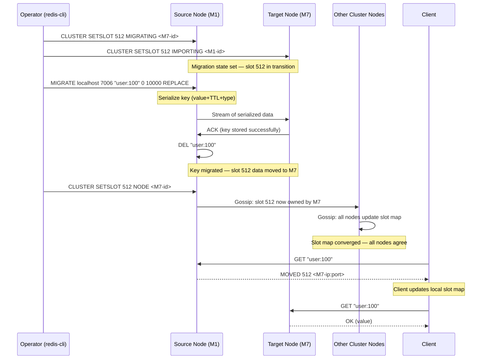

# Day 24: Cluster Operations & Resharding

---

## 1. Mục tiêu bài học

Sau bài học, bạn sẽ:

- Mô tả được resharding workflow toàn bộ: chọn slot → migrate từng key → cập nhật slot map → propagation qua cluster.
- Thực hiện được add node, remove node, rebalance slot bằng `redis-cli --cluster` mà không gây downtime cho production.
- Xử lý được MOVED redirect và ASK redirect trong client code khi cluster đang migrate, tránh MOVED storm.
- Phân tích và phòng tránh được 6 failure mode phổ biến khi vận hành cluster: migration timeout, slot stuck, client cache stale, replica lag, majority loss, coverage outage.
- Viết được cluster operation runbook chuẩn production: pre-check, execute, post-verify.
- So sánh được online resharding vs maintenance window, nhiều shard vs operational cost, và cluster automation vs manual control.

---

## 2. Vì sao cần học chủ đề này

### Incident 1: Twitter Cluster Expansion — MOVED Storm Khiến API Fail

Năm 2010, Twitter mở rộng Redis cluster từ 30 shard lên 60 shard để xử lý tăng trưởng traffic. Quá trình resharding kéo dài 45 phút. Tại sao Twitter API fail trong 10 phút?

Root cause: Client dùng hash ring caching cũ — sau khi resharding xong, client vẫn dùng slot map cũ, gửi request đến node không chứa key. Redis trả `MOVED <slot> <node-ip:port>`. Client không handle MOVED đúng cách (cập nhật slot map rồi retry), mà cứ gửi lại request gốc → **MOVED storm**: mỗi request tạo ra thêm 1 MOVED response → cascade fail.

Bài học: MOVED redirect là normal behavior của cluster, nhưng **client phải handle đúng**: parse MOVED → cập nhật slot map → retry đúng node. Không handle → production outage.

### Incident 2: Shopify Black Friday — Shard Overloaded Vì Không Reshard Đúng Cách

Shopify dùng Redis Cluster cho session store và cart data. Black Friday 2019, 1 shard có p99 latency 500ms trong khi các shard khác chỉ 5ms. Root cause: key distribution không đều — một số hash tag user_id trùng nhau nhiều → 1 slot chứa 10× keys so với slot trung bình. Đã có warning từ monitoring nhưng team không kịp reshard.

Bài học: Cluster cần **capacity monitoring** liên tục, không chỉ khi có incident. `CLUSTER COUNTKEYSINSLOT` là command quan trọng để phát hiện hot slot.

### Incident 3: AWS ElastiCache Resharding — Slot Stuck IMPORTING

Một team dùng AWS ElastiCache Redis Cluster. Thực hiện resharding qua AWS Console. Sau 2 giờ, slot vẫn ở trạng thái IMPORTING — source node vẫn chứa key nhưng target node đã nhận slot ownership. Client gửi request đến target node — key chưa có → cache miss liên tục. AWS support confirm: `CLUSTER SETSLOT <slot> IMPORTING` không được cleanup đúng cách.

Bài học: Dù là managed service, bạn vẫn phải hiểu trạng thái internal của slot migration. Monitoring IMPORTING/MIGRATING state là bắt buộc.

### Bottom Line

Cluster operation không chỉ là "chạy command là xong". Resharding là operation phức tạp nhất trong Redis vì:
- Nhiều node tham gia (source, target, cluster controller)
- Client có thể có stale slot map
- Migration per-key, không phải per-slot nguyên khối
- Nếu một bước fail → slot có thể stuck
- Không hiểu internals → không debug được khi có sự cố

---

## 3. Kiến thức nền cần có

- **Day 22 Redis Cluster & Hash Slots**: 16384 slot, hash tag `{}`, MOVED/ASK redirect, gossip protocol, cluster bus port, cluster-aware client. Bạn phải hiểu slot map là gì và tại sao MOVED xảy ra.
- **Day 23 Sharding Strategies**: consistent hashing, hot shard, key distribution. Bạn phải hiểu hash slot khác gì consistent hashing ring, và tại sao Redis Cluster dùng hash slot.
- **Day 21 Failover & Client Retry**: cluster failover không giống Sentinel failover. Cluster dùng `CLUSTER FAILOVER` command. Bạn phải hiểu replica promotion trong cluster context.

---

## 4. Lý thuyết chi tiết

### 4.1. Resharding Workflow — Từ Đầu Đến Cuối

Resharding = di chuyển N slots từ một hoặc nhiều source node sang một target node. Không downtime vì Redis Cluster dùng **online migration**: client tiếp tục gửi request, key được migrate từng cái.

```
┌──────────────────────────────────────────────────────────────────────────────┐
│                    RESHARDING WORKFLOW (Mermaid)                                │
│                                                                                │
│  Operator ──redis-cli --cluster reshard──▶ Cluster                             │
│         │                                                                       │
│         ▼                                                                       │
│  ┌─────────────────────────────────────────────────────────────────┐           │
│  │  Phase 1: CLUSTER SETSLOT <slot> MIGRATING on SOURCE            │           │
│  │  Phase 2: CLUSTER SETSLOT <slot> IMPORTING on TARGET            │           │
│  │  Phase 3: MIGRATE each key (per key, not per slot)              │           │
│  │  Phase 4: CLUSTER SETSLOT <slot> NODE <target-id> on SOURCE    │           │
│  │  Phase 5: Propagation via gossip to ALL nodes                  │           │
│  └─────────────────────────────────────────────────────────────────┘           │
│         │                                                                       │
│         ▼                                                                       │
│  Cluster converges: all nodes agree on new slot ownership                       │
│         │                                                                       │
│         ▼                                                                       │
│  Client MOVED/ASK redirects: client updates local slot map                     │
└──────────────────────────────────────────────────────────────────────────────┘
```

**Chi tiết từng bước:**

**Step 1: Chọn slots để migrate**
- Operator xác định slot cần migrate: 1024 slots (mặc định redis-cli) hoặc số tùy chỉnh.
- Các slot này thuộc về source node(s). Có thể migrate từ 1 hoặc nhiều source cùng lúc.

**Step 2: Bật MIGRATING trên source node**
```txt
CLUSTER SETSLOT <slot> MIGRATING <target-node-id>
```
- Source node vẫn serve traffic cho slot này.
- Nhưng khi client request một key trong slot đang MIGRATING:
  - Nếu key **tồn tại** trên source: trả về data bình thường.
  - Nếu key **không tồn tại** (đã migrate): trả về `ASK <slot> <target-node-ip:port>`.
- ASK (không phải MOVED) vì đây là redirection tạm thời trong migration, không phải permanent slot map update.

**Step 3: Bật IMPORTING trên target node**
```txt
CLUSTER SETSLOT <slot> IMPORTING <source-node-id>
```
- Target node chưa chứa key, nhưng đã biết nó sẽ nhận slot này.
- Khi nhận request đến key trong slot IMPORTING:
  - Nếu request là `ASKING` flag: cho phép serve (client đã nhận ASK redirect).
  - Nếu không có ASKING flag: trả về `MOVED <slot> <source-node>` (redirect về source).

**Step 4: Migrate từng key (MIGRATE command)**
```txt
MIGRATE <target-ip> <target-port> <key> <db> <timeout> [COPY | REPLACE] [KEYS key [key ...]]
```
- Redis source node serialize key (value + TTL + type) thành byte stream.
- Gửi qua TCP trực tiếp đến target node.
- Target node deserialize và store.
- Sau khi target ACK: mặc định source node xóa key. Nếu dùng `COPY`, source giữ lại key.
- `REPLACE` chỉ có nghĩa là ghi đè key cùng tên ở target nếu đã tồn tại; nó không quyết định source có bị xóa hay không.
- Trong resharding bình thường, `redis-cli --cluster` dùng MIGRATE không `COPY` để move key; `COPY` phù hợp cho backfill/dual-write migration khi muốn verify trước khi xóa source.

**Step 5: Cập nhật slot ownership**
```txt
CLUSTER SETSLOT <slot> NODE <target-node-id>
```
- Chạy trên **bất kỳ master node nào** (thường là cluster controller — node thực hiện reshard).
- Gossip protocol lan truyền slot map update đến tất cả nodes.
- Tất cả nodes update local slot map: slot thuộc target node.

**Step 6: Cleanup**
- Xóa MIGRATING state trên source node.
- Xóa IMPORTING state trên target node.
- redis-cli tự động làm bước này sau khi migrate xong.

```
TIMELINE — Reshard 1 slot (giản lược):

T=0s:    redis-cli: CLUSTER SETSLOT 512 MIGRATING node-2
         redis-cli: CLUSTER SETSLOT 512 IMPORTING node-1
         redis-cli: MIGRATE localhost 6380 "user:100" 0 10000 REPLACE
T=0.5s:  Key serialized on node-1, sent to node-2
         node-2: received, stored, ACK sent
         node-1: received ACK, DELETED key locally
T=1s:    redis-cli: CLUSTER SETSLOT 512 NODE node-2
         Gossip propagates to all cluster nodes
T=1.5s:  All nodes: slot 512 → node-2
         Migration complete
```

### 4.2. ASK vs MOVED — Phân Biệt Quan Trọng

Đây là hai loại redirect trong cluster, **khác nhau hoàn toàn về semantics**:

| Aspect | MOVED | ASK |
|---|---|---|
| **Ý nghĩa** | Slot map thay đổi vĩnh viễn | Migration đang xảy ra, redirection tạm thời |
| **Trigger** | Client gửi request đến sai node (slot map cũ) | Key không tồn tại trên source node đang MIGRATING |
| **Client behavior** | Cập nhật slot map + retry đến correct node | Gửi lại request với ASKING flag đến target node |
| **ASKING flag** | Không cần | Bắt buộc: `ASKING` command trước khi gửi request thực |
| **Sau khi migrate xong** | Tất cả request dùng slot map mới → MOVED không còn | ASK không còn xảy ra |

**Tại sao ASK redirect cần ASKING flag?**

Vì cluster có thể có nhiều slot đang migrate cùng lúc. Target node có thể vừa serve request cho slot đã hoàn tất, vừa serve ASK redirect cho slot đang migrate. ASKING flag cho target node biết: "Đây là request từ tiến trình migrate, hãy serve dù key chưa có local."

```typescript
// Ví dụ: Client handle ASK redirect
async function getWithRedirectHandling(
  slot: number,
  nodeId: string,
  key: string
): Promise<string | null> {
  const node = cluster.getNodeBySlot(slot);

  try {
    const result = await node.client.get(key);
    return result;
  } catch (err: any) {
    // Check error message for MOVED or ASK
    const moved = err.message.match(/MOVED (\d+) (\S+)/);
    const ask = err.message.match(/ASK (\d+) (\S+)/);

    if (moved) {
      // Permanent redirect: update slot map
      const [, newSlot, newNodeAddr] = moved;
      cluster.updateSlotMap(parseInt(newSlot), newNodeAddr);
      // Retry to correct node
      return retryGet(key, parseInt(newSlot));
    }

    if (ask) {
      // Temporary redirect during migration
      const [, askSlot, askNodeAddr] = ask;
      const askNode = cluster.getNodeByAddr(askNodeAddr);
      // MUST send ASKING first
      await askNode.client.asking();
      // Then retry the original command
      return askNode.client.get(key);
    }

    throw err; // Other error
  }
}
```

**MOVED Storm** = khi client nhận MOVED redirect nhưng **không cập nhật slot map**, cứ gửi lại request đến node cũ → mỗi lần gửi lại lại tạo thêm MOVED response → exponential growth → cluster overload.

### 4.3. Adding Nodes — Thêm Node Vào Cluster

Thêm 1 node vào cluster = 2 bước: add-node + reshard.

**Bước 1: Thêm node mới vào cluster**

```bash
# Start new Redis instance (port 7006)
# New node phải được khởi động với cluster-mode enabled
# Thêm node mới vào cluster (chưa có slot)
redis-cli --cluster add-node 127.0.0.1:7006 127.0.0.1:7000 \
  --cluster-slave \
  --cluster-master-id <master-id>
# Hoặc thêm như master mới (không có slot):
redis-cli --cluster add-node 127.0.0.1:7006 127.0.0.1:7000
```

**Bước 2: Reshard slots sang node mới**

```bash
# Reshard 1024 slots (mặc định) từ các master sang node mới
redis-cli --cluster reshard 127.0.0.1:7000 \
  --cluster-to <new-node-id> \
  --cluster-from <source-node-id> \
  --cluster-slots 1024 \
  --cluster-yes
```

```
ASCII Timeline — Add 7th node và reshard:

t=0:00   6-node cluster: [M1][M2][M3][M4][M5][M6] (mỗi node ~1706 slots)
         replicas R1-R6 follow masters

t=0:01   Start Redis 7th instance on port 7006
         Join cluster via gossip: [M1][M2][M3][M4][M5][M6][M7(empty)]

t=0:05   redis-cli --cluster add-node 127.0.0.1:7006 127.0.0.1:7000
         Node 7006 joined as master with 0 slots

t=0:10   redis-cli --cluster reshard 127.0.0.1:7000 \
           --cluster-to <node7-id> \
           --cluster-from <node1-id> \
           --cluster-slots 1024 \
           --cluster-yes

         Migration starts:
         Slot 0-1023: MIGRATING on M1, IMPORTING on M7
         MIGRATE commands running for each key in slots 0-1023
         Client requests: MOVED/ASK redirects flow

t=0:30   M1 slots 0-1023: all keys migrated to M7
         CLUSTER SETSLOT executed on all nodes

t=0:35   Final state:
         [M1: ~604 slots] [M2: ~1706] [M3: ~1706]
         [M4: ~1706]      [M5: ~1706] [M6: ~1706]
         [M7: ~1024 slots — JUST ADDED]

t=0:40   If M7 has replica R7: R7 catches up via replication
         Cluster is balanced (approximately)
```

### 4.4. Removing Nodes — Xóa Node Khỏi Cluster

Xóa node = 3 bước: rebalance trước → đợi replica promotion → del-node.

**Điều kiện tiên quyết:**
- Node không chứa slot → có thể xóa trực tiếp.
- Node có slot → phải rebalance trước (di chuyển slot đi nơi khác).
- Node là master có replica → replica phải được promote hoặc migrate trước khi xóa.

```bash
# Case 1: Node không có slot (replica hoặc master rỗng)
redis-cli --cluster del-node 127.0.0.1:7006 <node-id>

# Case 2: Node có slot — phải rebalance trước
# Di chuyển tất cả slot (hoặc số chỉ định) từ node cần xóa sang node khác
redis-cli --cluster reshard 127.0.0.1:7000 \
  --cluster-from <node-to-remove-id> \
  --cluster-to <target-node-id> \
  --cluster-slots <all-slots-on-source> \
  --cluster-yes

# Sau khi rebalance xong, xóa node
redis-cli --cluster del-node 127.0.0.1:7000 <node-to-remove-id>

# Case 3: Master có replica — replica migration tự động
# Khi master xóa khỏi cluster, replica của nó:
# - Nếu cluster-replica-migration = yes (default): replica tự tìm master mới
# - Nếu = no: replica không có master → offline
redis-cli --cluster del-node 127.0.0.1:7000 <master-id>
```

### 4.5. Replica Migration — Tự Động Hay Thủ Công

Replica migration = khi một master mất replica (vì replica được del-node hoặc replica không thể replicate), replica tự động migrate sang master khác trong cluster.

**Cơ chế tự động:**

```bash
# Trong redis.conf
cluster-replica-validity-factor 10
# Nếu replica không sync được với master trong
# cluster-node-timeout * replica-validity-factor ms
# → replica coi master là failed → tự migrate

cluster-allow-replica-migration yes  # Default: yes
cluster-migration-barrier 1
# Số replica tối thiểu master phải giữ lại sau migration
```

**Khi nào replica migration xảy ra:**

```
Scenario: Master M1 có 1 replica R1. M1 bị del-node khỏi cluster.

Without migration barrier:
  R1: "M1 gone, I have no master"
  R1: "I'll attach to M2 as replica"
  Result: M2 now has 2 replicas, M3 has 0. Unbalanced.

With cluster-migration-barrier = 1:
  R1: "M1 gone, I have no master"
  R1: "M2 has 1 replica (min = 1), can't migrate there"
  R1: "M3 has 0 replicas, I'll migrate to M3"
  Result: Replicas distributed evenly.
```

**Best practice cho replica migration:**
- `cluster-replica-validity-factor`: set = 0 nếu muốn replica **không bao giờ** tự migrate (sticky replica).
- `cluster-replica-validity-factor`: set = 10 (default) cho production có network instability.
- `cluster-migration-barrier`: 1 = mỗi master giữ ít nhất 1 replica sau migration.

### 4.6. Cluster Failover — Manual vs Automatic

Trong Redis Cluster, replica có 3 cách failover:

```txt
# Automatic failover: khi master không phản hồi
# replica tự động promoted sau khi:
#   - Master không respond trong cluster-node-timeout
#   - Replica đã synced với master (repl_offset gần đủ)
# Không cần human intervention

# Manual failover (graceful):
CLUSTER FAILOVER
# Replica được promoted bình thường
# Master graceful shutdown: đợi replica catch up trước khi failover
# Dùng khi muốn maintenance master mà không mất data

# Manual failover FORCE:
CLUSTER FAILOVER FORCE
# Replica promoted ngay, không đợi sync
# Có thể mất data (replica chưa catch up đủ)
# Dùng khi master đã down nhưng chưa có replica nào promote

# Manual failover TAKEOVER:
CLUSTER FAILOVER TAKEOVER
# Emergency: replica promoted mà không cần majority agreement
# Bypass failover authorization/quorum checks
# Nguy hiểm — chỉ dùng khi majority cluster bị partition
# và cần restore service ngay
```

```
Failover Scenario Timeline:

Normal state:
  M1 (master, slots 0-5460) ←→ R1 (replica)
  M2 (master, slots 5461-10922) ←→ R2 (replica)

T=0:      M1 crashes / network partition
T=30s:    cluster-node-timeout = 15s
           Nodes detect M1 unresponsive
           Quorum masters vote: M1 is failed

T=30-35s: R1 promotes automatically
           R1: CLUSTER FAILOVER (automatic, triggered by cluster)
           R1 becomes new master
           M2, M3, other nodes update slot map via gossip

T=35s:    Cluster serves traffic normally
           R1 (now master) serves reads/writes
           R1: "M1 is still down, waiting for M1 to rejoin"

T=60s:    M1 comes back online
           M1: rejoins cluster as replica of R1
           Replication starts automatically
```

### 4.7. Backup & Restore Cluster

Backup cluster ≠ backup single Redis instance. Cluster cần backup per-master vì mỗi master chứa subset of data.

**Backup strategy:**

```bash
# Bước 1: Identify all masters (không phải replicas)
redis-cli -p 7000 CLUSTER NODES | grep master

# Bước 2: BGSAVE trên từng master (không replica)
# Chạy song song trên tất cả masters
redis-cli -p 7000 BGSAVE
redis-cli -p 7001 BGSAVE
redis-cli -p 7002 BGSAVE

# Bước 3: Đợi RDB hoàn tất trên tất cả
redis-cli -p 7000 LASTSAVE
redis-cli -p 7001 LASTSAVE
redis-cli -p 7002 LASTSAVE
# Retry cho đến khi tất cả LASTSAVE > timestamp khi bắt đầu

# Bước 4: Copy RDB files từ mỗi master
# RDB path: config dir (thường /data trong container)
docker cp redis-7000:/data/dump.rdb ./backup/master-7000.rdb
docker cp redis-7001:/data/dump.rdb ./backup/master-7001.rdb
docker cp redis-7002:/data/dump.rdb ./backup/master-7002.rdb

# Bước 5: Tar + compress
tar czf cluster-backup-$(date +%Y%m%d).tar.gz ./backup/
```

**Restore strategy (consistent restore rất quan trọng):**

```
INCORRECT approach (data inconsistency):
  Step 1: Restore M1 from backup
  Step 2: Restore M2 from backup (M1 đã được update sau khi backup M2)
  Result: Inconsistent state

CORRECT approach (quorum-based restore):
  Step 1: Stop cluster
  Step 2: Take note of slot map (CLUSTER NODES)
  Step 3: Restore M1, M2, M3 tất cả cùng thời điểm
           (dùng backup chụp cùng thời điểm, hoặc có backup timestamp gần nhất)
  Step 4: Start cluster với same node IDs (critical!)
  Step 5: Verify: CLUSTER NODES trên tất cả nodes phải match
```

### 4.8. Operational Runbook — Checklist Chuẩn

#### Pre-check (trước khi reshard/add-node/remove-node):

```bash
# 1. Verify cluster health
redis-cli --cluster check 127.0.0.1:7000

# 2. Check all nodes are reachable
for port in 7000 7001 7002 7003 7004 7005; do
  redis-cli -p $port PING
done

# 3. Check no slot đang ở MIGRATING/IMPORTING state
redis-cli -p 7000 CLUSTER NODES | grep MIGRAT
# Expected: empty (nếu không có migration đang chạy)

# 4. Check replication lag
redis-cli -p 7000 INFO replication
# lag should be 0 or very small

# 5. Check memory headroom trên tất cả nodes
redis-cli -p 7000 INFO memory | grep used_memory_human
redis-cli -p 7000 CONFIG GET maxmemory

# 6. Backup trước khi operation (bắt buộc)
# ... backup steps from section 4.7 ...

# 7. Notify stakeholders: operation window started
# 8. Disable automated cluster operations (prevent conflict)
```

#### Execute (trong khi reshard):

```bash
# 1. Chạy reshard với --cluster-yes để auto confirm
# Hoặc giám sát manual nếu muốn kiểm soát từng bước
redis-cli --cluster reshard 127.0.0.1:7000 \
  --cluster-to <target-id> \
  --cluster-from <source-id> \
  --cluster-slots <N> \
  --cluster-yes

# 2. Monitor migration progress (trong terminal khác)
watch -n 5 'redis-cli -p 7000 CLUSTER NODES | grep MIGRAT'

# 3. Monitor client error rate
redis-cli -p 7000 INFO stats | grep -E "MOVED|ASK"

# 4. Monitor latency
redis-cli -p 7000 --latency-history

# 5. Nếu migration chậm (nhiều big keys):
#    - Check MIGRATE timeout: mặc định 10s per key
#    - Tăng timeout: redis-cli --cluster reshard ... với pipeline size thấp hơn
```

#### Post-verify (sau khi operation hoàn tất):

```bash
# 1. Verify cluster is healthy
redis-cli --cluster check 127.0.0.1:7000

# 2. Verify slot distribution (mỗi slot chỉ thuộc 1 node)
redis-cli -p 7000 CLUSTER NODES | grep master
# Kiểm tra: tổng slots = 16384

# 3. Verify no MIGRATING/IMPORTING states
redis-cli -p 7000 CLUSTER NODES | grep -E "MIGRAT|IMPORT"
# Expected: empty

# 4. Verify replication still healthy
for port in 7000 7001 7002; do
  echo "=== Port $port ==="
  redis-cli -p $port INFO replication | grep -E "role|master_link_status|master_repl_offset"
done

# 5. Load test ngắn gọn
redis-cli --cluster info 127.0.0.1:7000

# 6. Monitor latency p99 trong 5 phút sau operation
# 7. Notify stakeholders: operation completed
```

### 4.9. Cross-Slot Command Mitigation

Cross-slot command = command operate trên nhiều keys thuộc về **nhiều slots khác nhau**. Redis Cluster **reject** cross-slot command vì không thể đảm bảo atomicity khi keys nằm trên nhiều nodes.

```txt
# WRONGTYPE error — keys belong to different slots
MGET user:100 user:200 user:300
# Error: CROSSSLOT Keys in request don't hash to the same slot

# Same slot — OK
MGET user:{user_id}:profile user:{user_id}:cart user:{user_id}:session
# Vì tất cả có cùng hash tag {user_id} → cùng slot
```

**Ba cách xử lý cross-slot:**

**Cách 1: Hash tag đúng cách (Recommended)**

```typescript
// Key design: dùng hash tag để tất cả related keys cùng slot
// user:{100}:profile  → slot determined by "100"
// user:{100}:cart     → slot determined by "100"
// user:{100}:session  → slot determined by "100"

const USER_ID = 100;
const keys = [
  `user:{${USER_ID}}:profile`,
  `user:{${USER_ID}}:cart`,
  `user:{${USER_ID}}:session`,
];
// => Cùng slot => MGET works

const result = await cluster.mget(...keys);
```

**Cách 2: Client tự split theo slot/node**

```typescript
// Redis Cluster không execute MGET cross-slot.
// Application group keys theo slot/node rồi gửi GET/MGET song song:
// key1 → slot 100 (node A)
// key2 → slot 200 (node B)
// key3 → slot 100 (node A)
//
// Result: 2 pipelined MGET commands:
// Pipeline 1: MGET key1 key3  → to node A
// Pipeline 2: MGET key2       → to node B
// Client merges results

// Nhưng với transaction: pipeline không đảm bảo atomicity
// WATCH + MULTI/EXEC KHÔNG work cross-slot
```

**Cách 3: Lua script trên single node**

```lua
-- Chỉ work nếu tất cả keys cùng slot
-- Dùng KEYS argument pattern để lấy keys cùng slot
-- Hoặc hardcode keys có cùng hash tag

local profile = redis.call('HGETALL', KEYS[1])
local cart    = redis.call('HGETALL', KEYS[2])
return {profile, cart}
```

### 4.10. Mermaid Diagram — Cluster Resharding Sequence



---

## 5. Trade-off Analysis

### Online Resharding vs Maintenance Window

| Aspect | Online Resharding | Maintenance Window |
|---|---|---|
| **Downtime** | 0 (requests redirected) | Full or partial depending on strategy |
| **Client impact** | MOVED/ASK redirects, potential latency spike | No impact during window |
| **Operation risk** | Migration state stuck, key loss if MIGRATE fail | Clean state, easier to rollback |
| **Duration** | Longer (30-120 min for large migration) | Shorter (planned downtime) |
| **Suitable for** | Critical services, high-traffic apps, 24/7 business | Low-traffic periods, batch processing apps |
| **p99 impact** | Spike during migration (ASK/MOVED overhead) | Predictable upfront |

### More Shards vs Operational Cost

| Aspect | More (smaller) Shards | Fewer (larger) Shards |
|---|---|---|
| **Hot key risk** | Lower (keys spread wider) | Higher (hot slot more impactful) |
| **Memory per shard** | Smaller (easier to fit in RAM) | Larger (OOM risk if unbalanced) |
| **Management overhead** | Higher (more nodes to monitor/backup) | Lower (fewer nodes) |
| **Network hops** | More cross-node operations (if hash tag bad) | Fewer (keys likely co-located) |
| **Resharding frequency** | Higher (more shards = more frequent need) | Lower |
| **Cost** | Higher (more VM/instances) | Lower |
| **Recommended for** | >100K ops/sec, uneven key distribution | <50K ops/sec, uniform key distribution |

### Multi-key Support (Hash Tag) vs Distribution Quality

| Aspect | Hash Tag Enabled | Hash Tag Disabled |
|---|---|---|
| **Multi-key operations** | MGET, MSET, TX work cross-keys | Each key independent slot |
| **Distribution quality** | Risk: hot tag = hot slot | Risk: uneven hash → hot slot |
| **Application complexity** | Must manage hash tag carefully | Simpler key design |
| **Atomicity** | Transaction possible within slot | No cross-slot transaction |
| **Best for** | User profile with related keys | Independent cache entries |

### Cluster Automation (redis-cli) vs Manual Control (CLUSTER SETSLOT)

| Aspect | redis-cli --cluster | Manual CLUSTER SETSLOT |
|---|---|---|
| **Ease of use** | High (single command) | Low (must understand states) |
| **Safety** | Higher (built-in checks) | Lower (easy to make mistake) |
| **Flexibility** | Limited to preset workflows | Full control of each phase |
| **Rollback** | Automatic cleanup on failure | Manual rollback required |
| **Suitable for** | Standard operations | Emergency recovery, custom migration |
| **Debugging** | Harder to see internal state | Full visibility into each step |

---

## 6. Best Solution & Best Practices

### Scenario 1: Scale-up Cho Black Friday

**Context**: E-commerce Redis Cluster 6 nodes (12M keys, 50K ops/sec). Dự báo Black Friday tăng 5× traffic.

**Recommendation**:
1. **Pre-scale 2 tuần trước Black Friday**: add 2 nodes, reshard 1/3 slots. Không đợi đến ngày đó.
2. **During**: monitor slot distribution bằng `CLUSTER COUNTKEYSINSLOT` trên mỗi slot. Alert nếu slot > 20K keys.
3. **Hash tag review**: kiểm tra `user_id` distribution. Nếu có user có >10K keys → split bằng sub-key pattern.
4. **Read replica**: thêm read replica cho mỗi master để absorb read traffic spike.
5. **Do NOT resharding trong Black Friday**: operation window đã đóng.

**Anti-pattern**: Resharding trong peak traffic. Migration tạo ra ASK/MOVED overhead + key serialization overhead → latency spike.

### Scenario 2: Decommission Node

**Context**: Một node sắp hỏng (hardware issue). Cần migrate slots và xóa node.

**Recommendation**:
```bash
# 1. Pre-check: verify node health
redis-cli -p 7005 CLUSTER NODES | grep <node-id>
redis-cli -p 7005 PING

# 2. Check slot count trên node cần xóa
redis-cli -p 7000 CLUSTER NODES | grep <node-id-to-remove>
# Count slots owned by this node

# 3. Add replacement node (if not adding new node, redistribute slots)
# 4. Reshard tất cả slots từ node cần xóa
redis-cli --cluster reshard 127.0.0.1:7000 \
  --cluster-from <node-to-remove-id> \
  --cluster-to <target-node-id> \
  --cluster-slots <all-slots> \
  --cluster-yes

# 5. Verify rebalance complete (no MIGRATING states)
redis-cli --cluster check 127.0.0.1:7000

# 6. Verify replication re-established
redis-cli -p <target-port> INFO replication

# 7. Del node
redis-cli --cluster del-node 127.0.0.1:7000 <node-to-remove-id>

# 8. Decommission hardware
```

### Scenario 3: Cross-region Migration

**Context**: Migrate Redis Cluster từ us-east-1 sang us-west-2 (zero-downtime).

**Recommendation**:
1. Setup new cluster ở us-west-2 (empty).
2. Configure application với dual-write: write đến cả 2 clusters.
3. Chạy data migration script: migrate keys từ old cluster sang new cluster (batch, không dùng MIGRATE command vì cross-region network).
4. Switch traffic: point application về new cluster.
5. Monitor, validate data consistency.
6. Shutdown old cluster.

**Why not use MIGRATE cross-region**: MIGRATE yêu cầu TCP connection trực tiếp giữa source và target node. Cross-region MIGRATE có latency cao, bandwidth không đáng tin cậy, và không có cluster bus protocol support.

---

## 7. Performance Considerations

### Migration Throughput — Bị Giới Hạn Bởi Đâu

```
Migration throughput = min(
  Serialization speed (source node, single-threaded),
  Network bandwidth (source → target),
  Deserialization + write speed (target node, single-threaded)
)

Typical bottleneck: TARGET NODE single-threaded write
  - Target node: receive serialized data → parse → write → respond ACK
  - Redis single-threaded: trong khi migrate 1 key, không handle other commands
  - Result: latency spike trên target node during heavy migration

Numbers:
  - Key size 100B: ~5K-10K keys/sec migration throughput
  - Key size 1KB: ~1K-3K keys/sec migration throughput
  - Key size 100KB (big key): ~10-50 keys/sec — CAN BE A PROBLEM

redis-cli --cluster reshard có thể điều chỉnh:
  --cluster-pipeline <count>: batch N keys per MIGRATE call (default: auto)
  Tăng pipeline = faster migration nhưng tăng command queue, network buffer và load trên source/target
```

### Key Migration p99 Spike

```
Without migration:
  GET p99: ~1-3ms

During migration (heavy):
  GET p99: spike lên 50-200ms (target node busy with MIGRATE)
  MOVED/ASK redirect latency: +1-5ms per redirect
  Client retry latency: +1 RTT

Why p99 spikes more than p50:
  - p50: most requests không bị redirect (slot map accurate)
  - p99: requests đi đến node đang busy migrate → queue behind MIGRATE operations
  - Hot keys đang migrate: more likely to hit p99 spike

Mitigation:
  - Thực hiện migration khi traffic thấp
  - Dùng --cluster-pipeline 10 (batch) thay vì per-key
  - Monitor target node command stats: redis-cli -p <target> INFO commandstats
```

### ASK Redirect Impact

```
ASK redirect thêm:
  1. Network hop: client → source → redirect → target
  2. Source node: overhead xử lý ASK redirect response
  3. Client: ASKING command + retry

Worst case: key đang migrate, client không handle ASK
  - Request → source (key đã migrate, not found) → MOVED response
  - Client: không update slot map → request lại → MOVED again
  - Result: infinite MOVED loop → request timeout

Mitigation:
  - Luôn dùng cluster-aware client (ioredis, go-redis cluster mode)
  - Test MOVED/ASK handling trong CI/CD
```

### MOVED Storm

```
MOVED storm = exponential growth của MOVED responses khi:
  1. Many clients có stale slot map (sau reshard)
  2. Clients gửi request → wrong nodes → MOVED response
  3. Client KHÔNG update slot map → retry same wrong node → MOVED again
  4. Cascade: mỗi MOVED response tạo thêm traffic

Detection:
  redis-cli -p <port> INFO stats | grep -E "movED|ask"
  # Nếu MOVED/ASK count tăng nhanh trong short time → MOVED storm

Prevention:
  - Cluster-aware client: auto-update slot map on MOVED
  - Staggered client restart: restart clients in batches, không all at once
  - Pre-notify: inform clients about upcoming resharding
```

---

## 8. Production Failure Modes

### 8.1. Migration Timeout — Key Loss Possible

```
Symptom: Key không tồn tại trên cả source và target sau migration
Cause:
  - MIGRATE timeout quá ngắn (default 10s)
  - Key lớn (big key): serialize + transfer > timeout
  - Target node overloaded: cannot accept data in time
  - Source node crash mid-migration: key đã gửi nhưng chưa ACK

Detection:
  - redis-cli --cluster reshard: command fails với error
  - Check: key exists on source? Key exists on target?
  - redis-cli GET key trên source: returns nil
  - redis-cli GET key trên target: returns nil
  - RESULT: DATA LOSS

Fix:
  - Dùng MIGRATE với timeout dài hơn: MIGRATE ... 30000 (30s)
  - Dùng `COPY` trong backfill/dual-write migration nếu muốn giữ key trên source đến khi verify xong; với resharding slot chuẩn, cần cleanup source sau khi confirm để tránh duplicate stale data
  - Chunk big keys: split Hash/String > 10MB thành sub-keys trước migrate
  - Pre-migration: identify big keys: redis-cli --bigkeys trên source

Prevention:
  - luôn có backup trước reshard
  - monitor migration progress: check keys count before/after per slot
  - don't resharding during peak traffic (target node overloaded)
```

### 8.2. Slot Stuck IMPORTING/MIGRATING

```
Symptom: redis-cli --cluster check báo slot đang IMPORTING hoặc MIGRATING
         Cluster không converge — nodes disagree on slot ownership
Cause:
  - redis-cli --cluster reshard interrupted (Ctrl+C, network issue)
  - CLUSTER SETSLOT không executed trên tất cả nodes
  - Bug trong Redis (hiếm nhưng có thể xảy ra ở edge cases)

Detection:
  redis-cli -p 7000 CLUSTER NODES | grep MIGRAT
  # Tìm lines có MIGRATING hoặc IMPORTING flags

Fix:
  # Method 1: Complete the migration manually
  # Identify which node should own the slot
  redis-cli -p 7000 CLUSTER SETSLOT <slot> NODE <correct-node-id>
  # Chạy trên bất kỳ node nào trong cluster
  # Gossip sẽ propagate

  # Method 2: Abort stuck migration
  # Xóa MIGRATING state trên source
  redis-cli -p <source-port> CLUSTER SETSLOT <slot> NODE <source-node-id>
  # Xóa IMPORTING state trên target
  redis-cli -p <target-port> CLUSTER SETSLOT <slot> NODE <source-node-id>
  # Sau đó re-add target node vào cluster nếu cần

Prevention:
  - Không interrupt redis-cli --cluster reshard
  - Dùng --cluster-yes để tránh interactive prompt gây delay
  - Monitor migration progress continuously
```

### 8.3. Client Cache Slot Map Cũ — MOVED Storm

```
Symptom: Error rate tăng đột ngột sau reshard. MOVED responses spike.
Cause:
  - Clients cache slot map, không subscribe gossip protocol
  - Sau reshard: slot đã di chuyển, client vẫn gửi đến node cũ
  - MOVED redirect → client gửi lại → MOVED again → infinite loop
  - MOVED storm: exponential growth of redirect traffic

Detection:
  redis-cli -p <port> INFO errorstats | grep -E "MOVED|ASK"
  # Normal: vài MOVED/ASK per minute (during migration only)
  # Storm: hàng nghìn MOVED/ASK per second

Fix:
  # Option 1: Restart all clients (update slot map)
  # Downside: brief outage, connection storm

  # Option 2: Force cluster topology refresh (ioredis)
  client.cluster('CLUSTER SLOTS')  // Force refresh slot map

  # Option 3: Ensure cluster-aware clients subscribe to cluster bus
  // ioredis: tự động subscribe gossip, slot map auto-update
  // go-redis cluster: dùng NewCluster() với RouteByLatency()

Prevention:
  - Luôn dùng cluster-aware client library
  - Test MOVED/ASK handling trong staging trước reshard production
  - Staggered client restart: không restart all at once
```

### 8.4. Replica Không Catch Kịp Lúc Rebalance

```
Symptom: Sau khi migrate slots, replica không sync kịp → reads return stale data
Cause:
  - Rebalance di chuyển slots rất nhanh (migrate all keys trong minutes)
  - Replica sync theo replication protocol bình thường
  - Replication lag tăng vì replica phải sync nhiều keys mới
  - Read-from-replica: stale data cho đến khi replica catch up

Detection:
  redis-cli -p <replica-port> INFO replication | grep master_repl_offset
  # So sánh với master: lag > threshold → WARNING

Fix:
  # Đợi replica catch up trước khi promote
  redis-cli -p <replica-port> INFO replication
  # Check: master_link_status = up, lag = 0

  # Nếu lag lớn: throttle migration speed
  # redis-cli --cluster reshard: dùng smaller batch

Prevention:
  - Tăng cluster-node-timeout during heavy migration (30s → 60s)
    → Cho replica nhiều thời gian detect master fail và resync
  - Không promote replica trong 5 phút sau reshard (đợi sync xong)
  - Monitor replication lag continuously during migration
```

### 8.5. Majority Master Loss Trong Lúc Migrate

```
Symptom: Cluster không serve writes. cluster-require-full-coverage = yes
         Một số slots không có master (slots unreachable)
Cause:
  - Migration đang chuyển slot từ M1 sang M2
  - M1 và M2 đều down (power loss, network partition) TRONG migration
  - Trạng thái: M1 MIGRATING slot X, M2 IMPORTING slot X, không ai serve slot X
  - cluster-require-full-coverage = yes: writes to slot X bị REJECTED

Detection:
  redis-cli -p 7000 CLUSTER NODES
  # 2 nodes down, their slots = ?

Fix:
  # Emergency: force cluster takeover
  # Promote replica of failed master
  redis-cli -p <replica> CLUSTER FAILOVER TAKEOVER

  # Recovery: restore failed node from backup
  # Hoặc reassign slots bằng tay
  redis-cli -p <alive-master> CLUSTER SETSLOT <slot> NODE <alive-node-id>

Prevention:
  - cluster-require-full-coverage = no (accept degraded mode)
    → Writes still served, slots with no master return error for those slots only
  - Never resharding more than 1 node at a time (reduce exposure window)
  - Migration scheduling: không resharding cùng lúc với hạ tầng/network maintenance hoặc window rủi ro cao
```

### 8.6. cluster-require-full-coverage gây Outage Cục Bộ

```
Symptom: Một vài slots không serve được, writes bị CLUSTERDOWN
Cause:
  - cluster-require-full-coverage = yes (default)
  - Một số master down nhưng cluster vẫn "healthy" về quorum
  - Slots của master down: NOT served → writes REJECTED với CLUSTERDOWN
  - Application: write error → exception → potential cascade fail

Detection:
  redis-cli GET any_key_on_failed_master_slot
  # Error: CLUSTERDOWN The cluster is down
  redis-cli -p 7000 CLUSTER INFO | grep cluster_require_full_coverage

Fix:
  # Method 1: Set to no (allow degraded mode)
  CONFIG SET cluster-require-full-coverage no
  # Writes to healthy slots still work
  # Writes to failed master slots: still fail (no master to serve)

  # Method 2: Restore failed node ASAP
  # Restore from backup + rejoin cluster

  # Method 3: Manual slot reassignment (dangerous)
  # Force slots của failed master sang alive master
  redis-cli -p <alive-master> CLUSTER SETSLOT <slot> NODE <alive-node-id>

Prevention:
  - Set cluster-require-full-coverage = no cho most use cases
  - Monitor cluster state: alert khi any node down > 30s
  - Design application: handle CLUSTERDOWN gracefully
```

---

## 9. Real-world Examples

### Twitter Timeline Cluster Expansion (2012-2013)

Twitter Redis cluster ban đầu dùng **single-threaded Redis** (trước Redis Cluster ra đời). Họ tự implement client-side sharding: 50 Redis instances, consistent hashing ring.

Khi cần mở rộng, Twitter phải:
1. Add 50 instances mới vào ring.
2. Chạy migration script: đọc từng key từ old instance → write vào new instance.
3. **Zero-downtime**: nhưng migration script phải check hash ring để quyết định key thuộc instance nào.

**Bài học cho Redis Cluster**: Redis Cluster native resharding (`redis-cli --cluster reshard`) thay thế workflow phức tạp này. NhưngMOVED storm vẫn là vấn đề nếu client không handle đúng.

**Số liệu thực tế**:
- Twitter Redis cluster: 200+ instances
- Migration batch size: 10K keys/batch
- Migration duration: 2-4 giờ cho full resharding
- MOVED storm frequency: 1-2 lần/năm (khi engineer forget to flush client cache)

### Shopify Black Friday Capacity Scaling (2019)

Shopify dùng Redis Cluster cho shopping cart và session. Black Friday traffic tăng 10×.

**Operation thực tế**:
- Tháng 10 (trước Black Friday 1 tháng): thêm 2 shards (4 nodes + 4 replicas).
- Reshard ~1500 slots sang mỗi shard mới.
- Migration duration: 45 phút cho mỗi shard.
- **p99 latency during migration**: spike từ 5ms lên 45ms (vẫn acceptable).
- Không có outage vì tất cả clients dùng ioredis với MOVED handling.

**Số liệu**:
- Keys per shard before: 12M keys / 6 shards = 2M keys/shard
- Keys per shard after: 12M keys / 8 shards = 1.5M keys/shard
- Latency p99: 5ms → 45ms during migration → 3ms after (improved vì less contention)

### AWS ElastiCache Redis Cluster — Resharding API

AWS ElastiCache cung cấp managed Redis Cluster với API resharding:

```bash
# AWS CLI: initiate online resharding
aws elasticache modify-replication-group-shard-configuration \
  --replication-group-id my-cluster \
  --node-group-ids 0001 \
  --apply-immediately \
  --resharding-configuration \
    PreferredAvailabilityZones=us-east-1a,us-east-1b \
    --num-node-groups 8

# AWS tự động:
# 1. Add new shards
# 2. Migrate keys (background, customer-visible)
# 3. Remove old shard
# Customer experience: ~30-60 min migration, some latency spike
```

**ElastiCache limitation**: không expose IMPORTING/MIGRATING states cho customer. Monitoring chỉ qua AWS CloudWatch metrics:
- `EngineCPUUtilization`: spike during migration
- `DatabaseMemoryUsagePercentage`: memory redistribution
- `ReplicationLag`: replica sync during migration

**Lesson**: Managed service che giấu internals nhưng vẫn có performance impact. Không được quên cluster operation basics vì incident vẫn xảy ra.

### GitLab Redis Cluster

GitLab dùng Redis Cluster cho:
- Application cache (Redis Cluster 3 shards)
- ActionText blob cache (Redis Cluster 3 shards)
- Rate limiting counters

**GitLab's cluster operation challenges**:
1. **GitLab omnibus** bundling Redis không hỗ trợ cluster mode dễ dàng → phải setup manual.
2. **Zero-downtime deployment**: GitLab dùng藍**deploy process** để ensure no downtime khi resharding.
3. **Hash tag enforcement**: GitLab key design dùng hash tag `{}` để group related keys vào cùng slot (ví dụ: `rate_limit:{api}:{}`).

**GitLab's recommendation for cluster operations**:
- Dùng `redis-cli --cluster check` sau bất kỳ cluster operation nào.
- Backup before resharding: GitLab tự động trigger backup trước khi cluster resize.
- Test MOVED redirect handling trong CI pipeline.

---

## 10. Common Pitfalls

| Pitfall | Symptom | Fix |
|---|---|---|
| Reshard mà không tăng `cluster-node-timeout` | Replica coi master down during migration, trigger unwanted failover | Set `cluster-node-timeout = 30` (default 15) during heavy migration |
| Không monitor IMPORTING/MIGRATING states | Slot stuck forever, cluster không converge | Periodic check: `redis-cli CLUSTER NODES \| grep MIGRAT` |
| Dùng KEYS trên cluster khi đang migrate | KEYS scans entire node (blocking), không redirect được, có thể miss migrated keys | Dùng `CLUSTER GETKEYSINSLOT <slot> <count>` hoặc scan từ application |
| FLUSHALL trên cluster mode | FLUSHALL chỉ flush local node, không flush toàn cluster; keys đã migrate không bị flush | Dùng SCAN + DEL per-node, hoặc FLUSHALL trên từng node cần thiết |
| Reshard trong peak traffic mà không estimate migration duration | p99 spike cao, SLA breach | Schedule resharding cho off-peak hours; estimate: ~1 min per 10K keys |
| Không backup trước reshard | Data loss nếu migration fail giữa chừng | BGSAVE on all masters before operation |
| Add replica to node đang migrate | Replica sync lag cao, promotion bị delay | Đợi migration complete trước khi add/remove replica |
| Del-node mà không rebalance trước | Node có slot → del-node fail với error | Luôn verify: `redis-cli CLUSTER NODES \| grep <id> \| grep myself` + check slot count |
| Dùng `CLUSTER FAILOVER TAKEOVER` trong normal operation | Emergency takeover bỏ qua quorum, có thể tạo split-brain | Chỉ dùng khi majority cluster bị partition và cần restore ngay |
| Hash tag collision | 2 users có cùng hash tag → same slot → hot slot | Validate hash tag distribution trước khi deploy |

---

## 11. Câu Hỏi Tự Kiểm Tra

### Câu 1: MOVED vs ASK Redirect

Một client gửi `GET user:100` đến node M1 (port 7000). Redis trả `MOVED 12500 127.0.0.1:7006`. Sau đó client gửi `GET user:100` đến M7 (port 7006). Redis trả `ASK 12500 127.0.0.1:7006`.

Giải thích tại sao response đầu tiên là MOVED và response thứ hai là ASK. Client phải handle khác nhau như thế nào?

> **Đáp án**:
> - MOVED: slot map đã thay đổi vĩnh viễn. Slot 12500 hiện thuộc M7. Client cập nhật local slot map và retry vào M7.
> - ASK: migration đang xảy ra. Key chưa có trên M7 (đang migrate). Client phải gửi `ASKING` command trước rồi mới gửi `GET` (trong cùng pipeline hoặc transaction). ASK không cập nhật slot map.
> - Nếu client gửi `GET` thứ hai đến M7 mà không ASKING: M7 trả `MOVED 12500 M1` (redirect về source), vì không có ASKING flag → M7 không serve request cho key chưa local.

### Câu 2: Slot Stuck IMPORTING

Sau khi chạy `redis-cli --cluster reshard`, bạn kiểm tra `redis-cli CLUSTER NODES` và thấy slot 512 vẫn ở trạng thái IMPORTING trên target node sau 1 giờ. Cluster operation đã kết thúc (redis-cli exit). Giải thích nguyên nhân và cách fix.

> **Đáp án**:
> Nguyên nhân: redis-cli bị interrupt hoặc fail giữa chừng. `CLUSTER SETSLOT <slot> NODE <target-id>` không được execute trên source node. Source node vẫn nghĩ nó sở hữu slot 512. Target node đang IMPORTING nhưng không bao giờ nhận được ownership.
>
> Fix:
> ```txt
> # Trên bất kỳ node nào:
> CLUSTER SETSLOT 512 NODE <target-node-id>
> # Gossip sẽ propagate trạng thái mới
>
> # Verify:
> CLUSTER NODES | grep 512
> # Tất cả nodes phải show: slot 512 → target-node-id
> ```
>
> Prevention: luôn monitor IMPORTING/MIGRATING states sau reshard.

### Câu 3: Data Loss During Migration

Một big key (Hash 500MB) đang migrate. Source node crash 5 giây sau khi gửi serialized data nhưng chưa nhận ACK. Key có bị mất không? Làm thế nào để prevent?

> **Đáp án**:
> - `REPLACE` không quyết định việc xóa source; nó chỉ cho phép ghi đè key ở target. Mặc định `MIGRATE` move key: target nhận thành công thì source xóa key; `COPY` mới giữ key ở source.
> - Nếu source crash trước khi nhận ACK, key thường vẫn còn ở source. Nếu target đã nhận nhưng source chưa xóa, có thể xuất hiện duplicate tạm thời khi source quay lại với data cũ. Redis Cluster sẽ dựa vào slot ownership cuối cùng, nhưng duplicate stale data vẫn là rủi ro vận hành cần cleanup.
>
> Prevention:
> - Chunk big key: chia Hash 500MB thành 50 Hash 10MB trước migration.
> - Dùng `COPY` cho backfill an toàn rồi verify + cleanup source theo runbook, không nhầm `REPLACE` là chế độ giữ key.
> - Tăng MIGRATE timeout: `MIGRATE host port key 0 60000` (60s).
> - Backup trước reshard.

### Câu 4: MOVED Storm

Sau khi reshard hoàn tất, 30% requests bị error với message "MOVED ...". Không có requests nào thành công. Giải thích nguyên nhân root cause và cách fix nhanh nhất.

> **Đáp án**:
> Root cause: Clients có stale slot map. Sau reshard, clients vẫn gửi request đến old nodes. Redis trả MOVED. Nhưng **clients không update slot map** → gửi lại → MOVED again → MOVED storm.
>
> Fix nhanh nhất:
> ```typescript
> // Ioredis: force cluster refresh
> await cluster.cluster('CLUSTER SLOTS');
> // Hoặc restart clients (đợi 30 giây để gossip propagate)
>
> // Go-redis: dùng NewCluster() với proper configuration
> // Hoặc gọi:
> client.Close()
> client = NewCluster(...) // với slot map fresh
> ```
>
> Prevention: test MOVED handling trong CI, stagger client restart, notify clients trước reshard.

### Câu 5: cluster-require-full-coverage

Một master node down. Writes đến keys trong slots của master đó bị rejected với error "CLUSTERDOWN The cluster is down". Giải thích `cluster-require-full-coverage` và cách configure để tránh outage khi 1 node down.

> **Đáp án**:
> `cluster-require-full-coverage yes` (default): cluster yêu cầu **tất cả** 16384 slots phải có master online. Nếu 1 master down → cluster coi là "unhealthy" → writes bị rejected trên toàn cluster.
>
> Fix:
> ```bash
> # Trên bất kỳ node nào (runtime):
> CONFIG SET cluster-require-full-coverage no
>
> # Trong redis.conf (persistent):
> cluster-require-full-coverage no
> ```
>
> Trade-off:
> - `no`: writes đến healthy slots vẫn work. Writes đến slots không có master → error (nhưng không affect slots khác).
> - `yes`: writes toàn bộ cluster fail khi any master down → safer nhưng less available.
>
> Recommendation: Production thường set `no` vì availability quan trọng hơn perfect coverage.

### Câu 6: Replica Migration Auto

Một master M1 có 2 replicas (R1, R2). Bạn xóa M1 khỏi cluster. R1 và R2 sẽ đi đâu? Điều gì quyết định behavior này?

> **Đáp án**:
> Behavior phụ thuộc vào `cluster-allow-replica-migration` và `cluster-migration-barrier`:
>
> - `cluster-allow-replica-migration = yes` (default): R1 và R2 tự động migrate sang masters khác.
> - `cluster-migration-barrier = 1`: mỗi master giữ lại ít nhất 1 replica. R1 migrate sang M2, R2 migrate sang M3 (hoặc ngược lại).
>
> Nếu không có barrier: cả R1 và R2 có thể migrate sang cùng 1 master → M2 có 3 replicas, M3 có 0.
>
> Nếu `cluster-allow-replica-migration = no`: R1 và R2 không có master → trở thành master với 0 slots (hoặc offline tùy config).
>
> Prevention: luôn set `cluster-migration-barrier` và monitor replica distribution.

### Câu 7: Cross-Slot MGET

Application cần fetch `user:100:profile`, `user:200:profile`, `user:300:profile` (3 users, 3 slots khác nhau). Mỗi user có hash tag `{user_id}` khác nhau. Làm thế nào để fetch tất cả trong 1 round trip?

> **Đáp án**:
> Cách 1 (portable): application-level scatter-gather — group keys theo slot/node, gửi GET hoặc MGET same-slot song song đến các nodes, merge results theo thứ tự ban đầu.
> ```typescript
> const keys = ['user:100:profile', 'user:200:profile', 'user:300:profile'];
> // Pseudocode:
> // 1. CLUSTER KEYSLOT từng key, map slot -> node từ CLUSTER SLOTS
> // 2. Pipeline GET/MGET same-slot groups song song
> // 3. Merge values theo thứ tự keys ban đầu
> ```
>
> Cách 2: nếu các keys thực sự cần atomic multi-key operation, redesign key dùng hash tag để cùng slot. Với profile fetch read-only, scatter-gather là approach đúng.
>
> Cách 3 (hash tag): design keys để cùng slot nếu cần atomic cross-key operation. Nhưng với profile fetch (read-only), scatter-gather là approach đúng.
>
> Anti-pattern: gửi 3 lần `GET` tuần tự → 3 RTT.
