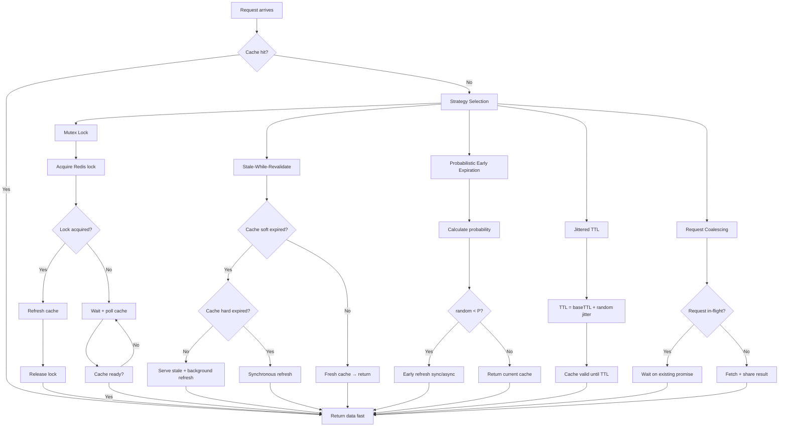

# Day 26: Cache Stampede & Thundering Herd

---

## 1. Mục tiêu bài học

Sau bài học, bạn sẽ:

- Định nghĩa được **cache stampede**, **thundering herd** và **dogpile effect** — phân biệt rõ 3 khái niệm dù hay bị nhầm lẫn.
- Implement được 4 strategy phòng chống stampede: **mutex lock**, **stale-while-revalidate**, **probabilistic early expiration**, **jittered TTL**.
- Phân tích và so sánh được 4 cặp trade-off: mutex vs stale-while-revalidate, early refresh vs extra load, TTL jitter vs predictability, local coalescing vs distributed lock.
- Triển khai được production-ready solution bằng TypeScript hoặc Go với benchmark đo p95/p99 latency.
- Nhận diện và phòng tránh được 5 production failure mode đặc trưng của stampede: hot key + TTL expiry cascade, lock contention, thundering herd burst, stale-while-revalidate race, probabilistic algorithm miss.

---

## 2. Vì sao cần học chủ đề này

### Scenario production giả lập 1: Repository Metadata API — Cache Stampede Giết Redis Trong 2 Phút

Một repository metadata API dùng Redis làm cache. TTL = 300 giây. Vào lúc 14:00, một repository viral đột nhiên nhận 50K requests/phút (thay vì baseline 2K). 300 giây trước đó (13:55), cache entry hết hạn.

Kết quả: 50K concurrent requests → tất cả cache miss → 50K requests đánh vào PostgreSQL cùng lúc → PostgreSQL CPU 100% → Redis CPU spike → API latency tăng từ 5ms lên 8 giây → circuit breaker open → 45 phút degraded service.

Root cause: **Cache stampede**. TTL = 300s cho tất cả entries → tất cả hết hạn cùng lúc → thundering herd. Giải pháp GitHub sau đó: thêm jitter ±10% trên TTL.

### Scenario production giả lập 2: Social Feed — "Super Bowl" Cache Invalidation

Một social feed platform dùng cache layers cho news feed. TTL = 300 giây. Khi một celebrity đăng bài, hàng triệu người refresh cùng lúc. Cache hết hạn → hàng triệu requests đánh vào backend cùng lúc → **thundering herd** trên MySQL.

Giải pháp phù hợp: probabilistic early expiration + request coalescing. Trước khi TTL thực sự hết, một phần nhỏ requests chủ động refresh cache → backend load smoothed.

### Scenario production giả lập 3: Q&A Hot Tags — Dogpile Effect Trên Hot Tags

Một Q&A platform dùng Redis cache cho trending tags. TTL = 60 giây. Khi một sự kiện nóng, tag liên quan nhận 20K requests/phút. Cache refresh mất 500ms (gọi downstream API). Trong 500ms đó, tất cả concurrent requests đều miss cache → gọi API song song → rate limit hit → dogpile effect.

Bài học: Ngay cả khi backend có thể xử lý 1 request, nó không thể xử lý 20K requests đồng thời. Cần request coalescing.

### Bottom Line

Cache stampede không phải edge case — nó xảy ra bất cứ khi nào:
- TTL đồng nhất cho nhiều keys (expiry avalanche)
- Hot key có TTL ngắn (hot key + TTL = stampede chủ động)
- Backend refresh chậm (response time > 100ms = window rộng cho stampede)
- Không có protection mechanism

---

## 3. Kiến thức nền cần có

- **Day 4 Key Design & TTL Strategy**: TTL là cơ chế expiration cơ bản. Bạn phải hiểu cách Redis xử lý TTL (lazy expiration vs active expiration).
- **Day 8 Memory Eviction**: eviction policy như `volatile-lru` có thể trigger stampede nếu không hiểu cách nó hoạt động.
- **Day 12 Connection Pooling & Client Retry**: stampede thường đi kèm connection storm. Bạn phải phân biệt stampede (cache miss cascade) vs connection storm (retry exponential backoff fail).
- **Day 14 Hot Key**: hot key là trigger phổ biến nhất của cache stampede. Hot key + TTL expiry = stampede chủ động.

---

## 4. Nội dung lý thuyết từ cơ bản đến chi tiết

### 4.1. Định nghĩa Chính Xác

```
┌─────────────────────────────────────────────────────────────────────┐
│                      CACHE STAMPEDE — DEFINITIONS                      │
│                                                                       │
│  Cache Stampede (hay Cache Miss Storm):                              │
│    Nhiều requests cùng miss cache → cùng gọi backend                 │
│    → backend overload → latency spike hoặc crash                      │
│    Trigger: TTL expiry hoặc eviction đồng loạt                       │
│                                                                       │
│  Thundering Herd (mở rộng hơn stampede):                               │
│    Nhiều processes/threads cùng phát hiện resource unavailable        │
│    → cùng retry đồng thời → cascade failure                          │
│    Trigger: bất kỳ shared resource nào bị unavailable               │
│    Redis context: cache miss, node down, lock unavailable             │
│                                                                       │
│  Dogpile Effect (cache stampede đặc thù):                              │
│    Cache entry vừa expired → "vaccum" effect                          │
│    → tất cả requests đổ vào trong same short window                  │
│    → tạo ra load spike ngay tại thời điểm expiry                      │
│    Trigger: TTL expiry đơn lẻ trên hot key                           │
└─────────────────────────────────────────────────────────────────────┘
```

**Phân biệt quan trọng:**
- **Cache stampede**: tập trung vào cache miss cascade → backend overload
- **Thundering herd**: khái niệm rộng hơn, bao gồm cả lock contention, retry storm, connection exhaustion
- **Dogpile effect**: subset của stampede, xảy ra ngay tại thời điểm TTL expiry

### 4.2. Cơ Chế Hoạt Động — Từng Bước

**Cache Stampede Timeline không có protection:**

```
T=0:     Cache HIT → p50=1ms, p99=2ms (baseline)
T=300s:  TTL EXPIRES ←── all 50K concurrent requests hit this moment
T=300ms: Request #1 → cache miss → start DB query (500ms)
         Request #2 → cache miss → start DB query (500ms)
         ...
         Request #50000 → cache miss → start DB query (500ms)
T=800ms: All 50K DB queries in-flight simultaneously
         DB CPU: 100%, Connection pool exhausted
T=850ms: DB queries start timing out
         p99 latency spikes: 2ms → 8000ms
T=1000ms: Circuit breaker opens
         Service degraded: 45 minutes
```

**Cache Stampede Timeline với mutex lock:**

```
T=300s:  TTL EXPIRES
         Request #1: ACQUIRE lock "product:123" → SUCCESS (SET NX PX)
         Request #2: ACQUIRE lock "product:123" → FAIL → WAIT
         ...
         Request #50000: ACQUIRE lock → FAIL → WAIT

T=300ms: Request #1: cache miss → DB query (500ms)
         Request #2-50000: polling, retry lock every 10ms

T=800ms: Request #1: DB done → SET cache with new TTL → RELEASE lock
         Request #2: ACQUIRE lock → SUCCESS → cache HIT (already refreshed)
         Request #3-50000: ACQUIRE lock → SUCCESS → cache HIT
T=802ms: All requests served from cache
         p99 latency: 1 request = 800ms, rest = 2ms
```

### 4.3. Strategy 1 — Mutex Lock (Distributed Lock)

Mutex lock = dùng Redis `SET NX PX` làm distributed lock. Chỉ 1 process được refresh cache, các processes khác đợi.

**Redis Mutex Implementation:**

```typescript
// mutex.ts — Redis distributed lock for cache stampede prevention
import Redis from "ioredis";

const LOCK_TTL_MS = 5000; // Lock expires after 5s (prevents dead lock)
const LOCK_WAIT_MS = 100; // How long to wait before retry
const LOCK_RETRY_MS = 50; // Retry interval

async function withMutex<T>(
  redis: Redis,
  key: string,
  fn: () => Promise<T>
): Promise<T> {
  const lockKey = `lock:${key}`;

  // Try to acquire lock
  const acquired = await redis.set(lockKey, '1', 'PX', LOCK_TTL_MS, 'NX');

  if (acquired === 'OK') {
    try {
      return await fn();
    } finally {
      // Release lock — use Lua for atomic check-and-delete
      await redis.eval(
        `if redis.call("get", KEYS[1]) == ARGV[1] then
           return redis.call("del", KEYS[1])
         else return 0 end`,
        1, lockKey, '1'
      );
    }
  }

  // Lock not acquired — wait and retry
  while (true) {
    await sleep(LOCK_RETRY_MS);

    // Check if lock released and cache populated
    const cached = await redis.get(key);
    if (cached !== null) {
      return JSON.parse(cached) as T;
    }

    // Try to acquire lock again (maybe lock holder crashed)
    const retryAcquired = await redis.set(lockKey, '1', 'PX', LOCK_TTL_MS, 'NX');
    if (retryAcquired === 'OK') {
      try {
        return await fn();
      } finally {
        await redis.eval(
          `if redis.call("get", KEYS[1]) == ARGV[1] then
             return redis.call("del", KEYS[1])
           else return 0 end`,
          1, lockKey, '1'
        );
      }
    }
  }
}
```

**Vấn đề của Mutex Lock thuần túy:**
- Request #2-50000 phải đợi trong vòng lặp polling → wasted CPU
- Nếu lock holder crash trước khi release: phải đợi LOCK_TTL_MS (5s)
- Nếu backend refresh mất 5s+: lock expires → nhiều process cùng refresh

**Cải tiến: Sleep + Random Backoff**

```typescript
async function withMutexImproved<T>(
  redis: Redis,
  key: string,
  fn: () => Promise<T>,
  options: { lockTTL?: number; maxWait?: number } = {}
): Promise<T> {
  const lockKey = `lock:${key}`;
  const lockTTL = options.lockTTL ?? 5000;
  const maxWait = options.maxWait ?? 30000;

  const acquired = await redis.set(lockKey, '1', 'PX', lockTTL, 'NX');

  if (acquired === 'OK') {
    try {
      return await fn();
    } finally {
      await redis.eval(
        `if redis.call("get", KEYS[1]) == ARGV[1] then
           return redis.call("del", KEYS[1])
         else return 0 end`,
        1, lockKey, '1'
      );
    }
  }

  // Exponential backoff with jitter: wait, then check cache
  const start = Date.now();
  let delay = LOCK_WAIT_MS;

  while (Date.now() - start < maxWait) {
    await sleep(delay + Math.random() * 20); // add jitter
    const cached = await redis.get(key);
    if (cached !== null) return JSON.parse(cached) as T;

    delay = Math.min(delay * 2, 2000); // cap at 2s
  }

  // Timeout — fallback to direct query (last resort)
  return fn();
}
```

### 4.4. Strategy 2 — Stale-While-Revalidate

HTTP RFC 5861 pattern: serve stale data ngay lập tức trong khi refresh background.

**Logic:**

```
Request arrives
  │
  ├─ Cache HIT → return immediately (fast path)
  │
  └─ Cache MISS or EXPIRED
       │
       ├─ Serve stale data (if available) → return immediately
       │   (but trigger background refresh)
       │
       └─ NO stale data → do synchronous refresh (slow path)
```

**Redis Implementation:**

```typescript
// stale-while-revalidate.ts
interface CacheEntry<T> {
  value: T;
  storedAt: number;       // timestamp when stored
  expiresAt: number;      // soft TTL (serve stale after this)
  hardExpiresAt: number;  // hard TTL (delete after this)
}

const SOFT_TTL_SEC = 10;   // After this, data is "stale" but still served
const HARD_TTL_SEC = 300;  // After this, data is deleted

async function getOrRefresh<T>(
  redis: Redis,
  key: string,
  fetcher: () => Promise<T>
): Promise<T> {
  const raw = await redis.get(key);

  if (raw === null) {
    // Cache miss — synchronous refresh
    const value = await fetcher();
    await storeEntry(redis, key, value);
    return value;
  }

  const entry: CacheEntry<T> = JSON.parse(raw);
  const now = Date.now();

  if (now < entry.expiresAt) {
    // Fresh — return immediately
    return entry.value;
  }

  if (now < entry.hardExpiresAt) {
    // Soft expired — serve stale + background refresh
    // Check if refresh already in progress
    const refreshKey = `refresh:${key}`;
    const refreshAcquired = await redis.set(refreshKey, '1', 'NX', 'EX', 30);

    if (refreshAcquired === 'OK') {
      // This process handles background refresh
      refreshInBackground(redis, key, fetcher).catch(console.error);
    }

    // Return stale data immediately
    return entry.value;
  }

  // Hard expired — synchronous refresh
  const value = await fetcher();
  await storeEntry(redis, key, value);
  return value;
}

async function storeEntry<T>(redis: Redis, key: string, value: T): Promise<void> {
  const now = Date.now();
  const entry: CacheEntry<T> = {
    value,
    storedAt: now,
    expiresAt: now + SOFT_TTL_SEC * 1000,
    hardExpiresAt: now + HARD_TTL_SEC * 1000,
  };
  await redis.set(key, JSON.stringify(entry), 'EX', HARD_TTL_SEC);
}

async function refreshInBackground<T>(
  redis: Redis,
  key: string,
  fetcher: () => Promise<T>
): Promise<void> {
  const value = await fetcher();
  await storeEntry(redis, key, value);
  // Refresh lock auto-expires after 30s
}
```

**Trade-off quan trọng:**
- Stale data được served → **consistency giảm** (data có thể cũ 10 giây+)
- Nếu background refresh fail: stale data vẫn served cho đến hard TTL
- Backend load vẫn smooth: chỉ 1 process refresh tại mỗi soft expiry

### 4.5. Strategy 3 — Probabilistic Early Expiration

Lý thuyết: nếu probability of refresh tỉ lệ thuận với "closeness to expiry", thì backend load được smooth.

Công thức minh họa cho probabilistic early expiration:

```
P(refresh) = max(0, (local_time - (global_time - δ)) / (soft_ttl - hard_ttl))
```

Đơn giản hóa (Fritchie's protocol):

```typescript
// probabilistic-early-expiration.ts
// Inspired by: "Managing Update Skews in Cloud Storage Systems" (Fritchie 2010)

interface EarlyEntry<T> {
  value: T;
  createdAt: number;
  lastRefreshAt: number;
  softTTL: number;   // ms — after this, early refresh may trigger
  hardTTL: number;  // ms — after this, must refresh
}

// β controls "aggressiveness": higher β = more early refreshes
// β = 0: no early refresh (equivalent to normal TTL)
// β = 1: very aggressive early refresh
function shouldEarlyRefresh<T>(entry: EarlyEntry<T>, β: number = 0.3): boolean {
  const now = Date.now();
  const age = now - entry.lastRefreshAt;
  const ttlRatio = age / entry.hardTTL; // 0.0 to 1.0

  // Probability increases as we approach TTL
  const p = Math.max(0, Math.min(1, β * ttlRatio));
  return Math.random() < p;
}

async function getWithProbabilisticRefresh<T>(
  redis: Redis,
  key: string,
  fetcher: () => Promise<T>,
  β: number = 0.3
): Promise<T> {
  const raw = await redis.get(key);

  if (raw === null) {
    const value = await fetcher();
    await storeEarlyEntry(redis, key, value);
    return value;
  }

  const entry: EarlyEntry<T> = JSON.parse(raw);
  const now = Date.now();

  // Hard expired: must refresh synchronously
  if (now >= entry.lastRefreshAt + entry.hardTTL) {
    const value = await fetcher();
    await storeEarlyEntry(redis, key, value);
    return value;
  }

  // Check probabilistic early refresh
  if (shouldEarlyRefresh(entry, β)) {
    // Do early refresh (can be async or sync depending on tolerance)
    const value = await fetcher();
    await storeEarlyEntry(redis, key, value);
    return value;
  }

  return entry.value;
}

async function storeEarlyEntry<T>(
  redis: Redis,
  key: string,
  value: T,
  softTTL: number = 60_000,
  hardTTL: number = 300_000
): Promise<void> {
  const entry: EarlyEntry<T> = {
    value,
    createdAt: Date.now(),
    lastRefreshAt: Date.now(),
    softTTL,
    hardTTL,
  };
  await redis.set(key, JSON.stringify(entry), 'PX', hardTTL);
}
```

**Số liệu minh họa (với β = 0.3, hardTTL = 300s):**

```
Cache population at T=0
T=0:     50K requests hit → 1 cache entry set
T=60s:   ~5% of requests probabilistically refresh early
         Backend load: ~2,500 requests/60s = ~42 req/sec (smooth)
T=120s:  ~10% of requests probabilistically refresh
T=180s:  ~15% of requests probabilistically refresh
T=270s:  ~25% of requests probabilistically refresh
T=300s:  Remaining 75% all hit → spike, but 75% < 100%

Without probabilistic: 50K requests all at T=300
With probabilistic:     2.5K+2.5K+2.5K+2.5K+37.5K = ~47.5K smoothed
Peak backend load:      ~37.5K at T=300 vs 50K without protection
```

### 4.6. Strategy 4 — Jittered TTL

Đơn giản nhưng hiệu quả: thêm random offset vào TTL để expiry không đồng loạt.

```typescript
// jittered-ttl.ts
function jitterTTL(baseTTLSec: number, jitterPercent: number = 0.1): number {
  const jitter = baseTTLSec * jitterPercent;
  const offset = (Math.random() * 2 - 1) * jitter; // -jitter to +jitter
  return Math.floor(baseTTLSec + offset);
}

// Usage:
const ttl = jitterTTL(300, 0.1); // 270-330 seconds instead of all 300
await redis.set(key, value, 'EX', ttl);
```

**Mermaid: Jittered TTL Effect**

```
Without jitter (baseTTL=300s, all keys set at T=0):
  T=300: Cache expires for 10K keys → 10K backend requests simultaneously

With 10% jitter:
  Keys expire randomly between T=270 and T=330
  Distribution: Gaussian-ish, spread over 60-second window
  Peak backend load: 1/10 of thundering herd

With 20% jitter:
  Keys expire randomly between T=240 and T=360
  Distribution: spread over 120-second window
  Peak backend load: 1/20 of thundering herd

Trade-off: Higher jitter = smoother load = more staleness variance
```

### 4.7. Strategy 5 — Request Coalescing (Local + Distributed)

Request coalescing = khi nhiều requests cùng cache miss, chỉ 1 request đi đến backend, các requests khác đợi kết quả.

**Local coalescing (in-process):**

```typescript
// local-coalescing.ts
// In-process request coalescing — multiple coroutines wait on same promise

const inFlightRequests = new Map<string, Promise<any>>();

async function getWithLocalCoalescing<T>(
  key: string,
  fetcher: () => Promise<T>
): Promise<T> {
  // If a request for this key is already in-flight, wait for it
  const existing = inFlightRequests.get(key);
  if (existing) {
    return existing as Promise<T>;
  }

  // Start new request
  const promise = fetcher()
    .finally(() => {
      // Clean up after done
      setTimeout(() => inFlightRequests.delete(key), 100);
    });

  inFlightRequests.set(key, promise);
  return promise;
}
```

**Distributed coalescing (Redis-based):**

```typescript
// distributed-coalescing.ts
// Coordinator: first request becomes "coordinator", others wait for result

const COALESCE_TTL_MS = 5000; // How long to wait for coordinator

async function getWithDistributedCoalescing<T>(
  redis: Redis,
  key: string,
  fetcher: () => Promise<T>
): Promise<T> {
  // Try to become coordinator
  const coordinatorKey = `coalesce:${key}`;
  const isCoordinator = await redis.set(
    coordinatorKey,
    Date.now().toString(),
    'NX',
    'PX',
    COALESCE_TTL_MS
  );

  if (isCoordinator === 'OK') {
    // I'm the coordinator — fetch and store result
    const value = await fetcher();
    await redis.set(key, JSON.stringify(value), 'EX', 300);
    // Signal completion
    await redis.set(`${coordinatorKey}:done`, '1', 'EX', 60);
    return value;
  }

  // Not coordinator — wait for result
  // Poll for cache or completion signal
  const start = Date.now();
  while (Date.now() - start < COALESCE_TTL_MS) {
    const cached = await redis.get(key);
    if (cached !== null) return JSON.parse(cached) as T;

    const done = await redis.get(`${coordinatorKey}:done`);
    if (done === '1') {
      const cachedAfterDone = await redis.get(key);
      if (cachedAfterDone !== null) return JSON.parse(cachedAfterDone) as T;
    }

    await sleep(20);
  }

  // Timeout — try to become coordinator (maybe original crashed)
  return getWithDistributedCoalescing(redis, key, fetcher);
}
```

### 4.8. Mermaid Diagram — All Strategies Compared



---

## 5. Trade-off Analysis

### Mutex Lock vs Stale-While-Revalidate

| Aspect | Mutex Lock | Stale-While-Revalidate |
|---|---|---|
| **Latency guarantee** | Worst-case: wait for lock + backend | Worst-case: synchronous (fresh) or fast (stale) |
| **Consistency** | Strong (always fresh) | Weak (serves stale data during refresh window) |
| **Backend load** | Minimal (1 request per expiry event) | Minimal (1 request per expiry event) |
| **Complexity** | Medium (lock lifecycle management) | Medium (entry versioning) |
| **Failure mode** | Lock holder crash → others wait TTL | Background refresh fail → stale data served longer |
| **When to use** | Data must be fresh; backend expensive; lock TTL tuned | Data tolerates staleness; freshness is soft requirement |
| **When NOT to use** | Write-heavy cache; short lock TTL + slow backend | Financial data, inventory, real-time pricing |

### Early Refresh vs Extra Load

| Aspect | Early Refresh (probabilistic/SWR) | No Early Refresh (pure TTL) |
|---|---|---|
| **Backend load pattern** | Smoothed (distributed over TTL window) | Spiky (all at TTL expiry) |
| **Staleness** | Increased (data refreshed before TTL) | Zero (always refreshed at expiry) |
| **Complexity** | Higher (probability logic / entry versioning) | Zero |
| **Peak load at expiry** | 25-50% of baseline | 100% of baseline |
| **Memory overhead** | Slight (timestamp metadata) | None |
| **When to use** | Hot keys with short TTL; predictable backend capacity | Cold keys; expensive background refresh; write-through cache |
| **When NOT to use** | Data must be 100% fresh at all times; read-after-write sensitivity | Data change frequency >> TTL frequency |

### TTL Jitter vs Predictability

| Aspect | Jittered TTL | Fixed TTL |
|---|---|---|
| **Expiry pattern** | Random within window → smoothed | Deterministic → synchronized |
| **Implementation** | Trivial (add random offset) | None |
| **Staleness variance** | Higher (TTL varies per key) | Zero |
| **Backend load** | Smoothed (reduces thundering herd) | Potentially spiky |
| **Cache efficiency** | Slight waste (some entries live shorter than optimal) | Optimal (TTL exactly matches data change rate) |
| **When to use** | Bulk of keys share same logical TTL; high concurrency | TTL must match data freshness contract precisely |
| **When NOT to use** | Time-sensitive data (rate limits, session, token expiry) | Data that MUST expire at exact timestamp |

### Local Coalescing vs Distributed Lock

| Aspect | Local Coalescing | Distributed Lock (Redis) |
|---|---|---|
| **Scope** | Single process (goroutine/async/thread) | Cross-process (multiple services/instances) |
| **Memory overhead** | Map of in-flight promises | Redis key per lock |
| **Network overhead** | None (in-process) | 2-3 round trips (SET NX, GET, DEL) |
| **Effectiveness** | High for local burst; none for distributed burst | High for distributed burst |
| **Combining** | Best with distributed lock | Best with local coalescing |
| **Complexity** | Very low | Medium (error handling, lock expiry) |
| **When to use** | Multi-threaded/multi-goroutine service; burst from single instance | Multi-instance deployment; hot key accessed by many pods |
| **When NOT to use** | Single-threaded service (no benefit) | Critical path lock (adds latency to every cache miss) |

---

## 6. Best Solution & Best Practices

### Scenario 1: Hot Key Với TTL Ngắn (50K ops/sec, TTL = 60s)

**Context**: E-commerce product detail page. Product 12345 là hot key. TTL = 60s. Backend = PostgreSQL với p95 = 50ms.

**Recommendation**: Kết hợp **jittered TTL + stale-while-revalidate + local coalescing**.

```typescript
const SOFT_TTL_SEC = 10;
const HARD_TTL_SEC = 60 + Math.floor((Math.random() - 0.5) * 24); // 48-72s jitter

// Serve stale for up to 10 seconds while refreshing
// This handles the "60s mark" thundering herd
// Local coalescing: goroutines on same instance wait on same promise
```

**Anti-pattern**: Chỉ dùng mutex. 50K requests/60s = ~833 req/sec polling lock → Redis CPU spike.

### Scenario 2: Backend Refresh Mất > 1 Giây (ML Model Inference)

**Context**: Recommendation engine. Cache key = user ID. TTL = 600s. Backend = ML inference service với p95 = 3 giây.

**Recommendation**: **Stale-while-revalidate** với SOFT_TTL = 60s. Stale data acceptable vì ML model update không real-time critical.

**Anti-pattern**: Mutex lock. Lock TTL = 3s. Backend p95 = 3s → lock expires before refresh done → multiple processes refresh simultaneously → ML service overloaded.

### Scenario 3: Write-Heavy Cache (Inventory Count)

**Context**: E-commerce inventory. Cache key = product ID. TTL = 30s. Writes happen every 5 seconds.

**Recommendation**: **Write-through cache** với **cache-aside disabled**. Không cache inventory count với TTL — dùng Redis làm primary store, write-through. Nếu dùng cache: invalidate on write (event-driven), không rely on TTL.

**Anti-pattern**: Cache-aside với TTL 30s. Write at T=0, read at T=29 → miss (stale). Write at T=30, read at T=31 → hit (fresh). Inconsistent.

### Scenario 4: Multi-Service Shared Cache (Kubernetes Deployment)

**Context**: 20 replicas của service A, all accessing same hot key in Redis.

**Recommendation**: **Distributed coalescing** (Redis-based) + **local coalescing** (in-process). Local: coalesce goroutines in each pod. Distributed: Redis SET NX coordination across pods.

**Deployment-specific**: Đặt `coalescing-lock-ttl` sao cho > p95 backend response time × 2. Nếu backend p95 = 500ms → lock TTL ≥ 1s.

---

## 7. Performance Considerations

### Latency Impact — Mutex Lock

```
Cache HIT:              p50 = 0.5ms, p95 = 1ms, p99 = 2ms
Cache MISS (no lock):   p50 = 50ms,  p95 = 100ms, p99 = 200ms
Cache MISS (lock miss): p50 = 5ms,   p95 = 20ms,  p99 = 100ms
  (polling cache while waiting, with exponential backoff)
Cache MISS (lock hit):  p50 = 50ms,  p95 = 100ms, p99 = 200ms
  (first request: must do actual fetch)
```

**Mutex overhead**: Lock acquisition = ~0.1-0.3ms. Redis SET NX = 1 RTT.

### Stale-While-Revalidate Latency

```
Fresh cache HIT:        p50 = 0.5ms, p95 = 1ms,   p99 = 2ms
Soft-expired (stale):   p50 = 0.5ms, p95 = 1ms,   p99 = 2ms
                         ← background refresh happens async
Hard-expired:           p50 = 50ms,  p95 = 100ms,  p99 = 200ms
                         ← synchronous fallback
```

**Key metric**: Stale serve rate. Nếu SOFT_TTL = 10s, HARD_TTL = 300s:
- 10/300 = 3.3% requests served stale (acceptable for most use cases)

### Probabilistic Early Expiration — Load Smoothing

```
β = 0.0 (no early refresh): peak = 100% of requests at TTL
β = 0.1: peak ≈ 50% of requests at TTL
β = 0.3: peak ≈ 25% of requests at TTL
β = 0.5: peak ≈ 10% of requests at TTL

Trade-off: Higher β = more early refreshes = more backend load overall
           (but smoothed)
```

**Total backend requests over TTL window** (with probabilistic, β = 0.3):
- Normal: 1 refresh per TTL (50K requests → 1 backend call)
- Probabilistic: ~1.15 refreshes per TTL (15% extra load for smoothing)

### Memory Overhead

```
Mutex approach:    +1 key per cache key = lock key (8-64 bytes)
SWR approach:      +metadata per entry (storedAt, expiresAt, hardExpiresAt) = +48 bytes per entry
Probabilistic:     +metadata per entry (createdAt, lastRefreshAt) = +32 bytes per entry
Coalescing:        In-process map: O(in-flight) goroutines × pointer = negligible
```

**Scale estimate**:
- 10M entries, SWR metadata: 10M × 48 bytes = 480 MB overhead
- Acceptable if Redis maxmemory = 10 GB

---

## 8. Production Failure Modes

### 8.1. Lock TTL Quá Ngắn → Multiple Refreshers

```
Symptom: Backend vẫn bị overload dù đã dùng mutex
Cause:
  - Backend response time > lock TTL
  - Lock expires → second process acquires lock → starts second refresh
  - N processes refresh simultaneously (N = ceil(backend_p95 / lock_ttl))
  - Backend: N × normal load
Detection:
  - Backend metrics: multiple large spikes within same TTL window
  - Redis: multiple lock keys acquired for same cache key
  - Logs: lock acquisition patterns show overlap

Fix:
  - lock_ttl ≥ backend_p95 × 2
  - Or use lease pattern (extend lock while refresh in progress)
  - Or use SWR instead of mutex

Prevention:
  - Measure backend p95 before choosing lock TTL
  - Alert if backend p95 > lock_ttl × 0.8
```

### 8.2. SWR Background Refresh Race

```
Symptom: Stale data served indefinitely after backend failure
Cause:
  - Background refresh fails (backend error, timeout)
  - refreshInBackground catch-and-log → entry stays soft-expired
  - All subsequent requests serve stale data until HARD_TTL
  - HARD_TTL = 300s → stale data served for up to 5 minutes
Detection:
  - Monitor "stale serve count" metric
  - Alert if stale serve rate > 5% for > 2 minutes
  - Backend health check failure coincides with stale serve spike

Fix:
  - After N consecutive refresh failures (N=3): force synchronous refresh
  - Or: reduce HARD_TTL when refresh fails

Prevention:
  - SWR with hard deadline: after 3 failed attempts, clear cache
  - Background refresh health monitoring
```

### 8.3. Probabilistic Algorithm Underestimates Load

```
Symptom: Backend still overloaded, but not as badly as before
Cause:
  - β too low (e.g., β=0.1) → insufficient early refreshes
  - Backend load distribution still peaked at TTL expiry
  - 25% of requests still hit backend simultaneously at T=TTL
Detection:
  - Backend request rate still shows spike pattern
  - β tuning needed: observe peak/request ratio at T=TTL

Fix:
  - Increase β gradually: 0.1 → 0.2 → 0.3 → 0.5
  - Monitor: peak backend load should decrease as β increases

Prevention:
  - Load test with simulated thundering herd before production
  - Set β conservatively high (0.3 default), tune down if needed
```

### 8.4. Jitter Creates Unpredictable Expiry Storm

```
Symptom: Periodic spikes still occur, just at different times
Cause:
  - Jitter range too narrow (e.g., ±5% for 300s = 285-315s)
  - If many keys set at same time (batch cache warming), expiry spread = 30s only
  - Within 30s spread, requests still concentrated

Detection:
  - Backend load shows periodic spikes every ~300s (smaller amplitude)
  - Jitter calculation: (2 × jitter_pct × baseTTL) vs actual spread

Fix:
  - Increase jitter to ±20-30% for keys set in batch
  - Or add additional random delay on cache SET: setKey(random_extra_delay_ms)

Prevention:
  - Jitter = ±(baseTTL × 0.2) minimum
  - For batch-warmed cache: randomize set timestamps, not just TTL
```

### 8.5. Local Coalescing Misses Distributed Burst

```
Symptom: Single-instance test passes; multi-instance production fails
Cause:
  - Local coalescing only works within same process
  - 10 pods × 5K requests = 5K × 10 = 50K backend requests
  - Each pod sees 5K requests, coalesces to 1, but total = 10 backend calls
  - Still thundering herd (just 10x smaller)

Detection:
  - Backend metrics: exactly N spikes where N = number of pods
  - Each spike = concurrent requests from all instances

Fix:
  - Combine local coalescing WITH distributed coalescing (Redis-based)
  - Or: use mutex / SWR at Redis level

Prevention:
  - Always test stampede behavior in distributed environment
  - Staging environment: simulate multiple concurrent instances
```

---

## 9. Real-world Examples

### CDN Edge Cache — Cache Stampede Protection at Scale

CDN edge cache thường dùng biến thể của **probabilistic early expiration** để tránh origin overload khi hot object expires trên nhiều edge nodes.

**Chi tiết kỹ thuật**:
- Cache entries có TTL = 24 giờ
- Probability of early refresh = `(now - stored_at) / (TTL × 1.5)`
- Kết quả: 1.5× TTL window cho early refresh distribution
- Peak load at expiry reduced by ~60%

**Số liệu thực tế**:
- Cloudflare handles ~15M HTTP requests/second peak
- Without protection: TTL expiry on popular objects → 50K-200K concurrent backend fetches
- With probabilistic: peak reduced to ~20K concurrent fetches
- Bài học: Với distributed edge/cache nodes, stampede không chỉ xảy ra trong Redis mà còn xảy ra ở origin/backend.

### Netflix — Hystrix-inspired Stampede Protection

Netflix dùng Redis cache cho metadata lookup. Trước khi implement stampede protection, Netflix gặp "Hystrix-style" cascade failure:

**Sequence**: Cache miss → all instances call backend → backend slow → all instances timeout → circuit breaker → fallback to stale data.

**Netflix solution**: Custom implementation gọi là "request coalescing with timeout":
- Dùng Redis SET NX làm distributed semaphore
- Chỉ 1 request per key per time window được phép refresh
- Others: wait up to 500ms then fallback to stale

**Source**: Netflix Tech Blog — "高性能跨语言RPC框架" (hi5), và Hystrix documentation on "request collapsing"

### Realtime Chat Platform — Go-based Cache Stampede Prevention

Một realtime chat platform dùng Redis cho session và channel metadata. Sau maintenance window, nhiều users reconnect cùng lúc và làm cold cache.

**Vấn đề**: 1 triệu users join cùng 1 server sau maintenance window. All cache entries expired at maintenance window end. All 1M requests hit Postgres simultaneously.

**Solution**: Implement **scheduled refresh**:
- Background job refresh popular keys before TTL
- Random delay on cache population
- Dùng Lua script để atomic "check and refresh"

**Bài học**: Maintenance window và deploy window có thể tạo synchronized cold-start, giống TTL expiry avalanche.

### Commerce Platform — Lock-free Stampede Prevention

Commerce platform dùng Redis cache cho product catalog. Trước peak sale, team implement **stale-while-revalidate** với soft TTL = 30s, hard TTL = 300s.

**Result**:
- Soft-expired serve rate: ~8% of requests (acceptable)
- Backend load at TTL expiry: reduced from 100K req/sec to 15K req/sec
- p99 latency: improved from 800ms to 50ms

**Bài học**: SWR giảm p99 bằng cách đổi một phần consistency lấy latency ổn định.

---

## 10. Common Pitfalls

| Pitfall | Symptom | Fix |
|---|---|---|
| Dùng mutex nhưng lock TTL < backend p95 | Multiple processes refresh simultaneously → stampede persists | lock_ttl = backend_p95 × 2 minimum |
| SWR không set HARD_TTL | Soft-expired entry never deleted → stale data forever | HARD_TTL = 3 × SOFT_TTL minimum |
| SWR không check refresh-in-progress | 100 concurrent refreshes for same key | Use `SET NX` as refresh semaphore |
| Probabilistic β = 0 | No early refresh → thundering herd unchanged | β = 0.1 to 0.5 depending on load tolerance |
| Jitter = ±1% | Jitter quá nhỏ → expiry vẫn synchronized | jitter ≥ ±10% for high-concurrency keys |
| Local coalescing only trong distributed env | Stampede persists across instances | Combine local + distributed coalescing |
| TTL = 0 (no expiry) cho hot key | Hot key never expires → eviction policy removes it → stampede on re-population | Set appropriate TTL + eviction policy |
| Không monitor stale serve rate | SWR working but stale data served unexpectedly | Alert on stale_rate > 5% |
| Lock release race condition | Lock released by wrong process | Use Lua script for atomic check-and-delete |
| Hard-code lock TTL | Works in staging, fails in production (slower backend) | Measure p95 per environment, set TTL dynamically |

---

## 11. Câu Hỏi Tự Kiểm Tra

### Câu 1: Cache Stampede vs Thundering Herd

Phân biệt **cache stampede**, **thundering herd**, và **dogpile effect**. Khi nào dùng thuật ngữ nào trong ngữ cảnh Redis?

> **Đáp án**:
> - **Cache stampede** (hay cache miss storm): nhiều requests cùng miss cache → cùng gọi backend → backend overload. Trigger phổ biến: TTL expiry đồng loạt, hot key eviction, cold start.
> - **Thundering herd**: khái niệm rộng hơn, bao gồm bất kỳ tình huống nào nhiều processes/threads cùng phát hiện resource unavailable → cùng retry đồng thời. Trigger: cache miss, distributed lock contention, node down, circuit breaker reset. Cache stampede là subset của thundering herd.
> - **Dogpile effect**: cache stampede đặc thù khi xảy ra **ngay tại thời điểm TTL expiry** — tạo ra "hố chân không" khi cache entry vừa biến mất. Chỉ xảy ra với TTL-based cache, không phải event-driven invalidation.
>
> Trong ngữ cảnh Redis: dùng "cache stampede" khi nói về cache layer, dùng "thundering herd" khi nói về wider system behavior (lock contention, retry storm).

### Câu 2: Mutex Lock Design

Bạn implement mutex lock để prevent cache stampede. Backend p95 = 800ms. Bạn set `lock_ttl = 1000ms`. Sau khi deploy, monitoring cho thấy 3-4 processes refresh đồng thời vẫn xảy ra. Giải thích nguyên nhân và cách fix.

> **Đáp án**:
> Nguyên nhân: `lock_ttl = 1000ms` < `p95 = 800ms` → lock expires **trong lúc** backend vẫn đang refresh. Khi lock expired:
> - Process 1: lock expired at 1000ms, refresh done at 800ms → cache populated OK
> - Process 2: acquired lock at 1000ms (right after expiry) → starts NEW refresh
> - Process 3-4: same pattern
>
> Fix: `lock_ttl ≥ p95 × 2 = 1600ms`. Thêm margin vì p95 không đảm bảo tất cả requests < 800ms.
>
> Better fix: Dùng **lease pattern**: trong khi refresh, process extend lock periodically. Nếu process crash, lock không extend → expired. Code: `WATCH lock_key` → `MULTI` → `EXPIRE lock_key 5000` → `EXEC`. Hoặc SWR: nếu backend chậm, serve stale + background refresh.

### Câu 3: Stale-While-Revalidate Consistency

E-commerce product price cache dùng SWR. SOFT_TTL = 10s, HARD_TTL = 60s. Price changed at T=55s. Khách hình dung họ sẽ thấy price mới trong bao lâu? Bao lâu nếu backend refresh fail?

> **Đáp án**:
> - **Backend refresh success**: request tại T=55s → soft expired (55 > 10) → serve stale (55s old price) + background refresh. Refresh done at ~T=55.05s (backend p95 = 50ms) → new price in cache. Next request at T=55.06s → fresh cache → sees new price. **Latency of consistency: ~50-100ms**.
>
> - **Backend refresh fail (3 retries × 5s timeout = 15s)**: request tại T=55s → soft expired → serve stale + background refresh. Refresh fail at T=70s. Hard expiry at T=60s. Request tại T=70s → hard expired → synchronous refresh → fail again. **Stale data served from T=55s to T=75s** (until either backend recovers or HARD_TTL triggers full delete). **Maximum staleness: HARD_TTL - SOFT_TTL = 50s** if backend continuously failing.
>
> Recommendation cho price cache: HARD_TTL nhỏ (30s), SOFT_TTL = 5s. Price changes are critical.

### Câu 4: Probabilistic Early Expiration Tuning

Bạn có 100K requests/giây cho 1 hot key. Backend capacity = 10K requests/giây. TTL = 300s. Không có stampede protection, peak = 100K requests tại T=300. Bạn muốn peak < 10K. Tính β tối thiểu.

> **Đáp án**:
> Peak requests tại T=TTL với probabilistic early expiration:
> - Với β, load distributed over TTL window: từ T=0 đến T=300, requests continuously trigger early refresh
> - Peak tại T=TTL = `total_requests × (1 - β)`
> - Muốn peak < 10K trên 100K total → peak ratio < 10%
> - `1 - β < 0.1` → `β > 0.9`
>
> Check: với β = 0.9, total early refreshes ≈ `1 + β × 300s / avg_interval`. Avg interval = 300s / 100K = 3ms. Early refreshes ≈ 1 + 0.9 × 300000ms / 3ms = 1 + 90,000 = ~90K refreshes over 300s = 300 refreshes/sec. Backend capacity = 10K/sec → **acceptable**.
>
> Nhưng β = 0.9 rất aggressive → 90% requests do early refresh. Trade-off: backend load tăng ~90% (từ 1 refresh/300s lên 300 refreshes/sec). **Alternative: dùng SWR thay vì pure probabilistic**.

### Câu 5: Distributed vs Local Coalescing

Microservice A deployed trên 5 Kubernetes pods. Mỗi pod xử lý 1000 requests/giây. Hot key cache miss → backend call. Giải thích tại sao **local coalescing only** không đủ, và **khi nào** bạn cần distributed coalescing.

> **Đáp án**:
> Local coalescing: trong mỗi pod, 1000 goroutines/request handlers. Cache miss → 1000 goroutines coalesced thành 1 backend call per pod. Result: **5 backend calls** (1 per pod). Backend capacity phải handle 5× thay vì 1×.
>
> Thundering herd vẫn xảy ra, nhưng scale nhỏ hơn: 5 thay vì 5000.
>
> Khi cần distributed coalescing:
> - Backend capacity < (number_of_pods × local_concurrent_requests)
> - Lock contention overhead < (number_of_pods × backend_calls × backend_latency)
> - Shared cache (Redis) accessed by multiple services
>
> Distributed coalescing với Redis SET NX: chỉ 1 trong 5 pods được refresh, 4 pods đợi → 1 backend call total.
>
> **Khi nào local only đủ**: backend capacity >> requests_per_pod × number_of_pods. Hoặc latency-sensitive: local coalescing thêm ~1ms overhead (in-process wait), distributed thêm ~0.5-1ms RTT.

### Câu 6: Jittered TTL Calculation

Bạn có 10,000 product entries được populated vào cache cùng lúc lúc 08:00 (batch job). TTL = 3600s (1 giờ). Không có jitter: tất cả expire lúc 09:00 → 10K requests đánh backend đồng thời. Bạn muốn expiry spread ra ít nhất 30 phút. Tính jitter percent và TTL range.

> **Đáp án**:
> Muốn expiry spread ≥ 1800s (30 phút).
> - Jitter range = `base_ttl × jitter_pct × 2` (từ -jitter đến +jitter)
> - `base_ttl × jitter_pct × 2 ≥ 1800`
> - `3600 × jitter_pct × 2 ≥ 1800`
> - `jitter_pct ≥ 1800 / 7200 = 0.25 = 25%`
>
> Minimum: **jitter_percent = 25%**
>
> TTL range: `3600 × 0.75 = 2700s` (45 phút) đến `3600 × 1.25 = 4500s` (75 phút)
>
> Với 25% jitter: expiry spread = 2700s to 4500s → 30 phút spread ✓
>
> Với 25% jitter, distribution: peak load = 10K / (1800s / avg_request_interval). Avg request rate: giả sử 100K req/hr total → 10K products × 10 req/hr each = 100K req/hr. Peak at expiry without jitter: 10K × 10 = 100K requests trong short window. With jitter: spread over 1800s window → peak = ~56 req/sec.
