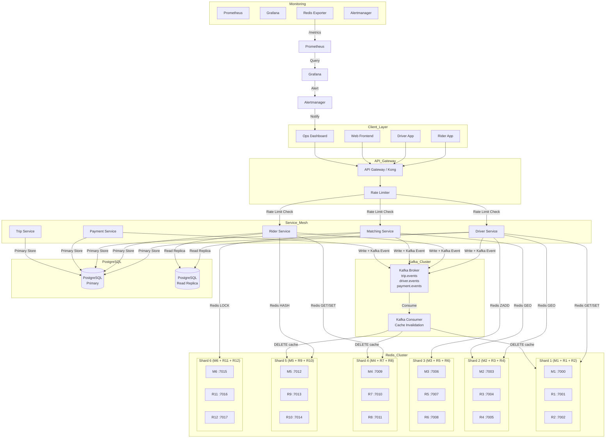
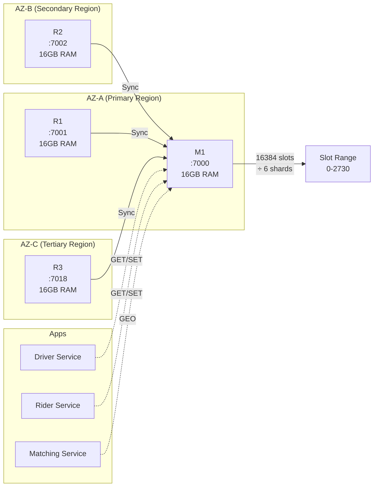
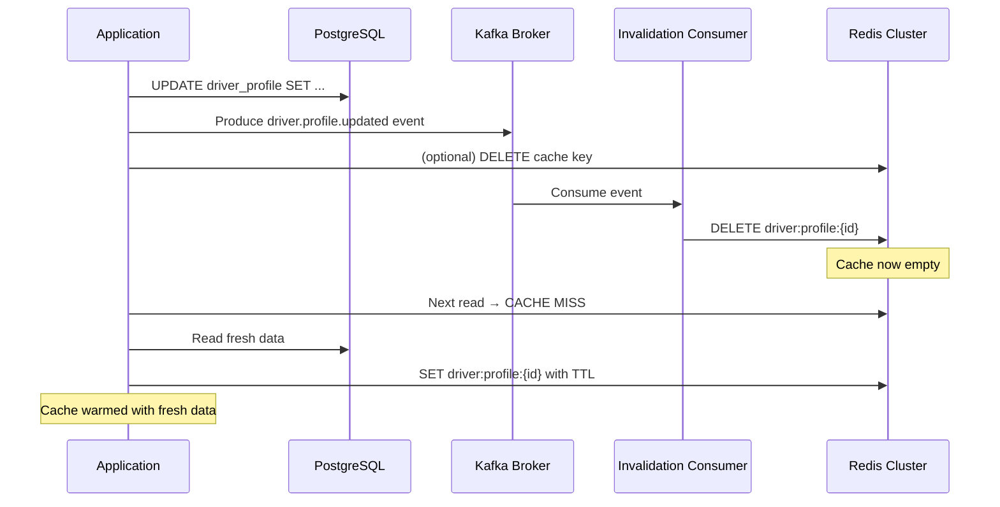
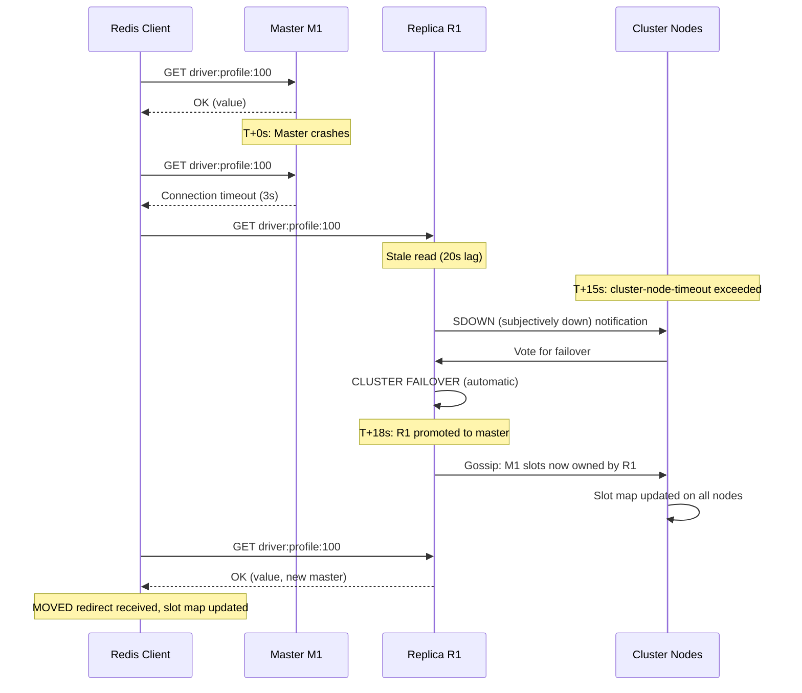

# Day 30: Capstone Reference Documents

Đây là tài liệu tham khảo cho Day 30 capstone. Chứa templates, checklists, diagrams, và code snippets production-ready.

---

## 1. Architecture Mermaid Diagrams

### 1.1. Full System Architecture



### 1.2. Redis Cluster Topology (Per-Shard Detail)



### 1.3. Cache Invalidation Flow



### 1.4. Failover Sequence



---

## 2. Redis Configuration Templates

### 2.1. Master Node Configuration (redis.conf)

```txt
# === FASTRIDE REDIS MASTER CONFIG ===
# Generated for Day 30 Capstone

# Network
bind 0.0.0.0
protected-mode yes
port 7000
tcp-backlog 511
timeout 10
tcp-keepalive 300

# General
daemonize no
supervised no
loglevel notice
databases 16

# Memory
maxmemory 12gb
maxmemory-policy allkeys-lru
maxmemory-samples 5

# Persistence
appendonly yes
appendfilename "appendonly.aof"
appendfsync everysec
no-appendfsync-on-rewrite no
auto-aof-rewrite-percentage 100
auto-aof-rewrite-min-size 64mb
aof-load-truncated yes
aof-use-rdb-preamble yes

# RDB
save 900 1
save 300 10
save 60 10000
stop-writes-on-bgsave-error yes
rdbcompression yes
rdbchecksum yes

# Replication
replica-read-only yes
repl-diskless-sync yes
repl-diskless-sync-delay 5
repl-backlog-size 64mb
repl-backlog-ttl 3600
min-replicas-to-write 1
min-replicas-max-lag 5
replica-serve-stale-data yes

# Cluster
cluster-enabled yes
cluster-config-file nodes.conf
cluster-node-timeout 15000
cluster-replica-validity-factor 10
cluster-migration-barrier 1
cluster-require-full-coverage no
cluster-replica-no-failover no

# Lua
lua-time-limit 5000

# Slowlog
slowlog-log-slower-than 10000
slowlog-max-len 128

# Security (managed via Vault/env)
# requirepass <loaded from environment>
# masterauth <loaded from environment>

# Performance
hz 10
dynamic-hz yes
activedefrag yes
active-defrag-threshold-lower 10
active-defrag-threshold-upper 100
active-defrag-ignore-bytes 100mb
active-defrag-max-scan-fields 1000
```

### 2.2. Replica Node Configuration

```txt
# Inherit from master config, plus:

replicaof <master-ip> <master-port>

# Replica-specific tuning
replica-priority 100
# replica of higher priority = preferred for failover
```

### 2.3. Docker Compose — Full Cluster

```yaml
# docker-compose.capstone.yml
version: "3.8"

services:
  # === Redis Masters ===
  redis-m1:
    image: redis:7.2-alpine
    container_name: fastride-m1
    ports:
      - "7000:6379"
    volumes:
      - ./redis-data/m1:/data
      - ./redis-conf/master.conf:/usr/local/etc/redis/redis.conf
    command: redis-server /usr/local/etc/redis/redis.conf
    restart: unless-stopped
    mem_limit: 16g
    cpus: 4
    networks:
      - fastride-redis

  redis-m3:
    image: redis:7.2-alpine
    container_name: fastride-m3
    ports:
      - "7003:6379"
    volumes:
      - ./redis-data/m3:/data
      - ./redis-conf/master.conf:/usr/local/etc/redis/redis.conf
    command: redis-server /usr/local/etc/redis/redis.conf
    restart: unless-stopped
    mem_limit: 16g
    cpus: 4
    networks:
      - fastride-redis

  redis-m5:
    image: redis:7.2-alpine
    container_name: fastride-m5
    ports:
      - "7006:6379"
    volumes:
      - ./redis-data/m5:/data
      - ./redis-conf/master.conf:/usr/local/etc/redis/redis.conf
    command: redis-server /usr/local/etc/redis/redis.conf
    restart: unless-stopped
    mem_limit: 16g
    cpus: 4
    networks:
      - fastride-redis

  # === Redis Replicas ===
  redis-r1:
    image: redis:7.2-alpine
    container_name: fastride-r1
    ports:
      - "7001:6379"
    volumes:
      - ./redis-data/r1:/data
      - ./redis-conf/replica.conf:/usr/local/etc/redis/redis.conf
    command: redis-server /usr/local/etc/redis/redis.conf
    restart: unless-stopped
    mem_limit: 16g
    depends_on:
      - redis-m1
    networks:
      - fastride-redis

  redis-r2:
    image: redis:7.2-alpine
    container_name: fastride-r2
    ports:
      - "7002:6379"
    volumes:
      - ./redis-data/r2:/data
      - ./redis-conf/replica.conf:/usr/local/etc/redis/redis.conf
    command: redis-server /usr/local/etc/redis/redis.conf
    restart: unless-stopped
    mem_limit: 16g
    depends_on:
      - redis-m1
    networks:
      - fastride-redis

  redis-r4:
    image: redis:7.2-alpine
    container_name: fastride-r4
    ports:
      - "7004:6379"
    volumes:
      - ./redis-data/r4:/data
      - ./redis-conf/replica.conf:/usr/local/etc/redis/redis.conf
    command: redis-server /usr/local/etc/redis/redis.conf
    restart: unless-stopped
    mem_limit: 16g
    depends_on:
      - redis-m3
    networks:
      - fastride-redis

  redis-r5:
    image: redis:7.2-alpine
    container_name: fastride-r5
    ports:
      - "7005:6379"
    volumes:
      - ./redis-data/r5:/data
      - ./redis-conf/replica.conf:/usr/local/etc/redis/redis.conf
    command: redis-server /usr/local/etc/redis/redis.conf
    restart: unless-stopped
    mem_limit: 16g
    depends_on:
      - redis-m3
    networks:
      - fastride-redis

  redis-r7:
    image: redis:7.2-alpine
    container_name: fastride-r7
    ports:
      - "7007:6379"
    volumes:
      - ./redis-data/r7:/data
      - ./redis-conf/replica.conf:/usr/local/etc/redis/redis.conf
    command: redis-server /usr/local/etc/redis/redis.conf
    restart: unless-stopped
    mem_limit: 16g
    depends_on:
      - redis-m5
    networks:
      - fastride-redis

  redis-r8:
    image: redis:7.2-alpine
    container_name: fastride-r8
    ports:
      - "7008:6379"
    volumes:
      - ./redis-data/r8:/data
      - ./redis-conf/replica.conf:/usr/local/etc/redis/redis.conf
    command: redis-server /usr/local/etc/redis/redis.conf
    restart: unless-stopped
    mem_limit: 16g
    depends_on:
      - redis-m5
    networks:
      - fastride-redis

  # === Prometheus + Redis Exporter ===
  prometheus:
    image: prom/prometheus:latest
    container_name: fastride-prometheus
    ports:
      - "9090:9090"
    volumes:
      - ./prometheus.yml:/etc/prometheus/prometheus.yml
    command:
      - '--config.file=/etc/prometheus/prometheus.yml'
      - '--storage.tsdb.path=/prometheus'
      - '--storage.tsdb.retention.time=30d'
    networks:
      - fastride-redis

  redis-exporter:
    image: oliver006/redis_exporter:latest
    container_name: fastride-redis-exporter
    environment:
      - REDIS_ADDR=redis://redis-m1:6379,redis://redis-m3:6379,redis://redis-m5:6379
      - REDIS_PASSWORD=${REDIS_PASSWORD}
    ports:
      - "9121:9121"
    depends_on:
      - redis-m1
      - redis-m3
      - redis-m5
    networks:
      - fastride-redis

  # === Grafana ===
  grafana:
    image: grafana/grafana:latest
    container_name: fastride-grafana
    ports:
      - "3000:3000"
    environment:
      - GF_SECURITY_ADMIN_PASSWORD=${GRAFANA_PASSWORD}
      - GF_USERS_ALLOW_SIGN_UP=false
    volumes:
      - ./grafana-dashboards:/var/lib/grafana/dashboards
      - ./grafana-provisioning:/etc/grafana/provisioning
    depends_on:
      - prometheus
    networks:
      - fastride-redis

networks:
  fastride-redis:
    driver: bridge
```

---

## 3. Capacity Planning Worksheet

```
╔════════════════════════════════════════════════════════════════════════════════════╗
║                 FASTRIDE REDIS CAPACITY PLANNING WORKSHEET                       ║
╠════════════════════════════════════════════════════════════════════════════════════╣
║ INPUTS                                                                             ║
╠════════════════════════════════════════════════════════════════════════════════════╣
║ Peak ops/sec                           │ [________] ops/sec                        ║
║ Read ratio                             │ [________]%                               ║
║ Write ratio                            │ [________]%                               ║
║ Average payload size                   │ [________] bytes                          ║
║ Active entities (drivers)              │ [________]                                ║
║ Active entities (riders)               │ [________]                                ║
║ Active entities (trips)                │ [________]                                ║
║ Growth factor (months)                 │ [________] months                         ║
╠════════════════════════════════════════════════════════════════════════════════════╣
║ DERIVED CALCULATIONS                                                                  ║
╠════════════════════════════════════════════════════════════════════════════════════╣
║ Read ops/sec = peak × read_ratio       │ [________] ops/sec                        ║
║ Write ops/sec = peak × write_ratio     │ [________] ops/sec                        ║
║ Peak burst = peak × 2                  │ [________] ops/sec                        ║
╠════════════════════════════════════════════════════════════════════════════════════╣
║ MEMORY ESTIMATE                                                                     ║
╠════════════════════════════════════════════════════════════════════════════════════╣
║ Data type          │ Keys    │ Avg bytes │ Subtotal  │ Shard分配              ║
║────────────────────┼─────────┼───────────┼───────────┼────────────────────── ║
║ Driver profiles    │ [______]│ [______] │ [______] │ [______] GB             ║
║ Rider profiles     │ [______]│ [______] │ [______] │ [______] GB             ║
║ Rider sessions    │ [______]│ [______] │ [______] │ [______] GB             ║
║ Driver sessions   │ [______]│ [______] │ [______] │ [______] GB             ║
║ Active trips      │ [______]│ [______] │ [______] │ [______] GB             ║
║ Rate limit counters│ [______]│ [______] │ [______] │ [______] GB             ║
║ Geo indices        │ [______]│ [______] │ [______] │ [______] GB             ║
║ Leaderboards       │ [______]│ [______] │ [______] │ [______] GB             ║
║ Misc               │         │           │ [______] │ [______] GB             ║
╠════════════════════════════════════════════════════════════════════════════════════╣
║ TOTAL WORKING SET (GB)                │ [________] GB                             ║
║ × Growth factor (3-6 months)          │ [________] GB                             ║
║ × Fragmentation factor (1.3-1.5)     │ [________] GB                             ║
║ = Total required memory               │ [________] GB                             ║
╠════════════════════════════════════════════════════════════════════════════════════╣
║ SHARD CALCULATIONS                                                                   ║
╠════════════════════════════════════════════════════════════════════════════════════╣
║ Single Redis ops capacity (est.)       │ 30,000 ops/sec                           ║
║ Min shards = ceil(peak_burst / 30K)   │ [________] shards                         ║
║ Recommended shards (2x headroom)       │ [________] shards                         ║
║ Nodes per shard (1M + 2R)              │ 3 nodes                                  ║
║ Total nodes = shards × 3              │ [________] nodes                          ║
╠════════════════════════════════════════════════════════════════════════════════════╣
║ MEMORY PER NODE CALCULATION                                                          ║
╠════════════════════════════════════════════════════════════════════════════════════╣
║ Total memory / shards                  │ [________] GB per shard                    ║
║ Per node (all masters = data)         │ [________] GB per master                  ║
║ Per node (all replicas = copy)        │ [________] GB per replica                  ║
║ Recommended node RAM                  │ [________] GB (use 80%)                    ║
║ Maxmemory setting                    │ [________] GB                              ║
║ Headroom                              │ 20%                                       ║
╠════════════════════════════════════════════════════════════════════════════════════╣
║ NETWORK BANDWIDTH                                                                     ║
╠════════════════════════════════════════════════════════════════════════════════════╣
║ ops/sec × payload bytes                │ [________] bytes/sec                      ║
║ = [________] Mbps                     │ Per shard: [________] Mbps                 ║
║ × replication factor (1.5×)           │ Per shard: [________] Mbps                 ║
║ Recommended NIC                        │ 10 Gbps                                   ║
╠════════════════════════════════════════════════════════════════════════════════════╣
║ REPLICATION BACKLOG                                                                   ║
╠════════════════════════════════════════════════════════════════════════════════════╣
║ repl-backlog-size =                    │                                           ║
║   (avg_write_bytes × write_ops ×      │                                           ║
║    expected_max_lag_seconds)           │                                           ║
║ Example: 500B × 35K × 30s = 525 MB   │ Recommended: 64 MB - 256 MB              ║
╠════════════════════════════════════════════════════════════════════════════════════╣
║ FAILOVER CAPACITY                                                                     ║
╠════════════════════════════════════════════════════════════════════════════════════╣
║ Failover time (p99)                   │ < 30 seconds                             ║
║ During failover:                       │ Writes queue / fail (no auto-retry)       ║
║ Read availability (replicas)          │ 100% (if replicas healthy)                ║
║ Write availability (master down)      │ 0% → 100% after failover                 ║
╚════════════════════════════════════════════════════════════════════════════════════╝
```

---

## 4. Production Readiness Checklist

### 4.1. Design Phase

```
DESIGN CHECKLIST — Complete before code review
================================================

Architecture
[ ] Redis topology chosen: [ ] Cluster [ ] Sentinel [ ] Standalone
[ ] Shard count justified by capacity planning
[ ] Replica count: [ ] per shard
[ ] Multi-AZ spread: [ ] AZ-A [ ] AZ-B [ ] AZ-C
[ ] Cross-AZ replication tested

Data Modeling
[ ] Key naming convention documented
[ ] Key patterns validated against hash tag requirements
[ ] No hot slot risk identified (analyze hash tag distribution)
[ ] TTL defined for every key type
[ ] TTL includes jitter (prevent thundering herd)
[ ] Eviction policy defined: [ ]
[ ] Big key analysis: max key size < 10 MB
[ ] Working set fits in configured maxmemory

Persistence
[ ] Persistence mode chosen: [ ] AOF always [ ] AOF everysec [ ] RDB only [ ] None
[ ] RDB schedule documented (for backup)
[ ] AOF rewrite strategy defined
[ ] min-replicas-to-write configured: [ ]
[ ] repl-diskless-sync configured

Security
[ ] requirepass set (via Vault)
[ ] masterauth set for replica connections
[ ] protected-mode: yes
[ ] bind configured: [ ]
[ ] Network-level firewall rules defined
[ ] ACL strategy defined (if applicable)
[ ] TLS plan defined (if applicable)

Monitoring
[ ] Metrics dashboard designed
[ ] Alert rules defined
[ ] Runbook documented
[ ] Capacity planning worksheet completed
```

### 4.2. Deployment Phase

```
DEPLOYMENT CHECKLIST — Before going live
=========================================

Infrastructure
[ ] All nodes deployed in correct AZs
[ ] Network connectivity verified (cluster bus port)
[ ] Node specs match capacity planning
[ ] maxmemory configured on all nodes
[ ] Cluster formed: CLUSTER INFO = ok
[ ] All 16384 slots assigned: CLUSTER SLOTS assigned = 16384
[ ] Replication established: REPLICAOF configured
[ ] Replication lag = 0 verified

Security
[ ] Password rotated from default
[ ] Password stored in Vault/secrets manager
[ ] Firewall rules applied
[ ] protected-mode verified
[ ] Redis port not exposed to internet

Data Modeling
[ ] Test keys inserted and verified
[ ] Key TTL working as expected
[ ] Hash tag distribution verified: CLUSTER KEYSLOT for hot patterns
[ ] No cross-slot errors in application logs

Performance Baseline
[ ] Benchmark run: redis-benchmark -r 100000 -n 1000000
[ ] GET p50 < 2ms, p95 < 10ms, p99 < 20ms
[ ] SET p50 < 3ms, p95 < 15ms, p99 < 30ms
[ ] GEOADD/ZRANGE baseline measured
[ ] Replication lag baseline measured
[ ] Memory usage verified: INFO memory

Monitoring
[ ] Redis exporter running and scraping
[ ] Prometheus targets up
[ ] Grafana dashboard imported
[ ] Alert rules configured in Alertmanager
[ ] Test alert fired (to verify notification channel)
[ ] Runbook accessible to on-call team

Backup
[ ] RDB backup tested: BGSAVE + copy
[ ] AOF files present
[ ] Backup restoration tested in staging
[ ] Backup schedule in cron/systemd
[ ] Backup retention policy defined
```

### 4.3. Operational Phase (Ongoing)

```
OPERATIONAL CHECKLIST — Monthly/Quarterly review
===============================================

Health Checks (Daily)
[ ] cluster_state = ok on all nodes
[ ] No slots in MIGRATING/IMPORTING state
[ ] Replication lag = 0
[ ] No evicted_keys spike
[ ] Memory usage < 80% on all nodes
[ ] No slow commands (SLOWLOG len = 0 or low)

Performance Reviews (Weekly)
[ ] p95/p99 latency within SLO
[ ] Hit rate > 85%
[ ] Ops/sec within capacity
[ ] Per-shard load balanced (no hot shard)

Capacity Reviews (Monthly)
[ ] Memory headroom > 30%
[ ] Ops/sec headroom > 50%
[ ] Capacity planning worksheet updated
[ ] Growth projection for next 3 months

Security Reviews (Quarterly)
[ ] Password rotation verified
[ ] ACL audit (who has access)
[ ] Network firewall rules reviewed
[ ] TLS certificate expiry checked

Disaster Recovery (Quarterly)
[ ] Backup restoration tested
[ ] Failover runbook tested (chaos day)
[ ] Recovery time measured (RTO)
[ ] Data loss measured (RPO)
[ ] Runbook accuracy reviewed
```

---

## 5. Monitoring & Alert Templates

### 5.1. Prometheus Alert Rules

```yaml
# prometheus-redis-alerts.yml
groups:
  - name: redis-cluster
    interval: 30s
    rules:

      # === CRITICAL ===
      - alert: RedisClusterStateFail
        expr: redis_cluster_state{job="redis-exporter"} == 0
        for: 1m
        labels:
          severity: critical
        annotations:
          summary: "Redis cluster state is FAIL"
          description: "Cluster {{ $labels.instance }} state is {{ $value }}. All writes will fail."

      - alert: RedisNodeMemoryCritical
        expr: redis_memory_used_bytes{job="redis-exporter"} / redis_memory_max_bytes{job="redis-exporter"} > 0.93
        for: 5m
        labels:
          severity: critical
        annotations:
          summary: "Redis node {{ $labels.instance }} above 93% memory"
          description: "Memory usage at {{ $value | humanizePercentage }}. OOM risk imminent."

      - alert: RedisReplicationLagCritical
        expr: redis_replication_backlog_histlen{job="redis-exporter"} > 50000000
        for: 5m
        labels:
          severity: critical
        annotations:
          summary: "Redis replication backlog approaching limit"
          description: "Backlog size {{ $value | humanize }} approaching limit. Replica may fall behind."

      - alert: RedisReplicationLinkDown
        expr: redis_connected_replicas{job="redis-exporter"} < 1
        for: 2m
        labels:
          severity: critical
        annotations:
          summary: "Redis master {{ $labels.instance }} has no connected replicas"
          description: "Data has no redundancy. Risk of data loss if this node fails."

      # === WARNING ===
      - alert: RedisMemoryWarning
        expr: redis_memory_used_bytes{job="redis-exporter"} / redis_memory_max_bytes{job="redis-exporter"} > 0.80
        for: 15m
        labels:
          severity: warning
        annotations:
          summary: "Redis node {{ $labels.instance }} above 80% memory"
          description: "Memory usage at {{ $value | humanizePercentage }}. Plan to scale soon."

      - alert: RedisHitRateLow
        expr: redis_keyspace_hits_total{job="redis-exporter"} / (redis_keyspace_hits_total{job="redis-exporter"} + redis_keyspace_misses_total{job="redis-exporter"}) < 0.85
        for: 30m
        labels:
          severity: warning
        annotations:
          summary: "Redis cache hit rate below 85%"
          description: "Hit rate = {{ $value | humanizePercentage }}. Check TTL, key design, or cache size."

      - alert: RedisEvictedKeysHigh
        expr: rate(redis_evicted_keys_total{job="redis-exporter"}[5m]) > 100
        for: 10m
        labels:
          severity: warning
        annotations:
          summary: "Redis eviction rate above 100/sec on {{ $labels.instance }}"
          description: "Memory pressure. Consider increasing maxmemory or reviewing TTL."

      - alert: RedisSlowCommands
        expr: redis_slowlog_length{job="redis-exporter"} > 50
        for: 5m
        labels:
          severity: warning
        annotations:
          summary: "Redis slowlog growing on {{ $labels.instance }}"
          description: "{{ $value }} slow commands logged. Check SLOWLOG for details."

      - alert: RedisLatencyP99High
        # p99 must come from client-side/application histogram metrics.
        # redis_exporter commandstats are aggregate totals, not latency percentiles.
        expr: histogram_quantile(0.99, sum(rate(redis_client_command_duration_seconds_bucket[5m])) by (le, instance, cmd)) > 0.050
        for: 10m
        labels:
          severity: warning
        annotations:
          summary: "Redis p99 latency above 50ms on {{ $labels.instance }}"
          description: "p99 latency = {{ $value }}s. Investigate slow commands or network issues."

      - alert: RedisReplicationLagWarning
        expr: (redis_master_repl_offset{job="redis-exporter"} - redis_replica_repl_offset{job="redis-exporter"}) > 10000
        for: 5m
        labels:
          severity: warning
        annotations:
          summary: "Redis replica lag above 10K ops on {{ $labels.instance }}"
          description: "Replica is {{ $value }} ops behind master. Check network or replica load."

      - alert: RedisConnectedClientsHigh
        expr: redis_connected_clients{job="redis-exporter"} > 8000
        for: 15m
        labels:
          severity: warning
        annotations:
          summary: "Redis {{ $labels.instance }} has {{ $value }} connected clients"
          description: "Approaching connection limit. Check for connection leaks."
```

### 5.2. Grafana Dashboard JSON (Snippet)

```json
{
  "dashboard": {
    "title": "FastRide Redis Cluster - Overview",
    "uid": "fastride-redis-overview",
    "panels": [
      {
        "title": "Cluster State",
        "type": "stat",
        "targets": [
          {
            "expr": "redis_cluster_state{job='redis-exporter'}",
            "legendFormat": "{{instance}}"
          }
        ],
        "fieldConfig": {
          "defaults": {
            "mappings": [
              { "type": "value", "options": { "1": { "text": "OK", "color": "green" } } },
              { "type": "value", "options": { "0": { "text": "FAIL", "color": "red" } } }
            ]
          }
        }
      },
      {
        "title": "Memory Usage (Per Node)",
        "type": "timeseries",
        "targets": [
          {
            "expr": "redis_memory_used_bytes{job='redis-exporter'} / 1024 / 1024 / 1024",
            "legendFormat": "{{instance}} used"
          },
          {
            "expr": "redis_memory_max_bytes{job='redis-exporter'} / 1024 / 1024 / 1024",
            "legendFormat": "{{instance}} max"
          }
        ]
      },
      {
        "title": "Cache Hit Rate",
        "type": "gauge",
        "targets": [
          {
            "expr": "rate(redis_keyspace_hits_total{job='redis-exporter'}[5m]) / (rate(redis_keyspace_hits_total{job='redis-exporter'}[5m]) + rate(redis_keyspace_misses_total{job='redis-exporter'}[5m])) * 100"
          }
        ],
        "fieldConfig": {
          "defaults": {
            "min": 0,
            "max": 100,
            "thresholds": {
              "mode": "absolute",
              "steps": [
                { "value": 0, "color": "red" },
                { "value": 70, "color": "yellow" },
                { "value": 85, "color": "green" }
              ]
            },
            "unit": "percent"
          }
        }
      },
      {
        "title": "Operations Per Second (Per Shard)",
        "type": "timeseries",
        "targets": [
          {
            "expr": "rate(redis_commands_total{job='redis-exporter'}[1m])",
            "legendFormat": "{{instance}} {{cmd}}"
          }
        ]
      },
      {
        "title": "Latency Distribution (p50/p95/p99)",
        "type": "timeseries",
        "targets": [
          {
            "expr": "histogram_quantile(0.50, sum(rate(redis_client_command_duration_seconds_bucket{cmd='get'}[5m])) by (le)) * 1000",
            "legendFormat": "p50"
          },
          {
            "expr": "histogram_quantile(0.95, sum(rate(redis_client_command_duration_seconds_bucket{cmd='get'}[5m])) by (le)) * 1000",
            "legendFormat": "p95"
          },
          {
            "expr": "histogram_quantile(0.99, sum(rate(redis_client_command_duration_seconds_bucket{cmd='get'}[5m])) by (le)) * 1000",
            "legendFormat": "p99"
          }
        ]
      }
    ]
  }
}
```

---

## 6. Runbook Templates

### 6.1. Master Failover Runbook

```txt
# FASTRIDE REDIS — MASTER FAILOVER RUNBOOK
==========================================

## Trigger Conditions
...
```

### 6.2. OOM (Out of Memory) Runbook

```txt
# FASTRIDE REDIS — OOM EMERGENCY RUNBOOK
=========================================

## Trigger
...
```

### 6.3. Cluster Resharding Runbook

```txt
# FASTRIDE REDIS — ONLINE RESHARDING RUNBOOK
=============================================

## Pre-conditions
...
```

### Step 2: Verify Client Reconnection
```bash
# Check application logs for MOVED redirects
grep "MOVED" /var/log/fastride-app.log | tail -20

# Verify writes are succeeding
redis-cli -p <new-master-port> SET "health:check:$(date +%s)" "ok"
# Expected: OK

# Check error rate in application
# Should be < 1% for 5 minutes post-failover
```

### Step 3: Monitor Replication
```bash
# Check new master has replicas attached
redis-cli -p <new-master-port> INFO replication
# Expected: connected_slaves:2, master_repl_offset: <value>

# Monitor replica lag
for port in <replica-ports>; do
  echo "Port $port:"
  redis-cli -p $port INFO replication | grep -E "master_link_status|master_repl_offset"
done
# Expected: master_link_status:up, lag: 0
```

## Recovery Actions (5-30 minutes)

### Step 4: Investigate Old Master
```bash
# If old master is accessible:
redis-cli -p <old-master-port> INFO
# Check reason for failure (OOM, crash, network)

# Check logs
tail -100 /var/log/redis/redis.log | grep -E "OOM|CRASH|SIGNAL"
```

### Step 5: Bring Old Master Back
```bash
# If hardware issue resolved:
# Old master will rejoin cluster as replica automatically
redis-cli -p <old-master-port> DEBUG SEGFAULT  # ONLY FOR TESTING

# Or restart the container/VM
docker restart fastride-m1

# Verify: old master rejoins as replica
sleep 10
redis-cli -p 7000 CLUSTER NODES | grep <old-master-id>
# Expected: ...replica,master=<new-master-id>
```

## Post-Incident (30-60 minutes)

- [ ] Verify hit rate back to normal (> 85%)
- [ ] Verify p99 latency back to SLO (< 50ms)
- [ ] Write incident report: root cause, impact, duration
- [ ] Schedule postmortem review
- [ ] Update runbook if gaps found

## Escalation
- Level 1: On-call SRE (auto-paging)
- Level 2: Redis/Platform team
- Level 3: Engineering Manager + VP Engineering
```

### 6.2. OOM (Out of Memory) Runbook

```markdown
# FASTRIDE REDIS — OOM EMERGENCY RUNBOOK
=========================================

## Trigger
- [ ] Alert: RedisNodeMemoryCritical (> 93%)
- [ ] Write errors: OOM

## Emergency Mitigation (0-5 minutes)

### Step 1: Identify Source
```bash
# Find big keys
redis-cli -p <port> --bigkeys

# Find keys by memory usage
redis-cli -p <port> MEMORY USAGE <key>

# Scan for keys without TTL (unbounded growth)
redis-cli -p <port> --scan | head -1000 | \
  xargs -I {} redis-cli -p <port> TTL {}
```

### Step 2: Emergency Cleanup
```bash
# Identify stale sessions (TTL = -1 = no expiry)
redis-cli -p <port> --scan --pattern "session:*" | \
  xargs -I {} redis-cli -p <port} TTL {}

# UNLINK stale keys (async delete, non-blocking)
redis-cli -p <port} --scan --pattern "session:*:old" | \
  head -10000 | xargs -I {} redis-cli -p <port} UNLINK {}

# Do NOT use FLUSHDB — deletes everything
```

### Step 3: Emergency Memory Increase
```bash
# If headroom exists in physical RAM:
redis-cli -p <port> CONFIG SET maxmemory 14gb
redis-cli -p <port} CONFIG SET maxmemory-policy volatile-lru
# This buys time but does not fix root cause
```

### Step 4: Verify Write Restored
```bash
redis-cli -p <port> SET "oom-test:$(date +%s)" "ok"
# Expected: OK
```

## Root Cause Investigation
- [ ] Was maxmemory set too low?
- [ ] Was there a big key that grew unexpectedly?
- [ ] Was TTL not set on session/counter keys?
- [ ] Was fragmentation ratio > 1.5?

## Prevention
- [ ] Memory headroom > 30%
- [ ] Big key monitoring in place
- [ ] TTL on all cache keys
- [ ] Active defrag enabled

### 6.3. Cluster Resharding Runbook

```markdown
# FASTRIDE REDIS — ONLINE RESHARDING RUNBOOK
=============================================

## Pre-conditions
- [ ] Peak traffic window: 2:00-4:00 AM
- [ ] Backup: BGSAVE on all masters complete
- [ ] Memory headroom > 30% on all nodes
- [ ] Staging test completed
- [ ] Stakeholders notified

## Pre-checks
```bash
# 1. Cluster health
redis-cli -p 7000 CLUSTER INFO
# Expected: cluster_state:ok

# 2. No migration in progress
redis-cli -p 7000 CLUSTER NODES | grep -E "MIGRAT|IMPORT"
# Expected: empty

# 3. Memory headroom
redis-cli -p 7000 INFO memory | grep used_memory_human
redis-cli -p 7000 CONFIG GET maxmemory
# Expected: used < 80% of maxmemory

# 4. Replication lag = 0
redis-cli -p 7000 INFO replication | grep lag
# Expected: lag: 0
```

## Execution
```bash
# Step 1: Add new master node
redis-cli --cluster add-node 127.0.0.1:7018 127.0.0.1:7000
# Verify: new node has 0 slots

# Step 2: Reshard 2000 slots from existing masters
redis-cli --cluster reshard 127.0.0.1:7000 \
  --cluster-to <new-node-id> \
  --cluster-from <source-node-id-1> \
  --cluster-slots 500 \
  --cluster-yes

# Monitor during reshard (in separate terminal)
watch -n 5 'redis-cli -p 7000 CLUSTER NODES | grep -E "MIGRAT|IMPORT"'

# Step 3: Reshard from multiple sources for even distribution
redis-cli --cluster reshard 127.0.0.1:7000 \
  --cluster-to <new-node-id> \
  --cluster-from <source-node-id-2> \
  --cluster-slots 500 \
  --cluster-yes

# Step 4: Verify all slots assigned
redis-cli -p 7000 CLUSTER INFO | grep cluster_slots_assigned
# Expected: 16384
```

## Post-checks
- [ ] cluster_state: ok
- [ ] No MIGRATING/IMPORTING states
- [ ] Replication lag = 0
- [ ] Benchmark: p99 latency within SLO
- [ ] Notify stakeholders: operation complete

## Rollback
```bash
# If p99 > 100ms sustained > 5 minutes:
# Abort: Ctrl+C (safe — migration state cleans up)

# If data integrity issue:
# Restore from backup: docker cp backup.rdb redis-node:/data/
# Restart Redis
```

---

## 7. Redis Key Design Specification

```
╔══════════════════════════════════════════════════════════════════════════════════════════╗
║                    FASTRIDE REDIS KEY DESIGN SPECIFICATION                             ║
╠══════════════════════════════════════════════════════════════════════════════════════════╣
║                                                                                          ║
║  FORMAT: <namespace>:<entity>:<entity_id>:<sub_resource>:<version>                       ║
║                                                                                          ║
║  RULES:                                                                                  ║
║  1. namespace = service name (driver, rider, trip, geo, ratelimit, leaderboard, lock)   ║
║  2. entity_id = primary identifier (ID, zone, hour_bucket)                              ║
║  3. sub_resource = optional细分 resource                                                 ║
║  4. version = optional, for backwards compatibility                                     ║
║  5. TTL MUST be set on all cache keys                                                   ║
║  6. Hash tag {} ONLY when multi-key operation is required                               ║
║                                                                                          ║
╠══════════════════════════════════════════════════════════════════════════════════════════╣
║  # │ Key Pattern                        │ Type │ TTL       │ Hash Tag │ Shard Key     ║
╠══════════════════════════════════════════════════════════════════════════════════════════╣
║  1 │ driver:profile:{driver_id}        │ Hash │ 24h       │ No       │ driver_id     ║
║  2 │ driver:session:{driver_id}:{token}│ Str  │ 7d        │ No       │ full key      ║
║  3 │ driver:available:{driver_id}      │ Str  │ 5m        │ No       │ driver_id     ║
║  4 │ rider:profile:{rider_id}         │ Hash │ 12h       │ No       │ rider_id      ║
║  5 │ rider:session:{rider_id}:{token} │ Str  │ 30d       │ No       │ full key      ║
║  6 │ trip:active:{trip_id}            │ Hash │ 2h        │ No       │ trip_id       ║
║  7 │ trip:history:{rider_id}:{idx}    │ List │ 90d       │ No       │ rider_id      ║
║  8 │ geo:driver:zone:{zone_id}        │ Geo  │ 5m        │ YES {zone_id} │ zone_id  ║
║  9 │ geo:rider:location:{rider_id}    │ Geo  │ 5m        │ No       │ rider_id      ║
║ 10 │ ratelimit:api:{rider_id}:{win}  │ Str  │ 60s       │ No       │ full key      ║
║ 11 │ ratelimit:driver:{driver_id}:{w}│ Str  │ 60s       │ No       │ full key      ║
║ 12 │ leaderboard:driver:rating        │ ZSet │ None      │ No       │ single key    ║
║ 13 │ leaderboard:driver:earnings:{d} │ ZSet │ 7d        │ No       │ single key    ║
║ 14 │ surge:{zone}:{hour_bucket}       │ Str  │ 30m       │ No       │ zone+hour     ║
║ 15 │ lock:match:{zone_id}             │ Str  │ 10s (NX)  │ No       │ zone_id       ║
║ 16 │ lock:trip:{trip_id}              │ Str  │ 30s (NX)  │ No       │ trip_id       ║
║ 17 │ idempotency:{request_id}         │ Str  │ 24h       │ No       │ request_id    ║
║ 18 │ counter:today:trip:{zone}        │ Str  │ 2h        │ No       │ zone          ║
║ 19 │ counter:today:driver:{driver_id} │ Str  │ 2h        │ No       │ driver_id     ║
║ 20 │ cache:fare:{route_hash}          │ Str  │ 5m        │ No       │ route_hash    ║
╠══════════════════════════════════════════════════════════════════════════════════════════╣
║  TTL JITTER: All TTLs include ±10% random jitter to prevent thundering herd              ║
║  Example: TTL=86400 → actual TTL = 86400 × (1 + random(0, 0.1)) = 86400-95040s         ║
╠══════════════════════════════════════════════════════════════════════════════════════════╣
║  HASH TAG RULES:                                                                          ║
║  - geo:driver:zone:{zone_id} → hash tag is {zone_id}                                   ║
║    → Used for: GEORADIUS on zone-level, MATCHING with nearby drivers                    ║
║    → Risk: Hot zone → hot slot. Mitigation: split large zones into sub-zones            ║
║  - DO NOT use hash tag for: profiles, sessions, counters, leaderboards                  ║
╠══════════════════════════════════════════════════════════════════════════════════════════╣
║  BIG KEY THRESHOLDS:                                                                      ║
║  - Max Hash fields: 10,000                                                               ║
║  - Max List length: 10,000                                                               ║
║  - Max String size: 10 MB                                                                ║
║  - Max Sorted Set members: 100,000                                                      ║
║  - Above thresholds: split into sub-keys                                                ║
╚══════════════════════════════════════════════════════════════════════════════════════════╝
```

---

## 8. Code Snippets — Production Patterns

### 8.1. Rate Limiting Lua Script

```lua
-- src/rate-limit.lua
-- Sliding window rate limiter
-- KEYS[1] = rate limit key
-- ARGV[1] = window size in seconds
-- ARGV[2] = max requests per window
-- ARGV[3] = current timestamp (seconds)
-- Returns: {allowed (0/1), remaining, retry_after}

local key = KEYS[1]
local window = tonumber(ARGV[1])
local limit = tonumber(ARGV[2])
local now = tonumber(ARGV[3])
local window_start = now - window

-- Remove old entries outside window
redis.call('ZREMRANGEBYSCORE', key, '-inf', window_start)

-- Count current requests in window
local current = redis.call('ZCARD', key)

if current < limit then
    -- Add new request
    redis.call('ZADD', key, now, now .. ':' .. math.random())
    redis.call('EXPIRE', key, window)
    return {1, limit - current - 1, 0}
else
    -- Rate limited
    local oldest = redis.call('ZRANGE', key, 0, 0, 'WITHSCORES')
    local retry_after = 0
    if oldest[2] then
        retry_after = math.ceil(oldest[2] + window - now)
    end
    return {0, 0, retry_after}
end
```

### 8.2. Distributed Lock (Safe Unlock)

```lua
-- src/unlock.lua
-- Safe unlock with token check
-- KEYS[1] = lock key
-- ARGV[1] = expected token (owner identifier)
-- Returns: 1 if unlocked, 0 if not owner

local key = KEYS[1]
local expected_token = ARGV[1]

local current_token = redis.call('GET', key)
if current_token == expected_token then
    redis.call('DEL', key)
    return 1
else
    return 0
end
```

### 8.3. TypeScript: Cache-Aside with Kafka Invalidation

```typescript
// src/cache.ts
import Redis from "ioredis";
import { Pool } from "pg";

const redis = new Redis.Cluster([
  { host: "127.0.0.1", port: 7000 },
  { host: "127.0.0.1", port: 7003 },
  { host: "127.0.0.1", port: 7006 },
  { host: "127.0.0.1", port: 7009 },
  { host: "127.0.0.1", port: 7012 },
  { host: "127.0.0.1", port: 7015 },
]);

const pg = new Pool({ connectionString: process.env.DATABASE_URL });

const DEFAULT_TTL = 86400; // 24 hours
const JITTER_FACTOR = 0.1; // ±10%

function jitterTTL(ttl: number): number {
  const jitter = Math.floor(ttl * JITTER_FACTOR * Math.random());
  return ttl + jitter;
}

async function getDriverProfile(driverId: string): Promise<any> {
  const cacheKey = `driver:profile:${driverId}`;

  // 1. Try cache
  const cached = await redis.get(cacheKey);
  if (cached) {
    return JSON.parse(cached);
  }

  // 2. Cache miss → read from DB
  const result = await pg.query(
    "SELECT * FROM drivers WHERE id = $1",
    [driverId]
  );

  if (result.rows.length === 0) {
    return null;
  }

  const profile = result.rows[0];

  // 3. Write to cache with jitter TTL
  await redis.setex(
    cacheKey,
    jitterTTL(DEFAULT_TTL),
    JSON.stringify(profile)
  );

  return profile;
}

async function updateDriverProfile(
  driverId: string,
  updates: Record<string, any>
): Promise<void> {
  // 1. Update PostgreSQL
  const setClause = Object.keys(updates)
    .map((k, i) => `${k} = $${i + 2}`)
    .join(", ");
  await pg.query(
    `UPDATE drivers SET ${setClause}, updated_at = NOW() WHERE id = $1`,
    [driverId, ...Object.values(updates)]
  );

  // 2. Invalidate cache (async — don't wait)
  // Kafka consumer will pick up the event and invalidate
  // For immediate consistency: delete synchronously
  const cacheKey = `driver:profile:${driverId}`;
  await redis.del(cacheKey);
}

// Graceful degradation when Redis is unavailable
async function getDriverProfileGraceful(
  driverId: string
): Promise<any | null> {
  try {
    return await getDriverProfile(driverId);
  } catch (err: any) {
    if (err.message.includes("CLUSTERDOWN") || err.code === "ECONNREFUSED") {
      // Redis unavailable → fallback to DB directly
      console.warn("[Cache] Redis unavailable, falling back to DB");
      const result = await pg.query(
        "SELECT * FROM drivers WHERE id = $1",
        [driverId]
      );
      return result.rows[0] || null;
    }
    throw err;
  }
}
```

### 8.4. Prometheus Metrics Definition

```typescript
// src/metrics.ts
import { Registry, Counter, Gauge, Histogram } from "prom-client";

export const registry = new Registry();

// Cluster-level metrics
export const redisClusterState = new Gauge({
  name: "redis_cluster_state",
  help: "Redis cluster state (1=ok, 0=fail)",
  labelNames: ["instance"],
  registers: [registry],
});

export const redisMemoryUsed = new Gauge({
  name: "redis_memory_used_bytes",
  help: "Redis memory used in bytes",
  labelNames: ["instance"],
  registers: [registry],
});

export const redisCacheHitRate = new Gauge({
  name: "redis_cache_hit_rate",
  help: "Cache hit rate (0-1)",
  registers: [registry],
});

// Application-level metrics
export const cacheHitCounter = new Counter({
  name: "fastride_cache_hits_total",
  help: "Total cache hits",
  labelNames: ["key_type"],
  registers: [registry],
});

export const cacheMissCounter = new Counter({
  name: "fastride_cache_misses_total",
  help: "Total cache misses",
  labelNames: ["key_type"],
  registers: [registry],
});

export const cacheOperationLatency = new Histogram({
  name: "fastride_cache_operation_duration_seconds",
  help: "Cache operation latency",
  labelNames: ["operation", "status"],
  buckets: [0.001, 0.005, 0.01, 0.025, 0.05, 0.1, 0.25, 0.5, 1],
  registers: [registry],
});
```

---

## 9. Reference Links

```
Redis Official Documentation:
  - Redis Cluster tutorial: https://redis.io/docs/management/scaling/
  - Redis Cluster spec: https://redis.io/docs/reference/cluster-spec/
  - Redis persistence: https://redis.io/docs/management/persistence/
  - Redis replication: https://redis.io/docs/management/replication/

Configuration Reference:
  - redis.conf: https://redis.io/docs/management/config/
  - Memory management: https://redis.io/docs/reference/optimization/memory-optimization/
  - Latency: https://redis.io/docs/management/optimization/latency/

Tools:
  - redis-benchmark: https://redis.io/docs/management/optimization/benchmarks/
  - redis-cli --bigkeys: https://redis.io/docs/management/optimization/memory-optimization/
  - Redis Slowlog: https://redis.io/commands/slowlog/
  - redis-cli --scan: https://redis.io/commands/scan/

Monitoring:
  - Redis Exporter: https://github.com/oliver006/redis_exporter
  - Grafana dashboards: https://grafana.com/grafana/dashboards?search=redis
  - Redis OBSERVABILITY: https://redis.io/docs/management/optimization/

Architecture Case Studies:
  - Twitter Redis: https://blog.twitter.com/engineering/en/topics/infrastructure/2019/building 
  - Uber Redis: https://eng.uber.com/michelangelo-machine-learning-platform/
  - Shopify Redis: https://shopify.engineering/scaling-redis-at-shopify
  - Grab Redis GEO: https://engineering.grab.com/real-time-geospatial

Backup & Disaster Recovery:
  - Redis RDB: https://redis.io/commands/bgsave/
  - Redis AOF: https://redis.io/topics/persistence#append-only-file
```
